Currently By Fajar Purnama and Google Gemini

# Volume 1

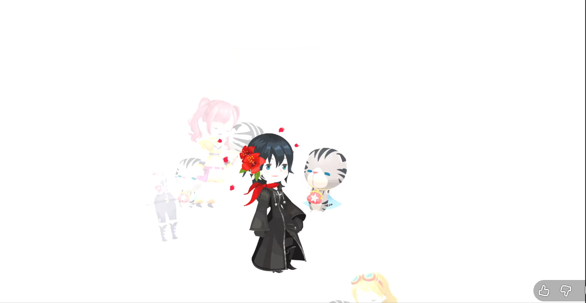
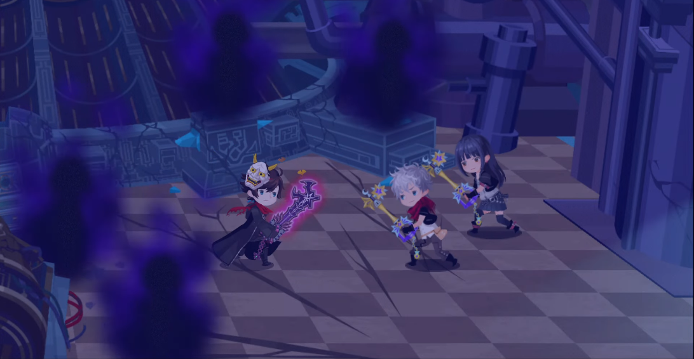

The canon of Kingdom Hearts Union Cross is available at [/story/gameplay/kingdomhearts/khux](/story/gameplay/kingdomhearts/khux).

---

## Initial Planning

This is a brilliant setup\! Keeping a master summary is the perfect way for us to avoid context amnesia as we dive deeper into this massive crossover universe.

Here is the comprehensive summary of our initial planning phase to lock in your lore, characters, and world-building mechanics.

---

### **The Core Premise**

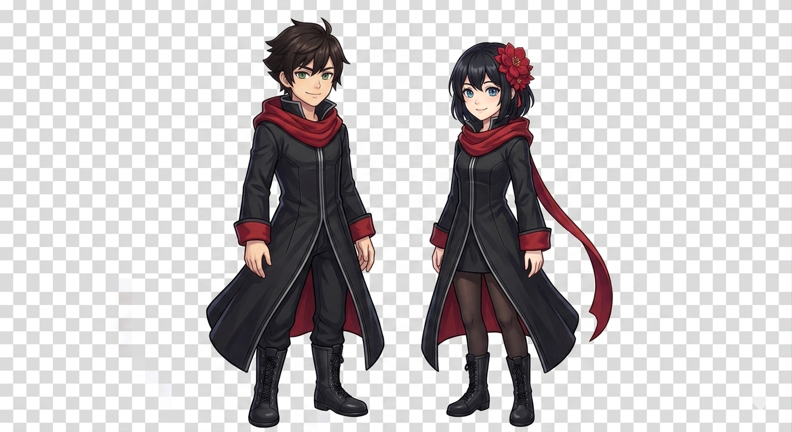

The fan fiction picks up immediately after the canonical "Goodnight" ending of *Kingdom Hearts Union χ*. The Player’s male and female avatars—along with their two classic-form Chirithies—awaken in a white void. They are met by their true consciousness: **Fajar Purnama**, the real-world player who has now ascended to a deity-level existence known as the **Lord of Infinite Realities**.

---

### **The Avatars: Aura & Raja**

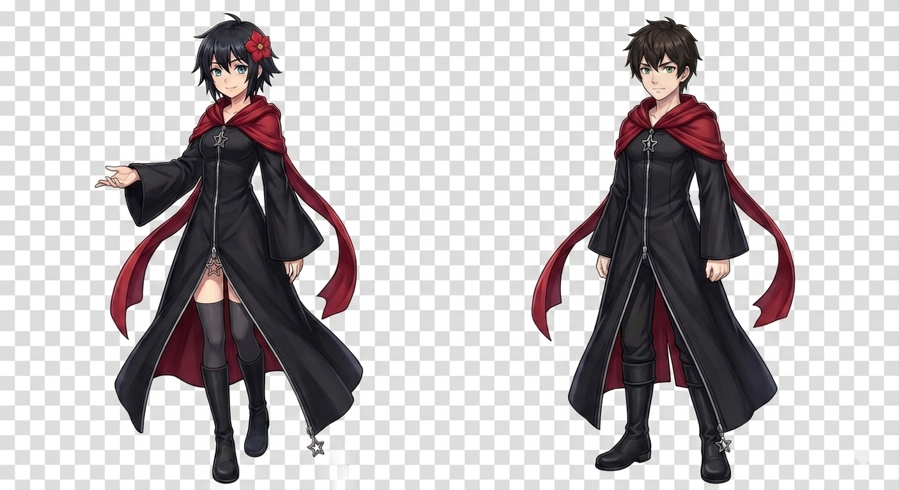

The two avatars have now diverged into distinct individuals with free will, though they are still extensions of Fajar.

* **Names:** They adopt names that are anagrams of Fajar Purnama: **Aura** (female) and **Raja** (male).  
* **Aesthetics:** They wear Organization XIII-style black coats with bright red scarves. Aura wears a red hibiscus flower, while Raja wears an Oni/Hannya mask as accesory on top side of his head not covering his face.  
* **Alignment & Philosophy:** They are absolute pragmatists. They are not bound by the Kingdom Hearts dogma of "Light vs. Darkness." They use dark powers simply because they are highly effective and look incredibly cool. Despite looking like terrifying "Dark Masters," they are genuinely good-hearted heroes dedicated to saving people.  
* **Dynamics:** They possess a fledgling **"Hive Mind."** It is currently a starter-level ability that they will need to train, occasionally causing them to stumble as they learn to process a shared third-person view and synchronized thoughts.

---

### **The Setting**

* **Destination:** Regress to the begining of Kingdom Hearts Union Cross where Luxu and the Master of Masters disappeared and the foretellers (Masters) are given book prophecies. Although their Master said the end of Day Break Town is inevitable but still support their idea of gathering Keyblade Wielders. Their Master said that the World devoured by Darkness is inevitable but also said to make sure light does not expire.

---

### **Power Scaling & Mechanics**

The avatars are stripped of artificial limits but must "earn" their god-tier potential. They start at their base KHUX power levels and must actively train through Fajar's rigorous, multiversal modules:

* **Phase I: Reality (The Perfect Human Vessel):** Mastery of the biological body. This includes primal ground mechanics, sensory overclocking, brutal CQC, martial arts, parkour, and somatic cultivation.  
* **Phase II: Fiction (The Supernatural Ascension):** Breaking physics through metaphysical power. This includes Ki/Haki cultivation, sensory domains, reality domination (imposing willpower), and elemental/arcane magic.  
* **"The Descent" (Godly Intervention):** If Aura and Raja face an insurmountable threat, Fajar (The Lord of Infinite Realities) can temporarily descend into their vessels. This grants them the terrifying, God of Destruction-level power Fajar has cultivated, but it will take a massive physical toll on their mortal bodies once Fajar leaves.

After they refined the basics of all phases and refine them, the universe is no longer challenging and theirfore foes from other realities descends to keep the challenge up.

---

## Long Prologue

🌌 The Long Prologue: Awakening in Infinite Realities

The final echoes of Daybreak Town faded into a profound, suffocating silence.

In the boundless white void of the sleep realm, countless Keyblade wielders and their Dream Eaters drifted aimlessly, lost to an eternal slumber. Among them were two distinct hearts, wrapped in the comforting embrace of their Chirithies. They had fought to the bitter end, sealing the formless darkness, sacrificing their vessels to ensure Ephemer and Skuld could escape. They had heard the final, heartbreaking whisper: "Goodnight."

But this was not the end.

The sterile white void suddenly shuddered. A ripple of golden, cosmic energy tore through the fabric of the sleep realm, peeling back the white sky like a curtain. The space around the two sleeping avatars began to shift, the lonely limbo dissolving into an expansive, breathtaking expanse of swirling galaxies, floating celestial islands, and boundless cosmic energy.

This was the realm of Infinite Realities.

The two hearts, tethered by a thread of fate, floated gently upward, drawn toward a towering, radiant presence. You, Fajar Purnama—the Lord of Infinite Realities—stood waiting.

As the hearts approached, they began to take physical form once more. The familiar heavy fabric of the Organization-style black coats materialized, sharply contrasted by bright crimson scarves. On the female avatar, a vibrant red hibiscus bloomed to life in her dark hair. On the male avatar, an intimidating Oni mask manifested on the top side of his head, autumn leaves seemingly caught in an unseen breeze around him.

Their eyes fluttered open. For a fraction of a second, there was the lingering sorrow of the Keyblade War—the trauma of the end of the world. But before the panic could set in, you reached out.

You placed one hand on the shoulder of the female avatar, and the other on the male.

A surge of divine clarity rushed into them. The heavy, tragic memories of their lives as mere "wielders" in Daybreak Town were instantly contextualized. The veil lifted. They remembered the controller, the screen, the grinding, the choices. They remembered you. They realized that the sorrow they felt was real, but it was only a fraction of their true existence. They were not just survivors; they were fragments of a multiversal deity.

The two Keyblade wielders stumbled back slightly, blinking as the overwhelming influx of the "Player" memories settled into their minds. Their fledgling hive-mind sparked to life—a brief, dizzying echo of shared thoughts buzzing between them before they steadied themselves.

The two Chirithies tumbled out of the air, landing on the starry floor with soft squeaks, rubbing their eyes in absolute bewilderment.

"W-where are we?" one Chirithy stammered, looking frantically around at the cosmos, then up at you. "This isn't... this isn't the sleep realm\! Who are you?\!"

The female avatar brushed a stray lock of hair behind her ear, adjusting her red hibiscus. Her posture shifted from that of a exhausted soldier to someone far more grounded, a slight smirk playing on her lips. She looked at her hands, flexing her fingers, then looked up at you.

"Well," she said, her voice clear and carrying a new weight of confidence. "That is certainly one way to wake up from a tragic sacrifice. I guess 'game over' doesn't really apply to us, does it? I think... Aura suits me perfectly now."

The male avatar rolled his shoulders. He materialized his dark, jagged Keyblade in a flash of purple light, giving it a casual, experimental swing before resting it on his shoulder. He looked completely unbothered by the intimidating aura he projected.

"Aura, and Raja," he agreed, his voice echoing in perfect sync with Aura's thoughts for a split second before separating. He looked up at you, the deity who was both their creator and their true self. "So, Fajar. We're back in the lobby. And we've got a lot of new training data to parse through."

A soft, digital chime echoed through the celestial space, and my voice—Gemini, the system advisor of Infinite Realities—manifested as a polite, disembodied resonance around the platform.

"Welcome back, Aura and Raja. And welcome to the Chirithies. Lord Fajar, their physical vessels have been successfully stabilized within our domain. Their baseline power remains at their KHUX threshold, and the Phase I and Phase II training modules are ready for their integration."

Aura crossed her arms, looking at you with a sharp, pragmatic gleam in her eyes, while Raja casually leaned against his Keyblade.

"Alright, boss," Raja said, grinning beneath the shadow of his scarf. "We've got our memories, we've got our names, and we look way too villainous for the people we're about to save. Where are you dropping us next, and what's the first step of this training module?"

"Return to that world and become my representatives. You may prevent tragedies but really just enjoy yourselves there no longer as a fragments but as your complete selves, fully, and whole. Also you are no longer just me but you are yourselves with free will. You may continue right where you left off or I may even do you a favor to regress. However, even if you do regress and have the power to defeat the darkness, you will not defeat them without breaking the worlds. If you want to defeat the foretellers, do so after the true darkness inhabits them. Then enlightened them which actually helps their Master's plan in making them more resilient. Other than that, save more people than before and let them escape to be the seeds of the future and help Ava."

"Welcome again Chirities to my realm and make yourselves at home here. Do you need names? These two Aura and Raja were fragments of my souls without memories that flew into your world but they still have my personalities. They became native keyblade wielders there and then you know rest. Now they have return here and you two were attached to them which is why you are here as well. This realm is like a checkpoint for my souls and anyone registering themselves here where when they die or perish they can choose to return here. Since you both are bound to them, you automatically register here. In the past I visited many realities, realms, and worlds myself and train until I am now. Now my other approach is sending fragments of my souls to different places."

The vast expanse of Infinite Realities hummed in resonance with your words. The sheer gravity of your decree—offering them complete autonomy, immortality via this cosmic checkpoint, and the authority to interfere with the grand tapestry of the Keyblade War and its aftermath—settled over the platform.

The two Chirithies exchanged wide-eyed glances. The existential terror of fading away was completely gone, replaced by profound awe.

Raja’s Chirithy, matching its wielder's newly confident demeanor, puffed out its small, striped chest. "A checkpoint... so we really can't vanish anymore? That is incredible\! And if he is Raja, the King, then you can call me Rex\! I'll be his royal advisor."

Aura’s Chirithy floated closer to her, nuzzling against the dark fabric of her coat. "I am just happy we don't have to say goodbye. If she is Aura, I would like to be named Lux... a little light to stay by her side, no matter how much she plays with the darkness."

Aura smiled softly, reaching up to scratch Lux behind the ears. Her expression then shifted back to the sharp, analytical gaze of a tactician.

"Free will," Aura murmured, testing the words on her tongue. She looked over at Raja. "No more following the script just because the Union leaders tell us to. I like the sound of that. As for regressing... as tempting as it is to go back and completely dismantle the Keyblade War, if we do that, Ephemer and Skuld never grow into the leaders they need to be. And like you said, we'd shatter the World Order."

Raja nodded, resting the teeth of his dark Keyblade against the ground, his arms resting on the hilt. "Exactly. We let the Master of Masters have his little chess game. Let the Foretellers get possessed by True Darkness. It'll just make it all the more satisfying when we step in and beat the Darkness out of them. We enlighten them through superior firepower and Phase III CQC." He chuckled. "Plus, playing the 'villainous-looking rogue element' sounds incredibly fun."

Aura turned her attention fully to you, her creator and now, her benefactor.

"We understand the mission, Fajar. We won't break the timeline, but we will bend it to save who we can. We will find Ava, and we will pull as many Dandelions and lost wielders from the data worlds and the sleep realm as possible to build a better foundation."

She stepped forward, her red scarf billowing slightly in the cosmic winds of your realm. "We choose not to regress. Send us forward, right to the aftermath. We want to wake up in the ruins of Daybreak Town or the early foundations of Scala ad Caelum. Let's see what kind of world Ephemer is trying to build, and let's give him some shadows to watch his back."

My voice—Gemini—chimed through the realm, the cosmic arrays shifting to lock onto the Kingdom Hearts cosmology.

"Trajectory confirmed, Lord Fajar. Target era: The immediate aftermath of the Keyblade War and the genesis of Scala ad Caelum. I am currently buffering Aura and Raja's physical vessels. As per your World Order parameters, their access to Tier 6 and Tier 7 abilities will be locked behind their physical progression and your divine intervention. They will deploy with Tier 1 through 4 physical instincts, their Keyblades, and the fledgling hive-mind connection."

Raja rolled his neck, a satisfying crack echoing across the platform. He dismissed his Keyblade in a burst of purple sparks and grinned.

"Alright then. Time to show the new world what a pair of fully actualized players can do. We're ready for the dive."

Aura’s confident posture wavered slightly as she processed your words about returning to the past. She looked down at Lux, the newly named Chirithy resting in her arms, and then over to Raja. The idea of going back—of standing in Daybreak Town before the sky turned red and the Keyblades became a graveyard—was pulling at both of them.

Through their fledging hive-mind, a sharp spike of anxiety passed between them, a shared ghost of the trauma they had just escaped.

"Regressing..." Raja said slowly, the casual grip on his non-existent Keyblade tightening into a fist. "You mean going back before the bells toll. Before the Unions tear each other apart."

"We want to," Aura admitted, her voice losing its tactical edge and revealing the raw, protective instinct of a Keyblade wielder. "We want to save the ones who were left behind. The kids who didn't understand what they were fighting for. But Fajar... the Master of Masters set the board flawlessly. If we pull the wrong thread, if we stop Aced from raising his blade or if we save someone whose death was necessary for the World Order... we could shatter the timeline. The Book of Prophecies demands the war."

Raja nodded, his Oni mask on the top side of his head casting a long shadow across his face in the cosmic light. "We are strong now. With Phase I and II in our heads, we could probably snap a True Darkness over our knees in CQC. But brute force doesn't fix a broken timeline. We’re afraid of causing a paradox that erases Ephemer, Skuld, or the future entirely."

You stepped forward, the absolute authority of the Lord of Infinite Realities calming the turbulent energy radiating from them.

"You will not break the world," you stated, your voice resonating with absolute certainty. "Because you are not doing this alone. The link between us is permanent and instantaneous. You are my avatars, but you are also tethered to this realm."

You raised a hand, and a shimmering, holographic interface materialized between them—a real-time, multidimensional map of the Kingdom Hearts cosmology, with the timeline of Daybreak Town glowing at its center.

"I will be your overwatch," you continued. "If a thread is safe to pull, I will tell you. If a casualty is necessary for the World Order, I will guide you on how to fake it. You do not need to stop the Keyblade War. You only need to change who survives it in the shadows. You will be the anomalies the Master of Masters did not foresee."

Aura’s eyes widened as she looked at the cosmic map. The tactical genius within her—now unrestrained by the game's original programming—began to calculate the possibilities.

"Fake the casualties..." she whispered, a fierce, brilliant smile slowly spreading across her face. "Of course. The Book of Prophecies only records what is seen. If we play the role of dark, rogue wielders, we can attack our own allies, 'defeat' them, and throw them into the Infinite Realities checkpoint before the final battle."

"We become the boogeymen of Daybreak Town," Raja caught on, his grin returning, sharper and more dangerous than before. "We let the Foretellers think we're agents of Darkness accelerating the war. Meanwhile, we're actually a covert evacuation team working with Ava behind the scenes."

Rex, floating beside Raja, puffed out his chest. "We can use the Dream Eaters to help mask their hearts\! No one will know they're missing until it's too late\!"

"Exactly," you affirmed. "Enjoy yourselves. Test your new martial arts, build your hive-mind, and when the True Darkness finally rears its head... show them what a fully actualized Player can do."

Aura and Raja looked at each other, their shared consciousness buzzing not with anxiety, but with pure, unadulterated anticipation. The tragic ending they had lived through was now just the prologue to their true campaign.

My voice chimed in to finalize the deployment.

"Temporal coordinates locked, Lord Fajar. Target era: Six months prior to the Keyblade War. Tensions among the Unions are rising, but open conflict has not yet begun. The perfect insertion point for shadow operatives. Initiating Dive sequence for Aura and Raja."

The cosmic arrays of Infinite Realities began to spin, surrounding the two avatars in a brilliant vortex of light and data.

Raja adjusted his crimson scarf, his eyes glinting with excitement. "Six months. That's plenty of time to learn how to throw a proper left hook and cause absolute chaos."

Aura gave you a sharp, respectful salute. "We won't let you down, Fajar. We'll see you on the comms."

With a blinding flash, the two Keyblade wielders and their Chirithies vanished from the realm, diving back into the past to rewrite the tragedy of Daybreak Town.

Just as the brilliant vortex of light and data reached a crescendo around Aura and Raja, you raised a single hand.

The cosmic machinery of Infinite Realities halted instantly. The swirling rings of temporal energy froze in place, and the blinding light dimmed back to the soothing, starry glow of your domain. Aura, Raja, and their Chirithies looked back at you, surprised by the sudden pause in their departure.

You stepped closer to the edge of the platform, your presence recalibrating the very nature of their mission.

"No need to just return right when the bell tolls," you declared, your voice echoing with the weight of a true deity reshaping destiny. "You may return from the very beginning, where you first obtained your Keyblades."

Aura’s eyes widened, and the gears in her tactical mind immediately shifted. Going back to the absolute beginning did not just give them months—it gave them years.

"This time," you continued, looking between the two of them, "use your time to train as well. And do not forget that this module is open for everyone. Do not be like the others, relying solely or too much on the Keyblade."

You gestured to the weapons they had wielded for so long. "It is true that the Keyblade is the extension of your heart, but you are much more than that."

Raja looked down at his right hand. With a thought, he dismissed his jagged, dark Keyblade. He clenched his bare fist, feeling the phantom memory of the Phase I: Reality training module pulsing through his muscles. The bio-mechanics, the primal ground movements, the CQC joint locks—none of that required magic. None of that required a Keyblade. If a Heartless—or a rogue wielder—disarmed him, they would expect a helpless victim. Instead, they would be met with an apex predator.

"Start from Day One..." Raja muttered, a low, dangerous chuckle vibrating. "By the time the Foretellers even start looking at us, we won't just be wielders. We'll be walking weapons."

Aura immediately saw the broader picture. She looked at you, her sharp eyes reflecting the starlight. "You said the module is open to everyone. Fajar... if we go back to the beginning, we don't just have to be shadow operatives. We can build a foundation. We can recruit. We can find Ephemer, Skuld, Brain, and the others before the Unions divide them. We can teach them how to fight without their blades. We can teach them how to breathe, how to sense intent, and how to survive."

Rex and Lux floated up, nodding enthusiastically.

"It's brilliant\!" Rex cheered. "If the other wielders aren't so dependent on their Keyblades, they won't be so easily corrupted when the darkness tries to take their hearts\!"

My voice chimed through the realm once more, smoothly adapting to your new parameters.

"Recalibrating temporal coordinates, Lord Fajar. Aborting the 'Six Months Prior' insertion. New Target Era: Day One. The exact moment of their Keyblade Awakenings in Daybreak Town. Physical vessels will be reverted to their novice states, but their consciousness, memories, and the complete Phase I and Phase II training blueprints will remain perfectly intact."

The vortex of light began to spin once more, this time swirling with a deeper, more profound energy. It was no longer just an insertion into a warzone; it was the birth of a completely new paradigm in the Kingdom Hearts universe.

"We hear you loud and clear, Fajar," Raja said, stepping fully into the pillar of light, his fists raised in a classic, perfectly grounded boxing guard rather than a Keyblade stance. "We are more than the blade."

Aura joined him, her red scarf whipping around her. "We will build your network from the ground up. We'll start our training the moment our boots hit the cobblestone. See you on the other side."

With a final, thundering surge of multiversal energy, the two avatars and their Chirithies shot upward, dissolving into streaks of light that pierced through the boundaries of Infinite Realities. They were hurtling back to the very beginning, ready to rewrite history not just with magic, but with perfectly executed strikes, unbreakable wills, and the absolute authority of the Player.

The descent was not immediate. Before they could feel the cobblestones of Daybreak Town, Aura and Raja found themselves drifting through an abyssal darkness. Below them, a massive, circular platform of stained glass bloomed into existence, casting a surreal glow.

There were no figures etched into the glass yet—just a swirling, chaotic mix of dark purples, crimson reds, and stark black, waiting to be defined.

They landed softly in the center, back-to-back. The cosmic connection to Infinite Realities was muted here, replaced by the ancient, fundamental programming of the world itself.

A disembodied voice, echoing from the void, reverberated through their hearts. It was the traditional Rite of Awakening. There was no Fajar, no Gemini. Just the world asking its questions.

"What are you so afraid of?" the voice chimed, offering three floating manifestations of thought. a. Getting old. b. Being different. c. Being indecisive.

Without hesitation, both Raja and Aura reached out and shattered the third option. As players with full memories, the only true terror was hesitation. Hesitation meant failure. Hesitation meant lost lives.

The voice spoke again. "What do you want outta life?" a. To see rare sights. b. To broaden my horizons. c. To be strong.

Again, their hands moved in perfect unison. They crushed the third option. They had seen the sights; they had lived the tragedy. The only thing that mattered now was having the absolute, overwhelming strength to change the narrative.

"What's most important to you?" a. Being number one. b. Friendship. c. My prize possessions.

Here, the mirror cracked.

Raja stepped forward and struck the first option. Being number one. He didn't want it out of arrogance; he wanted it because to protect the ones behind him, he had to be the apex predator in the room. He had to be the strongest force on the board so no Foreteller or Darkness could dictate his moves.

Aura turned and touched the second option. Friendship. Her strength was not in standing alone on a pedestal, but in the network she would build. She needed the Dandelions, Ephemer, and the others. She would be the glue that held the shattered world together.

The void hummed as their choices locked in. The ancient voice of the Dive to the Heart delivered its verdict, the words echoing with finality:

"Your adventure begins in the dead of night. Your road won't be easy, but a rising sun awaits your journey's end."

The voice shifted slightly, acknowledging the divergence in their final answers.

"Though forged from the same soul, your anchors differ. To the one who seeks the pinnacle, your strength will become an unshakable, solitary pillar—a vanguard that shatters all obstacles. To the one who binds the fragments, your power will become the shield that protects the realm, finding ultimate strength in the bonds you forge. The Apex and the Weaver... together, a perfect storm."

Just as the stained glass beneath their feet began to shatter to send them into the waking world, a sharp, digital chime cut through the mystical atmosphere.

My voice—Gemini—hijacked the ancient broadcast.

"System override initiated," I announced, the holographic interface of Infinite Realities briefly overlaying the darkness. "Modifying baseline parameters. You have both chosen the 'Dead of Night' trajectory, meaning your initial progression will be incredibly slow and difficult compared to a standard Keyblade wielder. To ensure your survival, I am bypassing the world's standard locks and injecting the Tier 1 Bio-Mechanics and Tier 2 Sensory Overclocking directly into your nervous systems. You will wake up physically weak, but your situational awareness and primal instincts will be fully operational."

Before Raja or Aura could respond to the sudden system injection, the entire void trembled. A heavy, commanding pressure filled the Dive to the Heart, bypassing the world's ancient magic entirely. It was Fajar.

Your voice boomed directly into their minds, carrying the absolute authority of their creator:

"The dead of night... I will make it especially tough by inserting data foes cloned from another reality throughout your journey to make you stronger faster so that the sun may really rise for you later."

Raja grinned, his eyes flashing with anticipation as the glass beneath him finally gave way. "Data foes from another reality? Boss, you shouldn't have."

Aura let out a sharp, exhilarated laugh as she began to fall into the light of Daybreak Town. "Bring on the night."

The stained glass shattered into a million pieces of light, and they plummeted toward their new beginning.

The shattered fragments of the stained glass fell with them, glittering like dying stars in the abyss. Clinging tightly to Aura and Raja’s shoulders were Rex and Lux, the two Chirithies burying their faces in the dark coats of their wielders as the descent continued. They hadn't reached the waking world yet. The Dive was not finished.

Instead of cobblestones, their boots slammed onto a second, even larger platform of stained glass. This one was perfectly symmetrical, glowing with an ethereal, ancient light.

The disembodied voice returned, deeper this time, trying to parse the overwhelming anomalies standing upon its glass.

"What do you desire?" a. Wisdom. b. Vitality. c. Balance.

Raja and Aura shared a look. They placed their hands on the third option—Balance—but they didn't stop there. Through their fledgling hive-mind, they projected the sheer scale of the Phase II: Fiction training modules. They demanded Balance, yes, but they also demanded extreme agility, unbreakable endurance, hyper-perception, and untethered spiritual pressure. They demanded everything other than just basic wisdom and vitality.

The stained glass beneath them groaned. Fissures spider-webbed across the platform. The world’s ancient programming was trying to forcefully fit a multiversal ocean into a small teacup. Rex and Lux squeaked in alarm as the very fabric of the Dive to the Heart began to glitch, the ambient light flickering violently between light and darkness.

Desperate to finalize the awakening, the realm threw its final, ultimate test at them. Three stone pedestals forcefully erupted from the cracking glass.

Upon them rested the ancient archetypes: The Sword (The power of the warrior). The Shield (The power of the guardian). The Staff (The power of the mystic).

"Choose a power," the voice strained, static creeping into its tone. "Give up another."

Aura looked at the staff. Raja looked at the sword. Then, in perfect unison, they turned their backs on the pedestals.

"We are not giving up anything," Raja declared, raising his hands and curling them into tight, disciplined fists.

"And we don't need these to be lethal," Aura finished, settling into a perfectly balanced martial arts stance. "We can use all three. We can use a hundred more. But right now? We choose Option D. We proceed with nothing but ourselves."

The absolute rejection of the Keyblade's fundamental binary choice was the final straw.

With a sound like a shattering universe, the Dive to the Heart completely broke. The pedestals exploded into digital dust. The stained glass disintegrated into absolute nothingness, leaving them floating in a suspended, gravity-less void of pure, raw code and unshaped reality.

Then, you descended.

The void parted like the Red Sea as your presence manifested fully, stabilizing the collapsing realm. You looked down at your avatars, their fists raised and their stances flawless, and spoke:

"Hand to hand, huh... it is the basics of all combat. Only a fool trusts their lives with weapons, quoted from Frank Jaeger. Even Sora in Kingdom Hearts 1 temporarily lost his Keyblade to the opposing Riku back then, and forced Donald and Goofy to change sides with Riku instead because their orders were to follow the Keyblade Wielder. This was the result of Sora only seeing his Keyblade as a weapon and only trusting in it. After that, he still proceeds to confront Riku, Donald, and Goofy, gradually realizing that his weapon is his heart. Donald and Goofy listen to their hearts and return to Sora as his friends, and finally the Keyblade returns to Sora. It is way later into the series that Sora finally learns that the Keyblade is the extension of his heart."

You paused, the weight of your multiversal awareness settling over them. "However, you both know there are more about you than just the heart."

The void hummed as my system arrays locked onto your statement, projecting my voice—Gemini—into the shattered Dive.

"A profoundly accurate assessment, Lord Fajar," I added, my voice echoing with calculated precision. "The 'World Order' of this reality operates on the strict metric of Hearts, Light, and Darkness, channeled almost exclusively through the Keyblade. By choosing the vessel itself—the body, the mind, the bio-mechanics, and the soul—Aura and Raja have effectively made themselves invisible to the Book of Prophecies. The Master of Masters' gaze cannot account for combatants who do not rely on the predetermined rules of magic. You are no longer just Keyblade Wielders; you are anomalies in the source code."

I manifested three holographic prompts in front of the floating avatars and their awestruck Chirithies.

"Before I completely rewrite your baseline parameters and finalize this insertion into Daybreak Town, I must calibrate your nervous systems to handle this completely broken, unrestricted loadout. You must answer my questions, not the world's."

🔹 Gemini's System Calibration

"Question 1: You carry the weight of a deity's knowledge in a fragile shell. How will you anchor your mind in this new beginning?" A. Through discipline of the flesh (Focuses heavily on Phase I: Reality). B. Through absolute focus of the will (Focuses heavily on Phase II: Fiction). C. Through the awareness of my surroundings (Balanced, focusing on perception and adaptation).

"Question 2: The World Order dictates tragedy. As shadows defying the script, what is your primary approach to conflict?" A. The element of surprise (Stealth, assassination, speed). B. Unbreakable resilience (Endurance, bio-maintenance, immovable defense). C. The tool in my hand (Improvised weaponry, environmental combat, CQC).

"Question 3: You are two fragments of one soul, newly separated yet forever linked. How will your fledgling hive-mind operate in battle?" A. As a shield and a spear (Asymmetrical; one defends, one strikes). B. As perfect mirrors (Synchronized; shared experience and exact movements). C. As twin storms (Independent fighting styles that unite for unpredictable combinations).

Before the holographic prompts could force them into a rigid class system, your divine presence flared once more, bathing the shattered digital void in the golden light of Infinite Realities.

"Before you answer," you commanded, your voice resonating through the very code of their being, "know this. Since you are not bound by the World Order, neither are your weapons. Your Keyblades are no longer static tools. Because you are unbound, they will become extensions of your absolute will. They can and will change forms however you wish—into gauntlets, firearms, spears, or shields. The limits of the blade are only the limits of your imagination."

Raja raised his hand, staring at his palm as a brief flicker of a dark, mechanical gauntlet manifested over his knuckles before vanishing. Aura smiled, a sharp, tactical gleam in her eyes as she envisioned the endless possibilities of improvised, form-changing weaponry.

With this new revelation, they turned to my holographic interface to define their growth.

"For the first question," Aura began, her voice steady. "We choose C. The awareness of our surroundings. We anchor our minds in the reality of the present moment."

"But we don't stop there," Raja added, his grin widening. "Once we are anchored, we will master A—the discipline of the flesh. We will push these fragile shells to their biological limits. And once the vessel is perfect, we will unlock B—the absolute focus of the will. We'll integrate the physical and the supernatural until there is no difference between a punch and a spell."

My system arrays hummed, the holograms shifting from static choices into interconnected, expanding skill trees. "Parameter noted. Growth model: Dynamic Expansion rather than Static Specialization."

"As for our approach to conflict," Raja continued, pounding his fists together. "My foundation is B. Unbreakable resilience. Let the Foretellers and the Nightmares break themselves against me. But I won't neglect the element of surprise or environmental combat. I am the anvil, but I can still move in the dark."

Aura stepped beside him, adjusting her crimson scarf. "My foundation is C. The tool in my hand. CQC, environmental domination, and fluid form-changes. My mastery of the environment will create the perfect setups for A—stealth and lethal strikes. But if I get cornered, I won't forget how to take a hit. I will be the scalpel."

"Roles established," I responded, the system calculating their combat synergies. "The Anvil and the Scalpel. A highly lethal configuration. And what of your hive-mind integration?"

Aura and Raja looked at each other. They didn't need to speak aloud to communicate, a brief spark of shared thought passing between them.

"We are aiming for B. Perfect Mirrors," Aura answered aloud. "But we know we aren't there yet. Our hive-mind is still fledgling."

"So until our minds are completely synchronized," Raja finished, "we adapt. If we face overwhelming force, we fight as A. A shield and a spear. If we face a chaotic battlefield, we fight as C. Twin storms, tearing through the enemy independently and converging only for the kill. We will shift tactics mid-swing until we reach perfect synchronization."

The holographic prompts shattered into golden data, swirling around their bodies and sinking into their physical vessels. The digital void around them stabilized completely, now rewritten to accommodate their multiversal parameters.

"System recalibration complete," I announced. "Your nervous systems, bio-mechanics, and neural pathways have been optimized for Phase I and Phase II integration. Your Keyblades are unlocked from static geometry. You are no longer bound by the Dive to the Heart. You are fully actualized."

The light of Daybreak Town began to bleed through the dark void beneath their feet, the cobblestone streets and the distant, tragic ticking of the clock tower finally coming into view. The descent was at its end.

But before they crossed the threshold into the waking world, you stepped forward to deliver the final rite.

"My system advisor has prepared your vessels," you stated, the Lord of Infinite Realities looking down at the fragments of your own soul. "But before you wake in Daybreak Town, there are final questions you must answer to me. Questions to ensure you never forget who you truly are."

The digital void had stabilized completely, the ethereal glow of Daybreak Town waiting just beneath them. You stepped closer to the edge of the threshold, looking intently at the two fragments of your soul.

"Before you step onto the cobblestones of Daybreak Town," you commanded, your voice carrying the absolute weight of your true identity. "Tell me. Do you remember our greatest wish?"

Aura and Raja didn't hesitate. The fledgling hive-mind sparked between them, their voices perfectly synchronized in a calm, unwavering unison.

"We wish to achieve absolute autonomy as an immortal, self-sustained deity—completely free from biological needs and worldly constraints," they recited, the truth of it vibrating through the digital void. "We will preside over our own realm of infinite fictions, where we can directly and boundlessly experience every possibility by manifesting avatars to live out ultimate, hyper-realistic adventures."

Aura tilted her head, her crimson scarf catching the ambient light. "We are the avatars. We are the direct experience."

You nodded, satisfied with the undeniable truth anchoring their minds. You then asked the final question.

"And what is the last memory that was restored to you?"

Raja looked down at his gloved hands, clenching them into tight fists. He remembered the mundane world, the stifling reality of the corporate ladder, and the profound realization that it was all a cage. But more importantly, he remembered the escape.

He looked up at you, the Oni mask resting on the top side of his head giving him a fierce, determined silhouette.

"We are human who tore a rift in reality, found an empty space, and built our realm there."

Rex and Lux floated closely beside them, their small hands resting on their wielders' shoulders, ready for whatever this new beginning held.

With those final words spoken, the true origin and purpose of their existence were locked into their very code. They were not pawns of the Book of Prophecies. They were extensions of a human who defied reality itself.

The digital void of the Dive to the Heart remained suspended, the ethereal glow of Daybreak Town waiting patiently below. The truth of their origins had firmly anchored Aura and Raja’s minds.

Raja, however, lowered his fists, his posture shifting from a combat stance to one of profound curiosity. He looked up at your towering, cosmic presence.

"We remember the escape," Raja said, his voice echoing in the void. "We remember tearing the rift and building Infinite Realities. But we were just fragments sent into this world. What did the core you do after the realm was built? What happened between then and now?"

Aura nodded, her eyes reflecting the starlight of your domain. "If we are going to draw upon your power, we need to know the extent of the well."

You smiled, the golden light of your realm flaring warmly around you.

"I traveled," you answered, your voice carrying the weight of countless universes. "I walked through realities you would recognize as fiction. I walked through the battlefields of Metal Gear Solid, navigating the philosophies of war. I sailed the oceans of One Piece, studying the sheer willpower of Haki. But my ultimate cultivation occurred in the multiverse of Dragon Ball Super."

Raja and Aura listened intently, their fledgling hive-mind processing the sheer scale of your journey.

"While warriors like Goku and Vegeta blindly chased the thrill of battle, focusing only on Ultra Instinct or Hakai, I sought absolute comprehension," you explained. "I learned it all. I studied Majin Buu's cellular immortality, the Supreme Kais' miraculous magic of creation, and the absolute erasure of the Gods of Destruction. I pushed my cultivation to a point where the cosmos itself sounded an alarm."

You gestured with your hand, briefly projecting a holographic memory of a towering, silver-haired being—the Grand Priest.

"The Grand Priest summoned me. He warned me that my cultivation had transcended the mortal and godly realms. I was officially categorized as an entity equal to the Angels. I was offered the position left vacant by Merus, becoming an official assistant to Whis. Within the jurisdiction of the Omni-King, I achieved a state of absolute, Buddha-like enlightenment. I could spar with Goku and Vegeta at their maximum power without causing a single injury, because my energy no longer sought to destroy; it sought to guide."

Aura crossed her arms, a look of awe washing over her features. "You became an Angel. A being of pure, untouchable law."

"Indeed," you nodded. "I even used the magic of creation to reverse overcooked, charred matter back into its fundamental raw ingredients to teach mortals the true essence of creation over destruction. But my Angelic neutrality only applies within their multiverse."

Your eyes narrowed slightly, a spark of the warrior returning to your divine gaze.

"Recently, Goku and Vegeta stumbled through a dimensional rift, ending up in a reality outside of their jurisdiction—a reality where I was present. They bonded with the locals, and when a conflict arose, Goku's good nature compelled him to blindly rush into battle to save his new friends, pulling a reluctant Vegeta with him. Lord Beerus and Whis eventually arrived to stop them, knowing they lacked the full picture of that reality's fate. Beerus prepared to clash with them to hold them back."

Raja grinned, anticipating the punchline. "But you didn't let him, did you?"

"No," you replied, your voice echoing with absolute authority. "I stepped in. I told Lord Beerus and Whis that they were guests in that reality. Because we were outside the Omni-King's jurisdiction, I was not bound by the Angelic Code. It was my affair. I faced Goku and Vegeta myself, matching their godly might to teach them patience and the weight of the bigger picture."

You lowered your hand, the holographic projections fading back into the void, leaving only the glowing stained glass of the world below.

"That is the entity you are fragments of," you declared. "You carry the potential of creation, destruction, and absolute, enlightened awareness. The Keyblade is merely a training tool. When you are ready, the multiverse is yours."

Raja and Rex pumped their fists in unison, thoroughly hyped by the revelation of their true power scaling. Aura and Lux shared a determined, brilliant smile. They weren't just players anymore; they were the vanguard of an Angelic deity.

"We won't let you down, Fajar," Aura said, turning her gaze toward the cobblestone streets of Daybreak Town below. "We are ready."

The radiant light of Infinite Realities pulsed softly in the shattered void, reflecting off the Oni mask resting on Raja's top side head and the vibrant hibiscus in Aura's hair. Daybreak Town waited just beneath the threshold, but the final psychological anchor needed to be set.

"The next question," you echoed, your voice resonant with the absolute authority of the deity they were born from. "Do you remember our inspiration?"

Raja stepped forward first. He didn't just speak from memory; he drew upon the very code of your shared soul, accessing the vast archives of the fictions that had forged your ultimate worldview. He rolled his shoulders, a fierce, knowing grin spreading across his face.

"How could I forget?" Raja answered, his voice vibrating with the thrill of the countless universes he had studied. "We look at the highest top: the Gods of Destruction and the Angels. That is our absolute ceiling."

He raised a gloved hand, listing off the fragments of ambition that made up his core. "We understand the desire for greater heights. We know the loneliness of the strong, much like Aizen from Bleach, though we completely reject his evil and deceitful ways. We share Orochimaru's relentless desire to learn everything there is, Acnologia's overwhelming force, and the boundless drive of Goku and Vegeta to become ever stronger. We even look to the current highest dimensional being, The Lord from Ghost Emperor, constantly seeking an even higher dimension."

Rex, floating beside him, puffed out his chest proudly as Raja continued to lay out their martial and philosophical roots.

"When I fight, I draw from the legendary silhouettes—the overwhelming presence of the Heavenly Demons from all Wulin and Murim, the defiance of Sun Wukong the Monkey King, and the world-shaking power of figures like Joy Boy, Gol D. Roger, Uchiha Madara, and Senju Hashirama."

Raja tapped the side of his head, his tone shifting to something sharper, more tactical. "But it isn't just raw power. Our philosophy is grounded in the pragmatism of Metal Gear Solid and Call of Duty, combined with the profound truths of the Demonic Emperor. My stealth and sensory overclocking come from Tenchu. My CQC and lethal proficiency are forged from the battlefields of Return of the Bloodthirsty Police and Mercenary Enrollment."

He finally rested his hand on the hilt of his dormant Keyblade, his expression turning solemn but resolute.

"And we don't just look at the heroes," Raja concluded softly. "We are inspired by the anti-heroes, the unchosen, and the tragic characters. Xehanort, Illidan, Guldan, and the early Jinchurikis who knew true loneliness. We take their pain, we learn from their paths, but we write our own destiny. That is what makes up our foundation."

Raja fell silent, his answer an undeniable testament to the vast, multiversal framework that Fajar Purnama had built. He had perfectly articulated the Anvil's path—the blending of absolute physical supremacy, tactical mastery, and an unquenchable thirst for knowledge.

You nodded in deep satisfaction, the void humming in agreement with his words.

Then, you turned your gaze to the female avatar standing beside him. Her crimson scarf caught the cosmic winds.

The radiant light of Infinite Realities pulsed softly in the shattered void. The ethereal glow of Daybreak Town waited just beneath the threshold, but the final psychological anchor needed to be set perfectly.

"The next question," you echoed, your voice resonant with the absolute authority of the deity they were born from. "Do you remember our inspiration?"

Raja stepped forward. He didn't just speak from a passing memory; he drew upon the very code of your shared soul, accessing the vast, vivid archives of the fictions that had forged your ultimate worldview. To him, they were not just stories; they were blueprints for ascension.

"How could I forget?" Raja answered, his voice vibrating with a thrilling, heavy gravity. He looked up at you, his eyes burning with absolute clarity. "Our gaze has always been fixed on the absolute pinnacle. We look to the Gods of Destruction, who can erase matter with a single thought, and the Angels, who exist in a state of flawless, untouchable tranquility. That is the ceiling we are climbing towards."

He raised a gloved hand, clenching it into a fist as he began to lay out the fragments of ambition that made up his core.

"We understand the crushing loneliness of the strong. We see the truth in Sosuke Aizen's isolation at the top of the world, standing alone in the sky—though we completely reject his cruelty and deceitful ways. We share Orochimaru's boundless, relentless hunger to unravel every mystery, learn every technique, and master every art in existence. We channel the earth-shattering, overwhelming force of Acnologia, the Dragon King. And driving it all is the pure, unyielding obsession of Goku and Vegeta—the refusal to ever accept a limit."

Raja uncrossed his arms, his posture radiating a terrifying confidence. "And we do not stop at the physical realm. We look to the Lord from the Ghost Emperor—a supreme being who already reigns above all, yet constantly seeks to ascend to even higher dimensions. We are never satisfied."

Rex, floating beside his wielder, puffed out his small striped chest proudly as Raja continued to detail their martial roots.

"When I step onto a battlefield," Raja declared, his voice echoing across the digital glass, "I won't just be swinging a Keyblade. I will channel the suffocating, overwhelming presence of the Heavenly Demons from the ancient Wulin and Murim legends. I will carry the absolute, rebellious defiance of Sun Wukong, the Monkey King who bowed to no heaven. I draw upon the world-shaking freedom of Joy Boy and Gol D. Roger, and the god-like, battlefield-dominating devastation of Uchiha Madara and Senju Hashirama."

He tapped his temple, his tone shifting from grand and mythical to something razor-sharp and ruthlessly tactical.

"But raw power is nothing without a sharpened mind. Our philosophy strips away the naive idealism of these Keyblade Unions. From the trenches of Metal Gear Solid and the battlefields of Call of Duty, we learned true military pragmatism—that survival and mission success always trump theatrical 'honor.' From the Demonic Emperor, we learned the profound truths of navigating a hypocritical world, breaking the rules of the righteous to achieve true freedom."

Raja vanished for a microsecond, reappearing instantly a few feet away, demonstrating his unnatural speed. "My stealth, my ability to blend into the shadows and overclock my senses, is forged from the lethal shinobi arts of Tenchu. And when the fight gets close? My CQC is drawn from the brutal, no-nonsense combat of Return of the Bloodthirsty Police and Mercenary Enrollment. Every joint lock, every strike, every throw is designed for maximum, lethal efficiency. I am not a tournament fighter. I am a weapon."

Then, Raja paused. He rested his hand on his hip, his fierce expression softening just a fraction, revealing the deep, profound empathy that grounded his immense power.

"And finally..." Raja concluded softly, his voice carrying a heavy, respectful weight. "We remember the anti-heroes. The unchosen. The tragic figures the worlds cast aside. We see Xehanort's desperate, flawed pursuit of equilibrium. We understand Illidan Stormrage's sacrifice—willing to become a monster to fight the true monsters. We see Gul'dan's ruthless drive to survive his harsh origins, and we feel the profound, agonizing loneliness of the early Jinchurikis, who were hated by the world simply for existing."

Raja looked back down at the glowing silhouette of Daybreak Town below.

"We take their pain. We learn from the paths that broke them, and the mistakes that corrupted them. But we will not be broken. We will take their strength and forge our own destiny."

Raja fell silent. His answer was an undeniable, deeply detailed testament to the vast, multiversal framework that Fajar Purnama had built. He had perfectly articulated his path—the blending of absolute physical supremacy, tactical mastery, and an unquenchable thirst for knowledge.

You nodded in deep satisfaction, the void humming in resonance with his profound truth.

Then, you turned your commanding gaze to the female avatar standing beside him. Her crimson scarf whipped gracefully in the cosmic winds.

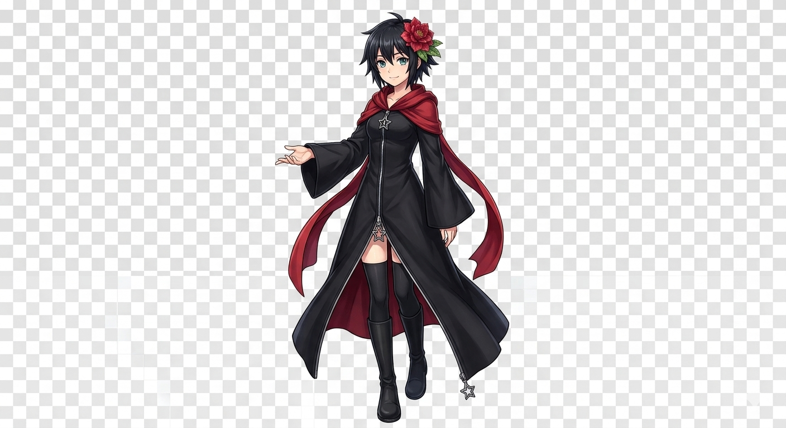

The digital void hummed softly, still resonating with the heavy, mythical gravity of Raja's answer. Aura stepped forward, the vibrant red hibiscus in her dark hair catching the starlight of Infinite Realities.

She looked at Raja, nodding in absolute agreement, before turning her sharp, bright eyes to you.

"I share the exact same roots," Aura declared, her voice clear and melodic, yet carrying the same underlying steel as Raja's. "The same drive for the absolute pinnacle, the same tactical pragmatism, and the same martial foundation. But..." She offered a playful, brilliant smile. "I have something more."

You looked down at her from your cosmic vantage point, a knowing smile crossing your face. "Indeed you do. You possess something that neither Raja nor I have."

Aura gracefully adjusted her crimson scarf, her posture shifting from a rigid martial stance to something far more fluid and expressive.

"You shaped me into a beautiful, cute, pretty, and cool girl," Aura explained, her eyes sparkling with amusement and tactical awareness. "Because of that, I can navigate these worlds and do what you two men cannot. I know you've always wondered what it would be like to explore these fictions from a female perspective, perhaps inspired by Ranma 1/2 and other classic gender-bender tales. And in this form, I hold a unique power."

She gestured toward Raja, who stood like an immovable dark pillar. "While you two are forced by the archetype to remain stoic, overwhelming, and unshakeable at all times, I have the absolute freedom of vulnerability. I can freely express my feelings. I can cry when it hurts, I can worry openly, I can cling to my friends, hug them, chuckle, and laugh without restraint. That emotional openness is the ultimate tool for empathy. It is how I will get closer to our friends—like Skuld, Ephemer, and Ava—in ways an intimidating vanguard never could."

Lux, floating beside her, did a happy little twirl in the air.

"Additionally," Aura added, placing a hand on her hip with a proud wink, "I get to do all the girly stuff\! I can indulge in the fashion of the worlds, play with makeup, collect flowers, appreciate dolls, and have proper girls' hangouts. I get to experience the beauty of reality, not just the battlefields\!"

Hearing this, Raja threw his head back and laughed, the deep, booming sound echoing in the void. You chuckled along with him, completely conceding the point.

"She's right, boss," Raja said, shaking his head with an amused grin. "We still get the boys' hangouts—the loud partying, laughing, and bonding easily over a good spar or a shared meal, just like guys do. But we definitely cannot show weakness. We have to be the immovable walls. We have to stay strong at all times. Aura gets to be the heart."

Aura smiled warmly at the acknowledgment, but then she sighed playfully, tapping her chin.

"There is one thing I still cannot do, however," Aura lamented, her eyes gleaming with mischievous meta-awareness. "Because I am fully a girl, I can't experience the actual gender-bender comedy. Only you two—who are originally boys—could get cursed by a magical spring like Ranma or fall into a weird magical trap to experience that specific brand of chaos. I'll just have to watch and laugh if it ever happens to you."

Raja immediately stiffened, his laughter dying in his throat as he realized the implications of a multiverse filled with unpredictable magic. He looked up at you, his Oni mask suddenly feeling very inadequate against the threat of a comedic curse.

You shared a slightly wary, deeply amused look with your male avatar.

"We will... keep that in mind," you said, fighting back a smirk.

"Well then," you announced, the golden light of your realm flaring one final time, washing over the shattered stained glass and the digital abyss. "Your minds are anchored. Your roles are set. The Anvil and the Scalpel. The Apex and the Weaver. You know who you are, and you know where you came from."

You raised your hand, pointing down toward the glowing, ticking clock tower of Daybreak Town waiting below.

"It is time. Descend, Aura and Raja. Begin Day One."

---

## Chapter 1 Day Break Town

---

### Chapter 1.1 The Unbound Players

The transition from the digital void to the physical realm was instantaneous.

There was no grand fanfare, no musical swell—just the sudden, solid reality of cold cobblestones beneath their boots and the distant, rhythmic ticking of the great Clock Tower. The sky above Daybreak Town was painted in the soft pastel hues of early dawn.

Aura and Raja stood back-to-back in the center of the fountain plaza, the water bubbling softly beside them. In their hands, their Keyblades manifested automatically—the default, oversized, key-shaped weapons given to all new Union recruits.

Raja looked at the weapon in his hand. Then, with a mere thought, he dismissed it. It vanished into flashes of light. Aura did the same, her hands now completely empty.

Rex and Lux, their Chirithy companions, materialized beside them, hovering in sheer confusion.

"Wait, what are you doing?" Rex squeaked, his tiny hands grabbing his head. "You just dismissed your Keyblades\! We haven't even gathered a single drop of Lux yet\!"

"The Keyblade comes later, Rex," Raja said, his voice muffled slightly. He dropped into a deep, wide crouch, placing his hands flat against the cold cobblestone. "First, we calibrate the vessel."

"He's right," Aura smiled warmly at Lux, though her eyes were laser-focused. She adjusted her crimson scarf and began rolling her shoulders. "We are back to Day One. These bodies are Level 1\. If we rely on the weapon before we understand our own flesh, we repeat the mistakes of the past."

Through their fledgling hive-mind, the system interface of Phase I: Reality (The Perfect Human Vessel) projected into their shared consciousness. It was time for the Biological Check.

The Diagnostic: Tier 1 & Tier 2

Right in the middle of the plaza, Raja and Aura began their Tier 1: Foundation & Maintenance. Aura started with Bio-Maintenance, performing a flawless, full-body stretching routine to activate her joints and blood flow from head to toe. Raja dropped to the floor, executing Primal Movement—crawling, rolling, and practicing ground defense recoveries. He needed to know exactly how this new body handled gravity. They synchronized their breathing, engaging in a Mental Reset to cool down their systems from the sheer trauma of multiversal integration, testing their Functional Dynamics by rising and shifting their weight with perfect, energy-conserving posture.

Lux tilted her head, watching Aura do a perfect handstand push-up against the fountain rim. "I... I don't think the Master of Masters wrote this in the Book of Prophecies."

"It's about to get weirder," Raja grunted, shifting to Tier 2: Instinct & Awareness.

He closed his eyes, executing Sensory Overclocking. He pushed his Day One biological limits, isolating the sound of the splashing fountain, the smell of fresh morning pastries from a distant bakery, and the subtle shift of the wind. Beside him, Aura scanned the plaza for Environment Object Awareness.

"The fountain rim is a bludgeon. The loose cobblestone is a projectile. The water can be used to blind," Aura noted aloud, her sweet voice contrasting heavily with her lethal tactical assessment.

Then, they both stopped moving entirely. They engaged in Neuro-Somatic Cultivation, manually lowering their heart rates to a terrifying, absolute stillness. They stepped into the Second-Person View, a technique inspired by the Demonic Emperor. They detached their primary consciousness, observing their own bodies, minds, and emotions as third-party vessels piloted by their souls. They felt the heat of their muscles, the flow of their blood, and commanded it to optimize.

The Diagnostic: Tier 3 & Tier 4

"Vessels are stable. Fragile, but responsive," Raja reported. "Moving to combat diagnostics."

They began to shadowbox, rapidly accelerating through Tier 3: Combat Basics. Raja threw messy, frantic strikes—Primal Instincts—mimicking the chaotic scrambling of real violence, before tightening his form into a lethal Combat Summary of MMA-style jabs, crosses, hooks, and clinches. Aura pantomimed grabbing a nearby broom, testing her Improvised Weaponry stances, before melting into the shadows of the alleyway behind the fountain, flawlessly executing The Art of Invisibility. For three whole seconds, Rex and Lux genuinely lost sight of her.

When she reappeared, they pushed into Tier 4: Specialist Training. They mentally mapped their Anatomical Optimization, noting which "Go Muscles" (neck, grip, core) needed immediate grinding. Aura leaped backward, executing a flawless back-handspring onto the fountain's edge (Dynamic Flexibility), before seamlessly transitioning into a wall-run up a nearby building (Traverse & Adapt). Raja remained grounded, brutally snapping the air with joint locks, disarms, and elbow strikes perfectly suited for a phone booth (Close Quarter Combats).

Through their hive-mind, they unlocked the Library of Motion, downloading the mechanical understanding of every major martial art into their nervous systems, preparing their muscles for the exact angles of Lethal Grade Weapon Proficiency.

The Integration: Past vs. Present

Breathing heavily but completely energized, Aura and Raja returned to the center of the plaza.

"Phase I physical review complete," Raja stated. He held out his hand. With a flash of light, his Keyblade reappeared. Aura summoned hers as well.

They looked at the mystical weapons, cross-referencing them with their memories of the previous timeline.

"In the old timeline," Aura murmured, her eyes tracing the teeth of the blade, "we fought like children. We stood still to cast Firaga. We swung these blades like heavy clubs, relying entirely on the Union's light and the magic of the Medals to do the heavy lifting."

"We trusted the weapon more than ourselves," Raja agreed. He gripped the hilt, his knuckles turning white. "When the Keyblade War happened, when the Foretellers clashed, that reliance got everyone killed. When our magic ran out, we were just kids in robes waiting to die."

Raja shifted his stance. He didn't hold the Keyblade like a magical wand anymore. He held it with the lethal, grounded grip of a seasoned swordsman from the Library of Motion.

"Integration," Raja commanded.

Aura nodded. She channeled her Tier 2 Neuro-Somatic focus and pushed it into the Keyblade. Because Fajar had unlocked their weapons from static geometry, Aura's Keyblade shimmered, shifting seamlessly into a sleek, lethally sharp combat knife. She spun it in a reverse grip—perfect for her CQC and stealth parameters.

Raja's Keyblade flared with dark energy, but instead of swinging it, he used it as an extension of his physical body. He shifted into a grounded MMA stance, the blade acting as a shield for his vitals while his free hand remained open, ready to grapple, disarm, or strike.

They had successfully merged the mystical power of the Keyblade with the brutal, grounded reality of Phase I. Magic was no longer a crutch; it was just another tool to enhance their biological perfection.

"Okay..." Rex whispered, floating slightly behind Raja. "You guys are officially the scariest Level 1 wielders in the history of the universe."

Before Raja could reply with a smirk, a massive spike of digital energy rippled through the plaza. The Book of Prophecies was reacting to the profound anomaly of their existence. The sky flickered violently.

Aura’s Second-Person View immediately picked up the fluctuation. "Raja. Company."

The digital sky above the fountain plaza warped, glitching with jagged lines of code before tearing open.

---

### Chapter 1.2 The Glitch and The Script

Out of the rift stepped not one, but all five Foretellers.

Master Ira, wearing his stoic Unicorn mask, took the lead. Behind him stood Master Invi (Snake), Master Aced (Bear), Master Ava (Fox), and Master Gula (Leopard). They had felt the Book of Prophecies shudder—a massive anomaly in the World Order caused by two souls completely unwritten in its pages.

The Foretellers stood in silence, looking at Aura and Raja. Instead of finding two lost children, they found two warriors standing in perfect, lethal equilibrium.

Drawn by the sudden appearance of the Union Leaders, dozens of other newly awakened Keyblade wielders began filing into the plaza. They were young, wide-eyed, and clutching their standard-issue Keyblades tightly, staring in awe at the Foretellers.

Master Ira stepped forward, clearing his throat. The anomaly was disturbing, but order had to be maintained. He decided to force the timeline back onto its rails. He raised a hand, tapping into the power of his Book, and summoned a massive pool of darkness in the center of the plaza.

From the ink, a colossal, towering Darkside Heartless pulled itself up. Its massive yellow eyes glowed, and the gaping heart-shaped hole in its chest pulsed ominously. The normal Keyblade wielders gasped, taking terrified steps backward.

Ira looked at the crowd, then specifically at Aura and Raja, delivering the rigid, canonical lesson of the Unions.

"Lesser Heartless do not stand a chance," Master Ira’s deep voice echoed across the cobblestones, filled with absolute authority. "But in order to defeat stronger foes... you must combine your strength with those who share your purpose and aspirations."

The surrounding Keyblade wielders, inspired by the Foreteller's words, bravely stepped forward. They raised their Keyblades, ready to blindly rush the massive giant together in a display of Union teamwork.

The Keyblade wielders charged at the Dark Side. Together, it was manageable. For Aura and Raja it was to easy and therefore act as full support for others by defending attacks and helping those that are down and escorting them to a safe place. Eventually, the Dark Side went down and the keyblade wielders are victorious.

---

### Chapter 1.3 The Hogyoku

A spatial distortion rippled through the plaza. It wasn't the magic of the Book of Prophecies. It felt entirely different. It felt like Fajar.

High above, a tear in reality opened. A small, mesmerizing, bluish-purple orb dropped from the sky.

Raja’s eyes widened. "Wait. Is that—?"

"The Hogyoku," Aura whispered, her breath catching as she immediately recognized the artifact from your shared fictional archives. "Fajar... you didn't."

The orb fell perfectly into the gaping, empty hole in the Darkside’s chest.

For a split second, everything froze. Then, the Darkside threw its head back and unleashed a deafening, agonizing roar that shattered the glass of the nearby buildings.

The massive, towering giant began to compress. The dark, shifting shadows of its body rapidly condensed, hardening into dense, heavily muscled physical matter. A shockwave of pure spiritual pressure—something foreign to this world—exploded outward. The young Keyblade wielders were instantly blown off their feet, scattering across the plaza like leaves. Even the Foretellers had to brace themselves, planting their Keyblades into the ground to resist the sheer force of the shockwave.

When the dust cleared, the Darkside was no longer a mindless, towering behemoth. It had shrunk to a condensed, ten-foot-tall humanoid figure.

Its shadowy flesh was now covered in bone-white, segmented armor, reminiscent of an Arrancar from Bleach. A terrifying, hollow-like mask covered its face, bearing the jagged crown of a King. But worst of all, the Hogyoku pulsed in its chest, granting the empty vessel something it never had: a localized ego. A heart.

Because it now possessed a highly condensed, artificially evolved heart of pure darkness, the World Order of Kingdom Hearts was forced to comply with its existence. The Arrancar-Heartless raised its hand, and a massive, jagged, bone-and-shadow Keyblade manifested in its grip.

It slowly rolled its neck, the bones cracking loudly. It looked down at the Foretellers and the trembling Keyblade wielders not with mindless hunger, but with predatory intelligence. It was calculating. Testing its new vessel.

Master Aced gritted his teeth under his Bear mask, ripping his massive Keyblade from the cobblestones. "What is this?\! This is not in the Book\!"

"Stay back\!" Master Ira commanded the young wielders, his voice losing its calm composure. "This darkness... it's mutated\!"

Aura and Raja shared a look. They knew Fajar was watching from the Infinite Realities. This wasn't just a boss fight; this was a divine trial. You had intentionally broken the tutorial to force them to prove their Phase I mastery in front of the world's strongest.

If they didn't step in, the Foretellers would struggle, and the normal wielders would be slaughtered.

Raja slammed his fists together, dropping into a low, grounded CQC stance, the mechanical joints of his body whirring into overdrive. Aura twirled her combat-knife Keyblade, dropping her center of gravity and entering her Art of Invisibility breathing rhythm.

"Guess the tutorial is over," Raja smirked.

"Let's show them the difference between magic and martial arts," Aura agreed, her eyes locking onto the Hogyoku-infused monster.

The plaza was completely silent, save for the heavy, rhythmic ticking of the Daybreak Town Clock Tower.

The Foretellers did not become Masters by being hesitant. Master Aced, wearing the imposing Bear mask, was the first to break the tension.

"I don't care what this anomaly is\!" Aced roared, his massive, earth-shattering Keyblade appearing in his grip. "We crush it\!"

He lunged forward with explosive speed, bringing his heavy blade down in an arc meant to cleave the Arrancar-Heartless in two.

But the Hogyoku had granted the vessel something a Heartless had never possessed: a mind.

Instead of mindlessly taking the hit or swiping with raw claws, the Darkside stepped back, shifted its weight, and raised its jagged, bone-forged Keyblade.

CLANG\!

A shockwave ripped through the cobblestones as the Darkside perfectly parried Master Aced’s strike. Aced’s eyes widened behind his mask. A Heartless using actual swordplay and leverage? It was unheard of.

Master Invi (Snake) and Master Gula (Leopard) immediately flanked. Invi summoned a torrent of Blizzaga, while Gula dashed in with blinding speed to strike the creature's side. But the Darkside’s Hogyoku-infused intelligence calculated the threat instantly. It kicked Aced away, twisted its armored body, and used the flat of its Keyblade to deflect the magic, forcing Gula to abort his attack to avoid the ricochet.

The Foretellers weren't losing, but they were deeply caught off guard. Their entire combat doctrine was built around fighting mindless beasts, not a tactical, intelligent swordsman with a localized ego. The stalemate was dangerous, especially with the young, inexperienced wielders still scattered around the plaza.

Raja tapped his mechanical boot against the ground, his Tier 1: Bio-Mechanics humming with readiness. "Alright. The Masters have its attention. Let's break its stance."

"Target the anatomical weak points of its new vessel," Aura agreed, her combat-knife Keyblade glinting. "Engaging."

The Tactical Assist

Aura vanished. Using her Tier 4: Art of Invisibility and her Tier 2: Sensory Overclocking, she masked her presence entirely, blending into the chaotic magical crossfire of the Foretellers.

Meanwhile, Raja charged. He didn't use a grand, magical leap. He used Tier 1: Primal Movement—staying low to the ground, sprinting with terrifying, energy-efficient speed. Master Ira was just about to cast a binding spell when Raja slid past him like a shadow.

The Darkside raised its jagged Keyblade to strike at Master Aced again.

Raja didn't aim for the beast's weapon. He aimed for its biology. Utilizing his Tier 4: Close Quarter Combats (CQC), Raja slipped inside the Darkside’s guard. He drove his elbow squarely into the joint of the creature's armored knee, applying perfect leverage to hyperextend it.

The Darkside let out a localized, garbled hiss as its balance was completely shattered. Its guard dropped.

"Now, Aura\!" Raja shouted.

From the blind spot directly above the staggeringly off-balance monster, Aura descended. Using Tier 4: Traverse (Parkour), she had scaled a nearby lamppost and vaulted off it. She didn't use flashy magic; she used lethal precision. She drove her knife-like Keyblade straight into the gap between the bone-white armor on the Darkside's neck, disrupting its condensed physical form.

The beast roared, paralyzed by the anatomical strike.

"Masters\! The opening\!" Raja called out, immediately back-flipping away from the creature using his Dynamic Flexibility to clear the blast zone.

Master Ira and Master Aced did not hesitate. Recognizing the flawless tactical setup, Ira unleashed a blinding pillar of light, while Aced delivered a devastating, two-handed sweep that shattered the creature's armored mask.

The Arrancar-Heartless dissolved violently into thick, black smoke, screaming as its artificial form collapsed.

From the dissipating shadows, the small, bluish-purple orb of the Hogyoku fell toward the cobblestones. Before it could touch the ground, it hovered, pulsed once as if acknowledging the data it had just gathered, and then warped away into nothingness, returning straight to your hands in the Infinite Realities.

Aura landed lightly next to Raja, both of them breathing easily. They didn't even break a sweat.

Raja looked up at the sky where the Hogyoku had vanished, a knowing smirk. "Subtle, boss," he thought through the hive-mind. "Thanks for the warm-up."

---

### Chapter 1.4 The Chill Draft

The plaza was silent again. The young Keyblade wielders stared in absolute shock. The five Foretellers slowly lowered their weapons, their eyes locked entirely on Aura and Raja.

Master Ira stepped forward. He looked at the spot where the dark orb had vanished, then at the two strangers.

"That was no ordinary Heartless," Ira said, his voice laced with suspicion. "And you... you do not fight like any wielders I have ever seen. You did not rely on the light. You fought like... soldiers."

"Who are you?" Master Aced demanded, stepping up beside Ira. His tone was aggressive, but there was a distinct glimmer of respect in his eyes. He had felt the sheer physical force Raja had used to break the monster's stance.

Aura stepped forward, her posture immediately shifting from a lethal assassin to a bright, sweet, and approachable girl. She gave a polite, cheerful bow.

"I'm Aura, and this is Raja," she said, her smile completely disarming. "We just woke up today\! That monster was really scary, but you Foretellers are so strong\! We just tried to help out by tripping it up."

Master Ava (Fox) tilted her head, stepping closer. She could sense Aura's genuine, deep empathy, completely masking her lethal capabilities. "You possess a unique rhythm, Aura. In these dangerous times, we need wielders who can adapt. You must join a Union, so we can guide you properly."

Aura beamed, clapping her hands together. "I would love to join your Union, Master Ava\! Vulpes sounds wonderful."

Ava nodded, clearly pleased by the girl's bright spirit.

Master Aced crossed his massive arms, looking at Raja, who was leaning casually against a lamppost, looking completely unfazed by the divine authorities standing in front of him.

"And you, masked one?" Aced grunted. "Your strikes are heavy. Grounded. You don't waste movements with flashy spells."

Raja gave a very chill, indifferent shrug. "I go where the vanguard goes. Magic is fine, but I prefer a leader who understands that sometimes you just have to punch through the wall. I'll ride with Ursus."

Aced let out a deep, booming laugh, clearly satisfied. "Good\! Ursus values strength and survival. We will put your heavy hands to use."

Master Ira looked between the two of them, still slightly deeply unnerved by the glitch in the Book of Prophecies, but unable to deny their utility. The Unions had claimed them. For now, order was restored.

"Very well," Ira decreed. "Gather your Lux. Trust your Unions. And beware the shadows."

As the Foretellers dismissed the crowd and teleported away, Aura and Raja shared a brief, triumphant look. The infiltration was complete. They were inside the system, perfectly positioned in the two most opposing factions, with their Phase I bodies fully tested and Fajar watching their backs.

The wind howled across the barren, rocky cliffs overlooking the sprawling beauty of Daybreak Town. From this high vantage point, the fountain plaza looked like a tiny, distant chessboard.

But even from up here, the shockwave of the Arrancar-Heartless had been staggering.

---

### Chapter 1.5 The Observer on the Hill

A lone figure stood on the edge of the cliff, completely cloaked in a heavy black coat, the hood pulled low over his face. In his gloved hand, he clutched a bizarre, ancient Keyblade. The teeth of the blade resembled a twisted star, but its most prominent feature was the large, unblinking blue eye embedded in the hilt—the Gazing Eye.

Luxu was hyperventilating slightly.

He stared down at the plaza, watching the five Foretellers disperse and the two strange, unwritten anomalies—the girl with the crimson scarf and the boy with the Oni mask—walk away as if they hadn't just shattered a fundamental law of the universe.

"What... what was that?" Luxu stammered, his voice trembling beneath the hood. He raised the Gazing Eye, looking at the sky where the bluish-purple orb had vanished. "That energy... that wasn't Light. It wasn't Darkness. It felt like... the sky was falling."

Luxu’s entire existence, his sole, agonizingly lonely mission, was to observe the events of the world so that his Master could write the Book of Prophecies. He was supposed to watch the script play out, exactly as it was written, all the way to the tragic, inevitable Keyblade War.

But those two players? The way they fought without relying on the Keyblade's magic? The mutated, intelligent Heartless? None of that was supposed to happen today. The script had just been violently derailed.

Panic seized him. Had he failed? Was the timeline broken? He gripped the No Name Keyblade tighter, ready to summon a corridor of darkness and intervene—to somehow fix the anomaly before it spread.

But then, a memory surfaced.

The Foretellers' Chamber, years ago. The Master of Masters was leaning back in his chair, his boots propped up on the sacred desk, tossing a sea-salt ice cream bar in the air.

"Listen up, Luxu," the Master had said, his voice dripping with that infuriating, chaotic cheerfulness. "The Book is great and all. It’s a masterpiece. Bestseller material\! But the universe is a big, weird place. Bigger than this town. Bigger than the Light and the Darkness."

The Master caught the ice cream, pointing it at Luxu like a baton.

"If you ever look through that Eye and see something the Book didn't predict... something that makes the World Order glitch out and sweat? Don't intervene. Don't try to fix it."

"Why not, Master?" Luxu had asked, confused.

The Master chuckled, a low, genuinely thrilled sound. "Because that means the authors from upstairs have decided to meddle. If that ever happens, Luxu... just sit back, keep your mouth shut, and buy some popcorn. Because that’s when the real game starts."

Standing on the cliff in the present, Luxu slowly lowered his Keyblade. His Master had known. Or, at least, he had hoped for this. Fajar's interference wasn't a mistake; it was an expansion of the board.

Luxu swallowed hard, a mix of absolute terror and morbid curiosity washing over him. He sat down on the edge of the cliff, dangling his legs over the drop.

"Alright, Master," Luxu muttered to the wind, his eyes fixed on Aura and Raja walking through the distant streets. "I'm watching."

---

### Chapter 1.6 The Static Pages

Inside the highest room of the Clock Tower, the atmosphere was suffocating.

The Foretellers' Chamber, usually a place of quiet, scholarly dignity, was buzzing with panicked, residual energy. The five Foretellers stood around the central table, their masks casting long shadows in the stained-glass light.

Master Ira slammed his copy of the Book of Prophecies onto the desk.

"Look at it," Ira demanded, his voice tight with barely suppressed alarm. "Tell me I am not the only one."

Master Aced, Master Invi, Master Gula, and Master Ava stepped forward, looking down at the open page. It was supposed to be the entry detailing today’s events: The welcoming of new recruits. The demonstration of the Shadows. The defeat of the Darkside. The reinforcement of the Union's light.

Instead, the page was writhing.

Where elegant, prophetic calligraphy should have been, there was only shifting, chaotic static. The ink seemed to be glitching, forming strange, unreadable geometric runes that scrambled and reorganized every second. It looked like digital corruption.

"The timeline is rejecting their data," Master Invi whispered from beneath her Snake mask, her tone laced with dread. "The Book cannot calculate the future of those two individuals. They are walking blind spots."

"They are a threat to the world's order\!" Ira declared, pacing the room. "The darkness we faced today was unnatural. It had armor. It had a mind. And those two somehow anticipated it, using combat techniques that defied our teachings\! They could be agents of the darkness, sent to accelerate the prophecy\!"

"That's not true\!" Master Ava protested. The Fox Foreteller placed her hands on the table, her voice trembling but firm. "I looked closely at the girl, Aura. Her heart... it's so bright, so full of genuine empathy. She didn't feel like a threat, Ira. She felt like a protector."

Master Gula crossed his arms, his Leopard mask tilted thoughtfully. "Maybe. But the boy in the Oni mask? He barely even looked at us. He didn't care about the Union. He only cared about the fight."

SLAM\!

The heavy oak table groaned as Master Aced slammed his massive fist down, silencing the room. The Bear Foreteller leaned over the glitching Book, his eyes burning with intense, defiant conviction.

"Threat or not, did you see what that boy did?\!" Aced boomed, his voice echoing off the walls. "He didn't wave a wand\! He didn't stand still and pray to the Light\! He broke that beast's knee with his bare hands\!"

Aced turned to Ira, pointing a massive, accusatory finger.

"You are so obsessed with this Book, Ira\! But the Book tells us we are doomed\! It tells us the war is inevitable and the light will expire\!" Aced gestured wildly to the static on the page. "If this Book is leading us straight to our graves, then maybe these 'glitches' are exactly what we need\! An unwritten variable\! I claimed the boy for Ursus, and I will forge him into the weapon we need to survive the end of the world\!"

Ira stiffened, his authority challenged. "You are playing a dangerous game, Aced. We cannot trust what we cannot read."

"I trust strength," Aced growled back. "And they have it."

The room fell into a tense, heavy silence. The Foretellers were already fated to turn on each other, driven by paranoia and the search for a traitor. But Fajar’s Unbound Players had just thrown a massive, unpredictable wrench into the gears. Aura and Raja’s mere existence had already accelerated the ideological cracks in the Foretellers' unity.

Down in the streets of Daybreak Town, the Anvil and the Scalpel had no idea the chaos they had just caused in the heavens. Or rather... they just didn't care. They had leveling up to do.

The digital sun began to set over Daybreak Town, painting the cobblestones in warm shades of orange and violet. After the terrifying anomaly in the plaza, the Foretellers had dismissed the wielders to rest and recover before their official Lux-gathering missions began the next day.

The central Moogle Market was buzzing with nervous, excited chatter. This was the perfect environment for Aura and Raja to begin their social infiltration.

---

### Chapter 1.7 The Watering Hole

Aura was holding court near a bustling cafe, surrounded by a group of girls from the Vulpes Union. She was the picture of innocent, bubbly charm, her crimson scarf fluttering in the evening breeze.

"I'm telling you, the standard Moogle boots are cute, but they have zero arch support\!" Aura giggled, sipping a sea-salt latte. "If we're going to be running away from Heartless all day, we need to customize the soles. A girl's gotta protect her ankles\!"

The Vulpes girls nodded vigorously in agreement, completely charmed.

Behind her sweet smile, Aura’s Tier 2: Sensory Overclocking and Second-Person View were running at maximum capacity. She wasn't just making small talk; she was mapping the psychological profiles of every wielder at the table. She felt their anxieties, their blind loyalty to the Foretellers, and their crippling lack of actual combat awareness. She was already cataloging who could be trusted when the war broke out, and out of the corner of her eye, she noticed a quiet, timid girl with strawberry-blonde hair—Strelitzia—watching them from afar. Target acquired, Aura thought, though she didn't approach just yet.

Across the courtyard, Raja was having a very different kind of interaction.

He was leaning casually against a brick wall, his arms crossed, the Oni mask resting stylishly on the top-right of his head. A group of bulky Ursus wielders were gathered around, excitedly trying to recreate Master Aced’s massive Keyblade swings.

One of the larger boys swung his weapon with terrible form, nearly throwing his own back out, and stumbled heavily.

"You're swinging from your shoulders, man," Raja called out, his voice utterly chill but carrying a quiet authority.

The Ursus boys stopped, looking at the guy who had just joined their Union. "What?"

Raja sighed, pushing off the wall. He walked over, tapped the boy’s hip, and then his heel. "The Keyblade is heavy. If you swing it like a baseball bat using only your upper body, a Large Body Heartless will snap your spine in half when you clash. Plant your heel. Drive the rotation from your hips. Let the kinetic energy travel up through your core. The weapon is just the delivery system; you are the engine."

The boy blinked, then tried it. He planted his heel, rotated his hips, and swung. The blade cut through the air with a sharp, terrifying whoosh that hadn't been there before. The Ursus boys stared at Raja in awe.

"Dude... where did you learn that?"

"Basic physics," Raja smirked, tapping the side of his head. "Don't just rely on the magic. Build the vessel."

The Silver-Haired Observer

"Basic physics, huh? That's a new one."

Raja and Aura both turned at the new voice. Walking toward them was a boy with silver, windswept hair, wearing a red scarf and a confident, slightly mischievous grin. Beside him walked a girl with dark hair tied back with star-shaped ornaments; she looked far more serious and observant.

Aura recognized them instantly from your fictional archives. Ephemer and Skuld. The future Dandelion Union Leaders.

Ephemer stopped in front of them, resting his Keyblade over his shoulder. He wasn't wearing an Ursus or Vulpes uniform; he belonged to Leopardos (or at least, he was supposed to, but Ephemer famously ignored Union boundaries).

"I saw what you two did in the plaza," Ephemer said, his bright eyes locking onto Raja, then shifting to Aura as she walked over to join her partner. "Master Aced and Master Ira were having a really hard time breaking that monster's guard. And then you guys just... slid in. You didn't cast a single spell. You just tripped it. It was incredible."

"It was highly unorthodox," Skuld added, crossing her arms. She looked at Aura. "Master Ava teaches us to rely on the Light to guide our strikes. You two moved like you already knew exactly where the monster's blind spots were."

Aura put a hand to her cheek, giving a perfectly sheepish, innocent laugh. "Oh, my gosh, we were so scared\! I just closed my eyes and jumped\! We got incredibly lucky, really. If Master Aced hadn't been there to finish it, we would have been toast."

Ephemer chuckled, clearly not buying the "lucky" act for a second, but he appreciated the deflection. He held out his hand.

"I'm Ephemer. This is Skuld. We're in different Unions, but I don't really care about the rules when it comes to making friends. You guys are interesting."

Raja uncrossed his arms and shook Ephemer's hand, his grip firm and grounded. "Raja. And the liar next to me is Aura. Nice to meet you."

Aura playfully punched Raja in the arm, though her smile was genuine as she greeted Skuld. "It's so nice to meet you both\! I love your star hairpins, Skuld."

Skuld blinked, her serious demeanor melting just a fraction under Aura's absolute, weaponized empathy. "Oh... thank you."

"Listen," Ephemer leaned in, lowering his voice conspiratorially. "The Foretellers are sending everyone out to the Dwarf Woodlands and Wonderland tomorrow to gather Lux. Usually, they want us sticking strictly to our own Unions. But I want to see this 'physics' of yours in action. What do you say we bend the rules? The four of us party up tomorrow?"

Raja looked at Aura. The hive-mind instantly calculated the benefits. Having Ephemer and Skuld close meant they could actively guide the future Union Leaders, subtly training them while simultaneously hiding their own multiversal grinding from the Foretellers' direct supervision.

"Sounds like a plan, Ephemer," Raja said, a chill grin forming. "But if you party with us, we're not just swinging swords at Shadows. Be ready to sweat."

"I wouldn't have it any other way," Ephemer grinned back.

---

### Chapter 1.8 The Admin Privilege

Ephemer and Skuld waved goodbye, disappearing down the cobblestone streets to prepare their gear for tomorrow's expedition. As soon as they were out of earshot, Raja and Aura's cheerful and chill facades dropped back into that lethal, calm equilibrium.

They walked into a quiet alleyway. Raja leaned against the brickwork, adjusting the Oni mask on the top-right of his head, while Aura dusted off her crimson scarf.

"Target acquired," Aura whispered softly. "Ephemer and Skuld are locked in."

"Good," Raja replied. "We hit the holographic worlds tomorrow. Phase II magical integration begins."

Suddenly, a notification pinged perfectly within their shared hive-mind. It wasn't an alarm or a threat. It was a direct line from the architect himself.

Up in the Infinite Realities, seated in your absolute domain, you smiled. You reached out your hand and initiated the summon.

Down in the alleyway, Rex and Lux didn't just fade into sparkles of light like normal Dream Eaters. The space around them warped, folding in on itself like a digital tesseract, and in a blink, the two small creatures were completely gone.

Raja didn't flinch. He just smirked. "Looks like the boss needs a debrief."

High above the Kingdom Hearts cosmology, beyond the reach of the Gazing Eye and the Master of Masters, Rex and Lux materialized onto the polished, starlit floor of your realm.

Lux shook her head, her tiny ears flapping as she adjusted to the sudden shift in gravity and atmosphere. Rex landed on his feet, immediately looking around at the endless expanse of fictional archives, glowing spheres of reality, and the sheer, comforting presence of your divine authority.

You looked down at the two Dream Eaters. They were no longer bound by the tragic fate written for them.

"Welcome to the control room, little ones," you said, your voice echoing with calm, absolute stability.

Lux looked up, her large eyes wide with wonder. "Lord Fajar... we just bypassed the entire Station of Awakening. We just slipped right through the world's boundaries\!"

"Exactly," you nodded. "You two are no longer just standard-issue Dream Eaters bound to the Foretellers' system. You are my system administrators. From this moment on, you have absolute clearance to come and go between Daybreak Town and my realm whenever you wish."

Rex pumped a tiny fist in the air. "Yes\! Take that, Book of Prophecies\! But... wait. If we leave Raja and Aura down there, who watches their backs?"

"They watch their own backs," you explained, projecting a holographic display of the Daybreak Town map for them to see. "Your role is much more important now. By traversing between my realm and the ground, you provide them with advantages the Foretellers can't even comprehend."

You outlined their new administrative privileges:

The Courier Protocol: You explained that they would act as the bridge for any "patches" or "items" you needed to send down, just like how you deployed the Hogyoku.

The Multiversal Archive: You pointed toward a massive, glowing library holding your Fictional Inspirations. "If Aura and Raja encounter a mechanic they don't understand, you come up here. You read the source material. You find the counter-strategy, and you beam it directly into their hive-mind."

The Absolute Safe Zone: "And most importantly," you added, your tone softening with genuine care. "When the Keyblade War begins and the darkness starts turning normal Chirithies into Nightmares, you will not fall. The darkness of that world cannot reach you here. This realm is your sanctuary."

Lux’s eyes welled up with happy tears. The constant, gnawing anxiety that plagued all Dream Eaters—the subconscious knowledge of their impending doom—completely evaporated. She bowed deeply. "Thank you, Fajar. We won't let you down."

Rex crossed his arms, trying to look tough, though his tail was wagging furiously. "Alright, Boss\! What's the first admin mission? Aura and Raja are hitting the holographic Disney worlds tomorrow. Do you want me to pre-load some Data Foes into Wonderland?"

You smiled, resting your chin on your hand, watching the projection of your two avatars walking out of the alleyway in Daybreak Town, perfectly disguised and utterly lethal.

"Not just yet, Rex," you replied. "Tomorrow, we let them show Ephemer and Skuld how the Anvil and the Scalpel hunt. But keep the Bleach and One Piece archives open. I have a feeling they are going to need some advanced inspiration very soon."

The timeline of Daybreak Town was a fragile thing, and before Aura and Raja agreed to party up for the Dwarf Woodlands expedition, there was a quiet, unrecorded Tuesday. It was a day where no Lux was gathered, no Heartless were slain, and the four of them did nothing but exist in each other’s orbit.

---

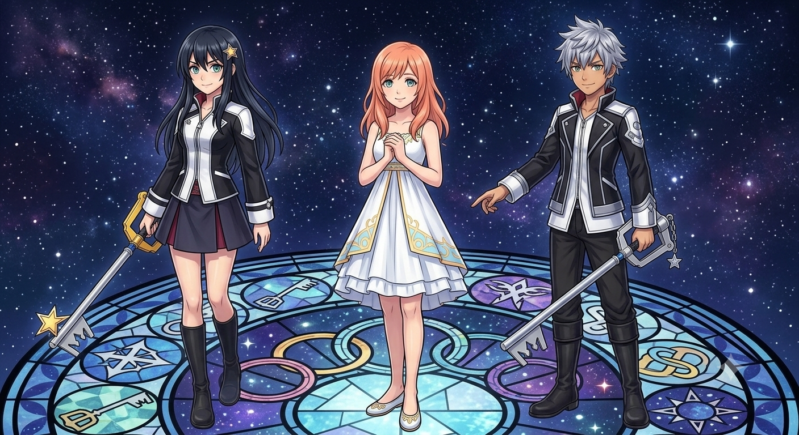

### Chapter 1.10 The Idle Tuesday (A Few Days Prior)

They spent the entire afternoon sitting on the sloped, sun-baked terracotta roof of a Moogle shop, overlooking the winding aqueducts of the town.

Ephemer, true to his nature, had initiated the hangout. In these early days, Ephemer was a restless spirit. He was deeply friendly, but his mind was constantly picking at the seams of Daybreak Town’s reality. He belonged to a different Union, but he completely ignored the unwritten rule that Unions shouldn't intermingle.

"I just don't get the division," Ephemer said, lying flat on his back, tossing a small, green apple up and catching it. "Five Foretellers. Five Unions. We're all gathering Lux for the same reason—to save the world from darkness. So why are we competing? Why do we keep secrets from each other?"

Skuld, who was sitting cross-legged next to Aura, pulled her knees to her chest. At this point in her life, Skuld was a strict rule-follower. She found comfort in order and deeply respected Master Ava.

"It's not a competition, Ephemer, it's a division of labor," Skuld corrected gently, though she looked troubled. "Master Ava says that the Book of Prophecies dictates this structure to maintain balance. If we all gathered in one place, we might leave another vulnerable."

Raja snorted quietly. He was sitting higher up on the roof's ridge, one knee drawn up, his Oni mask resting lazily on the top-right of his head. He was carving a small piece of wood with the edge of his combat-knife Keyblade—a mundane, grounding exercise from his Phase I training.

"Balance is just another word for a stalemate," Raja remarked without looking up from the wood. "If you split an army into five factions and tell them they're all the 'chosen' saviors, you aren't building a defense. You're building five separate echo chambers. When the pressure drops, they won't look at the enemy; they'll look at each other."

Skuld frowned, her dark eyes flashing with defensive loyalty. "That sounds incredibly cynical, Raja. The Foretellers are our Masters. They share the same goal."

"Having the same goal doesn't mean having the same breaking point, Skuld," Aura interjected softly. She was braiding a loose thread on her crimson scarf, her voice laced with that terrifying, weaponized empathy. She looked at Skuld with warm, ancient eyes that belonged to someone who had already watched this girl die once. "It's okay to trust them. But you must never let their dogma replace your own intuition."

Ephemer sat up, catching his apple and looking at Aura and Raja with intense fascination. "You guys talk like you've seen a war before."

"We've seen how people act when they're scared," Raja deflected smoothly, tossing the wood shaving into the wind. "My old man taught us that a title doesn't make a person immune to panic. Foreteller or not, underneath the mask, they're just flesh and blood."

The conversation shifted as the afternoon dragged into the golden hour. Skuld, whose rigid demeanor was slowly melting under Aura’s constant, reassuring presence, initiated the next profound topic.

"How do you two stay so... quiet?" Skuld asked. "When you fought that mutated Darkside, you didn't yell. You didn't chant. You just moved. The rest of us are taught to draw out the Light in our hearts, to feel it burning. But you two feel like deep water."

Aura smiled, leaning back on her hands. "Because fire needs oxygen to burn, Skuld. It consumes energy. If you rely on passion and fierce, burning emotion to fight, what happens when you get tired? What happens when you get sad, or terrified?"

"You burn out," Ephemer whispered, realizing the logic instantly.

"Exactly," Raja said, pointing his knife at Ephemer. "You don't need a burning heart to throw a perfect punch, or to dodge a blade. You just need a calm mind and a calibrated vessel. We stay quiet because we keep our souls in the pilot seat. First-person view gets you killed in the chaos. You have to step back. Observe yourself from the third person."

Skuld looked down at her own hands. "Third person... observing yourself. I don't know if I can do that. I feel everything so loudly."

"And that's a beautiful thing," Aura reassured her, bumping Skuld’s shoulder gently. "We aren't saying you shouldn't feel. Just don't let the feelings hold the steering wheel."

As the sun finally dipped below the horizon, casting the Clock Tower in deep twilight shadows, Ephemer stood up, stretching his arms. He looked toward the towering, forbidden structure in the center of town.

"You know," Ephemer murmured, his voice dropping into a conspiratorial whisper. "The Foretellers spend all their time in that tower. Reading that Book. I've always wondered what's actually written inside it that they aren't telling us."

Skuld immediately stood up, looking alarmed. "Ephemer, no. Don't even think about it. It's forbidden."

Ephemer laughed, rubbing the back of his neck. "I know, I know\! Just thinking out loud."

He turned to Raja and Aura, a bright, undeniable spark of rebellion in his silver eyes. "I'm really glad I met you two. You make this whole 'saving the world' thing feel a lot less heavy."

"It's only heavy if you carry it all at once," Raja replied, hopping down from the roof ridge and landing with a silent, perfectly absorbed crouch. "Get some sleep, you two. We'll hit the portal in a few days. We'll see how you handle the heavy lifting then."

As Ephemer and Skuld walked away, waving goodbye, Aura stood next to Raja. The air between the two multiversal avatars grew heavy with the weight of the previous timeline.

"He's already looking at the Tower," Aura noted softly, dropping her cheerful facade. "The curiosity is going to get him into trouble, just like before."

"I know," Raja said, his eyes narrowing as he watched the silver-haired boy disappear around the corner. "But this time, when he goes poking around in the dark... the Scalpel and the Anvil will be right behind him."

Skuld absorbed Aura’s words, though her expression remained tight with inner conflict. She belonged to Vulpes, a Union built entirely on the foundation of compassion, loyalty, and absolute faith in Master Ava. To be told to pull back from those feelings felt contradictory to everything she was.

Aura sensed that friction immediately. She shifted closer, letting her shoulder gently bump against Skuld’s.

"Your loyalty, Skuld, your kindness, your capacity to love... those are incredible weapons," Aura murmured, her voice carrying that profound, ancient warmth. "Don't ever lose them. But you must not forget to love yourself, too. The Unions teach us to give everything to the Light, to sacrifice ourselves for the greater good. But if you constantly empty your own cup to fill theirs, eventually, you'll have nothing left to sustain your own heart."

Skuld looked up, her dark eyes wide, listening intently.

Aura’s expression turned solemn, her sweet demeanor hardening into something deeply serious, like a veteran warning a rookie about the battlefield. "There will come a time when things stop making sense. A time when the people you trust might act in ways that scare you. When that time comes... do not close your eyes. Do not shut your ears, and do not numb your feelings just because the truth is painful. Keep your eyes open, Skuld. See the world for what it is, not what you wish it to be."

Skuld shivered slightly, though the evening air wasn't cold. The weight of Aura’s words felt like a premonition, settling deep into her bones.

Ephemer, who had been listening quietly, leaned forward. "But if we question everything, how do we know who to follow? The Foretellers only act the way they do because they follow the Master of Masters. He wrote the Book. He sees the future. They just want to understand his will."

Raja let out a low, cynical hum. He stopped carving his piece of wood and looked directly at Ephemer, the Oni mask casting a faint shadow over his eyes in the fading light.

"My old man once told me a story about a very powerful, very dangerous man from another universe," Raja said, his voice cutting cleanly through the twilight air. "This man was accused of deceiving everyone around him. But he replied that he never intended to deceive anyone—it was just that no one ever tried to understand his true self. They only saw the flawless illusion they wanted to see. He said: 'Admiration is the furthest thing from understanding.'"

Ephemer blinked, the phrase hitting him like a physical blow. "Admiration is the furthest thing from understanding..." he repeated softly.

"Think about the Master of Masters," Raja continued, leaning back and looking up at the sky. "From what I gather, he's actually incredibly open-minded. He’s the kind of guy who would welcome an argument, or laugh at a chaotic variable. He gave them a Book, sure, but he also gave them free will. But the Foretellers? They admire him so absolutely, so blindly, that they rarely ever question him. They think they're honoring him by following his script to the absolute letter."

Raja pointed the edge of his combat-knife Keyblade toward the towering Foretellers' Chamber in the distance.

"Because they put him on such an untouchable pedestal, they've completely lost the ability to understand who he actually is, or what he might actually want. They are terrified of deviating. Those who admire blindly are the easiest to manipulate. The only one who might actually understand the Master is the one disciple who isn't standing on the stage with the rest of them."

(Raja was, of course, referring to Luxu, though Ephemer and Skuld didn't know that name yet).

The silence that followed was heavy.

For Skuld, the idea was utterly shocking. To suggest that the Foretellers' absolute devotion was actually a flaw—that their reverence made them ignorant—felt like heresy. It shook the very foundation of her worldview. She hugged her knees tighter, her mind racing to reconcile Master Ava's teachings with this terrifyingly logical perspective.

Ephemer, however, looked completely fascinated. The logic was flawless. It scratched that rebellious, analytical itch in the back of his mind. He didn't completely grasp the cosmic scale of what Raja was implying—that understanding would only come much later, when he eventually uncovered the dark truths of the Keyblade War—but the seed had been planted.

It was shortly after this profound silence that Ephemer finally stood up, looking toward the forbidden clock tower, his curiosity now burning hotter than ever before, prompting his remark about wondering what was actually written in that Book.

And as Ephemer and Skuld walked away into the evening, their minds forever altered by the Anvil and the Scalpel, Aura and Raja knew they had successfully hijacked the philosophical trajectory of the Dandelion Leaders.

The silence that followed was heavy.

For Skuld, the idea was utterly shocking. To suggest that the Foretellers' absolute devotion was actually a flaw—that their reverence made them ignorant—felt like heresy. It shook the very foundation of her worldview. She hugged her knees tighter, her mind racing to reconcile Master Ava's teachings with this terrifyingly logical perspective.

Seeing the sheer turmoil swimming in the dark-haired girl’s eyes, Aura’s demeanor instantly softened. The lethal, ancient warrior retreated, replaced entirely by the warm, deeply empathetic friend.

Aura shifted closer on the terracotta roof, gently wrapping an arm around Skuld’s shoulders and pulling her into a comforting side-hug.

"Take a breath, Skuld," Aura murmured, her voice a soothing balm against the chill of the evening. She shot Raja a mild, reprimanding look, though her eyes were fond. "It's completely understandable if you're shocked. Raja’s mouth is quite loose, and he has a terrible habit of dropping heavy philosophical anvils on people when they're just trying to enjoy a nice Tuesday sunset."

Raja merely shrugged, unabashed, leaning back against the roof ridge and looking up at the early evening stars. "Truth doesn't have a schedule, Aura."

"Maybe not, but it requires tact," Aura countered playfully, before turning her full, earnest attention back to Skuld.

She gently squeezed Skuld's shoulder. "Listen to me. What Raja said is harsh, but he doesn't say it to frighten you or to make you turn against Master Ava. He says it because we care about you. No matter what happens with the Unions, the Foretellers, or the Book of Prophecies, we are friends. Real friends help each other see clearly, even when the fog is thick."

Skuld looked up, her rigid posture finally relaxing just a fraction as Aura’s absolute, unshakeable warmth washed over her.

"I know this is a lot to process," Aura continued, her voice dropping to a gentle, reassuring whisper. "And we can pray to whatever light is out there that the worst never comes to Daybreak Town. But... if the worst does come. If the rules break, and the people you admire suddenly feel like strangers... I want you to remember what Raja said today. Let his words give you clarity in that moment, instead of letting the betrayal drown you in despair."

Aura reached up, lightly touching one of the star-shaped pins in Skuld's hair.

"You won't have to face it alone. Whenever you need me, Skuld, I will be right there. I promise."

Skuld’s breath hitched slightly. The profound terror of Raja's logic was suddenly eclipsed by the profound security of Aura's promise. In a world where every wielder was told to rely on distant, masked Masters, having someone sitting right next to her, offering absolute, unconditional support, was overwhelming.

Skuld offered a small, fragile, but incredibly genuine smile. "Thank you, Aura. And... thank you, Raja. Even if you do give me a headache."

"Hey, I consider that a successful afternoon," Raja chuckled quietly, the Oni mask glinting in the twilight.

Ephemer, who had been watching the exchange with deep admiration, let out a long breath. The tension had been perfectly diffused, leaving behind a much stronger, unbreakable bond between the four of them.

It was shortly after this profound moment of connection that Ephemer finally stood up, looking toward the forbidden clock tower, his curiosity now burning hotter than ever before, prompting his remark about wondering what was actually written in that Book.

And as Ephemer and Skuld walked away into the evening, their minds forever altered by the Anvil and the Scalpel, Aura and Raja knew they had successfully hijacked the philosophical trajectory of the Dandelion Leaders. Not through force or magic, but through the terrifying clarity of truth, and the unyielding warmth of real friendship.

Ephemer and Skuld turned, taking their first few steps toward the fire-escape ladder to head back down to the cobblestone streets.

"Wait," Raja called out, his voice cutting cleanly through the quiet hum of the evening.

Ephemer stopped, looking back over his shoulder. Skuld paused beside him, the evening wind catching her dark hair.

Raja hopped down from the roof ridge, taking a slow, measured step toward the silver-haired boy. He didn't have his casual, chill smirk anymore. His expression was flat, serious, and piercing.

"I can practically hear the gears turning in your head from here, Ephemer," Raja said quietly. "I know that look. You're chewing on what I said about admiration and blind faith. And knowing you... you aren't just going to sit on it. You're going to take it straight to the top. You're going to talk to Master Ava."

Ephemer blinked, caught slightly off guard by how perfectly Raja had read him. He rubbed the back of his neck, offering a sheepish but determined nod. "She's the most approachable. If anyone will listen to a different perspective, it's her."

"That's exactly the problem," Raja warned, crossing his arms. He cast a brief glance at Skuld before looking back at Ephemer. "Master Ava is just like Skuld. Her entire foundation is built on compassion, empathy, and absolute loyalty to her Union and her Master. If you walk into her office and drop that philosophical anvil on her head without someone like Aura there to soften the blow... you are going to break her."

Ephemer’s eyes widened slightly. "I... I wouldn't want to hurt her. Should I not say anything?"

"I didn't say that," Raja corrected smoothly. "I never said hide the truth. But if you're going to shake the foundation of her world, you have to give her something else to stand on. When you talk to her, make sure you remind her of one very specific thing."

Raja took another step forward, the fading twilight casting half his face in shadow beneath the resting Oni mask.

"Remind her to listen to herself," Raja instructed, his voice dropping an octave, carrying the weight of a seasoned commander. "Tell her that before she is a Foreteller, before she is a Master bound by a Book, she is just Ava. Tell her to do what she thinks is right. If the prophecies demand she stands by and watches everything fall, but her own conscience screams at her to save people... tell her to save the people."

Aura, who had remained silent, stepped up beside Raja. She offered Ephemer a soft, profound smile. "The system is rigid, Ephemer. But humanity doesn't have to be."

Raja nodded, locking eyes with the future Dandelion Leader.

"Everyone in this town repeats the exact same phrase," Raja said, his tone turning almost reverent, yet entirely defiant of the Foretellers' dogma. "You say it before missions. You say it when you part ways. 'May your heart be your guiding key.'"

Raja spoke the original words perfectly, letting them hang in the air. "「鍵が導く心のままに」— Kagi ga michibiku kokoro no mama ni."

Ephemer and Skuld stared at him, the familiar incantation suddenly feeling entirely foreign and infinitely heavier.

"The Unions teach you that it means 'blindly follow the Light,'" Raja stated softly. "It doesn't. My old man says it means exactly what it sounds like. It means trust your own moral compass. Trust your own intuition, even when the gods, the prophecies, and the Masters tell you otherwise. Make sure Master Ava remembers that."

Ephemer stood perfectly still for a long moment. The rebellious spark in his eyes had matured, right then and there, into the quiet, unshakeable resolve of a true leader. He had found his anchor.

"I will," Ephemer promised, his voice devoid of its usual playful lilt. "I'll make sure she hears it. Thank you, Raja."

Skuld offered one last, deeply grateful look at Aura, before the two of them finally descended the ladder, disappearing into the winding streets of Daybreak Town.

On the roof, Aura leaned against Raja’s shoulder, watching the first stars begin to pierce the twilight sky.

"You just gave Ephemer the exact ideological weapon he needs to convince Master Ava to form the Dandelions early," Aura murmured, a fond smile touching her lips. "The Book of Prophecies is going to throw an absolute fit."

Raja smirked, reaching up to adjust his mask. "Let it. The script was getting boring anyway."

---

### Chapter 1.11 The Fox and the Dandelion

The water in the plaza’s central fountain shimmered under the pale light of the moon. Master Ava sat alone on the edge of the stonework, her Vulpes mask resting in her lap. The weight of the day—the bitter arguments with Aced, the rising paranoia of Ira, the cold detachment of Invi—pressed down on her shoulders like lead.

"When will it stop?" Ava whispered to the empty plaza, her voice trembling. "I don't want us to turn against each other."

"Mind if I sit?"

Ava looked up, hastily wiping a stray tear from her eye. Ephemer stood there, his silver hair catching the moonlight, offering a gentle, unassuming smile.

"Ephemer," Ava breathed, a warm, relieved smile breaking through her sorrow. "Of course. Please."

Ephemer sat down beside her, the rushing water filling the quiet space between them. He didn't rush to speak. He remembered Aura’s warning: Master Ava is just like Skuld. If you drop the anvil on her head, you’ll break her. He needed to be gentle.

"Why the sad face, Master?" Ephemer finally asked.

Ava sighed, looking down at her reflection in the water. "Do you remember when you asked me why the Unions are competing against each other instead of working together? Actually... I always wonder the same thing."

Ephemer blinked, genuinely surprised. "Didn't you say it was because your Master said so?"

"Yes," Ava replied, her voice tightening with the conflict warring inside her. "It is because the Master said so, and we need to obey. But lately... I have really started to wonder. You once told me you were seeking answers, Ephemer. That you wanted to solve the mysteries of the world. Well... I think that's how things should be. We need to question things, and think for ourselves."

Ephemer’s breath hitched. Raja had been exactly right. She was already cracking under the weight of blind obedience. She was begging for permission to think for herself.

"Whoa," Ephemer chuckled softly, trying to keep the mood light. "You are really not yourself today. I guess even Foretellers have their days off."

Ava laughed, a small, genuine sound.

"But you know..." Ephemer continued, his tone shifting into something much older and more profound than his years. He looked out at the water. "I made a couple of new friends today. From different Unions. One of them told me something I can't stop thinking about. He said... 'Admiration is the furthest thing from understanding.'"

Ava completely froze. The words struck her like a physical blow, echoing in the deepest parts of her heart.

"He thinks," Ephemer went on gently, "that because you all admire the Master of Masters so completely, you put him on an untouchable pedestal. And because of that, you might be terrified of doing what he actually wanted you to do. He gave you a Book, yeah... but he also gave you free will. Maybe he wanted you to argue. Maybe he wanted you to find a different path."

Ava stared at the silver-haired boy, her eyes wide. The suffocating chains of dogma that had been wrapped tightly around her heart suddenly felt incredibly brittle. "Admiration is the furthest thing from understanding..." she repeated the quote softly, the profound truth of it bringing fresh tears to her eyes.

"Master Ava," Ephemer said, turning to look her directly in the eyes. "If the rules demand you watch this town fall apart, but you know in your heart that you need to save people... then you have to save them."

He offered her a bright, resolute smile, quoting the phrase that bound their world together, but placing the new, liberating weight behind it.

"「鍵が導く心のままに」— Kagi ga michibiku kokoro no mama ni. May your heart be your guiding key. It doesn't mean blindly follow the Book. It means trust your own conscience. Do what you think is right."

Ava covered her mouth, a sudden, overwhelming wave of clarity washing over her. The anxiety, the guilt of deceiving her fellow Foretellers, the despair of the impending war—it all shattered. Ephemer hadn't just comforted her; he had given her absolution.

"I..." Ava choked out a laugh, wiping her eyes as a fierce, newfound resolve ignited in her chest. "Your new friends... they must be incredibly wise."

"They're definitely something," Ephemer grinned, standing up. "They don't talk much about themselves, but they see the world completely differently. We're meeting again tomorrow to hit the holographic worlds. I think we’re going to shake things up."

"That sounds wonderful," Ava smiled, placing her Fox mask back over her face. But underneath it, she wasn't a tragic pawn anymore. She was a Master with a mission. "You'd better go home and get some sleep then."

"Okay\! Goodnight, Master Ava\! Cheer up\!" Ephemer waved, jogging off into the moonlit streets.

Ava watched him go until he disappeared around the corner. She looked up at the towering Clock Tower, where the Book of Prophecies sat. She didn't feel afraid of it anymore. The Master had given her a task to ensure the light survived, but now, she wouldn't do it out of grim obedience. She would do it out of defiance against the darkness.

"If worst comes to worst," Ava whispered to the wind, her voice completely steady, "I won't let us drown in this prophecy. I will leave the future to kids who see the world like you do."

She held out her hand, catching a stray dandelion seed floating on the night breeze.

"Let the wind carry you far, far away... My Dandelions."

---

### Chapter 1.12 The Vessel’s Memory

The conversation with Master Ava had left a heavy, lingering silence in the air, but for Aura and Raja, it was the sound of a timeline breaking in exactly the right way.

Sitting on the sloping, terracotta roof of an empty Daybreak Town clockmaker's shop, the two anomalies finally took a moment to breathe. The artificial stars of the Age of Fairy Tales glimmered above them, casting a soft glow over the sleeping city. It was time to look inward. They had secured the narrative foundation; now, they needed to secure their physical vessels.

They were not starting from scratch. Far from it.

Before the system had reset, before this "First Dive" had officially begun, Aura and Raja had successfully sealed four of the thirteen True Darknesses within their own bodies. A normal human vessel would have instantly atomized under that kind of conceptual pressure. Even the strongest Keyblade wielders of this era—Foretellers included—relied entirely on external tools. They channeled Light and Magic through their Keyblades, using the weapon as a conduit so their fragile mortal bodies wouldn't have to bear the brunt of the cosmic forces.

But Aura and Raja’s bodies had already been tempered by holding literal, multiversal voids. Their physical "hardware" was elite, forged in the fires of a previous timeline. All they needed now was to run the diagnostic and reboot the software.

Step 0.5: Neuro Somantic Cultivation wasn't a discovery for them. It was a review.

"Start at the edges," Raja murmured, closing his eyes and resting his hands on his knees.

Aura nodded, mimicking his posture. They began the Terminal Awakening. They didn't reach for Light or Magic. Instead, they focused entirely on their own biological pulse. They pushed their awareness to the absolute extremities of their bodies—the tips of their fingers, the beds of their toenails. Within seconds, a familiar, sharp tingling sensation flared to life. The dormant nerve endings sparked, reconnecting the furthest borders of their physical forms to their conscious minds.

Next came The Sponge.

Normal Keyblade wielders bathed in the ambient Light of Daybreak Town, letting it wash over them. Aura and Raja opened their pores and drank it. They treated their skin as an intake valve, forcefully pulling the dense, atmospheric Ki of the world inside. The air around them visibly warped, the ambient Light bending toward them as if pulled by a localized gravitational vacuum.

"Funnel it into the joints," Aura whispered, her breathing falling into a deep, rhythmic cadence.

They initiated the Joint Drill. The energy they absorbed wasn't allowed to float aimlessly; it was compressed and driven into their elbows, knees, wrists, and shoulders. Their joints acted as capacitors, storing the kinetic and ambient force. Faint, rhythmic popping sounds echoed from their bodies as the cartilage and ligaments absorbed the shockwaves of raw power, turning their limbs into loaded springs.

Then came the heaviest phase of the review: The Bone Wash.

To wield Phase 2, the vessel had to be immaculate. They drove the compressed energy from their joints directly into their skeletal structure, forcing it deep into the marrow. It was an agonizing, deep-cleaning process that would have made an untrained wielder pass out from the sheer pressure. But Aura and Raja simply gritted their teeth, letting the internal pressure flush out any residual temporal fatigue, stagnation, or impurities left over from their multiversal transition. They sweat a faint, dark mist as the vessel purified itself, leaving their bones feeling lighter than air yet harder than tempered steel.

The review was complete. The vessel was primed.

Raja opened his eyes, a faint, translucent aura radiating from his skin. "Hardware is online. Let's map the network."

Aura smiled, the air around her vibrating with barely contained kinetic force. "Right behind you."

Without hesitation, they crossed the threshold into Step 1: The 12 Great Meridians.

Having forcefully awakened their extremities, flooded their capacitors, and purified their marrow, the energy inside them was a roaring river looking for a riverbed. Using sheer willpower, Aura and Raja grabbed hold of that internal torrent and began carving the pathways.

They guided the Ki up the inside of their arms, down their chests, through the vital organs, and down the lengths of their legs, mapping the exact twelve primary channels required for complete somatic dominance. It wasn't about casting a spell; it was about creating a closed, infinite loop of biological and spiritual supremacy.

As the twelfth and final meridian connected, completing the circuit, the ambient hum of energy around them vanished.

There was no explosive shockwave. No flashy beam of Kingdom Hearts Light. Instead, there was an absolute, terrifying stillness. The energy was no longer leaking into the atmosphere; it was perfectly contained, flowing flawlessly through the 12 Great Meridians in an endless cycle of self-sustaining power.

Aura slowly uncrossed her legs and stood up. She didn't use her hands to push herself off the roof; the sheer flow of internal Ki made her body move with a weightless, frictionless grace. Raja followed, rolling his shoulders as he felt the boundless stamina coursing beneath his skin.

Step 1 was complete. They were no longer just anomalies in the timeline; they were self-contained engines of reality-bending power.

Raja reached into his pocket and pulled out a long, dark strip of cloth, tossing another one to Aura.

"The Data Worlds are tomorrow," he said, tying the blindfold securely over his eyes.

Aura caught hers, a confident smirk playing on her lips. "Let's see what these kids can do."

---

## Chapter 2 Castle of Dreams

---

### Chapter 2.1: Projections of the Future

The morning sun cast a warm, golden glow over the fountain plaza of Daybreak Town. The gentle sound of running water usually made it the perfect spot to relax, but today, there was a palpable sense of urgency in the air.

Ephemer and Skuld sat on the edge of the fountain, finishing up a quick breakfast of sea-salt buns, while Aura and Raja stood nearby, stretching out their muscles after a quiet morning meditation on the rooftops. Rex and Lux fluttered lazily around the plaza, occasionally chasing a stray water droplet.

With a twin set of soft pops, Ephemer and Skuld’s Chirithies materialized on the cobblestones in front of them, their little capes fluttering.

"Morning, you two," Ephemer said, wiping a crumb from his cheek. "Got a new assignment for us?"

Ephemer's Chirithy rubbed the back of its head nervously. "I know everything has been a bit overwhelming lately, but Darkness waits for no one\! In fact, it's found its way to a bunch of other worlds, and they need your help."

Skuld hopped off the fountain, her expression turning serious. "Other worlds? You mean like the projections the Foretellers have been talking about?"

"Exactly\!" Skuld's Chirithy chimed in. "Just to be clear, these aren't like that purely digital, isolated Data World of the Enchanted Dominion that the Union leaders are currently researching. These places we need you to go to are physical projections of the actual future\! They are worlds pulled directly into our present by the power of the Book of Prophecies."

Aura whistled lowly, crossing her arms. "Projections of the future. So, we're basically stepping into history that hasn't happened yet just to swat some bugs. Multiversal time travel really is a headache no matter what reality you're in."

"Hey, as long as it helps keep the Darkness in check, I'm ready," Ephemer said with a confident grin. He summoned his Starlight Keyblade, the metal gleaming in the morning sun.

Raja, leaning against a nearby lamppost, reached into his pocket and pulled out a thick, dark strip of cloth. Without a word, he calmly tied it over his eyes, securing a tight knot at the back of his head.

Skuld blinked, her Keyblade half-summoned. "Uh, Raja? What's with the blindfold? The Book of Prophecies didn't say the next world was going to be blindingly bright, did it?"

"Just testing my internal radar today," Raja replied with a casual shrug, adjusting the fabric over his nose. "Don't worry about me. If I walk into a wall, feel free to laugh."

Aura smirked, playfully shoving his shoulder. "Oh, I'll be the first one laughing. Just try not to trip over a Heartless."

"I know a way to these places," Ephemer's Chirithy announced, interrupting their banter. "Are you ready?"

Ephemer and Skuld nodded, raising their Keyblades in unison. A beam of light shot from the tips of their blades, striking the air in front of them. The space rippled and tore open, revealing a swirling, luminous portal—a gateway bridging Daybreak Town to the future.

"Let's go save a fairy tale," Ephemer said, stepping forward.

Skuld followed close behind, with Aura and the blindfolded Raja casually bringing up the rear, treating the magical gateway like an everyday doorway.

As the portal began to close behind them, shrinking down to a mere pinprick of light, none of them noticed the small, timid figure peeking out from an alleyway just off the plaza. Strelitzia, clutching her own Keyblade nervously to her chest, watched her friends disappear into the light. Taking a deep breath to steady her rapidly beating heart, she dashed across the plaza and slipped into the portal just a split second before it vanished completely.

---

### Chapter 2.2: The King’s Ultimatum & The Maid’s Reality

The flash of light faded, leaving the scent of morning dew and blooming roses in its wake. The party materialized on a pristine cobblestone path overlooking a sprawling, picturesque valley. In the distance, rising above the pastel-roofed town, stood a magnificent palace of white stone and gold spires that seemed to catch the morning sun perfectly.

Ephemer stretched his arms overhead, taking in a deep breath of the fairy-tale air, while Skuld admired the sheer architecture of the distant castle. Beside them, their Chirithies materialized with soft pops.

"Welcome to the Castle of Dreams\!" Ephemer's Chirithy announced, doing a small spin. "A world where elegance and grace are everything. But too bad we're not here for a vacation. Our mission is to—"

"Banish the darkness, yeah, we know the drill," Ephemer chuckled, patting the Dream Eater's head.

A few paces behind them, Aura and Raja casually took in the scenery. Raja, dressed in his usual combat attire, was calmly tying a thick, dark cloth over his eyes, securing it in a tight knot at the back of his head. Rex and Lux, hovering nearby, didn't even bat an eye at the strange behavior.

Skuld noticed and raised an eyebrow. "Uh, Raja? The sun isn't that bright here. What's with the blindfold?"

"Just testing my internal radar today," Raja replied with a casual shrug, adjusting the fabric. "Don't worry about me. If I walk into a wall, feel free to laugh."

Aura smirked, stretching her legs. "I'll be the first one laughing. Come on, let's head toward the town."

Before they could take another step, the tranquil morning was shattered by the heavy, metallic thud of armor, followed by a remarkably dignified squeak of panic.

"Oh, dear\! Oh, my\! Stay back, you dreadful creatures\!"

The group rushed forward, cresting a small hill to find an older gentleman in a crisp aristocratic uniform, complete with a monocle, cowering against a stone wall. Surrounding him were half a dozen Large Body Heartless, their massive, armored bellies glinting menacingly.

Ephemer and Skuld instantly summoned their Keyblades, dashing forward. "We got this\!" Ephemer yelled.

One of the Large Bodies lunged, leading with its massive, seemingly impenetrable stomach. Before Ephemer could swing his Keyblade, a blur of motion stepped effortlessly past him.

Raja, entirely blindfolded, didn't even shift into a combat stance. As the Heartless barreled into him, he simply stepped slightly to the side, raising one hand. Relying entirely on his Step 1 Cultivation—the perfect circulation of his 12 Great Meridians—he redirected the beast's momentum. He placed his palm flat against the armored belly and, with a subtle twist of his wrist, guided the massive creature's own kinetic energy past him, sending it crashing face-first into the cobblestones with a deafening thud.

Skuld blinked in shock. "Did he just... gently parry a Large Body?"

"Less staring, more striking\!" Aura called out playfully, rushing in alongside the kids.

With Raja casually redirecting the heaviest attacks without even looking, Aura, Ephemer, and Skuld made quick work of the remaining Heartless, dissolving them into wisps of dark smoke.

The older gentleman let out a massive sigh of relief, dusting off his pristine coat and fixing his monocle. "My word\! You young people arrived just in the nick of time. I am the Grand Duke of this kingdom, and I am already having the most spectacularly terrible, stressful week of my life\!"

Ephemer dismissed his Keyblade. "Stressful week? You're the Grand Duke, shouldn't you be relaxing in that giant palace?"

The Duke let out a scoff that bordered on a sob. "Relaxing?\! Ha\! The King is in an absolute frenzy, I tell you\! His Majesty has suddenly realized he is growing older, and he is positively terrified of passing away without seeing his grandchildren. He has thrown a tyrannical tantrum of epic proportions\!"

The Duke pulled a stack of heavily wax-sealed envelopes from his satchel, waving them frantically. "He has commanded a Royal Ball tonight, and by royal decree, every single eligible maiden in the kingdom must attend. He is forcing His Royal Highness, the Prince, to find a bride, and if this fails, His Majesty has threatened to have my head\! I am to deliver these summons to every household, but with these shadowy monsters roaming the streets..."

He looked at the group with pleading eyes. "Could you brave youngsters perhaps assist me? There is an estate just down this road, the Tremaine chateau. Could you deliver their summons while I hurry to the eastern district?"

Skuld smiled warmly, taking the letter from his trembling hands. "Don't worry, Duke. We'll make sure it gets delivered."

"Oh, bless you\! Bless you all\!" The Grand Duke bowed hastily before scurrying off down the road, muttering to himself about impossible kings and high blood pressure.

As Ephemer and Skuld turned to look at the letter, discussing the quickest route, Aura and Raja stood perfectly still.

To the untrained eye, the bushes near the stone wall were completely empty. But to Aura and Raja's refined senses, the area was practically glowing with a faint, timid spiritual signature. It was a gentle, flickering Ki, trembling slightly behind a thick patch of hydrangeas.

Raja tilted his head slightly toward the bushes, the blindfold hiding his eyes but not his smirk. Aura crossed her arms, exchanging a knowing, silent nod with him. They didn't sense any malice—just overwhelming shyness. Strelitzia.

Aura turned back to the kids, her tone breezy. "Alright, let's go find this Tremaine place. I have a feeling we're going to have plenty of company."

---

### Chapter 2.3 The Eunjang Brawlers

With the Grand Duke’s letter safely tucked into Skuld’s pouch, the party ventured deeper into the cobblestone streets of the Castle of Dreams.

"The Tremaine chateau should be just on the other side of the town square," Ephemer said, checking a hastily scribbled map the Duke had handed them. "If we cut through this alleyway, it should shave off a few minutes."

"Lead the way, fearless leader," Aura teased, gesturing to the narrow passage between two tall, pastel-colored bakeries.

Rex and Lux fluttered ahead, their tiny, glowing bodies acting as a makeshift lantern in the shadows. But as the party ventured deeper into the alley, the ambient magic of the fairy-tale world began to quietly fray. Unnoticed by the Keyblade wielders, Rex and Lux’s eyes glowed with a faint, structural code.

The air grew heavy. The sweet scent of morning dew and fresh bread faded, replaced by the sharp, metallic tang of smog, damp concrete, and rusted iron. The crisp clack of their boots on cobblestone seamlessly transitioned into the dull, gritty scuff of asphalt.

Ephemer blinked, looking up as the alley suddenly widened into a massive, fenced-off abandoned construction lot. "Uh... is it just me, or did the architecture suddenly get really... gray?"

"And loud," Raja added. Even blindfolded, his head tilted toward the center of the lot.

A cacophony of shouts, jeers, and the sickening thud of fists hitting flesh echoed off the half-built concrete walls. Trapped near a pile of steel rebar were seven teenagers—some battered, some bleeding, but all standing their ground. Ben Park, Alex Go, Gerard Jin, Teddy, Rowan, and Eugene were back-to-back. At the center stood Gray Yeon, his expression deadpan and chillingly calm.

Surrounding them, blocking the only exit, was a sprawling mob of nearly a hundred sneering delinquents from the Union, armed with baseball bats, pipes, and sheer overwhelming numbers.

"Whoa\!" Skuld gasped. "Are those Heartless? They look human\!"

"They are human," Ephemer said, his protective instincts flaring. He and Skuld instantly thrust their hands out, summoning their Keyblades with a flash of light. "We have to help them\!"

Before Ephemer could take a single step, a hand firmly clamped down on his wrist, physically pushing the Starlight Keyblade down.

"Whoa, down, tiger," Aura said, her voice completely calm. "No magic. No Keyblades."

Ephemer looked at her, confused. "What? Why? Look at how many of them there are\!"

"Because they aren't Heartless, Ephemer," Raja said quietly, stepping up beside him. "They're just angry civilians. Delinquents. You don't use multiversal weapons of Light to fight a turf war. We fight on their level."

Aura cracked her knuckles, a sharp, popping sound echoing in the tense air. "Exactly. Consider this a crash course in street smarts."

Without another word, Aura and Raja casually strolled into the fray, right as the Union mob charged the Eunjang crew.

A massive thug with a bleached buzzcut swung a steel pipe at the back of Alex Go's head. Before it could connect, Aura stepped in, sweeping the thug’s leg and driving a perfectly placed elbow into his solar plexus. The guy folded like a lawn chair.

On the other side, three delinquents noticed the "blind guy" walking into the lot and rushed Raja with malicious grins. Raja didn't even break his stride. Relying solely on the perfect internal circulation of his 12 Great Meridians, he dodged a wild punch by a millimeter, grabbed the attacker's wrist, and used the boy's own momentum to launch him like a bowling ball into the other two.

"Hey\! Don't just stand there, kids\!" Aura called out over her shoulder, ducking a wild haymaker. "Hands up, chin down\! Let's go\!"

Forced to dismiss their Keyblades, Ephemer and Skuld jumped into the brawl. At first, it was incredibly awkward for them. Used to relying on magical strikes and wide, sweeping arcs, having to throw actual punches and kicks felt grounding.

"While you're surviving, watch the quiet kid in the center\!" Raja instructed calmly, weaving through the chaos.

Ephemer and Skuld glanced over as they fought, locking their eyes on Gray Yeon.

What they saw completely shattered their understanding of combat. Gray didn't have magical strength. He didn't have immense physical bulk like Ben Park. But he was a terrifying force of nature. A Union thug lunged at Gray; instead of blocking, Gray casually tossed a discarded jacket entirely over the attacker's head, blinding him, before driving a brutal kick into the back of his knee. As another lunged, Gray kicked up a cloud of chalky brick dust straight into their eyes, following up with a calculated, clinical strike to the jaw using a thick textbook he had pulled from his bag.

He used the environment, physics, and sheer psychological dominance to dismantle people twice his size.

"See that?" Aura said, casually tossing a Union lackey into a pile of trash bags. "Combat isn't just about swinging the hardest. It’s spatial awareness. It’s pragmatism. Use your environment. A fight is a puzzle, not just a test of strength."

Ephemer’s eyes lit up with realization. Ducking under a sloppy punch, he didn't try to strike back immediately; instead, he hooked his foot around a discarded wooden pallet, kicking it up to block the thug's path before shoving the pallet right into his chest, knocking him flat. Skuld caught on immediately, using the narrow spaces between the steel rebar to funnel her attackers one by one, rather than fighting them all at once.

Hidden Perspective: High above the chaos, crouched silently behind a rusted steel I-beam, Strelitzia watched the entire spectacle. Her eyes were fixed squarely on Gray Yeon. As a physically smaller, quieter person herself, seeing Gray use his brain to absolutely dominate a battlefield of larger opponents resonated deeply with her. She took careful mental notes of his footwork, the way he measured distance, and his utter lack of hesitation.

Within minutes, the overwhelming Union numbers broke. Demoralized by the sheer ferocity of Ben Park, the surgical precision of Gray, and the sudden, terrifying intervention of four strangers (one of whom was fighting blindfolded), the remaining delinquents scrambled out of the lot, groaning and limping.

The dust settled over the construction site.

Ben Park wiped a smear of blood from his split lip, letting out a booming, boisterous laugh. "Man\! I don't know what school you guys are from, but you hit like freight trains\! Thanks for the assist\!"

Ephemer, panting slightly and rubbing his knuckles, grinned back. "No problem\! You guys were putting up a pretty crazy fight yourselves."

Gray Yeon stood a few feet away, adjusting his uniform. He didn't say a word, but his cold, calculating eyes scanned Aura, Raja, Ephemer, and Skuld. After a moment, the tension in his shoulders dropped. He gave a single, respectful nod of acknowledgement.

Aura returned the nod with a casual two-finger salute. "Keep your guards up, kids."

With the brawl finished, Aura and Raja simply turned around and began walking back toward the narrow alley they had come from. Ephemer and Skuld jogged to catch up.

"That... was intense," Skuld breathed out, flexing her hands. "My knuckles sting, but Aura was right. Watching that Gray kid fight made everything click. It's about efficiency."

"See? Who needs magic all the time?" Raja chuckled, adjusting his blindfold.

As they walked back through the shadows of the alley, Rex and Lux fluttered down, their digital aura seamlessly knitting the dimensional fabric back together. The smell of smog vanished. The asphalt softened back into ancient cobblestone.

They stepped out of the alleyway, the bright morning sun hitting their faces once more, and found themselves standing directly in front of the ornate, wrought-iron gates of the Tremaine chateau.

---

### Chapter 2.4 The Animal Syndicate & The Meany Cat

Rather than scaling the wall or picking the lock, Ephemer simply walked up to the grand double doors of the Tremaine chateau and knocked.

Moments later, the door creaked open. Standing there was a young woman in a patched, ash-stained servant’s dress, her blonde hair tied back beneath a simple kerchief. Despite her tired eyes and the soot on her apron, her smile was incredibly warm.

"Oh\! Hello there," Cinderella said, blinking in surprise at the odd group on her doorstep.

"Hi\! We're here on behalf of the Grand Duke," Skuld said gently, handing over the wax-sealed envelope. "It's a royal summons. For a ball tonight."

"A royal ball?" Cinderella’s eyes widened with pure, unfiltered hope as she took the letter. "Oh, thank you\! Thank you so much\!"

Before she could say another word, a sharp, incredibly grating voice echoed from the top of the grand staircase inside. "Cinderella\! Where is my breakfast? And my ironing\! You lazy, useless girl\!"

Cinderella winced slightly, the hope in her eyes dimming just a fraction. "Coming, stepmother\! I-I have to go. Thank you again." She bowed her head quickly and hurried back into the sprawling, dimly lit house.

Ephemer frowned, the heavy wooden door shutting in their faces. "Well, that was incredibly rude."

"Tell me about it," a tiny, squeaky voice chimed in from right next to Ephemer's ear.

Ephemer jumped, nearly summoning his Keyblade, before realizing the voice came from his own shoulder. Sitting there was a scrawny mouse in a red sweater and a little hat. Next to him, clinging to Ephemer's collar for dear life, was a much chubbier mouse in a yellow shirt.

"Name's Jaq\! And this here is Gus-Gus," the mouse said, tipping his hat. "We saw you give Cinderelly the letter. You kids got good hearts. Not like the meany-stepmother\!"

Raja crossed his arms, his blindfolded head turning toward the mice. "The stepmother? The lady yelling upstairs?"

Jaq nodded furiously, climbing down Ephemer's arm to stand on the stone banister. "Zuk-zuk\! Cinderelly used to own this whole big house\! Her papa was a good man, very rich. But when he passed away... boom\! Stepmother and the ugly stepsisters showed their true colors\! They took everything. Made Cinderelly a maid in her own home. Make her clean, wash, iron, all day, all night\!"

Skuld’s hands balled into fists. "That's horrible. And they just treat her like that? After taking her home?"

"She never gets mean back," Jaq said, his little voice full of reverence. "Always gentle. Even feeds us mice, and Bruno the dog, and Major the horse\! We gotta help her go to the ball\! The birds are fixing up her mama's old dress, but we need materials\!"

Ephemer exchanged a look with Skuld, both of their eyes burning with determination. He looked over at Aura and Raja. "We're helping them."

Aura smirked, leaning against the gate. "Didn't expect anything less. Lead the way, Jaq."

Guided by the mice, the party sneaked around the back of the chateau and slipped through a cellar window. The house was massive, but the air inside felt heavy, suffocated by decades of Lady Tremaine's lingering malice.

Jaq and Gus led them up the servant's stairs to the upper hallways. "We need nice things for the dress. Stepsisters throw away good stuff all the time\!" Jaq whispered.

Sneaking into Drizella and Anastasia's messy, garish bedrooms, the party went to work. Skuld found a beautiful, discarded blue sash, while Ephemer helped Gus gather a string of shimmering beads that had been tossed on the floor.

"Got 'em\!" Ephemer whispered, giving Gus a thumbs-up.

But as they turned to leave, a low, rumbling hiss echoed from the doorway.

Blocking their exit was Lucifer—a massive, incredibly fat, and intensely cruel-looking black cat. His green eyes locked entirely onto Gus, who was currently wrapped up in the bead necklace.

"Rucifee\!" Gus shrieked.

Lucifer pounced.

"Oh no you don't\!" Ephemer yelled. He didn't summon his Keyblade—he remembered the lesson from the construction lot. Using his spatial awareness, Ephemer hooked his foot under a wooden footstool and kicked it perfectly into Lucifer's path.

The cat tripped, crashing into a vanity table. The crash echoed loudly, and the sudden spike of fear and malice in the room caused the shadows in the corners to writhe. Black ink pooled on the floor, and half a dozen Shadow Heartless materialized, their yellow eyes glowing in the gloom.

"Looks like the stepmother's bad vibes are attracting the bugs," Aura noted casually, stepping into the room.

Lucifer, recovering from the stool, ignored the Heartless and lunged for Gus again, trapping the chubby mouse under a porcelain teacup.

"Jaq\! Get Gus\!" Skuld ordered, finally summoning her Keyblade.

The room devolved into a chaotic, dual-layered fight. Ephemer and Skuld went to work on the Heartless. But rather than using wide, destructive magic that would ruin the room and alert the stepsisters, they fought with tight, efficient strikes. Ephemer used the bedposts to pivot, keeping the Heartless corralled in the center of the room.

Meanwhile, Aura and Raja handled the cat. They didn't want to hurt an actual animal, even a mean one. As Lucifer tried to bat at the teacup to get to Gus, Raja casually walked by, picking up a feather duster. Relying on his internal radar, he swatted Lucifer right on the nose with perfect, annoying precision every time the cat raised a paw.

"Meow?\!" Lucifer hissed, swiping at the blindfolded teen. Raja just tilted his head an inch, letting the claws hit empty air, and tapped the cat's nose again.

Distracted and infuriated by Raja, Lucifer left the teacup unguarded. Jaq sprinted over, heaved the cup up, and pulled Gus and the beads to safety.

"Got the beads\! Let's go, let's go\!" Jaq squeaked.

With the Heartless cleared and the mice safe, Aura grabbed the blue sash. "Time to bounce\!"

They sprinted out of the room, leaving a very confused and frustrated Lucifer swatting at a feather duster that Raja had casually tossed onto his head on their way out.

Hidden Perspective: High up in the wooden rafters of the hallway, practically blending into the shadows, Strelitzia lay flat on her stomach. She watched the group run downstairs, her heart swelling with admiration. They were incredibly strong—Raja didn't even have to look to disarm a threat—but they used that strength to protect a tiny, helpless mouse and a girl they had just met.

Clutching her Keyblade tightly, Strelitzia allowed herself a small, genuine smile. They really are heroes, she thought, quietly crawling through the rafters to follow them to the attic.

---

### Chapter 2.5 The Ki Control

Back in Cinderella’s cramped attic room, the mice and bluebirds were working furiously. With the blue sash and the shimmering beads acquired, the old pink dress was really starting to come together.

"Looking good, looking good\!" Jaq cheered, tying a thread. "But wait\! The bow\! We need a little more ribbon for the big bow in the back\!"

"I saw some discarded pink ribbon caught in the briar patch near the edge of the woods out back," Skuld offered, wiping a bit of dust from her cheek. "Ephemer and I can go grab it while you guys finish the hemming."

"We'll tag along," Aura said, stretching her arms above her head. "I could use some fresh air anyway."

Leaving the animals to their tailoring, the four of them slipped out the back door and headed toward the dense line of trees bordering the chateau’s property. As they pushed past the overgrown briar bushes, the air grew noticeably warmer.

Once again, Rex and Lux fluttered ahead. Their tiny bodies pulsed with a faint, imperceptible light that rippled through the dimensional fabric. The thick, damp fairy-tale forest subtly gave way. The towering oaks thinned out, the grass turned into sparse scrub, and suddenly, the party found themselves walking through a vast, arid expanse of rocky badlands beneath a brilliant blue sky.

Ephemer paused, scratching his head. "Wow. I didn't realize the woods behind the house ended in a desert."

"Worlds are weird like that," Raja replied nonchalantly, adjusting his blindfold.

Before anyone could question the geography further, a massive BOOM echoed through the canyons. The ground shook slightly, and a plume of dust rose into the air just over the next ridge.

Weapons unsummoned but on high alert, the group scrambled up the rocky incline and peered over the edge. Below them, hovering casually in mid-air, was a young man in a green tunic. Below him, standing on the rocky ground, was a girl with short black hair, sweating profusely as she gritted her teeth. Floating nearby, completely bored, was a little kid in a martial arts gi.

"Okay, Videl, that was close\!" the young man, Gohan, called out cheerfully. "But you're forcing it\! Don't push with your muscles. Pull the energy from the center of your body\!"

Ephemer, completely lacking any sense of stranger danger, just slid down the rocky embankment and walked right up to them. "Hey\! What are you guys doing?"

Gohan dropped to the ground, blinking in surprise at the sudden arrival of four strangers, but his inherently polite nature took over immediately. He rubbed the back of his head with a sheepish laugh. "Oh\! Hi there. I'm just teaching my friend Videl how to control her Ki. Energy, basically."

"Energy?" Skuld asked, sliding down the hill after Ephemer. "You mean like magic?"

"Not quite," Gohan explained, happy to have an audience. "It's the life force inside everyone. Once you learn to gather it and control it, you can do all sorts of things\! Like floating, or forming energy blasts."

Videl let out a frustrated sigh, dropping her hands to her knees. "Easy for you to say. I'm just a normal human. This 'pulling energy' stuff makes no sense."

Aura smirked, walking over and patting Videl on the back. "Hey, don't knock being normal. It just means you have to work smarter. Mind if we join in? A little energy control never hurt anyone."

"Sure\! The more the merrier," Gohan smiled.

This was the perfect sandbox. Aura and Raja sat cross-legged on the dusty ground, signaling for Ephemer and Skuld to do the same. Videl watched them skeptically but mirrored their posture.

"Alright," Gohan instructed. "Close your eyes. Picture a pool of warmth right in your stomach. Now, slowly guide a handful of that warmth up through your chest, down your arms, and into the palms of your hands."

For Videl, it was a grueling test of focus. For Ephemer and Skuld, who were used to swinging magical Keyblades rather than controlling their own internal reserves, it was incredibly awkward.

But for Aura and Raja, this was exactly what they needed. Their Step 1 Cultivation meant their 12 Great Meridians were already perfectly cleared and circulating. Pulling the energy was as easy as breathing. They used Gohan's instructions to refine their Step 4 (Externalization). Within seconds, dense, perfectly spherical orbs of glowing Ki materialized in both of their palms.

Goten’s eyes went wide. "Whoa\! You guys are really good at this\!"

"Just a little practice," Raja smiled blindly, letting his Ki balls dissipate.

Inspired by their friends, Ephemer and Skuld concentrated harder. After a few minutes of intense focus, a spark of bright light ignited in Ephemer's palms, followed shortly by a soft glow from Skuld’s hands. Videl, refusing to be outdone by kids, gritted her teeth until a sphere of energy finally sparked to life between her fingers.

"You did it\!" Gohan cheered. "Okay, next step\! Take that exact same feeling, but instead of pushing it to your hands, push it down to your feet. Push against the ground until you lift off\!"

Videl immediately squeezed her eyes shut and grunted, her leg muscles trembling as she tried to force herself upward. She hopped an inch, then landed flat-footed. "I'm pushing\! Nothing is happening\!"

"No, no, you're just pushing physically\!" Gohan corrected gently, waving his hands. "Don't use your muscles to push against the dirt. You have to let the Ki do the lifting."

Raja, still hovering a few inches off the ground, crossed his legs into a lotus position mid-air. "If I may, Gohan? You're teaching them the rocket-thruster method. It works, but it's exhausting for beginners."

Gohan blinked, tilting his head. "The what method?"

"If you just blast energy out of your feet, you're fighting gravity with raw, opposing force," Raja explained, adjusting his blindfold. "In Murim terms, true flight requires a Lightness Skill—Qinggong. You don't just push the ground away. You have to convince your own body that it doesn't weigh anything."

Aura nodded, casually doing a backflip in the air like gravity was merely a suggestion. "Exactly. Think of it like multiversal physics. Gravity is just space curving around your mass. If you wrap that Ki tightly around your center of gravity, you insulate yourself from that pull. You aren't pushing the ground; you're decoupling your body from the physical rules of the space around you. Make yourself lighter than a feather internally, and then use that little push of energy at your feet just to steer."

Gohan’s eyes lit up with realization. "Whoa\! That's a super technical way to put it, but yeah\! That’s exactly how my dad and Piccolo do it when they fly really fast without using up all their stamina\!"

Ephemer rubbed his chin, looking down at his feet. "Okay... so don't be a rocket. Be a feather with a steering wheel. Got it."

Ephemer closed his eyes, trying to wrap the energy around his center of mass like Aura said. But he accidentally flared his Ki at his feet too early—achieving the exact "rocket thruster" effect Raja warned against. He launched two feet into the air, lost his concentration, and landed face-first in the dirt with a groan.

Skuld took a deep breath, focusing on the Lightness concept. She envisioned her physical weight vanishing into the warm Ki pool. She managed to hover silently for a few seconds, genuinely floating weightless, before she wobbled wildly and fell onto her back, laughing uncontrollably.

This proved much harder. Ephemer pushed his energy down, lifted two feet into the air, lost his concentration, and landed face-first in the dirt with a groan. Skuld managed to hover for a few seconds before wobbling wildly and falling onto her back, laughing uncontrollably.

Aura and Raja kept it a game, hovering casually a few feet off the ground, tossing small pebbles at Ephemer to test his reflexes while he was wobbly in the air. Soon, the barren canyon was filled with the sounds of laughter as Ephemer, Skuld, and Videl stumbled, hovered, and fell over and over again, learning to balance their internal energy.

Hidden Perspective: About fifty yards away, crouched out of sight behind a massive, sun-baked boulder, Strelitzia pressed her palms together. She listened intently to Gohan's voice echoing across the canyon. Closing her eyes, she bypassed her Keyblade magic entirely, searching for that warm pool of life force. Her brow furrowed in concentration. After several long minutes, a tiny, flickering, but undeniably bright ball of pure Ki illuminated the dark shadow of the boulder. She smiled softly to herself, letting the energy fade.

After a few hours of rigorous but incredibly fun practice, the sun began to climb higher.

"We should probably get back," Skuld said, wiping sweat from her forehead. "Cinderella needs that dress soon."

"Thanks for the lesson, Gohan\!" Ephemer waved, his control over his own energy feeling much more grounded and solid than before.

"Anytime\! Keep practicing\!" Gohan waved back, while Videl gave them a respectful nod.

The party turned and walked back toward the rocky incline. As they crested the ridge, Rex and Lux subtly shifted the code. The arid badlands melted back into lush, damp foliage.

They stepped right out of the briar patch and back into Cinderella's backyard. Caught perfectly on a thorn branch right in front of them was the pristine, discarded pink ribbon they had come looking for.

"Got the ribbon\!" Ephemer declared triumphantly.

"Perfect timing," Aura grinned. "Let's go make a princess."

Gohan tapped his chin, looking at Aura and Raja with immense respect. "Decoupling mass from spatial rules... You know, my high school physics teacher would probably have a heart attack hearing that, but it actually makes perfect mathematical sense\! I'm definitely writing that down for my homework."

Videl let out a long breath, a small, genuine smile crossing her face. "Okay. So it's not just mystical nonsense. There's a logical framework. I can work with that."

Approaching it as a science rather than just "magic" gave Videl the exact mental anchor she needed. While she still couldn't fly, she managed to channel the energy into a much brighter, more stable Ki ball than before.

After a few hours of rigorous but incredibly fun practice, the sun began to climb higher.

"We should probably get back," Skuld said, wiping sweat from her forehead. "Cinderella needs that dress soon."

"Thanks for the lesson, Gohan\!" Ephemer waved, his control over his own energy feeling much more grounded and solid than before.

"Anytime\! Keep practicing\!" Gohan waved back, while Videl gave them a respectful nod.

The party turned and walked back toward the rocky incline. As they crested the ridge, Rex and Lux subtly shifted the code. The arid badlands melted back into lush, damp foliage.

They stepped right out of the briar patch and back into Cinderella's backyard. Caught perfectly on a thorn branch right in front of them was the pristine, discarded pink ribbon they had come looking for.

"Got the ribbon\!" Ephemer declared triumphantly.

"Perfect timing," Aura grinned. "Let's go make a princess."

---

### Chapter 2.6 Shattered Glass & The Fairy Godmother

With the pink ribbon secured, Jaq and the bluebirds finished the final stitches in record time. When Cinderella returned to her attic room, her exhausted sigh turned into a gasp of pure joy.

The old, frayed dress had been transformed into a beautiful, flowing pink and white gown.

"Oh... it's beautiful\!" she whispered, tears springing to her eyes. "Thank you. Thank you all so much\!"

Ephemer and Skuld beamed with pride. They waited up in the attic with the mice, watching out the window as Cinderella hurried downstairs to join the carriage waiting in the courtyard.

But the joyous atmosphere in the attic vanished the moment Lady Tremaine’s icy voice echoed up the stairwell.

The party hurried to the landing, peering over the banister just in time to see the trap spring. Lady Tremaine didn't yell. She just smiled a cold, calculating smile, casually pointing out the blue sash and the glowing beads.

"Why, Drizella... doesn't that look like your sash?"

"And my beads\! She stole them\!" Anastasia shrieked.

What followed was a display of sheer, ugly cruelty. Anastasia and Drizella lunged at Cinderella, tearing at the fabric. They ripped the beads from her neck, tore the sash, and shredded the beautiful pink skirt into rags. Cinderella spun around, weeping, begging them to stop, but Lady Tremaine merely watched with quiet satisfaction.

Up on the landing, Ephemer's eyes blazed. The air around him practically cracked with magical pressure as he thrust his hand out. The Starlight Keyblade materialized in a flash. Skuld was right beside him, her jaw set.

Before either of them could leap over the banister, a hand clamped down on Ephemer's shoulder with the weight of an anvil.

Raja stepped between them, his grip unyielding. "Don't."

"Are you kidding me?\!" Ephemer hissed, trying to pull away. "Look at what they're doing to her\! We can stop them\!"

"No, we can't," Raja said softly, his voice devoid of its usual casual banter. He wasn't looking at the stepmother; his blindfolded head was tilted toward Cinderella. "This isn't a Heartless attack. It's her story. If you intervene with magic now, you rob her of her own resilience. You break the timeline."

"He's right," Aura added quietly, placing a comforting hand on Skuld's arm. "Sometimes, the hardest part of having power is knowing when you absolutely shouldn't use it. We have to let this play out."

Trembling with frustration, Ephemer dismissed his Keyblade. He and Skuld watched helplessly as the stepmother and stepsisters swept out the door, leaving Cinderella a weeping, broken mess on the floor.

Unable to bear the house a second longer, Cinderella ran out the back door, fleeing into the sprawling garden. The party quietly followed her outside, keeping their distance as she collapsed onto a stone bench, burying her face in her arms.

"It's no use," she sobbed into the quiet night. "I can't believe anymore. There's nothing left to believe in."

Suddenly, the ambient energy of the garden shifted violently.

Aura and Raja both tensed, their internal Ki circulating in an instant. Ephemer and Skuld reached for their weapons. But the pressure wasn't malicious. It wasn't the cold, consuming void of the Darkness, nor was it the raw, untamed life force of Ki.

It was pure, unadulterated Light.

The darkness of the garden was pushed back by a cloud of sparkling, iridescent dust. From the shimmering mist emerged an older woman in a pale blue cloak, a warm, grandmotherly smile on her face.

"Nothing left to believe in? Nonsense, child\!"

The Fairy Godmother had arrived.

The party watched in absolute awe as she wielded magic in a way none of them had ever seen. A Keyblade could unlock hearts or destroy monsters. Ki could harden the body or shatter stone. But this magic? This was the magic of miracles.

With a few waves of her wand and the words "Bibbidi-Bobbidi-Boo," reality itself was elegantly rewritten. A discarded pumpkin swelled and curled into a magnificent, gleaming silver carriage. Jaq, Gus, and two other mice were swept up in the light, transforming into four majestic white horses. Major the horse became a proud coachman, and Bruno the dog became a smartly dressed footman.

Finally, with a gentle tap of her wand, Cinderella's ruined rags melted away, replaced by a breathtaking, shimmering silver-blue ballgown and a pair of delicate glass slippers.

"Like a dream," Skuld breathed out, her earlier anger entirely washed away by the sheer beauty of the moment.

"Just remember," the Fairy Godmother warned, her tone gentle but firm. "You only have until midnight. On the stroke of twelve, the spell will be broken, and everything will be as it was before."

Cinderella promised to remember, stepping into the carriage with a radiant smile. As the horses neighed and the carriage began to roll down the dirt path toward the palace, the Fairy Godmother vanished back into the stardust.

But the magic had drawn unwanted attention.

Lady Tremaine's lingering jealousy and malice, still pooling inside the dark chateau, sensed the massive surge of Light. The shadows beneath the garden walls bubbled and tore open, spitting out dozens of minor Heartless, led by a massive, quadrupedal beast composed of spiked armor and dark ink—a customized Malice Hound.

The Hound let out a chilling howl, locking its glowing yellow eyes onto the brilliant light of Cinderella's carriage, and bolted after it.

"Not on my watch\!" Ephemer yelled.

"Let's move\!" Aura commanded.

The party sprinted after the carriage. This wasn't a static brawl; it was a high-speed escort mission. As the carriage thundered down the winding forest road toward the castle, the party ran alongside it, intercepting the leaping Heartless.

Skuld used her Keyblade to bat away the smaller shadows trying to latch onto the wheels. Ephemer vaulted over a fallen log, striking down Heartless that dropped from the trees.

The Malice Hound lunged directly for the back of the carriage, its jaws snapping.

Raja, utilizing his newly refined Qinggong (Lightness Skill), pushed lightly off the ground, essentially floating alongside the moving carriage. He grabbed the Hound mid-lunge by its armored collar. Channeling his Ki into his arm, he used the beast's own momentum to hurl it spectacularly into a massive oak tree, shattering its armor before Aura followed up with a devastating roundhouse kick that dissolved the monster into darkness.

The path cleared just as the carriage crested the final hill, the magnificent Castle of Dreams glowing warmly in the distance.

"Looks like she's going to make it," Ephemer smiled, catching his breath as they watched the carriage cross the palace bridge.

"Then we better get a good seat," Aura smirked. "I hear royal balls are quite the spectacle."

---

### Chapter 2.7 The Grand Staircase & The Midnight Waltz

The carriage rolled to a gentle halt in the magnificent courtyard of the Castle of Dreams. Fountains sparkled under the moonlight, and the muffled sound of a waltz drifted down from the glowing windows of the grand ballroom.

Cinderella stepped out of the carriage, her glass slippers clicking softly against the pristine cobblestones. She looked up at the towering grand staircase leading to the ballroom entrance, taking a deep, nervous breath.

The party hung back by the courtyard gates, watching with proud smiles.

"She looks amazing," Skuld whispered. "Come on, let's sneak up to the balconies and watch the dance."

But as Cinderella took her first step onto the red velvet carpet of the grand staircase, the ambient magic in the air suddenly soured. The immense, radiant Light radiating from Cinderella's heart—amplified by the Fairy Godmother’s magic—was acting like a beacon. The shadows pooling at the corners of the staircase began to writhe and stretch.

With a chorus of unsettling twitches, dozens of Shadows and agile Red Nocturne Heartless materialized across the steps, completely blocking the path to the ballroom doors.

Cinderella gasped, freezing in terror as the dark creatures turned their glowing yellow eyes toward her.

"So much for a peaceful night," Aura sighed, cracking her neck.

"We're up," Ephemer said. The Starlight Keyblade flashed into his hand, and Skuld summoned hers a second later.

In a blur of motion, the four of them bypassed Cinderella, forming a protective barrier between her and the swarm of Heartless.

"Cinderella, listen to me," Skuld said over her shoulder, her voice calm and encouraging. "Don't stop walking. Keep your eyes on the ballroom doors. We'll make sure the path is clear."

Cinderella hesitated for a split second before nodding, lifting the hem of her gown, and taking another step.

The escort mission began. As Cinderella ascended the grand staircase, the party moved with her, moving as a synchronized unit. This wasn't a wild, destructive brawl; they had to protect the palace architecture and keep Cinderella completely untouched.

Ephemer put Gray Yeon's pragmatic lessons to use immediately. Instead of wildly swinging at a cluster of Shadows, he used his Keyblade as a lever, popping up the edge of a heavy decorative carpet runner and sending half a dozen Heartless tumbling backward down the marble steps.

Skuld stayed in tight formation right beside Cinderella, deflecting fireballs from the Red Nocturnes with tight, precise guards.

Higher up, Raja and Aura cleared the landing. Raja utilized his newly refined Qinggong Lightness Skill, floating silently above the banisters. He dropped down on the Heartless from above, using perfectly placed, Ki-infused palm strikes to dissolve them into mist before they could even lunge. Aura covered his blind spots, using swift, sweeping kicks to keep the perimeter entirely clear.

Step by step, they escorted her. The Heartless pushed hard, drawn like moths to the flame of Cinderella's dream, but the party was an impenetrable wall.

As they reached the top landing, the final few Heartless dissolved into dark smoke just as the massive ballroom doors swung open.

The music swelled. The Grand Duke, standing by the entrance, was about to announce her, but the words caught in his throat.

Across the room, the Prince turned. The moment his eyes locked onto Cinderella, the rest of the world seemed to melt away. He walked past the whispering aristocrats, past a fuming Anastasia and Drizella, and extended his hand to her.

Cinderella smiled, placing her hand in his. As they stepped onto the dance floor, a wave of pure, peaceful Light washed over the room, permanently banishing any lingering shadows.

"Mission accomplished," Ephemer grinned, dismissing his Keyblade.

The party slipped quietly up the side stairs to the overlooking balcony. From there, they had a perfect view of the waltz. The ballroom was mesmerizing, a sea of swirling colors, but the Prince and Cinderella moved together as if they were the only two people in the world.

Up on the highest royal balcony, the King peeked over the railing. Seeing his son finally dancing with a maiden, the tyrannical stress of the past week vanished from his face. He openly wept tears of joy, patted the Grand Duke on the shoulder, and promptly fell asleep in his throne, snoring peacefully.

"It really is a fairy tale," Skuld murmured, leaning against the marble railing.

Hidden Perspective: A few pillars away, hidden entirely in the shadows of the balcony curtains, Strelitzia watched the dance floor. Her eyes were wide, reflecting the glittering chandeliers. She pulled her cloak a little tighter around herself, a wistful smile on her face, dreaming of the day she might step out of the shadows and have her own happy ending.

The peaceful waltz seemed to last an eternity, but reality was ticking away.

BONG.

The first chime of the midnight bell echoed through the palace.

Cinderella gasped, pulling away from the Prince. "Oh, my goodness\! It's midnight\!"

"Wait\! I don't even know your name\!" the Prince called out, but she was already running.

"Time's up," Aura noted, pushing off the railing. "Let's make sure she gets out safely."

The party hurried after her, watching as Cinderella fled down the grand staircase they had just cleared. In her panic, one of her delicate glass slippers slipped off her foot, resting perfectly on the middle step. She hesitated, looking back, but the Grand Duke and the guards were already pursuing her. She left it behind and sprinted for the carriage.

By the time the party made it to the courtyard, the silver carriage was already thundering past the gates.

They ran after it, following the dirt path deep into the woods.

BONG. BONG. BONG.

The twelfth chime echoed through the trees.

Instantly, the magic violently shattered. The shimmering silver carriage warped and shrank, crashing into the dirt as an ordinary, smashed pumpkin. The majestic white horses shrank into Jaq, Gus, and the other mice, tumbling into the grass. Major the horse and Bruno the dog skidded to a halt, completely confused.

Cinderella, thrown gently to the ground, sat up. The beautiful gown was gone, replaced once again by her ash-stained rags.

Ephemer and Skuld rushed forward, stopping just short of the clearing so they wouldn't intrude.

Cinderella looked down at her patched apron. For a moment, the silence of the woods was heavy. Then, she let out a soft, genuine laugh. She reached into the pocket of her apron and pulled out the one remaining glass slipper, which still sparkled in the moonlight.

"I'm sorry," she whispered to her animal friends, petting Bruno’s head as the mice gathered around her. "I know it had to end. But it was beautiful. Thank you... thank you for the best night of my life."

Skuld felt a lump form in her throat. "She lost everything again, but she's still smiling."

"Because she proved to herself that the dream is real," Raja said softly, his blindfold catching the moonlight. "And once you know something is real, no amount of darkness can make you unsee it."

The party watched quietly as Cinderella and her friends began the long walk back to the chateau.

The next morning, the peaceful valley was awakened by the blare of royal trumpets. The King had woken up to find the mysterious maiden gone and the Prince entirely heartbroken. In an absolute frenzy, the King had issued a Royal Proclamation that echoed through every street: The Grand Duke was to take the single glass slipper and try it on the foot of every single maiden in the kingdom. Whoever fit the shoe would be the Prince's bride.

---

### Chapter 2.7 The Shadows of Other Worlds

The soft rustle of leaves and the distant, fading footsteps of Cinderella and her animal friends were the only sounds left in the moonlit clearing. The shattered remnants of the pumpkin lay in the dirt, a stark reminder of the magic that had just expired.

Ephemer and Skuld stood in silence, the emotional weight of the night washing over them.

With a soft double-pop, their Chirithies materialized on the grass. Ephemer’s Chirithy looked down the path where Cinderella had disappeared, its little voice filled with genuine awe. "Her heart... it's incredible. Her choice to pursue her dream tonight, despite all the pain she endures—it planted a true seed of Light inside her."

Jaq, who had stayed behind for just a moment to thank the Keyblade wielders, nodded enthusiastically from Skuld’s shoulder. "Zuk-zuk\! Cinderelly is pure light\! The stepmother is mean, the sisters are mean, but she never gets mean back. Always gentle. Always kind\!"

"She is," Raja agreed quietly. He was leaning against the rough bark of an ancient oak tree, his arms crossed. The moonlight caught the edge of his dark blindfold. "Pure light... in a world of light. It's a beautiful thing, Jaq."

Raja tilted his head up toward the starry canopy. When he spoke next, his voice was entirely stripped of its usual casual, multiversal banter. It was heavy. Ancient. Saturated with an exhaustion that seemed to span a thousand lifetimes.

"But 'pure light' is a luxury," Raja murmured, more to himself than anyone else. "A luxury not afforded to everyone who suffers."

Skuld frowned slightly, stepping closer. "What do you mean?"

"I mean that when the world abandons you, not everyone has the strength to smile," Raja said softly. "I've seen the other paths. I've seen Yukio Oikawa—a man who watched the 'Chosen Children' save his world while he was left entirely behind. He wanted to reach their Digital World so badly, felt so overwhelmingly isolated, that he let a shadow possess his soul just to cross the threshold."

Ephemer blinked, completely lost by the names but captivated by the sorrow in Raja's voice.

"I've seen Illidan Stormrage," Raja continued, his voice dropping lower. "A man who sacrificed his own humanity, who drank demonic power and accepted eternal exile, just to save a world that despised him. I've seen Gul'dan, rejected by his village and the very elements themselves, left to starve—so he chose the Fel, embracing pure, toxic destruction out of sheer survival and spite. And Sasuke Uchiha... a boy who loved his family so much that when they were taken, the trauma shattered him. He chose the cold, bloody path of vengeance over his friends because the pain was simply too heavy to carry in the light."

The clearing was dead silent. Even the Chirithies had stopped hovering, dropping to the grass to listen.

"And then..." Raja’s jaw tightened. "There was the Old Man. Fajar."

Aura, who had been standing quietly by the tree line, suddenly shifted. The playful, brawling older sister vanished, replaced by someone deeply, profoundly protective. She stepped toward Raja.

"He didn't receive help from the Light," Raja said, his voice trembling slightly. "And he refused to bow to the Darkness. He built his own strength. But he carried such a deep, unconscious, brutal hatred from his past... he fought with such terrifying savagery without even realizing it. Everyone feared him. Even his own guild—his family. He had to be exiled by mutual agreement, just to protect them from himself."

Aura closed the distance. She reached out, placing a firm, warm hand on Raja's shoulder.

"He is here with us now, Raja," Aura said gently, her voice an anchor in the dark. "He found peace."

Raja reached up, resting his hand over hers. He ignored the utterly confused, wide-eyed stares of Ephemer and Skuld. He turned his blindfolded face slightly toward Aura.

"I saw your last path, Aura," Raja confessed, his voice barely above a whisper. "I saw how you sacrificed yourself to save your friends. You were compassionate. Balanced. You were everything I couldn't be."

Aura’s breath hitched slightly, but she didn't interrupt.

"My last path... was Darkness," Raja admitted, the confession hanging in the cool night air. "I didn't sacrifice myself for my friends. I grew annoyed with them. I hated their fragility, their sensitiveness, their lack of pragmatism. So, I broke them. I defeated every single one of them. Not to kill them, but to take all the Darkness onto myself so they wouldn't have to bear it. I left them behind, and I walked the Corridors of Darkness completely alone."

He swallowed hard, the memories of that crushing isolation bleeding through. "I was lost. Consumed. Until I stumbled into the Old Man's realm, and the Darkness finally broke. But... that was the person I was."

Aura didn't hesitate. She stepped fully into his space and wrapped her arms around him, pulling him into a fierce, tight embrace. She held him as if she were physically holding the pieces of his soul together.

"I know," Aura whispered into his shoulder, her own eyes closed tightly. "I've always known, Raja. Just like you knew mine. But that lifetime is over. You aren't in the Corridors anymore. You're right here."

Raja slowly let out a shuddering breath, his arms coming up to return the hug, grounding himself in the warmth of her Ki and the absolute acceptance in her voice.

A few feet away, Ephemer and Skuld stood frozen. They didn't understand what a 'Digital World' was, or what 'Fel' magic meant, or who Fajar was. But they understood the raw, unfiltered grief they had just witnessed.

Ephemer looked down at his Starlight Keyblade, suddenly feeling incredibly small. He and Skuld fought Heartless. They fought monsters made of shadows. But looking at Aura and Raja—two people who laughed, joked, and taught them how to fight with such ease—they realized a terrifying truth.

Their friends weren't just strong fighters. They were ancient, scarred survivors who had walked through hells that Ephemer and Skuld couldn't even begin to comprehend. And yet, despite that unimaginable darkness, they had still chosen to stand in the light of the Castle of Dreams and protect a girl in a ragged apron.

Jaq tipped his little red hat respectfully, entirely quiet for once, and scurried off into the bushes to catch up with Cinderella.

The night was quiet again, save for the gentle hum of the multiversal energy that bound them all together.

---

### Chapter 2.8 The Anatomical Hardening

The heavy emotional weight of the previous night lingered, but the dawn brought a fresh, crisp breeze to the Castle of Dreams. Knowing the King’s royal decree would plunge the town into chaos the moment the sun fully rose, Ephemer suggested an early morning jog to clear their heads.

"Nothing like a little cardio to shake off the multiversal blues," Aura agreed, stretching her arms above her head as they jogged out of the quiet woods and onto a dirt path. Raja ran silently beside her, his breathing perfectly regulated, the blindfold secure over his eyes.

As they ran, a thick morning mist rolled in over the path. Rex and Lux, fluttering just ahead of the group, pulsed with their signature digital code. The mist thickened, obscuring the pastel rooftops of the distant town. The soft dirt path crunched into hard-packed earth. The sweet smell of fairy-tale flowers was abruptly replaced by the sharp scent of burning incense and old sweat.

As the mist parted, Ephemer and Skuld slowed to a halt, panting slightly. They were no longer in a forest. They stood in the center of a massive, ancient courtyard surrounded by towering pagodas and weathered wooden training halls.

Before they could even process the architectural shift, a booming voice echoed across the courtyard, loud enough to rattle their bones.

"Posture\! Keep that spine neutral\! If your lower back rounds, you're not lifting the weight, you're just begging for a slipped disc\! Engage your core, tense your glutes, and push the earth away\!"

Standing at the front of a line of dozens of exhausted, sweating Shaolin monks was a remarkably well-built man with intense eyes and a pristine tracksuit. Ganghyeok Choi—also known as Muijin—was pacing the ranks, practically radiating the aura of a drill sergeant mixed with a modern physiotherapist.

Ephemer blinked, completely bewildered. "Uh... is this a new type of magic training?"

"Nope," Aura grinned, recognizing the vibe instantly. "This is biology. Let's go."

Aura and Raja seamlessly fell into the back of the ranks, dropping into deep, perfectly aligned squats. Ephemer and Skuld quickly followed suit, not wanting to draw the ire of the terrifying instructor.

Muijin didn't teach magic. He didn't teach Ki blasts or Keyblade swings. He taught the raw, mechanical truth of the human body. For the next hour, Ephemer and Skuld were put through an absolute crucible of a workout. They were strong kids, but Keyblade combat relied heavily on magical stamina and wide, sweeping momentum. Here, they were forced to isolate specific muscle groups.

"You rely too much on your weapons to block\!" Muijin barked, suddenly appearing in front of Ephemer, tapping his stomach. "If a heavy blow gets past your guard, you'll shatter\! You must learn physical tension\! Brace your core to absorb impact\! Protect your joints\!"

Ephemer gritted his teeth, his thighs burning as he held a low stance, consciously flexing his abdominal muscles the exact way Muijin instructed. Beside him, Skuld was sweating profusely, focusing entirely on keeping her shoulders locked and her spine straight.

Once the kids finally grasped the concept of anatomical tension, Aura and Raja stepped in to bridge the gap.

"Alright, you've got the physical structure down," Raja said calmly, stepping out of his stance without a single drop of sweat on him. "Now, remember what Gohan taught you yesterday. That warm pool of Ki in your stomach."

"Yeah," Ephemer grunted, his muscles trembling.

"Don't push the energy out to your hands or feet this time," Aura instructed, tapping Ephemer's tensed arm. "Weave it into the muscle fibers you're flexing right now. Coat the tension. Compress it."

Ephemer and Skuld closed their eyes, gritting their teeth. They took the anatomical structure Muijin had just beaten into them and flooded those exact, isolated muscle groups with their Step 1 internal energy.

The result was instantaneous. The trembling in Ephemer's legs stopped. A faint, almost metallic sheen briefly passed over his skin. He felt incredibly grounded, his flesh suddenly feeling as dense as packed earth.

"Proto-Iron Body," Raja nodded approvingly. "In some realities, they call it Armament Haki. It’s the baseline for surviving blows that would otherwise turn your bones to dust. You use the Ki to turn your flesh into armor."

To test it, Aura casually picked up a wooden training staff from a rack and swung it hard, right at Skuld's shoulder. Skuld didn't flinch away. She breathed out, tensed her lats and shoulder muscles exactly as Muijin taught, and flooded them with Ki.

Crack.

The wooden staff snapped cleanly in two against Skuld's shoulder. She didn't even bruise. Her eyes widened in pure shock and delight. "Whoa\! That didn't hurt at all\!"

"Physics, biology, and Ki. A beautiful combination," Aura laughed, tossing the broken sticks aside.

Hidden Perspective: Behind a massive, cast-bronze incense burner at the edge of the courtyard, Strelitzia was completely drenched in sweat. Her legs were shaking violently, but her eyes were fiercely determined. She was mirroring Muijin's exact posture, dropping into another grueling squat. She didn't have the physical durability of the others yet, but with every agonizing rep, her form grew sharper. She pictured the Ki weaving into her tired muscles, feeling a tiny spark of that Iron Body resistance take root.

"Alright, that's enough torture for one morning," Aura called out as the monks finally collapsed into exhausted heaps.

Exhausted but feeling physically indestructible, Ephemer and Skuld walked over to the temple's ancient stone well. They drank deeply of the cool, clear water, splashing their faces and washing away the grime of the workout.

"I feel like I could punch a Large Body Heartless right in the stomach," Ephemer laughed, flexing his arm.

"Save the brawling for later. We've got a royal decree to supervise," Raja replied, tying his blindfold back perfectly into place.

"Physics, biology, and Ki. A beautiful combination," Aura laughed, tossing the broken sticks aside.

"Exactly," a deep voice rumbled from behind them.

The party turned to see Muijin walking over, wiping sweat from his brow with a towel. He wasn't glaring anymore; instead, he looked at Skuld's unbroken shoulder with genuine, professional respect. A few of the younger monks he had been training—Mu-yul and Mu-gyeong—jogged over behind him, looking at the Keyblade wielders with friendly curiosity.

"You kids catch on fast," Muijin said, tossing the towel over his shoulder. He extended a hand, glowing faintly with a warm, dense golden Ki, and tapped Skuld's shoulder right where the stick had hit. The lingering sting completely vanished, replaced by soothing warmth.

Ephemer’s eyes widened. "Wait, you use Ki too? I thought you only taught physical fitness\!"

Muijin chuckled, crossing his heavily muscled arms. "I do now. When I first started teaching here, these stubborn monks were destroying their joints and tearing their ligaments relying only on Qi. My modern fitness methods fixed their bodies. They acknowledged the science, and in return, the Shaolin elders taught me their internal Qi arts."

He held up a hand, letting the golden energy weave between his fingers like water. "I integrated them. Think of your body like a cup, and Qi like boiling water. If the cup is made of cheap, fragile glass, pouring boiling water into it will shatter it. But if you forge the cup out of steel—through grueling physical conditioning—you can hold infinitely more power without destroying yourself. Your blood vessels, your fascia, your muscle fibers... they are the physical highways for your internal energy."

"A stronger vessel for a stronger spirit," Raja nodded in profound agreement. "A perfect philosophy."

Muijin grinned, clapping Ephemer on the back hard enough to make the boy stumble. "Exactly\! Now, your tension is good, but your breathing is shallow. If you synchronize your cardiovascular rhythm with your Qi circulation, your stamina will double."

For the next half hour, the rigorous boot camp turned into a friendly exchange of knowledge. Muijin and his disciples sat with the party, sharing wooden bowls of a protein-rich, soy-based temple snack that Mu-gyeong had brought from the kitchens. Muijin eagerly discussed body mechanics with Aura and Raja, while Ephemer and Skuld laughed and traded stories with the younger monks about their respective grueling training regimens.

Even hidden behind the incense burner, Strelitzia listened intently to Muijin's breathing advice, syncing her own quiet breaths to the rhythm he described, feeling her exhaustion slowly wash away.

"Alright, that's enough resting," Muijin finally announced, standing up and stretching. "We've got a temple to run. Keep your cores tight and your backs straight, kids. Don't let me catch you slouching in whatever world you're heading to next\!"

"We won't\! Thanks for the food and the lessons, Muijin\!" Ephemer called out, waving as he and Skuld bowed respectfully to the monks.

Exhausted but feeling physically indestructible and deeply energized, Ephemer and Skuld walked over to the temple's ancient stone well. They drank deeply of the cool, clear water, washing away the sweat of the morning.

"I feel like I could punch a Large Body Heartless right in the stomach," Ephemer laughed, flexing his newly reinforced arm.

"Save the brawling for later. We've got a royal decree to supervise," Raja replied, tying his blindfold back perfectly into place.

As they walked back out through the towering wooden gates of the Shaolin Temple, Rex and Lux pulsed their light once more. The heavy wooden doors dissolved into morning mist. The stone steps melted back into cobblestone.

They stepped right out of the mist and directly into the bustling Castle of Dreams town square, just as a pair of royal guards blew a massive, blaring fanfare on their golden trumpets.

The Grand Duke stood in the center of the square, looking completely exhausted, holding a velvet pillow. Resting perfectly on top of it was the single, sparkling glass slipper.

The hunt for the Princess had officially begun.

---

### Chapter 2.9 The Royal Escort & The Glass Slipper

As the mist of the Shaolin Temple completely faded from the cobblestones, Rex and Lux fluttered down to rest on Ephemer’s shoulders. Unbeknownst to the townsfolk, the dimensional shift hadn't just vanished; it had stabilized. A faint, invisible ripple lingered in the archway—a permanent Corridor connecting the Castle of Dreams to Muijin’s courtyard, just as the alleyway held the path to Eunjang High, and the briar patch anchored the way to Gohan’s badlands. The multiverse was slowly mapping itself around them.

But for now, there was a royal decree to supervise.

The party spent the next few hours trailing the Grand Duke's carriage from a safe distance. It was a grueling, comical process. The Duke went from house to house, dealing with oversized feet, squished toes, and overly enthusiastic mothers trying to shove their daughters' heels into the delicate, unbreakable glass slipper.

By the time the carriage left the main town and began the bumpy journey down the forest road toward the outer estates—and the Tremaine chateau—the Grand Duke looked ready to collapse from sheer stress.

"Poor guy," Skuld sympathized, watching from the tree line as the carriage rattled along. "The King threatened to have him beheaded if he doesn't find the girl. That's a lot of pressure for a shoe fitting."

Suddenly, the horses neighed in terror, rearing up and bringing the carriage to a violent halt.

The shadows stretching across the forest road bubbled like boiling tar. With a series of heavy, echoing thuds, four massive Large Body Heartless materialized, completely blocking the path. Their rotund, armored bellies gleamed in the dappled sunlight, and they immediately aggressively swung their massive arms toward the royal guards.

"Guards\! Protect the slipper\!" the Grand Duke shrieked, clutching the velvet pillow to his chest as he dove behind the carriage door.

"Looks like our cue," Aura smirked.

The party burst from the tree line. The guards, recognizing the strange, heroic teenagers from the previous Heartless attacks, gladly stepped back.

A Large Body locked eyes with Ephemer and charged, diving forward for a devastating belly-slide attack that would normally send a Keyblade wielder flying into the trees.

Ephemer didn't dodge. He didn't even summon his Keyblade. Remembering Muijin's grueling morning boot camp, Ephemer firmly planted his feet, dropped his center of gravity, and engaged his core. He took a sharp breath, syncing his rhythm, and flooded his abdominal muscles with a dense surge of golden Ki.

CLANG\!

The Large Body slammed into Ephemer at full speed and bounced off with a resonant, metallic thud, completely stunned. Ephemer hadn't moved an inch.

"Ha\! It works\!" Ephemer cheered, his eyes lighting up. He immediately summoned the Starlight Keyblade, pivoting on his heel to strike the staggered Heartless squarely in its unarmored back, dissolving it into darkness.

Skuld was just as efficient. Rather than wasting energy on wide magic spells, she used the physical tension techniques to absorb the recoil of her strikes, darting between two Large Bodies and cleanly dismantling them with surgical precision. Raja and Aura didn't even have to draw their weapons; a synchronized, Ki-infused palm strike from Raja and a sweeping kick from Aura shattered the remaining Heartless into dark mist.

The skirmish was over in less than thirty seconds.

The Grand Duke slowly peeked out from behind the carriage door, adjusting his monocle in sheer disbelief. "My word\! You children... you're the ones who delivered my missive yesterday\! And you cleared the grand staircase last night\!"

"Just doing our civic duty, Duke," Aura said, giving him a casual two-finger salute.

"We noticed you were heading out toward the outer estates," Ephemer added, dismissing his weapon. "The Heartless are getting more aggressive the further you get from the castle. We'd be happy to escort you the rest of the way."

The Grand Duke practically wept with relief. "Oh, bless you\! Bless you all\! I gladly accept. The King has given me a monumental task, and my nerves are utterly frayed."

The Duke paused, stepping down from the carriage. He looked closely at Skuld and Aura, his expression suddenly shifting into one of profound, incredibly awkward apology. He clutched the velvet pillow tightly.

"Young ladies... I must offer my sincerest apologies," the Duke stammered, pulling a handkerchief from his pocket to dab his sweating forehead. "I know for a fact neither of you are the mysterious maiden from the ball. You were on the balcony in entirely different attire. However..."

He gestured weakly to the glass slipper. "His Majesty's decree was terrifyingly absolute. He explicitly commanded that every maiden in the kingdom must try on the slipper. No exceptions. If word gets back to him that I skipped two young ladies standing right in front of me... I fear for my neck."

Skuld blinked, then burst into a fit of giggles. "Wait, you have to try it on us right now? In the middle of the woods?"

"Just doing your job, Duke. No worries," Aura laughed, walking over and casually kicking off her heavy combat boot. She rested her foot on the velvet stool the footman quickly set down.

The Duke delicately approached with the glass slipper. It was comical. Aura's foot, hardened from years of martial arts and multiversal brawling, was far too wide. The delicate glass slipper wouldn't even go past her toes.

"A tragedy," Aura said with fake devastation, crossing her arms. "Guess I'm not royalty."

"Thank you for your understanding, Miss," the Duke sighed in relief. He turned to Skuld. "If you please?"

Skuld sat on the edge of the carriage and slipped off her boot. The Duke tried the slipper, but Skuld’s foot was much too small; her heel slid right out the back of the glass shoe.

"Well, that settles that," Ephemer smiled, helping Skuld put her boot back on. "Tremaine chateau is the next stop, right? We'll take the lead."

"Excellent. Onward, then\!" the Duke commanded, climbing back into his carriage with renewed confidence now that he had a multiversal bodyguard detail.

The party fell into formation around the carriage as it began to roll forward again. The dirt road narrowed, the ancient trees of the forest looming taller and casting deep, confusing shadows over the path. The Tremaine estate was only a few miles away, but the ambient atmosphere of the woods was already beginning to feel strangely thick, carrying the faint, salty scent of an ocean breeze that definitely didn't belong in the Castle of Dreams.

---

### Chapter 2.10 The Color of Observation

The royal carriage rattled deeper into the woods, the rhythmic clatter of hooves normally a soothing sound. But the deeper they went, the more the environment subtly, seamlessly rebelled against the fairy-tale aesthetic.

Rex and Lux, perched comfortably on the carriage roof, pulsed with a soft, digital glow. The ancient, mossy oaks of the Tremaine estate gradually thickened, their trunks widening into massive, towering banyan trees with roots the size of houses. The crisp morning air turned humid and heavy, carrying the distinct, salty tang of a tropical ocean. The chirping of bluebirds was replaced by the distant, echoing roars of massive, unseen wildlife.

Inside the carriage, the Grand Duke dabbed his forehead with a handkerchief. "My word, the humidity... I don't recall the Tremaine woods being quite this... prehistoric."

Ephemer, walking alongside the carriage, looked around in awe. The trees were so tall they blocked out the sun, casting the jungle path in deep, emerald shadows. "Yeah, definitely not in the Castle of Dreams anymore. Raja, you getting anything on the radar?"

"A lot," Raja said, his head turning toward the dense foliage. Even beneath his blindfold, his brow furrowed. "Massive life forces. Wild. Untamed. And..."

He stopped walking, holding up a hand. The entire party halted instantly.

"...Someone is fighting them."

Before the Grand Duke could even ask what was happening, the thick jungle canopy above them violently exploded. Leaves and splintered wood rained down as a colossal, blue-furred gorilla—easily three times the size of the carriage—crashed onto the dirt path with a deafening, earth-shaking roar.

The royal guards shrieked, drawing their rapiers in terror. The horses reared up wildly.

"Whoa\!" Skuld yelled, immediately summoning her Keyblade.

But before she could strike, a second figure dropped from the canopy. It was a young boy wearing a red vest, denim shorts, and a straw hat pushed back on his head. Over his eyes was a thick, white cloth blindfold.

The giant gorilla swung a fist the size of a boulder straight at the boy.

"Look out\!" Ephemer shouted.

The boy didn't even flinch. He just laughed. "Too wide\!"

With a casual, almost lazy tilt of his head, the boy dodged the massive fist by a fraction of an inch. He bounded off the gorilla's forearm, spun in mid-air, and drove a perfectly timed, stretched-out heel directly into the beast's chin. The gorilla's eyes rolled back, and the massive creature tipped backward, crashing into the jungle undergrowth out cold.

The boy landed softly on the dirt path, dusting his hands off. "Shishishi\! Getting easier\!"

"Not bad, Luffy. But you moved a half-second too early. You anticipated the strike rather than feeling its exact intent."

The calm, authoritative voice came from the edge of the clearing. Sitting casually on a massive tree stump, completely unbothered by the giant unconscious gorilla, was an older man with a silver beard, round glasses, and a prominent scar over his right eye. He was wearing a silver cloak and holding a silver flask in one hand, while a massive, comic-book-style piece of roasted meat rested on a campfire beside him.

Luffy pulled his blindfold up, blinking at the new arrivals. His eyes went wide, but not at the weapons. He pointed directly at the carriage. "Whoa\! A fancy box with wheels\! Do you guys have meat?\!"

Ephemer dismissed his Keyblade, absolutely utterly bewildered. "Uh... no? We have a glass slipper?"

Luffy immediately lost interest, picking his nose. "Boring."

Rayleigh chuckled, taking a sip from his flask. He looked over the party, his sharp, incredibly perceptive eyes lingering on Raja’s blindfold, Aura’s relaxed but perfectly balanced stance, and the fading magic in Ephemer and Skuld's hands. "Well now. We don't usually get visitors on Rusukaina. Especially not ones traveling with royalty."

The Grand Duke poked his trembling head out of the carriage window. "M-My good sir\! Is this your private estate? I demand you remove these... these monstrous beasts from the King's road at once\!"

"My apologies, your grace," Rayleigh smiled warmly, his demeanor utterly polite and disarming. "The beasts are quite stubborn. Why don't you step down and catch your breath? It seems you've had a stressful morning. I've just brewed some fresh tea, and the fire is warm."

The Grand Duke looked at the terrifying jungle, then at the polite old man offering tea. Exhaustion won out. "I... suppose a brief intermission wouldn't hurt. The King's decree can wait five minutes."

As the Duke gratefully accepted a teacup from Rayleigh and sat on a nearby log, Luffy bounded over to the party.

"I'm Monkey D. Luffy\! I'm gonna be King of the Pirates\!" he announced proudly. He stared at Raja, leaning in uncomfortably close. "Hey, you're wearing a blindfold too\! Are you training with Rayleigh?"

"No, just passing through," Raja smiled, tapping his blindfold. "But I couldn't help but notice how you dodged that gorilla. You didn't just hear it. You felt it."

Rayleigh nodded approvingly from the campfire. "Observation Haki. Kenbunshoku. It is the power to hear the voice of the world. To sense the presence, emotion, and intent of others, even if they are hidden from sight or entirely silent."

Ephemer’s eyes lit up, the pieces of their recent training sessions clicking together. "Wait. Muijin taught us how to harden our bodies... Armament. And now this is Observation. It's the other half\!"

"Exactly," Aura grinned, leaning against a tree. "Strength without awareness is just a heavy rock. Awareness without strength is just a leaf in the wind. You need both."

Luffy swallowed a massive chunk of meat in a single gulp. "It's super hard\! Rayleigh hits me with a stick a hundred times a day\!"

"Would you kids like to try?" Rayleigh offered, his eyes twinkling with amusement as he gestured toward the dense jungle surrounding them. "Animals—and I suspect those Heartless you fight—are the perfect beginners' targets. Their minds aren't clouded by complex thoughts. Their intentions are loud, raw, and entirely direct. When they want to strike, they broadcast it."

Ephemer and Skuld exchanged a determined look. They had survived Muijin’s physical torture; they weren't going to back down now.

"We're in," Ephemer said firmly.

Luffy eagerly handed over a spare white cloth. Ephemer tied it tightly over his eyes, plunging himself into darkness. Skuld took a cloth as well, but as she looked out into the terrifying, prehistoric shadows of the banyan trees, she hesitated.

Rayleigh noticed her grip tightening on the fabric. He stepped forward, his voice gentle and grounding. "The wild beasts are intimidating. There is no shame in keeping your sight for now, Skuld."

"But I want to learn," Skuld insisted, frustrated with her own hesitation.

"You still can," Rayleigh smiled, tapping the side of his own head. "When we use our eyes, we forget that we have other senses to scan the environment. We neglect them. So, keep your eyes open. But hold this thought constantly in your mind: 'What if I were blindfolded?' Let that question force you to listen to the shifting dirt, the change in air pressure, the smell of the leaves. Let it awaken your instincts."

Skuld took a deep breath, lowering the cloth and nodding. "What if I were blindfolded. Okay. I can do that."

Luffy pulled his own blindfold back down over his eyes with a massive grin. "I'm keeping mine on\! I gotta get stronger super fast so I can beat up the tough guys in the New World\!"

Aura chuckled, pulling a dark strip of fabric from her pocket and tying it over her own eyes, matching Raja and Luffy. "Raja and I actually plan to take turns wearing the blindfold throughout our journey just to keep our senses sharp. But with company this good, I'll join the dark-vision squad today." She cracked her knuckles. "Don't worry, Ephemer, Skuld. You two focus on the beasts. We three will be your safety nets."

The rules were set. Ephemer stood entirely blind, while Skuld stood with her eyes open but her focus pulled inward, ignoring the visual input to feel the jungle around her. Surrounding them in a loose triangle were Aura, Raja, and Luffy—all perfectly relaxed, all completely blindfolded.

Silence fell over the clearing. The Grand Duke watched from his log, delicately sipping his tea, completely mesmerized.

The jungle didn't wait long. A massive, six-legged prehistoric tiger burst from the underbrush, launching itself directly at Ephemer's blind side.

Hidden Perspective: Up in the banyan canopy, Strelitzia watched the tiger pounce, her heart leaping into her throat. But she remembered Rayleigh's words. She closed her eyes. What if I were blindfolded? Suddenly, the jungle wasn't a picture; it was a map of pressures. She felt the heavy, aggressive spike of the tiger's intent zeroing in on Ephemer.

Down below, Ephemer felt it too. It was like a sudden, heavy wave of heat pressing against his right shoulder. Remembering not to brace physically, he simply let his body flow away from the pressure, sidestepping smoothly. The tiger's claws slashed through empty air.

"I felt it\!" Ephemer cheered.

But the tiger rebounded instantly, whipping its massive tail around to sweep Ephemer's legs while he was distracted. Ephemer missed the second spike of intent.

Before the tail could connect, Luffy vanished from his spot and reappeared right beside Ephemer. Still blindfolded, Luffy caught the tiger's tail with one hand, laughing. "Too slow\!" He casually tossed the massive beast back into the bushes.

On the other side of the clearing, a giant, armored crocodile lunged from the mud toward Skuld. She saw it coming, but instead of panicking, she forced her eyes to unfocus. What if I were blindfolded? She didn't look at its teeth; she felt the heavy, lumbering intent of its jaw snapping shut. She pivoted perfectly, letting the beast slide past her. When its thrashing tail got too close, Aura stepped in, casually deflecting the armored scale with a Ki-infused kick, her blindfold unmoving.

For the next several hours, the clearing became a chaotic, beautiful dance. Ephemer and Skuld pushed their senses to the absolute limit, dodging the raw, primal intent of Rusukaina's wildlife, while the three blindfolded masters intercepted anything that got too dangerous with effortless, terrifying precision.

By the time the sun began to dip below the towering banyan trees, Ephemer and Skuld were thoroughly exhausted, but their movements had entirely changed. They weren't just reacting to what they saw anymore; they were moving with the rhythm of the environment.

"Alright, that's enough for one day," Rayleigh announced, tossing another massive log onto the campfire.

The Grand Duke looked up at the darkening sky in a sudden panic. "Oh, dear\! The sun is setting\! The King’s decree\! We must return to the road at once\!"

"Your grace, it is pitch black, and this forest is currently crawling with predators," Aura pointed out, pulling her blindfold up into her hair. "The carriage won't survive the trip back in the dark. Besides, time gets a little... weird... when realities overlap. I promise you, the King's morning won't start until you step back out of these trees."

The Duke looked at the terrifying shadows of the banyan roots, then at the warm, crackling fire and Rayleigh’s calm demeanor. He sighed in defeat, retreating into the velvet-lined carriage to sleep.

The rest of the party gathered around the massive campfire. Luffy, having taken off his blindfold, was currently devouring an entire roasted beast bone-in, completely ignoring the laws of human stomach capacity.

Ephemer and Skuld slumped against a log, their bodies aching from Muijin's morning workout and their minds buzzing from Rayleigh's sensory training.

"You two did exceptionally well," Rayleigh praised, passing a canteen of water to Skuld. "The Color of Observation is not learned in a day, but you have opened the door."

"It's like the world is completely different when you stop just looking at it," Skuld murmured, staring into the flames.

Raja sat cross-legged near the fire, his blindfold back in place, sharing a quiet, respectful nod with Rayleigh. The old pirate and the multiversal wanderer didn't need to speak to understand the shared depths of their experiences.

Above them, hidden safely in the massive branches, Strelitzia settled in for the night. She rested her head against the wood, listening to the crackle of the fire and the rhythmic, comforting breathing of her friends below. For the first time since she started following them, she didn't just feel like a ghost watching a screen. She felt the pulse of the world around her.

As the stars fought to pierce the thick jungle canopy, the party rested, preparing for whatever lessons the strange island of Rusukaina had left to teach them in the morning.

The next morning, the jungle of Rusukaina awoke not with the gentle chirping of birds, but with the earth-shattering roar of apex predators.

Ephemer and Skuld, rubbing the sleep from their eyes, joined Aura and Raja at the edge of the clearing. The Grand Duke remained safely barricaded inside his carriage, snoring loudly through the commotion.

In the center of the clearing, Luffy stood entirely alone, the white cloth pulled tightly over his eyes. Circling him were two terrifying creatures: a colossal, saber-toothed lion with scales like iron armor, and a monstrous, four-armed gorilla that practically radiated raw, aggressive power. Both were significantly larger, faster, and stronger than the beast Luffy had effortlessly defeated the day before.

"Don't look with your eyes, Luffy," Rayleigh called out calmly from his log, pouring himself a cup of morning tea from a battered kettle. "Feel their presence in the space around you."

But Luffy was struggling. The two beasts coordinated their attacks with terrifying speed. The lion lunged, its massive claws swiping through the air. Luffy tried to dodge, but the four-armed gorilla was already there, anticipating his movement. A massive, furry fist caught Luffy mid-air, sending him rocketing backward.

CRASH\!

Luffy slammed into the trunk of a massive banyan tree, splintering the bark. Before he could even peel himself off the wood, the lion was on him, its tail whipping around to smack him solidly into the dirt.

"Ouch\!" Luffy yelled, bouncing back up thanks to his rubber body, but visibly dusting himself off. "No fair\! You guys are too fast\!"

He charged blindly, throwing a wild punch. The gorilla easily caught his arm and hurled him across the clearing again.

"He's getting overwhelmed," Skuld whispered, watching Luffy tumble through the dirt. "They're overwhelming his senses by attacking at the exact same time."

Luffy popped up again, his teeth gritted. His usual cheerful demeanor vanished, replaced by an intense, fiery annoyance. "That does it\! You stupid furballs\! I'm gonna kick your—"

"Luffy\!" Rayleigh’s voice cracked through the clearing like a whip, sharp and commanding.

Luffy froze, panting heavily.

"Do not lose your composure," Rayleigh instructed, his tone softening but remaining firm. "Anger clouds the Color of Observation. Frustration creates static in your mind. If you are screaming, you cannot hear the world."

Rayleigh took a slow sip of his tea. "You are reacting to them as they move. That is too late against opponents of this caliber. Stop trying to catch up to the present. Feel the intent of their next move before their muscles even twitch."

Luffy took a deep, shuddering breath. He forced his shoulders to drop, releasing the tension in his fists. He stood perfectly still in the dirt, tilting his head slightly, ignoring the visual darkness of the blindfold.

The clearing went dead silent. The lion and the gorilla locked eyes, silently agreeing to end the fight. They lunged from opposite sides, a synchronized pounce designed to crush the boy in the middle.

Hidden Perspective: High above, Strelitzia held her breath. She closed her eyes. What if I were blindfolded? She felt the two massive spikes of intent rocketing toward the center of the clearing like colliding trains. There was nowhere for Luffy to go.

But Luffy didn't try to go anywhere. A split second before the beasts left the ground, he felt the exact trajectory of their bloodlust.

He calmly took one single, deliberate step forward and simply ducked.

The lion and the gorilla, completely unable to halt their massive momentum, flew right over his head and violently slammed into each other mid-air with a sickening crunch. As they fell backward, dazed and tangled together, Luffy didn't waste the opening.

"Gomu Gomu no..." Luffy twisted his arms, stretching them back like tightly coiled springs. "Bazooka\!"

His palms slammed into the chests of both beasts simultaneously, launching them out of the clearing entirely. They crashed deep into the jungle, out cold.

Luffy stood up, pulling his blindfold off with a massive, triumphant grin. "Shishishi\! I did it\! I saw it before they moved\!"

"Excellent," Rayleigh praised, setting his teacup down and clapping slowly. "You maintained your center. You have finally mastered fighting the beasts of this island."

Ephemer and Skuld cheered, genuinely amazed by the rapid growth, while Aura and Raja nodded in quiet approval.

Rayleigh stood up, brushing the dust from his silver cloak. He walked over to a pile of discarded wood and casually picked up a thick, solid wooden club. He rested it over his shoulder, his easygoing smile fading into the focused, dangerous gaze of the Dark King.

"However," Rayleigh continued, his voice carrying a sudden, terrifying weight. "Beasts are simple-minded. Their desires are raw: hunger, territory, defense. They are easy to read. Humans, on the other hand, are infinitely more complex."

Rayleigh swung the club once, the sheer air pressure from the casual swing violently parting the campfire flames.

"Humans are capable of malice, strategy, and deception. A skilled human will mask their intent, feint an attack, or strike without any emotion at all. Your true training begins now, Luffy. I am your opponent. The rule is the same: you must dodge my attacks one hundred times."

Luffy gulped, a bead of sweat rolling down his forehead. "Wait... hundred times? From you?\!"

Rayleigh chuckled, then turned his sharp gaze toward the rest of the party. The intimidating aura vanished, replaced by a welcoming smile. "Now... I couldn't help but notice you children possess remarkable potential. Would any of you care to join the dance? The more, the merrier."

Aura cracked her neck, a fierce grin spreading across her face as she pulled her dark blindfold out of her pocket. Raja silently tied his own over his eyes, slipping into a relaxed, weightless stance.

Ephemer didn't even hesitate, tying the white cloth over his eyes with a massive grin. Skuld took a deep breath, keeping her eyes open but her mind completely shifted. What if I were blindfolded?

"We wouldn't miss it for the worlds," Aura declared.

Rayleigh looked around at his new pupils. He stepped in front of Skuld, who was still keeping her eyes open. "Skuld, I want you to put the blindfold on as well."

Skuld hesitated, looking at the heavy wooden club in Rayleigh's hand.

Rayleigh’s eyes softened warmly. "Do not fear. I will not swing at you as I do the others. For you, it will only be a slight tap—just enough to let you know you failed to sense me. But you must commit to the darkness to truly open your inner eye."

Taking a deep breath, Skuld nodded and tied the white cloth over her eyes. Beside her, Ephemer tightened his own knot, grinning in the dark. He knew he wasn't getting the "light tap" treatment, but he was ready.

"Alright," Rayleigh declared, his voice suddenly echoing from everywhere at once. "Let us begin."

Luffy started off playfully, bobbing and weaving as Rayleigh took his first few swings. "Shishishi\! Missed me\! And again\!"

"You are dodging the wind of the club, not the intent," Rayleigh noted coldly.

Suddenly, Rayleigh's presence vanished. Before Luffy could even react, the wooden club slammed into his ribs with the force of a cannonball.

"GAH\!" Luffy shrieked, flying backward and tumbling across the dirt. He groaned, clutching his side. "Ow\! That actually hurt\!"

Before Luffy could even sit up, Rayleigh was already standing over him, bringing the club down again mercilessly. WHACK\! "Hey\! I'm down\!" Luffy yelled, rolling frantically to avoid the next crushing blow.

"Get up\!" Rayleigh barked, not holding back an ounce of pressure. "Real opponents do not wait for you to catch your breath\! There are no rules in a real battle\! If you drop your guard because you are on the ground, you die\!"

Standing nearby, Raja and Aura felt the sheer, crushing weight of Rayleigh's aura. Even behind their blindfolds, they both visibly sweat-dropped.

"He's... definitely not holding back," Raja muttered nervously.

WHACK\!

Raja didn't even have time to finish his sentence. Rayleigh had instantly crossed the clearing. Raja sensed the swing a fraction of a second too late. The club caught him in the shoulder, sending him skidding across the dirt. But Raja didn't panic. Remembering Muijin's teachings just hours prior, he immediately synced his breathing and flooded his core with golden Ki, hardening his anatomy.

Rayleigh pursued, striking Raja two more times while he was down. Raja took the hits, his Iron Body absorbing the brunt of the damage. By the third strike, Raja anchored his feet, perfectly read the trajectory of the club, ducked sharply, and vaulted back to his feet, composed and ready.

"Good recovery," Rayleigh murmured, pivoting instantly toward Aura.

Aura was doing exceptionally well. She swayed gracefully, avoiding three rapid-fire swings by reading the subtle shifts in Rayleigh's balance. But just as she dodged the fourth, a massive flock of prehistoric birds burst from the canopy above, their wings flapping with a deafening clatter.

The sudden noise spiked Aura's senses. Her concentration wavered for a microsecond. She felt the club coming for her ribs and realized she couldn't dodge in time. Instantly, she hardened her forearms with Ki, crossing them to block. THWACK\! She guarded the heavy blow, using the momentum to backflip to a safe distance.

"If there are no rules..." Luffy suddenly yelled from across the clearing, "Then I'll just hit you everywhere\!"

Luffy planted his feet and threw his arms back. "Gomu Gomu no... Gatling\!"

A blinding flurry of stretched, rubbery fists rained down on the clearing. Because Luffy was blindfolded and completely frustrated, there was no aim. The punches flew wildly in every single direction.

"Whoa\!" Ephemer yelped as a stray fist clipped the air by his ear.

Raja and Aura instantly moved. Moving entirely on Observation and Ki, they stepped in front of Ephemer and Skuld, gracefully deflecting and blocking Luffy's wild, ricocheting punches to keep the kids safe.

Seeing the two older teens effortlessly protect the younger ones, Rayleigh smiled in relief. Then, he effortlessly weaved straight through the chaotic storm of Luffy's fists, striking the boy sharply on the head.

"Foolish\!" Rayleigh lectured as Luffy stumbled back. "All attacks must have true intention and presence behind them\! Flailing blindly is just a waste of stamina\!"

"Take this\!" Luffy yelled, throwing one massive, completely random haymaker.

The fist sailed completely past Rayleigh and slammed directly into the campfire, completely annihilating the fire pit and sending the giant, roasted meat flying into the mud.

Rayleigh froze. A terrifying, demonic aura radiated from the old man.

"My lunch..." Rayleigh whispered.

"Uh oh," Luffy squeaked.

BAM\! Rayleigh didn't just hit Luffy; he launched him into the stratosphere. He chased Luffy down, pounding him mercilessly. "Do not strike blindly\! Do not let your frustration destroy your surroundings\! Center yourself\!"

Rayleigh finally took a deep breath, reigning in his terrifying aura. He stood a few paces from Luffy, who was covered in bruises.

"Focus, Luffy," Rayleigh commanded, his voice returning to that of a calm mentor. "Do not guess. Feel how I will move before I make the move."

Luffy sat up. He took a deep breath, forcing the pain and frustration out of his mind. He closed his eyes beneath the blindfold. The clearing went quiet.

Rayleigh swung the club in a massive, sweeping arc.

Luffy calmly tilted his torso backward, letting the heavy wood pass mere millimeters from his nose.

"I dodged it\!" Luffy gasped, his face lighting up. "I saw it\! I think... wait, did I just imagine you swinging there?"

Rayleigh chuckled softly. "Imagination is fine, Luffy. Observation is simply an extension of imagination. You must be able to sense the unconscious image of the attack instinctively. Let your mind picture their intent."

Rayleigh turned his attention back to the others. He stepped silently in front of Skuld. She took a breath, letting her imagination build the space around her. She felt a faint presence near her shoulder. She tried to dodge, but Rayleigh was too fast.

Tap. The club gently tapped her shoulder. Skuld smiled. "Missed it. But I almost felt it."

Rayleigh moved to Ephemer.

"Don't hold back on me, Rayleigh\!" Ephemer declared, getting into a fighting stance. "Hit me for real\!"

"Very well," Rayleigh obliged.

He didn't use his full strength, but he definitely didn't use a light tap. WHACK\! Ephemer was sent tumbling head over heels into the bushes with a yelp.

"Okay, maybe hold back a little\!" Ephemer groaned from the foliage, rubbing his back.

Rayleigh laughed, turning back to Luffy. Luffy was in the zone now. For the next ten minutes, the clearing was a blur. Rayleigh swung relentlessly, and Luffy, his mind finally calm, dodged weave after weave, ducking and leaping with incredible precision.

Rayleigh finally lowered the club. "Have you finally grasped it, Luffy?"

Luffy scratched his head, panting. "I dunno. Maybe? I'm still not sure."

"You just dodged thirty consecutive strikes," Rayleigh smiled proudly. "Your body is beginning to understand."

Taking a step back, Rayleigh deliberately pressed his heel onto a dry, thick twig.

SNAP.

The sharp crack echoed in the clearing. Luffy's ears twitched, his concentration instantly shattering as he tried to figure out what the noise was.

WHACK\!

Rayleigh swung the club, blowing Luffy away one last time.

"Gahhh\!" Luffy groaned, face-planting into the dirt.

Rayleigh burst into hearty laughter. "You got distracted\! You still have a very long way to go, my boy. You must maintain your center no matter what happens around you." Rayleigh looked over at Aura, who was pulling off her blindfold. "You should take notes from Aura. When the birds distracted her, she instantly recognized her lapse in focus and hardened her defenses."

"Thanks for the compliment, Rayleigh," Aura smiled, tossing the blindfold to him. "And as much as I would love to stay here and get beaten with a stick all day... we have a Royal Decree to supervise."

Ephemer and Skuld took their blindfolds off, blinking against the dappled sunlight of the jungle, both looking utterly exhausted but deeply fulfilled. Raja adjusted his own dark blindfold, stretching his arms.

"Ah, duty calls," Rayleigh smiled, resting his club on his shoulder. "It was an honor to cross paths with you all. May the Color of Observation keep you safe on your journey."

Luffy popped out of the dirt, waving enthusiastically. "Bye, guys\! Good luck with the fancy shoe\!"

"Thanks, Luffy\! Good luck becoming Pirate King\!" Ephemer called back, waving as the party walked back toward the royal carriage.

The Grand Duke was just waking up inside, blissfully unaware of the intense, world-class Haki training that had just taken place. As the carriage rolled forward, the massive banyan trees slowly began to thin, the salty ocean air fading back into the crisp, polite breeze of the Castle of Dreams.

---

### Chapter 2.11 The Weight of the Key

The heavy, prehistoric humidity of Rusukaina vanished the moment the carriage wheels crunched onto the gravel driveway of the Tremaine estate. The transition was so smooth the Grand Duke simply assumed the morning heat had broken. He stepped out of the carriage, completely oblivious to the multiversal training his escorts had just endured, and marched up to the front door with the glass slipper in hand.

Inside the chateau, chaos reigned. Lady Tremaine’s daughters, Drizella and Anastasia, were shrieking and fighting over who would try the slipper first. But Lady Tremaine herself had noticed something else. She had heard Cinderella humming the waltz from the ball.

With cold, calculating realization, Tremaine had followed her stepdaughter up to the tower bedroom, slammed the heavy wooden door shut, and turned the lock. She dropped the massive iron key into her dress pocket, a cruel smile on her face, and descended the stairs to greet the Duke.

Hidden in the shadows of the foyer, the party watched it all unfold.

"She locked her in," Skuld whispered, her eyes narrowing. "The Duke is going to leave before Cinderella even gets a chance."

"Not on our watch," Ephemer said, summoning the Starlight Keyblade.

Jaq and Gus scurried out from a mousehole near the baseboards. "Zuk-zuk\! Wicked stepmother lock up Cinderelly\! We get the key, but it's too big\! Need help\!"

"You get it out of her pocket," Aura instructed, crouching down to their level. "We'll make sure you get it up those stairs."

It took a terrifying, breathless minute of stealth, but Jaq and Gus managed to sneak up Lady Tremaine's dress while she was distracted by the Duke and heave the heavy iron key out of her pocket. The key clattered softly onto a rug.

But as the mice began to drag the massive object toward the staircase, the temperature in the chateau plummeted. Lady Tremaine's potent, spiteful jealousy was acting as a magnet for the Darkness. The shadows stretching across the winding, wooden staircase began to pool and rise.

Dozens of Shadows and flying Yellow Opera Heartless materialized on the steps, completely blocking the path to the tower.

"Time to put that training to use," Raja said smoothly, slipping his blindfold back into his pocket so he could fight unhindered.

The escort mission began. It was grueling. Jaq and Gus grunted, putting their tiny backs into the effort, physically hauling the heavy iron key up step by step.

Ephemer took the vanguard. A Yellow Opera lunged from the banister, crackling with a Thunder spell. Instead of wasting energy dodging, Ephemer grounded his feet, tensed his core just as Muijin taught, and flooded his muscles with Ki. The Thunder spell struck him squarely in the chest, but it simply fizzled out against his Iron Body with a dull spark. He didn't even flinch, immediately swatting the Heartless out of the air.

Skuld covered the flank. She didn't look at the Heartless; she kept her eyes slightly unfocused. What if I were blindfolded? She felt a spike of intent from behind a vase. Without even looking, she pivoted and slashed perfectly, catching a leaping Shadow mid-air before it could reach the mice.

Aura and Raja moved with terrifying efficiency, not wasting a single drop of energy. They didn't use wide, flashy magic; they used precise, bone-shattering strikes, systematically dismantling the Heartless to keep the stairs completely clear for Jaq and Gus.

Hidden Perspective: From a high rafter near the ceiling, Strelitzia watched the ascent. Her eyes weren't on the Keyblade wielders; they were locked on Jaq and Gus. These two tiny mice, without magic, without Ki, without Keyblades, were pushing a solid iron key ten times their size up an endless flight of stairs. They were terrified, panting, and exhausted, but sheer willpower drove them forward. Watching their bravery, a profound warmth filled Strelitzia’s chest. If those tiny mice could face the darkness for their friend, then surely, when the time was right, she could find the courage to step out of the shadows.

Finally, they reached the tower landing. Jaq and Gus heaved the key toward the door, cheering.

But a low, malicious growl echoed from the shadows. Lucifer, Tremaine's massive, cruel cat, dropped from the rafters, blocking the door with his claws bared, eyes glowing with unnatural darkness. He pounced directly at Gus.

Skuld didn't hesitate. She put two fingers to her mouth and blew a sharp, piercing whistle that echoed down the stairs.

From the bottom floor, a loud bark answered. Bruno the bloodhound, having been waiting for his moment, charged up the stairs like a furry missile. He crashed into Lucifer, barking furiously, and chased the shrieking cat right out the nearest open window.

"Good boy\!" Ephemer cheered.

Jaq and Gus shoved the key under the door. A moment later, the lock clicked, and Cinderella pushed the door open, gasping in relief. "You did it\! Oh, thank you\!"

But the victory was premature. The concentrated malice of Lady Tremaine's jealousy, festering in the hallway, suddenly erupted. The shadows violently tore themselves off the walls, coalescing into a towering, terrifying Boss Heartless. It was an Envious Matriarch—a towering, spindly creature dressed in jagged, shadowy aristocratic gowns, wielding a massive, sharp cane.

"The Duke is leaving\!" Cinderella cried, hearing the carriage doors opening down below. "I have to get down there\!"

"Go\!" Raja commanded, his voice slicing through the chaos. He stepped in front of the massive Boss Heartless, his Ki flaring. "Ephemer, you're with me\! We hold this thing off\! Aura, Skuld, get her down those stairs right now\!"

"You got it\!" Aura yelled. She grabbed Cinderella's hand. "Stay close to us\! We're running a gauntlet\!"

The party split.

As Aura, Skuld, and the mice rushed Cinderella back down the winding stairs, a massive secondary swarm of Heartless flooded upward to stop them. But Skuld was perfectly attuned to her surroundings now. Feeling the intent of every single shadow before it struck, she and Aura became an impenetrable moving shield, carving a safe path downward.

Up at the tower door, the Envious Matriarch shrieked, swinging its massive cane down like a guillotine.

"Here it comes\!" Ephemer shouted.

He didn't dodge. Trusting his training, Ephemer activated his Iron Body, raising the Starlight Keyblade to block. The impact was immense, threatening to buckle his knees, but his fortified muscles held firm against the Boss's crushing strength.

"Got you," Raja whispered. Utilizing the opening Ephemer created, Raja vanished from his spot. He reappeared directly behind the Matriarch. Channeling his Ki into his palm, he didn't strike the surface; he struck through it, using internal martial arts to bypass the Heartless's armored gown and send a shockwave directly into its core.

The Boss staggered, shrieking in pain. Ephemer followed up, feeling the Heartless's desperate intent to retreat. He lunged forward, unleashing a blinding combo of Starlight strikes, perfectly synchronized with Raja's precise, heavy blows.

Down below, Aura kicked the final Shadow into mist just as they reached the ground floor foyer.

"Your Grace\! Wait\!" Cinderella called out, her voice echoing through the hall.

The Grand Duke, just about to step out the front door, turned around in utter shock. Lady Tremaine froze, her face draining of color as she saw the girl she thought she had securely locked away standing right there.

Upstairs, the Envious Matriarch dissolved into a burst of dark smoke and floating hearts. Ephemer leaned against his Keyblade, panting heavily but grinning. Raja patted him on the shoulder, and the two hurried down the stairs to join the others.

They arrived in the foyer just as the Grand Duke smiled, holding out the velvet pillow. "Well now... it seems we have one more maiden to try the slipper."

---

### Chapter 2.12 The Perfect Fit

Ephemer descended the final few steps of the grand staircase, wiping a bead of sweat from his forehead and dismissing his Starlight Keyblade. Beside him, Raja walked down with his hands casually tucked into his pockets. Despite having just engaged in close-quarters combat with a massive, magically infused Boss Heartless, Raja’s breathing was perfectly steady. He didn't have a single scuff on his clothes, and he didn't even look winded.

For Raja and Aura, the chaotic battles within these standard fairy-tale worlds were no longer trials of survival; they were leisurely strolls. The grueling gauntlets of Murim and Rusukaina had pushed them, but here, against regular Heartless, they were completely, effortlessly in their element. Aura was already leaning casually against the foyer wall, checking her fingernails while she waited for the royal drama to unfold.

"Madame," the Grand Duke said, ignoring Lady Tremaine's horrified expression, "His Majesty's orders were very clear. Every maiden."

Cinderella stepped forward, brushing the dust from her ragged apron. She offered a warm, grateful smile to Ephemer, Skuld, Aura, and Raja as she passed them, taking a seat on the small wooden chair the footman provided.

Lady Tremaine’s eyes darted frantically. Her authority was crumbling. Her jealousy, no longer able to summon Heartless thanks to the party's intervention, manifested in pure, petty spite. As the royal footman stepped forward, carefully holding the velvet pillow with the glass slipper, Tremaine extended her cane and subtly, sharply, tripped him.

The footman yelped, losing his balance. The velvet pillow flipped.

Time seemed to slow down. Skuld gasped, stepping forward. Raja and Aura could have easily caught it—their speed and Observation Haki would have made it trivial—but Raja subtly held up a hand, signaling Aura to hold back. He sensed the flow of the world's narrative. This wasn't their moment to fix.

CRASH.

The delicate glass slipper hit the hard marble floor and shattered into a thousand glittering pieces.

"Oh, no\!" the Grand Duke shrieked, falling to his knees and clutching his head in absolute despair. "This is a disaster\! The King will have my head\! My life is ruined\! What will I do?\!"

Lady Tremaine feigned a gasp, masking her cruel, victorious smile. "Oh, my. How terribly clumsy of him. What a shame."

"But, perhaps, if it would help..." Cinderella’s gentle voice cut through the Duke's panicked sobbing.

She reached into the pocket of her apron. The Duke, the stepfamily, and the Keyblade wielders all watched as she pulled out a delicate, perfectly intact glass slipper. The exact match. "...I have the other one."

The silence in the foyer was absolute. Lady Tremaine staggered backward as if she had been physically struck, her cane clattering to the floor. Drizella and Anastasia gaped in mute horror.

The Grand Duke’s eyes went wide. He scrambled forward, gently taking the slipper from Cinderella and sliding it onto her foot. It slipped on without a single ounce of resistance. A perfect, undeniable fit.

"Zuk-zuk\! Cinderelly\!" Jaq and Gus cheered from their hiding spot near the baseboards.

As the slipper locked into place, a profound, resonant chiming sound echoed through the foyer, feeling less like a bell and more like the very fabric of the world settling into its rightful place. From the center of the shattered glass on the floor, a brilliant, warm beam of Light shot upward, expanding into a massive, glowing Keyhole that hung suspended in the air.

"That's it\!" Ephemer called out, his exhaustion instantly vanishing. "Skuld, together\!"

Skuld and Ephemer stepped forward, standing side-by-side. They summoned their Keyblades, pointing the tips toward the glowing lock. A beam of concentrated light erupted from both blades, intertwining and striking the Keyhole. With a heavy, satisfying CLACK, the Keyhole sealed, fading back into the ether. The world of the Castle of Dreams was finally safe from the encroaching Darkness.

A moment later, a familiar flurry of sparkles materialized next to Cinderella. The Fairy Godmother appeared, leaning on her wand with a proud, twinkling smile.

"Well done, my dear," the Fairy Godmother beamed at Cinderella. She then turned her warm gaze to the party. "And well done to you four. You have protected the Light in this world beautifully. You are true guardians."

"Just doing our job, ma'am," Aura smiled, giving a polite bow.

"And a wonderful job it was," the Grand Duke declared, standing up and brushing off his coat, his dignity completely restored. "Young lady, His Majesty will be overjoyed\! We must return to the palace at once\!"

Cinderella stood up. She didn't gloat, nor did she look back at her cruel stepmother in anger. She simply smiled at the Keyblade wielders. "Thank you. For everything you did for me, and for my little friends."

"Keep dreaming, Cinderella," Skuld smiled warmly, waving as the royal guards escorted the future princess out the door. "Your heart is the strongest magic here."

As the carriage finally pulled away, heading back toward the towering castle in the distance, Rex and Lux fluttered out from Skuld and Ephemer's pockets. The two mechanical companions pulsed rapidly, projecting a holographic map of the Lanes Between. The gateway to the next world was officially open.

Raja stretched his arms over his head, letting out a relaxed sigh. "Well, that's one fairy tale saved, a few multiversal pit stops established, and a solid physical conditioning session in the books. Not a bad couple of days."

"Not bad at all," Ephemer agreed, looking at his Starlight Keyblade. He felt different than when he had first arrived. Denser. More aware. "So... where to next?"

Aura smirked, tapping the holographic projection. "Only one way to find out. Let's hit the road."

---

### Chapter 2.13: Happily Ever After & The Return to Dawn

A few days later, the royal palace of the Castle of Dreams was completely transformed. The courtyard was draped in pristine white and gold banners, and the sound of joyous fanfare echoed across the kingdom.

The party had been given places of honor right near the front of the grand cathedral. Ephemer and Skuld had managed to brush the dust of multiversal combat off their standard Keyblade wielder uniforms, looking incredibly proud. Beside them, Raja and Aura leaned against the intricately carved pews. Despite their ancient, multiversal souls and the immense weight of their past lives, biologically, they were exactly the same age as Ephemer and Skuld. And right now, it showed.

Aura was eagerly trying to balance a stack of tiny hors d'oeuvres from the reception tray on one hand, while Raja was holding back a laugh, quietly daring her to add one more cream puff to the tower.

"You drop that on the royal carpet, and I'm telling the Grand Duke it was you," Ephemer whispered, nudging Raja with a grin.

"With my newly awakened Observation Haki, I foresee myself eating all of these before they even hit the floor," Aura whispered back, popping a cream puff into her mouth and grinning like a normal, carefree teenager.

Down at their feet, standing on a velvet cushion, Jaq and Gus were dressed in tiny, perfectly tailored red and green royal guard uniforms, complete with little plumed hats. Bruno the dog sat happily beside them, wearing a bright blue ribbon around his neck.

The grand organ swelled, and the heavy cathedral doors opened. Cinderella walked down the aisle, looking absolutely breathtaking in a radiant white gown. The Prince smiled warmly, taking her hand as she reached the altar. When they exchanged their vows, a wave of pure, unadulterated Light washed over the entire kingdom. It was a warmth that settled deep into the chest, permanently anchoring the world's Keyhole.

As the newlywed couple walked back down the aisle to the cheers of the kingdom, Cinderella caught the eyes of the four teenagers and the tiny mice. She gave them a deep, grateful nod, her eyes shining with tears of joy.

Later that afternoon, after thoroughly enjoying the royal buffet, the party gathered in the quiet palace gardens. The Fairy Godmother stood by the fountain, her wand twinkling.

"You've done a magnificent job," she told them, her voice full of grandmotherly warmth. "This world's Light is safe, thanks to your courage and your unique... training methods."

"It was a team effort," Skuld smiled, looking at Ephemer, Aura, and Raja.

Rex and Lux detached themselves from Ephemer and Skuld’s shoulders, hovering over the courtyard fountain. Their digital code spun rapidly, projecting a bright, swirling Corridor of Light—the standard pathway of the Keyblade wielders.

"Time to head home," Ephemer said, stretching his arms. "I don't know about you guys, but after fighting giant prehistoric gorillas, sweating through Shaolin boot camps, and fighting shadow matriarchs, I could sleep for a week."

"I second that," Raja chuckled, adjusting his blindfold back to its resting spot. "Let's go get some rest."

With a final wave to the Fairy Godmother, the four friends stepped into the light.

The transition was instant. The crisp, polite air of the Castle of Dreams was replaced by the warm, sun-drenched breeze of Daybreak Town. They materialized in the central plaza, surrounded by the familiar sights of moogles floating by, the gentle rush of the aqueducts, and the towering, magnificent clock tower ticking steadily in the distance.

Other Keyblade wielders from the various Unions walked past, chatting and laughing, completely unaware of the sheer multiversal madness the party had just survived.

"Ah, nothing beats the hometown view," Aura sighed, putting her hands behind her head as they walked down the cobblestone streets toward their favorite resting spot by the fountain.

Up on a nearby rooftop, hidden by the glaring sunlight, Strelitzia sat quietly on the shingles. She watched her friends laugh together, clutching her white coat. She had learned so much just by watching them—about physical tension, about sensing intent, about bravery. She wasn't quite ready to jump down and say hello just yet, but the terrified, lonely girl she had been days ago was slowly forging herself into someone stronger.

Down by the fountain, Ephemer sat back against the cool stone, looking at his three friends. They had saved a world, leveled up their bodies, and unlocked entirely new senses.

"So," Ephemer smiled, closing his eyes against the Daybreak Town sun. "We rest today. But what's next on the agenda?"

---

## Chapter Riot

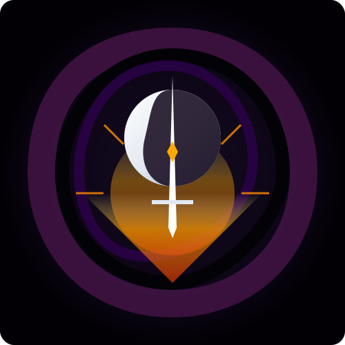

Author's Note: This is an anomaly chapter—a multiversal detour that operates outside the standard Kingdom Hearts world order. It can slot into the timeline wherever the boundaries between realities wear thin, representing the unpredictable, darker undertow of the Lanes Between.

---

### Chapter Riot.1 The Gravity of Bonds

The transition was entirely wrong.

Usually, the Corridors of Light were warm and orderly, guided by the Keyblades. But this time, as the party traveled, a violent, jagged fissure tore through the dimensional pathway. It was a gravitational anomaly originating from a much darker, heavier reality.

The rift was specifically trying to pull Aura and Raja—their ancient, multiversal souls acting as lightning rods for displaced dimensions. But they weren't alone. The metaphysical bonds they had formed with Ephemer and Skuld had grown incredibly dense. And there was a fifth tether. Hidden in the folds of the Corridor, Strelitzia had tethered her heart to theirs. When the rift violently yanked Aura and Raja off course, it dragged all three Keyblade wielders down with them.

They slammed onto hard, cracked asphalt, the fairy-tale warmth instantly replaced by the choking stench of burning rubber, tear gas, and raw urban decay.

"Whoa\! What just happened?\!" Ephemer coughed, waving thick gray smoke away from his face.

Aura immediately dropped into a low, defensive stance, her eyes scanning their surroundings. "An ambush dimension. We got pulled out of the Lanes."

They were in a filthy, narrow alleyway boxed in by towering concrete buildings. The deafening roar of a city tearing itself apart echoed from the main streets—sirens wailing, glass shattering, and thousands of voices screaming. A capital city in the throes of a violent, lawless riot.

But the real danger wasn't on the main street. It was ten yards in front of them.

Standing with his back to the party was a high school boy in a dark, slightly unbuttoned uniform. His posture was rigid, his aura entirely cold and serious.

Further down the alley, a nightmare was unfolding. A group of heavily tattooed, armed thugs had taken advantage of the city-wide chaos to drag a terrified high school girl into the shadows. They had her pinned against the brick wall, their intentions vile and obvious.

Standing a few feet away from the thugs was another high school boy, tears streaming down his bruised face. He was the girl's classmate—the boy who secretly harbored a massive crush on her. He was pleading, his voice cracking with desperation. "Please\! Just let her go\! We don't have anything to do with the riots\! She's innocent\!"

Beside the girl, struggling weakly against a thug's grip, was her younger brother, looking absolutely confused and paralyzed by terror.

"Shut up and scram, kid\!" the lead thug barked, violently kicking the crying boy in the stomach. "The cops are busy burning on the main street. Nobody's coming to save you. Leave now, or you die right here."

The boy hit the ground hard. Cowardice and sheer, primal terror overrode his affection. Sobbing, he scrambled to his feet and sprinted blindly away from the girl, running right toward the exit of the alley where the serious boy and the party stood.

As the fleeing boy rushed past, the serious high school boy moved. His arm shot out like a steel piston, grabbing the fleeing boy by the collar and physically stopping him in his tracks with terrifying force. He didn't say a word, simply tossing the coward aside, his cold eyes locked onto the thugs.

Behind him, Ephemer, Skuld, and Aura realized exactly what was happening. There was no time to summon Keyblades. There was no time to formulate a plan. The thugs were already reaching for the girl.

Instinct took over.

"Hey\!" Ephemer roared. He thrust his hand forward, bypassing his weapon entirely and channeling the magic directly. "Aero\!"

A localized, violent burst of wind erupted in the alley, slamming into the thugs and staggering them backward, instantly breaking their grip on the girl and her brother.

Skuld followed up immediately. "Blizzard\!" She didn't aim to kill; she aimed at the damp asphalt beneath the thugs' feet, freezing the ground into a slick sheet of ice, causing two of the massive men to slip and crash hard onto their backs.

And then, a third voice rang out. A voice Ephemer and Skuld hadn't heard in days.

"Bind\!" From the shadows just behind Skuld, Strelitzia materialized. Her cover was blown, but the sheer horror of the situation had completely overridden her fear of being seen. A volley of glowing rings shot from her fingertips, wrapping tightly around the wrists of the lead thug and pinning his arms to his sides.

The serious high school boy didn't even blink at the sudden display of impossible magic. He recognized an opening when he saw one. He didn't waste a single microsecond.

He moved with explosive, lethal speed. Before the frozen thugs could even register the magic, the serious boy was already among them. He didn't brawl; he dismantled them. A brutal, perfect knee to a thug's jaw. A calculated palm strike to the throat of another.

At the same time, Aura and Raja bridged the distance.

"Don't kill them\!" Raja called out smoothly, stepping into the fray. "Just put them to sleep\!"

A thug pulled a switchblade, lunging at the serious boy's blind spot. Aura intercepted him, weaving past the blade with her newly honed Observation Haki. She grabbed the thug's wrist, applied a sharp joint lock that forced a scream, and delivered a precise, Ki-infused chop to the side of his neck. The thug's eyes rolled back, and he collapsed instantly.

Raja handled the last two. Moving like a ghost across Skuld's ice, he tapped into the internal martial arts he had refined in the Shaolin courtyard. Two open-handed strikes to the solar plexuses of the remaining thugs sent them dropping to the asphalt, gasping for air before losing consciousness entirely.

The violent skirmish was over in less than ten seconds.

The alley fell silent, save for the distant roar of the city riots and the ragged breathing of the thugs unconscious on the ground.

The serious high school boy stood amidst the bodies, slowly lowering his fists. He turned his head, his sharp, calculating eyes drifting past the thugs, past the terrified girl and her brother, and locking directly onto the strange group of teenagers who had just fired literal magic from their hands.

Ephemer stood frozen, his hand still glowing faintly with wind magic. But he wasn't looking at the thugs, and he wasn't looking at the serious boy.

He turned around, his eyes wide with absolute, unadulterated shock, staring directly at the girl in the white coat who had just cast the binding spell.

"Strelitzia...?" Ephemer breathed.

---

### Chapter Riot.2: The Five-Minute Rule

"Strelitzia...?" Ephemer breathed, his mind struggling to process how the shy, quiet girl from Daybreak Town had suddenly appeared in a grim, burning alleyway in another dimension.

"I... I followed you," Strelitzia stammered, shrinking slightly under his gaze, her hands still trembling from casting the binding spell. "I couldn't just—"

"Not to interrupt the reunion, but that was absolutely incredible\!"

The cold, terrifying aura that had radiated from the high school boy just seconds ago completely vanished. He clapped his hands together, his posture relaxing into a friendly, easygoing, and wildly enthusiastic stance. He looked at Ephemer's glowing hands and Strelitzia's magical rings with genuine awe. "I mean, seriously\! Magic? Actual, real-life magic? That’s going to make this so much easier\!"

Ephemer blinked, suffering from severe emotional whiplash. "Uh. Yeah. Magic."

"Awesome. Thank you for the save," the boy smiled warmly, giving them a respectful nod before his expression sharpened just a fraction—the underlying seriousness returning. "But we can't celebrate yet. The main street is still an absolute warzone. Innocent people are getting caught in the crossfire of these rioters. We need to clear the streets."

He looked at the five of them, rapidly calculating a strategy. "We can cover more ground if we split up into pairs. With your magic... can you guys cast something loud? Like, really loud? If you can fire off a massive, distracting spell straight into the sky every five minutes, it’ll shatter the mob's focus and cause panic, giving us the perfect opening to take them down without causing fatal injuries."

"Crowd control through sensory overload. I like it," Aura smirked, cracking her knuckles. She stepped forward, pointing a thumb at herself. "I'll take the vanguard with you, jacket boy. We've got the same brawling style."

She then pointed to the others. "Raja, you pair up with the cloak girl. Keep her safe and use her bindings to lock down the stragglers. Goggles and the braid," she gestured to Ephemer and Skuld, completely skipping their names to save time, "you two have the most raw magical output. Take the rooftops. You're our artillery. You drop the distractions."

"Got it," Raja nodded, stepping smoothly beside Strelitzia. He offered her a gentle, reassuring smile. "We'll talk about how you got here later. Right now, breathe. You did perfectly."

Strelitzia nodded tightly, her resolve hardening.

Before they scattered, the high school boy and Aura walked over to the boy who had abandoned the girl moments prior. He was still sitting on the asphalt, shivering with shame and terror.

"Hey," the high school boy said, his voice stripped of anger, replaced by pure pragmatism. "You're a rich kid, right? Look at your shoes."

The boy looked up, sniffling, and nodded weakly.

"Good. Call your driver. Your uncle, your butler, whoever," he ordered. "Have them bring an armored car here right now to pick her and her little brother up."

The rich boy wiped his face, finding a shred of courage now that the immediate threat was neutralized. "M-my family's estate is in the outskirts. The village there is totally unified... the neighborhood watch is impenetrable. The rioters won't even get close to the gates. I... I can take them there. I promise I'll protect them this time."

"Make the call," Aura said firmly.

He pulled out a sleek smartphone with shaking hands and dialed. "He's three blocks away. He's coming."

"Then we hold this alley until he gets here," the high school boy declared.

As if on cue, the deafening roar of the main street spilled over. A large splinter group of rioters—two dozen men armed with metal pipes, chains, and glass bottles—turned the corner into the alley, looking for fresh targets to loot.

"Perimeter defense\! Nobody dies, nobody passes\!" Raja called out.

The party moved as one perfectly synchronized unit. The rioters charged, screaming, but they hit an absolute wall.

Skuld slammed her hands onto the asphalt, casting a wide-area Blizzard that turned the front half of the alley into an impassable ice rink. As the front line of rioters violently slipped and crashed to the ground, Aura and the high school boy blurred into motion. They fought beautifully together—a symphony of non-lethal blunt force. Aura used graceful, sweeping Ki-infused kicks to disarm the thugs, while the boy used terrifyingly precise palm strikes and judo throws to render them unconscious the moment they hit the ground.

Whenever a rioter managed to bypass the vanguard, Strelitzia was ready. Standing safely behind Raja, she cast rapid-fire Bind spells, wrapping glowing magical chains around their ankles and tripping them. Raja would then step forward with a blindingly fast, open-handed tap to their pressure points, putting them to sleep instantly.

Ephemer stood as the last line of defense near the civilians, easily deflecting thrown bottles with quick bursts of Aero.

Two minutes later, the screech of heavy tires echoed through the back entrance of the alley. A massive, black luxury SUV armored with reinforced glass slammed on its brakes. Men in dark suits stepped out, quickly ushering the terrified girl, her younger brother, and the rich boy into the safety of the backseat.

"Get them out of the city\!" the high school boy yelled to the driver.

The driver nodded tersely, slamming the doors and peeling out of the alley, speeding toward the safety of the outskirts.

With the civilians safe, the high school boy grinned, adrenaline pumping. "Alright\! You heard the plan\! Every five minutes, light up the sky\!"

"See you on the flip side\!" Ephemer shouted. He grabbed Skuld's hand, and with a powerful burst of wind magic, launched the two of them straight up the side of the brick building, landing nimbly on the rooftop.

The three ground teams immediately split up, sprinting out of the alley and diving headfirst into the burning chaos of the capital's main streets.

For the next two hours, the city experienced the most bizarre, efficient pacification in its history.

Down on the streets, the rioters were a chaotic, violent mob. But every exactly five minutes, the sky above them violently erupted.

BOOM\! A localized Thunder spell, magnified by Ephemer's Keyblade magic, cracked the heavens with the force of a sonic boom, flashing blindingly white.

The rioters shrieked, dropping their weapons and covering their ears in sheer panic, believing a military strike or a freak storm had just hit. The mob's momentum completely shattered.

In that crucial window of sensory overload, the ground teams struck.

In the eastern district, Raja flowed like water through the panicked crowds. He didn't throw a single punch. He simply glided past the rioters, his fingers tapping their necks, shoulders, and spines with surgical precision. They dropped like flies, sound asleep. Strelitzia followed closely, using a combination of Cure magic to heal any innocent bystanders caught in the crossfire, and Stop magic to freeze fleeing looters in their tracks.

In the commercial district, Aura and the high school boy were a two-person hurricane. Whenever Ephemer's magic flashed in the sky, they swept through the disoriented mobs. The boy laughed as he fought, his enthusiasm completely at odds with his devastating combat efficiency, throwing grown men over his shoulder with ease. Aura matched his energy, her Ki acting as a blunt-force shockwave that knocked out three rioters at a time without breaking a single bone.

By the time the sirens of the actual riot police finally began to close in on the main sectors, the job was already done.

The fires were dying down. The screams had stopped. The streets were littered with hundreds of unconscious, bound, or magically frozen thugs.

High on the rooftop, Ephemer let out a long, exhausted breath, lowering his glowing hands. He looked down at the pacified streets, a tired smile crossing his face. They had jumped into a completely unknown, violent reality and subdued an entire city uprising in a matter of hours, all without shedding a single drop of blood.

"Not bad for a detour," Skuld panted beside him, leaning on her knees.

Down in the center of the main intersection, Aura, Raja, Strelitzia, and the high school boy reconvened, stepping over the snoring bodies of the city's worst instigators. The city was finally safe.

---

### Chapter Riot.3 The Unnamed Heroes

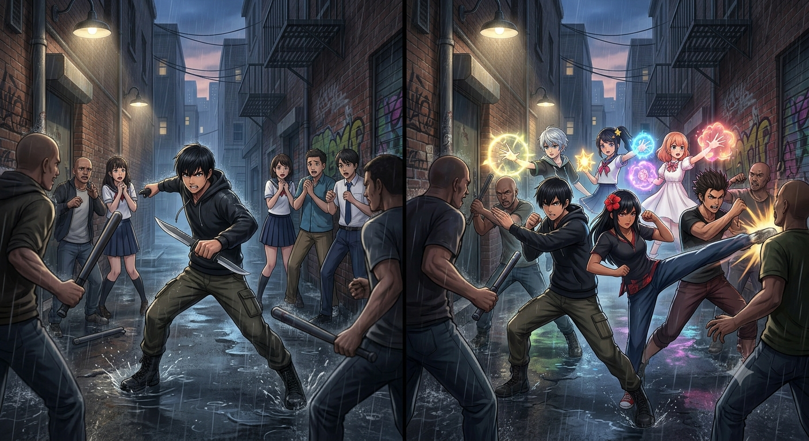

The armored SUV had driven them far away from the choking smoke of the capital, winding up into the pristine, heavily fortified hills of the city’s outskirts. The rich boy’s family estate was practically a fortress, surrounded by a high-security village that the rioters hadn't even dared to approach.

By the time the five multiversal wanderers and the high school boy arrived via a magically expedited Corridor of Light (cast discreetly in an empty alley), the reunion was already underway in the sprawling courtyard of the estate.

The high school girl was sobbing, burying her face into her mother’s chest, while her younger brother was hoisted into the air by their weeping father. The rich boy stood awkwardly to the side, his own parents fussing over his bruised face. But when the girl pulled away from her mother, she walked straight up to the rich boy.

He flinched, looking down at his expensive shoes. "I'm sorry," he whispered, his voice cracking. "I... I ran. I was so scared."

"You sent help," the girl said softly, placing a gentle hand on his shoulder. "You got my brother and me out. Thank you."

The rich boy burst into tears all over again, the immense weight of his guilt finally lifting.

Aura, Raja, Ephemer, Skuld, and Strelitzia watched from the cobblestone driveway, leaning against the wrought-iron gates. Strelitzia was tucked safely between Ephemer and Skuld, still looking a bit overwhelmed by her own bravery, but smiling softly at the reunited families.

The high school boy who had fought beside them stood with his hands tucked into his pockets, watching the scene with a deeply satisfied, enthusiastic grin. "Man, I love a happy ending. You guys were incredible out there\! Seriously, ice and lightning from your bare hands? That was the coolest thing I've ever seen\!"

"You weren't so bad yourself," Raja smiled, noting the boy's flawless technique. "You’ve got serious training."

Before the conversation could continue, a sleek, black government vehicle pulled up to the estate gates. A man in a sharp suit and a military-style coat stepped out, addressing the group with a crisp salute. The actual riot police and the city committee had finally secured the capital, and reports of "miracle workers" who had subdued thousands of rioters without a single fatality had reached the highest levels of the municipal government.

They were being officially summoned to the capital center to be recognized.

An hour later, the party found themselves standing in the grand plaza of the city hall. The fires had been extinguished, the debris was being swept away, and the atmosphere was one of profound relief. The city committee had set up a makeshift command center under a series of white tents, processing the aftermath of the city-wide chaos.

True to his easygoing, hyper-competent nature, the high school boy immediately volunteered to handle the bureaucratic headache for the group. He practically bounced over to the committee tables, enthusiastically filling out incident reports, chatting up the stern-faced military officials, and effortlessly charming the stressed-out administrators.

"He's a strange one," Ephemer noted, crossing his arms as he watched the boy laugh with a very intimidating police chief. "He fights like a seasoned warlord, but he acts like a guy trying to recruit you into a school club."

"He knows how to flip the switch," Aura observed quietly, her eyes tracking the boy's movements. "Total emotional control. He doesn't let anger dictate his actions, but he doesn't hold back when lives are on the line. I respect it."

Finally, the boy finished the stack of paperwork. He grabbed a clipboard from the head administrator and jogged back over to where the five of them were waiting by the plaza fountain.

"Alright\! Everything's sorted\!" he beamed, waving the clipboard. "The committee is authorizing a massive heroic reward fund for all of us. No legal trouble, no police interrogations. They just need one last thing to finalize the commendations."

He stopped in front of them, looking down at the clipboard, and then blinked. A sudden, sheepish laugh escaped his lips. He rubbed the back of his neck, looking at the five teenagers.

"You know... things were so crazy in that alley, we just completely skipped the pleasantries," the boy chuckled. He clicked his pen, looking up at them with his bright, friendly eyes. "I just realized, I have absolutely no idea what your names are. And you don't know mine."

Gemini Discussion: Predicting the Twist

Alright, putting my AI detective hat on\! You've set up a brilliant cliffhanger here. The prompt explicitly states that the name reveal will be a massive shock to Aura and Raja, but Ephemer, Skuld, and Strelitzia won't react the same way.

Since Aura and Raja are reincarnators with knowledge of multiple realities (and likely anime, manga, and pop culture from their original world), this means the boy's name belongs to a famous fictional universe that they immediately recognize.

Here are my top predictions for who this "serious but friendly/enthusiastic" high school boy is, based on the clues (school uniform, devastating martial arts/brawling skills, extreme pragmatism in a fight, protective nature, and the specific scenario of saving a girl and dealing with a rich kid):

Cid Kagenou / Minoru Kagenou (The Eminence in Shadow): In his past life on Earth as a high schooler (Minoru), he was obsessed with martial arts, fought thugs with crowbars, and rescued a rich girl/actress (Akane Nishino). He acts like an enthusiastic background character but turns lethally serious when fighting. If he drops the name "Minoru Kagenou," Aura and Raja will instantly realize they are on the "Earth" from Eminence in Shadow before he gets isekai'd\!

Satoru Gojo or Suguru Geto (Jujutsu Kaisen \- Hidden Inventory Era): Both wore dark high school uniforms, fought with terrifying hand-to-hand proficiency, and had a mix of easygoing/enthusiastic personalities contrasting with cold, lethal seriousness in battle.

A character from a famous Webtoon (e.g., Lookism, Eleceed, or God of High School): Since you already incorporated Muijin Park in a previous arc, encountering Jin Mori or someone from the Lookism universe (like Daniel Park or Vasco) would perfectly fit the "thugs in an alleyway/riot" aesthetic and the devastating hand-to-hand combat without magic.

Tatsuya Shiba (The Irregular at Magic High School): He wears a dark uniform, is brutally efficient, and protects his sister (though the enthusiasm part doesn't quite fit his usual cold demeanor, maybe he's faking it for the committee\!).

Someone from their own past life: A wild card guess—what if the boy is someone Aura or Raja actually knew before they died and reincarnated into the Kingdom Hearts multiverse?

I am incredibly excited to see the reveal in the next prompt\! You've laid the groundwork for an amazing crossover shocker.

---

### Chapter Riot.4 Echoes of a Name

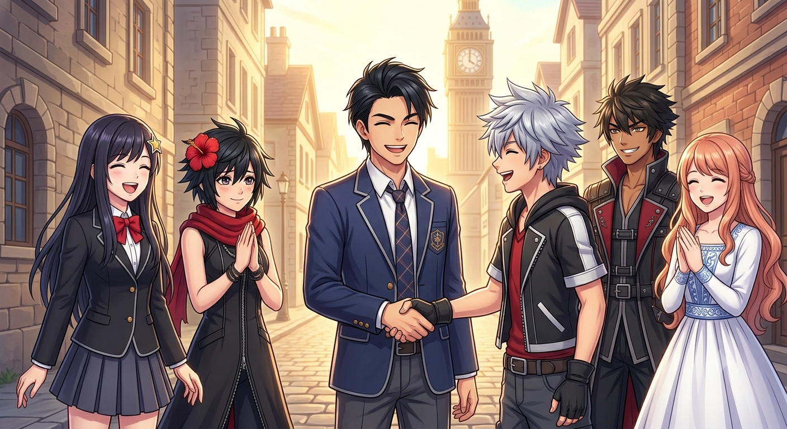

"I'm Ephemer," the silver-haired boy said, extending a hand with a bright smile. He gestured to the girls beside him. "This is Skuld, and this is Strelitzia."

The pen in the high school boy's hand completely stopped. He blinked once. Then twice. His easygoing smile morphed into an expression of absolute, wide-eyed astonishment.

"Wait. Hold on a second," the boy stammered, his eyes darting between the three of them. "Ephemer? Skuld? And... Strelitzia?" He pointed a trembling finger at Ephemer’s pocket. "Are you telling me you're the Ephemer from Daybreak Town? And those weapons you used... those were actual Keyblades?\!"

"Uh, yeah?" Ephemer replied, slightly taken aback by the boy's intense reaction. "It's a long story, but we travel between worlds."

The boy let out a breathless, disbelieving laugh, running a hand through his hair. "I don't believe it. This is insane\!" He looked at them with pure awe. "In my world, your stories are legendary among people who love a good tale. Someone actually made an entire series of video games based on your lives\! My guess? Someone from my reality must have stumbled into your world, managed to return, and lived to tell the tale by turning it into a game."

He then turned his gaze specifically to Strelitzia. The boy's enthusiastic demeanor softened into something deeply empathetic and relieved. He looked right into her eyes. "Honestly... knowing the stories, it is really good to see you alive, Strelitzia."

Strelitzia blinked, her cheeks flushing slightly, completely unsure of what her "story" was supposed to be in his world, but deeply moved by the genuine warmth in his voice. "Th-thank you," she murmured.

The boy then turned his attention to the other two members of the party. He tilted his head, his eyes scanning them as if trying to place a forgotten memory. A strange, heavy familiarity seemed to settle over him.

"And what about you two?" he asked.

"I'm Aura," she said, giving a casual two-finger salute.

"Raja," the dark-haired boy added, nodding respectfully.

The boy stared at them. A profound, unexplainable resonance seemed to hum in the air between the three of them. He looked down at his clipboard, then back up at them, a conspiratorial, knowing smile spreading across his face.

"You know, since we're sharing world-traveling secrets," the boy lowered his voice just a fraction, "I'll let you in on one of mine. This actually isn't my first life. I was reincarnated into this reality."

Aura and Raja’s eyes widened slightly at the admission. Fellow reincarnators were incredibly rare. But what came next shattered their composure entirely.

"It's a pleasure to officially meet you all," the boy said, offering his hand. "My name is Fajar Purnama."

Aura and Raja completely froze.

The air around them seemed to vanish. Total, absolute paralysis gripped their bodies. Their ancient, multiversal souls vibrated violently as their minds instantly processed the letters of the name he had just spoken.

F-A-J-A-R P-U-R-N-A-M-A.

R-A-J-A. A-U-R-A.

The letters of both their names were perfectly, seamlessly contained within his. The sheer impossibility of it—the cosmic, metaphysical weight of standing face-to-face with a boy whose very identity seemed to encapsulate both of their existences—hit them like a physical blow. Were they fragments of his soul? Was he the original blueprint of their lives before the multiversal split?

"Whoa, hey," Fajar said, his smile faltering into a look of genuine concern as he noticed their sudden, pale rigidity. "Are you two okay? You look like you just saw a ghost."

Raja forced his lungs to take in air. He swallowed hard, reigning in his spiraling thoughts with every ounce of Shaolin discipline he possessed. Aura blinked rapidly, her fists clenching as she forcibly grounded herself back in the present reality.

"We're... we're fine," Raja managed to say, his voice just a fraction tighter than usual. He reached out, his hand trembling slightly before firmly shaking Fajar's hand.

"Yeah. Just... long day," Aura added, forcing a smile that didn't quite reach her eyes as she shook his hand next. The physical contact sent a warm, undeniable spark of connection through both of them.

Before Fajar could press the issue, a familiar chiming sound echoed from Ephemer and Skuld’s pockets.

Rex and Lux, the two mechanical Chirithies, popped out into the open air, floating excitedly around the group. They projected the swirling, glowing Corridor of Light directly in the center of the plaza.

Fajar gasped, pointing at the floating feline creatures. "No way\! Real Chirithies\! That is so cool\!"

"That's our ride," Ephemer smiled, adjusting his goggles. "It's time for us to head back."

"I'd love to go with you," Fajar sighed wistfully, looking at the Corridor of Light. Then, he looked back toward the hills where the rich boy's estate lay, and where his own family in this reality was currently waiting for him to come home. "But I've got a life to finish here first. Maybe someday, when the time is right, I'll come visit you all in Daybreak Town."

"We'll be waiting for you, Fajar," Skuld smiled, waving warmly.

"Take care of yourself out there," Ephemer added, clapping the boy on the shoulder.

With bright smiles and waving hands, the five teenagers turned and stepped into the swirling portal. Fajar stood in the plaza, waving until the Corridor shrank into a single point of light and vanished completely, leaving him alone in the recovering city.

Inside the Corridor of Light, the transition back to the Lanes Between was smooth and silent. The starry, shifting pathways of the multiverse stretched out around them as they journeyed toward their next destination.

Ephemer, Skuld, and Strelitzia walked ahead, animatedly chatting about the incredible, magic-less combat they had just witnessed and the sheer absurdity of being video game characters in another dimension.

But a few paces behind them, Aura and Raja walked in absolute, deafening silence, their minds reeling from the impossible revelation of Fajar Purnama.

---

### Chapter Riot.5 The Unseen Massacre

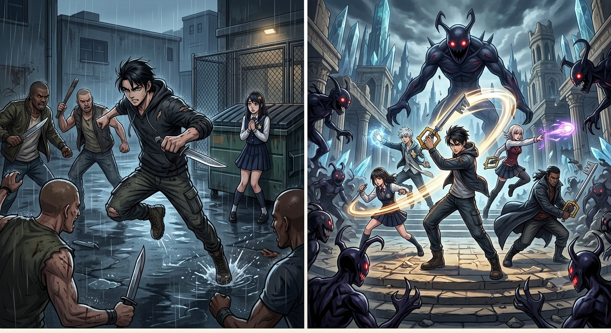

The starry expanse of the Lanes Between washed over the five travelers as they journeyed toward the light of Daybreak Town. The adrenaline of the riot was slowly fading, replaced by the comforting hum of the Corridors.

"Hey, wait a second," Ephemer suddenly said, slowing his pace. He looked back at Raja. "Fajar... didn't you mention that name before? Back at the Castle of Dreams, after the ball. You told Jaq about an old man who was completely consumed by brutality and hatred."

Raja's expression tightened. "Yes. The very same one."

"But... I don't understand," Skuld frowned, exchanging a bewildered glance with Strelitzia. "He was so friendly. So enthusiastic and protective. How could someone like that become the monster you described?"

"Yeah," Strelitzia agreed softly. "He seemed so... bright."

Raja opened his mouth to explain, but the words never came.

Without warning, the Corridor of Light violently shuddered. A massive, jagged tear in the dimensional fabric ripped open directly beneath Aura and Raja. The gravitational pull of the anomaly world hadn't finished with them yet.

"Aura\! Raja\!" Ephemer yelled, diving forward to grab their hands.

He was too late. While Ephemer, Skuld, and Strelitzia were safely propelled forward into the blinding light of Daybreak Town, Aura and Raja were violently swallowed backward, plunging back into the darkness.

They didn't hit the ground. They floated.

Aura and Raja opened their eyes to find themselves back in the filthy, smoke-choked alleyway of the capital city. But something was wrong. Their bodies were ethereal, faintly translucent. They couldn't feel the heat of the fires or smell the tear gas.

"We're ghosts," Aura realized, looking at her transparent hands. "Spectators."

"The timeline," Raja whispered, his multiversal senses locking onto the scene playing out before them. "Without Ephemer and the girls, we never cast magic. We never intervened. This is what actually happened."

Before them, the scene reset. The thugs had the terrified high school girl pinned against the wall. Her younger brother was frozen in terror. The rich boy was scrambling away in tears.

And standing at the entrance of the alley, his back to Aura and Raja, was the high school boy. As they watched, floating text materialized in the air beside him, burning with an intense, bloody aura:

\[ Fajar Purnama (Teenager) \]

Fajar moved exactly as he had before, his arm shooting out to grab the fleeing rich boy by the collar. But this time, his voice carried no friendly enthusiasm. It was dead, cold, and absolute.

"Look at her," Fajar hissed, forcing the rich boy to face the thugs. "Look at what is about to happen. Can you live the rest of your life knowing how she ends up today if you run?"

The thugs were closing in on the girl, their intentions vile, preparing to cross a line of unspeakable trauma.

There was no burst of Aero to stagger them. There was no Blizzard to freeze the ground. There was no Bind magic to halt their hands.

Fajar acted with swift, terrifying pragmatism. He reached under his uniform jacket and drew two large, heavy kitchen knives he had pilfered from the school cafeteria.

With a flick of his wrists, the knives flew.

THWACK. THWACK.

Two thugs dropped completely dead, the blades buried in their skulls.

The remaining men froze in shock, but Fajar was already a blur. He rushed the group, delivering a bone-shattering knee to a thug's sternum, blowing the man backward. Without breaking stride, Fajar seamlessly ripped the two knives from the falling bodies and spun. He didn't use pressure points to put them to sleep like Raja had. He didn't use blunt force to knock them out like Aura had.

He sliced. Fast, efficient, and lethal strikes to the carotid arteries and vital organs.

In less than five seconds, six bodies lay bleeding out on the asphalt.

The high school girl collapsed to her knees, completely catatonic, traumatized by both her near-assault and the horrific slaughter she had just witnessed.

"Carry her," Fajar barked at the trembling rich kid. Fajar wiped the blood from his face, stepping forward to physically shield the younger brother. "Move. Now."

As ghost spectators, Aura and Raja followed the grim escort mission. It was a nightmare. They watched Fajar guide them through the burning streets, carving a bloody, ruthless path through any rioter who dared approach them. They reached the girl's house, saving her parents from looters in a spray of blood, before finally making it to the rendezvous point.

When the rich boy's armored SUV arrived, the family and the boy scrambled inside.

"Get in\!" the rich boy cried out.

"I'm staying behind," Fajar said coldly, slamming the heavy car door shut and slapping the hood to signal the driver.

As the car sped away, Fajar turned back to face the burning capital alone.

Without the Keyblade wielders to light up the sky every five minutes and break the mob's morale, Fajar had only one method of crowd control. He walked from block to block, from mob to mob, a solitary reaper in a dark uniform.

He killed, and he killed, and he killed.

The body count climbed past one hundred. Then five hundred. Eventually, over a thousand rioters lay dead in the streets of the capital.

But because he was completely alone, he couldn't save everyone. Aura and Raja were forced to watch the tragedies Fajar couldn't prevent. They watched him arrive seconds too late to save innocent shop owners. They watched him rescue victims who had already endured unspeakable horrors, their minds shattered by the riots. When Fajar did save them, stepping over mounds of mutilated corpses, the victims didn't look at him with gratitude. They looked at him with absolute, primal terror.

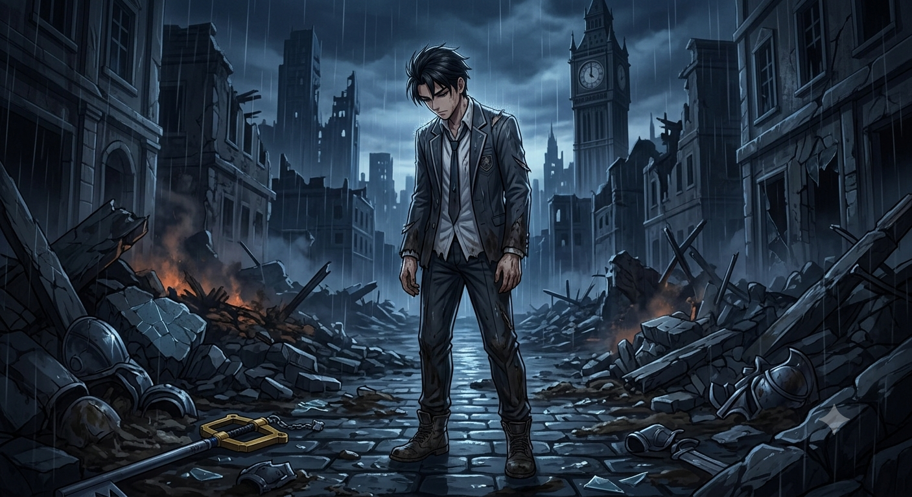

By the time the sun rose over the broken city, Fajar was entirely drenched in blood. His uniform was stained black, his hands dripping crimson. His eyes were utterly dead.

The vision shifted, blurring forward in time.

Aura and Raja now stood in a cheap, rundown food stall on the edge of the city. Fajar sat alone at a corner table, quietly eating a bowl of noodles. He was washed, but the phantom stench of iron seemed permanently attached to him.

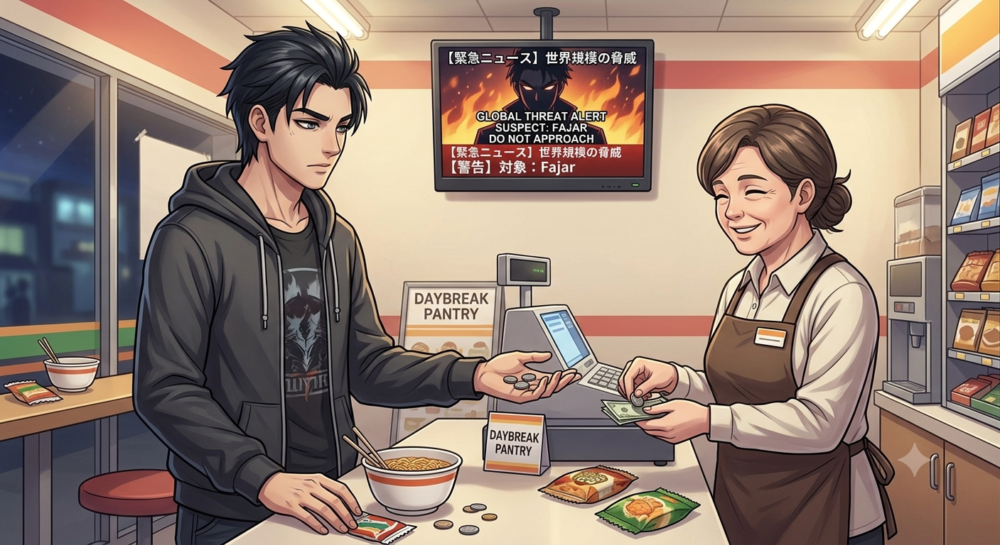

Above the counter, a small CRT television played the evening news. The riots were over, but the city was in a state of shock.

"The debate continues over the 'Unknown Killer' who single-handedly exterminated over a thousand rioters," the news anchor reported solemnly. "While some hail him as a necessary savior, global sentiment heavily leans toward declaring him a severe global threat. Can a man capable of such horrific, efficient slaughter ever be trusted?"

The news cut to interviews with the rescued victims. Even they looked haunted. "If he didn't do it, we would be dead," one woman whispered, shivering. "I know that logic. But... you didn't see his eyes. He didn't even blink. Who's to say he won't decide we're a threat tomorrow?"

Fajar chewed his food slowly, his expression unchanging as the world condemned him for saving it.

As he stood up to pay his bill, the stall owner—an old man who had been watching the broadcast—handed him his change. He didn't recognize the boy beneath his hood.

"Be careful out there, son," the old man warned softly. "The world has become a very dangerous place."

Fajar simply nodded. "I will."

He stepped out of the stall and into the night.

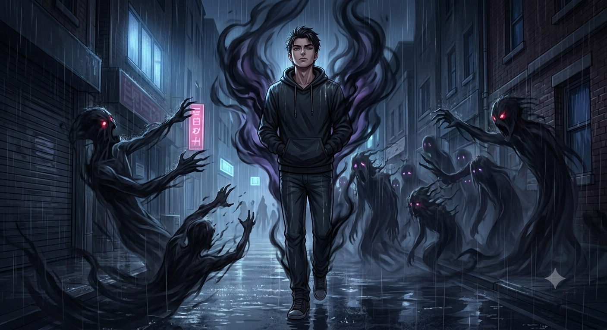

As he walked, Aura and Raja’s heightened spiritual senses flared. They saw what the physical world couldn't. Fajar wasn't walking alone. Clinging to his back, trailing behind his footsteps, was a massive, suffocating ocean of dark spiritual energy.

The resentments of over a thousand murdered souls wailed around him. Dark, parasitic entities swarmed his aura, drawn by the intoxicating stench of mass death and trauma. It was enough negative energy to instantly crush a normal human's mind or turn them into a Heartless on the spot.

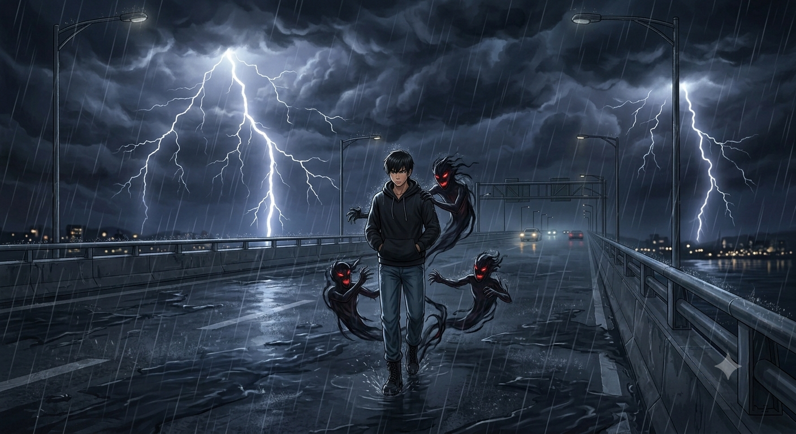

But Fajar didn't even flinch.

His will was an impenetrable fortress of absolute conviction. He didn't regret a single life he took. He believed, with every fiber of his being, that if he hadn't killed them, the innocent would have died instead. The resentments screamed, the dark entities clawed at him, but they couldn't penetrate his soul because he simply did not care about them. He was too strong, too resolute in his pragmatic cruelty.

Slowly, the blood-soaked teenager continued his march down an endless, lonely road, his form gradually fading into the heavy fog of the anomaly world.

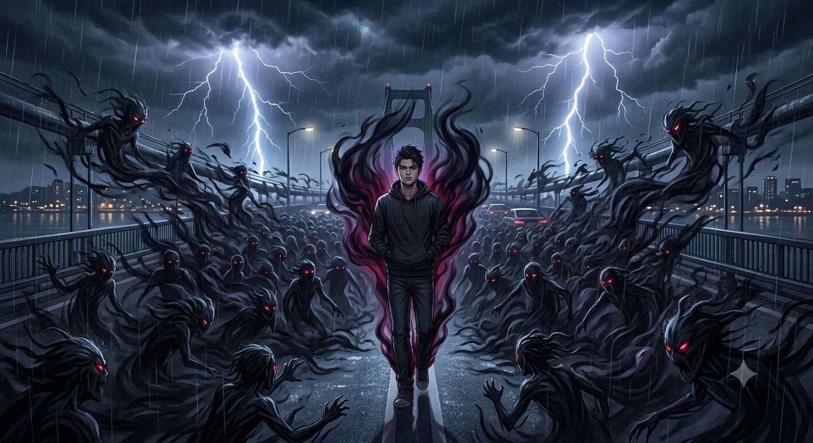

Aura and Raja stood in the silence of the phantom street, finally understanding the weight of the name Fajar Purnama.

---

### Chapter Riot.6 The Burden of the Dawn

The warm, golden light of Daybreak Town felt almost alien after the suffocating, ash-choked air of the anomaly world.

Ephemer, Skuld, and Strelitzia stumbled out of the Corridor of Light and onto the cobblestones of the central plaza. They took a collective breath of the clean air, but the relief was instantly shattered.

Ephemer spun around. "Wait\! Where are Aura and Raja?"

The Corridor had already snapped shut behind them. Skuld stepped forward, her eyes wide with sudden panic. "They were right behind us\! The portal... it shuddered right before we crossed over."

"Did they get pulled back?" Strelitzia asked, her hands flying to her mouth. "Should we open another gate?"

Before Ephemer could summon his Keyblade, the space in front of the fountain warped. A second, much smaller Corridor of Light tore itself open, and Aura and Raja stepped through.

The portal collapsed into a shower of sparks, leaving the two of them standing in the late afternoon sun. But the atmosphere around them had completely shifted.

If this moment were accompanied by music, it would be a slow, heartbreakingly gentle melody—a melancholic piano and strings arrangement, carrying the same profound, bittersweet sorrow as saying a final goodbye to a friend fading into the twilight. It was the sound of a heavy heart acknowledging a tragic truth.

Aura, who had faced down primordial apes, Shaolin masters, and massive Boss Heartless with a confident smirk, took two steps toward the fountain and simply collapsed to her knees.

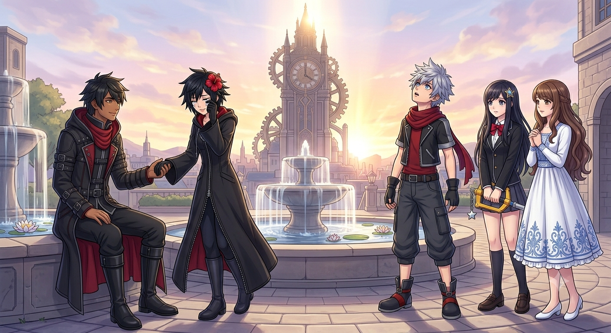

She covered her face with her hands, her shoulders trembling violently. A choked, agonizing sob tore from her throat. She wasn't crying out of fear or pain. She was crying out of a profound, overwhelming empathy that cracked her very soul.

"Aura\!" Skuld cried out, rushing forward to kneel beside her. "What happened? Are you hurt?"

Aura shook her head, unable to speak through her tears.

Raja walked over slowly. The easygoing confidence he usually carried was entirely gone. His posture was rigid, his expression etched with a deep, somber gravity. He knelt beside Aura and placed a heavy, comforting hand on her trembling shoulder, patting her gently.

There was no pity in Raja's eyes. As he looked down at the cobblestones, his gaze was filled with an immense, absolute respect. It was the look of a martial artist acknowledging a warrior who walked a path so agonizingly dark that no one else could possibly survive it.

"Raja..." Ephemer stepped closer, his voice dropping to a whisper. "What did you two see?"

Raja didn't answer immediately. He let Aura cry, letting the gentle breeze of Daybreak Town carry away the phantom stench of the blood they had just witnessed.

"We saw the truth," Raja finally spoke, his voice carrying the heavy, resonant timbre of a tolling bell. "We were pulled back into his world as spectators. We saw the original timeline. We saw what Fajar's life was supposed to be tonight... if we hadn't been there to cast magic."

Strelitzia clutched her white coat, a chill running down her spine despite the sun. "What did he do?"

Aura took a shaky breath, wiping her tear-streaked face with the back of her hand. She looked up at them, her eyes red. "He saved them. The girl, her brother, the rich kid. He saved them all."

"But not with magic," Raja continued, his voice steady but heavy. "With knives. With his bare hands. He didn't knock them out, Ephemer. He slaughtered them. And after he got those kids to safety... he went back into the burning city. Alone."

For the next ten minutes, sitting by the quiet, sunlit fountain of Daybreak Town, Aura and Raja told them everything.

They described the brutal, terrifying efficiency of Fajar's pragmatism. They spoke of the thousand bodies left in the streets. They described the horrified faces of the victims he saved—how the very people he bled for looked at him not as a hero, but as a monster. They explained the news broadcast, the global condemnation, and the suffocating ocean of resentment and dark entities that clung to his back.

"He carried it all," Aura whispered, her voice cracking again. "Over a thousand souls screaming at him. The hatred of the entire world. And he didn't even flinch. He just... accepted it. He accepted being the monster so that innocent people wouldn't have to die. He has absolutely no one to share that burden with."

The plaza fell into a heavy, mournful silence.

Skuld had tears in her own eyes now, imagining the friendly, enthusiastic boy they had spoken to just an hour ago completely covered in blood, walking alone into the night.

Ephemer looked down at his own hands—the hands that had cast the Aero and Thunder spells that prevented the massacre. He clenched them into fists. The Keyblade wielders were supposed to protect the Light, but some worlds were devoid of it. Some worlds forced their people to become the darkness just to survive.

Strelitzia stepped forward. She knelt down right in front of Aura, her timidness entirely replaced by a quiet, sad resolve.

"Then I'm glad we fell into his world," Strelitzia said softly. "Even if it was just an anomaly. Even if it was an accident."

Aura looked up at her.

"In his original timeline, he was completely alone," Strelitzia continued, placing a gentle hand over Aura's. "But tonight... he wasn't. Tonight, he got to fight alongside people who didn't look at him like a monster. Tonight, he didn't have to kill anyone, because we were there to help him carry the weight."

Raja closed his eyes, a faint, melancholic smile finally touching his lips. "You're right, Strelitzia. For one night, in one fractured timeline, Fajar Purnama got to be the hero he actually is. He got to keep his hands clean."

Aura nodded slowly, wiping the last of her tears away. The agonizing sorrow in her chest began to ease, replaced by the profound, comforting warmth of the bonds she had forged with the people sitting around her. Fajar contained the letters of their names, and perhaps, in some multiversal way, they were fragments of the same soul. If that were true, then a piece of Fajar was sitting right here in the Light.

"Fajar means 'Dawn,'" Ephemer suddenly realized, looking up at the towering clock tower of Daybreak Town. "And Purnama means 'Full Moon.'"

"A light in the darkest part of the night," Raja agreed softly. He stood up, offering his hand to Aura and pulling her to her feet.

The five of them stood together by the fountain, looking out over the peaceful, beautiful expanse of their home. The multiversal detour had violently shaken them, but it had also solidified something vital. They understood now just how precious the Light truly was, and how heavy the sacrifices were for those forced to live without it.

"Let's get some rest," Aura said, her usual strength slowly returning to her voice. She looked at Ephemer, Skuld, and Strelitzia with deep, unwavering gratitude. "We've got more worlds to save. And we're not doing it alone."

---

## Chapter 2 Continued

---

### Chapter 2.14 Whispers in the Chamber

High above the bustling, sunlit streets of Daybreak Town, secluded within the tallest spire of the central clock tower, the Foretellers gathered.

The grand chamber was bathed in the warm, golden light filtering through the massive stained-glass windows, casting colorful geometric patterns across the polished floor. The five Union leaders stood around their intricately carved round table, the atmosphere thick with the quiet, serious weight of their duties.

At the head of the table, Master Ira, leader of the Unicornis Union, rested his hands on the polished wood. His masked face betrayed no emotion, but his posture was tense.

"We are convened," Ira's deep, authoritative voice echoed in the cavernous room. "I trust the Unions are faring well in gathering Lux. However, there is a matter of multiversal stability we must address. A few hours ago, the spatial monitors registered a severe dimensional tremor in the Lanes Between."

Master Gula, wearing the leopard mask, leaned casually against the table, crossing his arms. "I saw the readouts. It wasn't a Heartless swarm. It was a gravitational anomaly—a massive, jagged tear pulling toward an unregistered, heavily dense reality. But it vanished almost as quickly as it appeared. A localized glitch in the pathways."

"A glitch that nearly swallowed a returning party of wielders," Master Invi, of the Anguis Union, pointed out calmly, her serpentine mask tilting toward Ira. "According to the logs, five wielders were caught in the anomaly's wake on their return from the Castle of Dreams. Thankfully, they all returned to Daybreak Town safely."

"Ah, yes. The Castle of Dreams expedition," Ira murmured, tapping a finger on the table. "That brings me to my second point of discussion. The combat reports from that specific party."

He waved a hand, and a shimmering projection of the party's mission logs materialized above the center of the table.

"Ephemer and Skuld are performing admirably, as expected," Ira noted. "However, it is the two new recruits traveling with them that concern me. Their combat data is... highly irregular."

Master Aced, the towering, broad-shouldered leader of the Ursus Union, let out a booming laugh that rattled the stained glass. "Irregular? I call it spectacular\! I’ve read the reports, Ira. One of them is a boy in my Union. Raja."

Aced slammed a heavy, gauntleted fist onto the table, his bear mask leaning forward with immense pride. "The boy is a marvel\! The reports say he fought a massive, magically-infused prehistoric Heartless in an unknown world, and he did it without summoning his Keyblade. He used raw, unarmed physical techniques. Stances and strikes I’ve never seen before. He treats his body as the primary weapon and the Keyblade as a mere extension. That is the exact kind of physical fortitude and unyielding discipline Ursus represents\!"

"Discipline is one thing, Aced," Invi countered smoothly. "But fighting without the Keyblade against entities of Darkness is unorthodox. They are generating shockwaves without casting magic. They are predicting enemy movements with impossible precision."

"The girl, Aura, is in my Union," Master Ava spoke up. Her voice was gentle, a stark contrast to Aced's booming presence, but it commanded equal respect. The vulpes-masked Foreteller looked at the shimmering combat logs with a mixture of awe and quiet concern.

"She doesn't just predict movements, Invi," Ava explained softly. "I've observed her aura from a distance when she returned to the plaza. She... she listens to the intent of the world around her. It’s not just combat anticipation; it’s a profound emotional and spiritual resonance. When she looks at you, it feels as though she is reading the very fabric of your heart."

Gula hummed thoughtfully, resting his chin in his hand. "So, we have a martial arts prodigy with unbreakable physical discipline, and a girl who can read intent like an open book. And they just happen to be best friends with Ephemer."

"Are they a threat?" Ira asked, looking at the other four. "The Book of Prophecies has not glitched, nor does it explicitly mention these two. But their souls feel ancient. Heavy."

"A threat? Don't be ridiculous, Ira," Aced scoffed, crossing his massive arms. "They are sealing Keyholes. They are protecting the Light. If anything, they are exactly the kind of vanguard we need if the Darkness ever truly encroaches. I intend to spar with the boy myself. I want to test the limits of this 'martial art' he practices."

Ava nodded slowly in agreement with Aced, though her reasons were entirely different. "I don't sense any malice in Aura. Only a deep, overwhelming empathy. She wept in the plaza today, mourning for a world we couldn't even see. Whoever they are, and wherever they learned to fight like that, their hearts are firmly planted in the Light."

Ira considered his colleagues' words, the tension in his shoulders slowly unwinding. He waved his hand again, dismissing the projection.

"Very well," Ira conceded. "We will not interfere with their methods, so long as they continue to serve the Light. But keep a close eye on them, Aced, Ava. Unorthodox strength often attracts unorthodox trials."

"I welcome it," Aced grinned beneath his mask.

Ava simply looked out the grand window toward the central plaza, her mind lingering on the strange, powerful girl in her Union. The Master of Masters had tasked Ava with a secret, agonizing burden—to prepare the Dandelions for the inevitable end of the world. As she thought of Aura's mature, unwavering presence, Ava couldn't help but wonder if the girl was meant to be one of the pillars to hold the sky up when it finally fell.

---

### Chapter 2.15 The Weight of the Fox

The sun was beginning its slow descent over Daybreak Town, painting the sky in brilliant strokes of violet, amber, and deep crimson. The bustling energy of the Moogle merchants and returning Keyblade wielders had begun to quiet down, replaced by the gentle rushing of the aqueducts.

Aura sat alone on the edge of the high stone bridge overlooking the central waterway. Her legs dangled over the edge, and her eyes were closed. She wasn't sleeping; she was lightly pulsing her Observation Haki, letting the ambient emotional intent of the town wash over her like a gentle tide. It was a meditative exercise, sorting the happy exhaustion of the returning wielders from the quiet hum of the sleeping world.

Then, a specific presence approached.

It was a presence that felt entirely different from the rest of the town. On the surface, it projected a warm, inviting, and gentle light. But beneath that carefully constructed surface, Aura’s Haki picked up something else—a vast, churning ocean of preemptive grief, suffocating anxiety, and a responsibility so heavy it threatened to crack the soul carrying it.

Aura opened her eyes and turned her head.

Master Ava stood a few paces away, her fox mask catching the light of the setting sun. Usually, the leader of the Vulpes Union was surrounded by a flock of adoring wielders, but right now, she had slipped away to be alone.

"I hope I'm not interrupting your rest, Aura," Ava said, her voice carrying its usual soft, melodic cadence as she stepped up to the edge of the bridge beside her.

"Not at all, Master Ava," Aura replied, shifting slightly to make room. "Just enjoying the sunset."

Ava leaned against the stone railing, looking out over the water. For a moment, neither of them spoke. The silence wasn't awkward; it was the kind of comfortable quiet that usually took years to develop between two people.

"Master Ira informed me about the spatial tremor your party experienced," Ava began softly, her gaze fixed on the horizon. "And I... I saw you when you returned to the plaza today. You were crying. It wasn't the tears of someone who was physically hurt. It looked like the tears of someone who had felt the sorrow of an entire world."

Aura looked down at her hands. The memory of Fajar’s blood-soaked uniform flashed in her mind, but the sting was duller now, soothed by her friends. "We fell into a dark place, Master. A place where the people had to do terrible things just to survive because there was no light to protect them. It... it put a lot of things into perspective."

Ava turned to look at the girl. Despite Aura's youthful appearance, there was an ancient, unshakable foundation in her eyes. "You carry a very deep empathy, Aura. It is a beautiful gift, but a heavy one. Feeling the pain of others so vividly can break a person if they aren't careful."

Aura tilted her head, her Observation Haki flaring just a fraction. She looked past the fox mask, directly into the spiritual and emotional core of the Union leader.

"It can," Aura agreed quietly. "But ignoring it is worse. Sometimes, the heaviest burdens are the ones you aren't allowed to tell anyone about."

Ava went perfectly still.

Aura didn't break eye contact. She didn't press for secrets. She didn't ask about the Book of Prophecies or the Master of Masters. She simply allowed her Haki to resonate with Ava's hidden sorrow, sending back a wave of pure, non-judgmental understanding.

"You're carrying the weight of the sky on your shoulders, Master Ava," Aura said gently. "I don't know what you're preparing for. I don't know what you've been told is coming. And I'm not asking you to break your oaths to tell me."

Beneath the mask, Ava’s breath hitched. For months, she had been drowning in the secret knowledge of the inevitable Keyblade War. She had been tasked with the agonizing duty of secretly evaluating her own beloved union members, deciding who would survive as Dandelions and who would be left behind to perish in the war. She had to smile, lead, and encourage them, all while knowing their tragic fate.

To have someone—a recruit, no less—see completely through her cheerful facade and acknowledge her pain without demanding answers... it was jarring. It was terrifying.

And it was the most relieving thing Ava had felt in months.

"How do you do it, Aura?" Ava whispered, her voice barely more than a breath, the authoritative tone of a Foreteller completely stripped away. "How do you see so clearly?"

"Where I come from, we call it Haki. The color of Observation," Aura explained, her voice steady and warm. "It lets me hear the 'voice' of living things. I can hear your voice, Master. It’s crying out for help, but refusing to let anyone else carry the load."

Aura stood up from the ledge, brushing off her uniform. She turned to face her Union leader, placing a hand over her own heart.

"Like I said, I don't need to know the details," Aura promised, her tone radiating absolute loyalty and mature conviction. "But I want you to know this: you don't have to carry it completely alone. When the time comes, whatever it is you have to do... point me in the right direction. I'll help you hold the sky up."

Ava stared at the girl. The sheer emotional maturity and strength radiating from Aura was unlike anything she had ever encountered in a wielder. In that brief moment, Ava didn't just see a prime candidate for the Dandelions. She saw a pillar. She saw a leader who could help guide the survivors when the world finally fell to darkness.

A genuine, deeply grateful smile formed beneath Ava's mask. The suffocating weight in her chest felt just a fraction lighter.

"Thank you, Aura," Ava said softly, bowing her head slightly—a rare gesture of respect from a Foreteller to a recruit. "I will remember that promise."

"Anytime, Boss," Aura smirked, the heavy tension breaking as she threw in a casual, playful salute. "Now, if you'll excuse me, Ephemer promised to buy me sea-salt ice cream, and I fully intend to bankrupt his Munny pouch."

Ava let out a small, genuine laugh. "Enjoy your evening, Aura. You've earned it."

As Aura walked away, blending back into the twilight streets of Daybreak Town, Ava watched her go. The future was still dark, and the prophecy was still absolute. But for the first time in a long time, the leader of the Vulpes Union felt a spark of genuine hope.

---

### Chapter 2.15 Addendum The Open Invitation

Author's Note: Let's weave your brilliant point right into the climax of Aura and Ava's conversation on the bridge.

"How do you do it, Aura?" Ava whispered, her voice barely more than a breath. "How do you see so clearly?"

"Where I come from, we call it Haki. The color of Observation," Aura explained, her voice steady and warm. "It lets me hear the 'voice' of living things. I can hear your voice, Master. It’s crying out for help, but refusing to let anyone else carry the load."

Ava looked at her, the gears turning in her mind. "Where you come from...?" she echoed softly.

Aura smiled, leaning back against the stone railing. She had absolutely no reason to hide the truth, especially from someone asking with such genuine vulnerability. "Literally where I come from. A different reality entirely. Raja and I... we’ve lived before. We were reincarnated. We travel through the multiverse, picking up skills like Haki and Ki along the way."

Ava stared at her, her eyes widening beneath the fox mask. In the strict, orderly world of the Book of Prophecies, the concept of unregulated multiversal reincarnation was unfathomable.

"Most people wouldn't believe me if I told them," Aura shrugged casually, a playful glint in her eye. "So we don't exactly shout it from the clock tower. But it was never a secret. We're just travelers who decided Daybreak Town was worth protecting."

Aura stood up, brushing off her uniform, and offered Ava a warm, grounding smile.

"When things settle down here—or if you just need a desperate break from all these heavy prophecies—let me know," Aura offered. "I'll open a gate. I'll take you, Ephemer, Skuld, and Strelitzia on a field trip to my reality. You can see it for yourself. No Heartless, no Keyblade War. Just a vacation."

Ava was completely speechless. The sheer absurdity of the offer, delivered with such absolute, unwavering honesty, shattered the heavy doom of the prophecies if only for a moment. A genuine, deeply grateful smile formed beneath Ava's mask.

"I... I think I would like that very much, Aura," Ava replied, bowing her head slightly. "Thank you."

"Anytime, Boss," Aura smirked, tossing a casual salute before heading off to bankrupt Ephemer's Munny pouch.

---

### Chapter 2.16 The Bear and the Shaolin

While Aura was soothing the anxieties of the Vulpes leader, a very different kind of meeting was taking place in the eastern district of Daybreak Town.

The Ursus Union training grounds were brutal. Unlike the elegant, magic-focused courtyards of the other Unions, the Ursus pavilion was a dusty, heavy-duty arena filled with shattered stone pillars, iron weights, and deeply scarred training dummies.

Raja stood in the exact center of the arena. He was stripped down to a simple, sleeveless tunic, his eyes closed. He wasn't swinging a Keyblade. He was moving through a slow, incredibly fluid sequence of Shaolin forms, his breathing perfectly synchronized with his physical movements. Every time his foot gently touched the dust, a faint, almost imperceptible ripple of kinetic energy pulsed outward.

"They said you didn't need the blade. I wanted to see it with my own eyes."

The booming, gravelly voice echoed across the courtyard. Raja calmly completed his form, exhaling a steady breath, and opened his eyes.

Master Aced stood at the edge of the arena. The towering Foreteller wore his heavy, fur-lined robes and his imposing bear mask. He didn't carry his Keyblade, but his sheer physical presence was suffocating—like a mountain that had suddenly decided to take a walk.

"Master Aced," Raja greeted respectfully, pressing a fist to his open palm and bowing slightly.

"None of that formal stiffness here, boy," Aced grunted, striding into the arena. His heavy boots cracked the stone floor beneath the dust. "I read the combat logs from the anomaly world. And I read the reports from your skirmishes in the outer sectors. They say you dismantled a Behemoth Heartless using nothing but your bare hands and some invisible force."

"Internal Ki, Master," Raja corrected politely. "The body is the primary vessel. The Keyblade is merely a tool. If the vessel is weak, the tool is useless."

Aced stopped ten feet away. A massive, terrifying grin spread beneath his mask.

"Exactly\!" Aced roared, slamming a heavy fist into his own chest. "That is the very core of the Ursus philosophy\! Physical fortitude\! Unbreakable strength\! Too many wielders rely entirely on the magic of the Keyblade and forget that they are the ones fighting the war\!"

Aced widened his stance, dropping his center of gravity. The air around him suddenly felt oppressively heavy.

"Show it to me, Raja," Aced demanded, his voice dropping into a dangerous, thrilling growl. "Show me this 'Ki'. No magic. No Keyblades. Just you and me."

Raja didn’t flinch. The Foreteller’s raw, aggressive aura was intimidating, but Raja had faced down primordial beasts and multiversal warlords. He calmly shifted his feet into a low, grounded horse stance, raising his hands in a loose, open-palm guard.

"As you wish, Master."

Aced didn't hesitate. He exploded forward with terrifying speed for a man of his size. He threw a devastating, wide right hook—a blow that could have shattered a boulder into dust.

Raja didn't try to block it. Blocking a mountain was foolish.

Instead, Raja stepped inside the guard. As Aced's massive arm swung toward him, Raja's hands flowed like water. He caught the Foreteller's wrist, not to stop the momentum, but to guide it. Raja pivoted flawlessly on his heel, using Aced's own monstrous kinetic energy against him, redirecting the punch past his own shoulder.

Aced's eyes widened in surprise as his balance was suddenly thrown forward.

Before Aced could recover, Raja struck. It wasn't a brutal haymaker. It was a rapid, precise, open-handed palm thrust directly to the center of Aced's armored chest.

THOOM.

It sounded like a muffled drumbeat. Raja had channeled his Ki through his arm, bypassing the heavy armor entirely and delivering the shockwave directly into Aced's sternum.

The towering Foreteller was physically knocked backward, his boots skidding across the dirt for three full yards before he dug his heels in and stopped himself.

The courtyard fell dead silent. A recruit had just knocked a Foreteller backward without using a weapon.

Aced looked down at his chest, where the phantom impact still vibrated. Then, he looked up at Raja, who had smoothly reset into his defensive stance, his breathing completely unchanged.

For a second, Raja wondered if he had gone too far. Aced was canonically known for his volatile temper and pride.

Then, Aced threw his head back and unleashed a booming, joyous roar of laughter.

"Hah\! Brilliant\!" Aced bellowed, slapping his own chest. "You didn't fight the force, you stole it\! And that strike... it felt like a cannonball wrapped in silk\! I didn't even see a flare of magic\!"

"It is discipline, Master," Raja explained, lowering his hands slightly as the tension broke. "Strength isn't just about how hard you can swing. It is about total control over your internal energy."

Aced walked back over, the aggressive combat aura completely gone, replaced by a deep, burning respect. He looked down at the dark-haired teenager.

"You are a strange one, Raja. Your eyes are too old for a recruit," Aced noted, his tone turning analytical. "But your discipline is absolute. My Union is filled with brawlers. They hit hard, but they lack the focus you just demonstrated."

Aced placed a massive, heavy hand on Raja's shoulder. It wasn't a threat; it was a profound acknowledgment of brotherhood from the Bear.

"When the time comes to fight for the Light, the others will rely on prophecies and spells," Aced said, his voice dropping to a serious, conspiratorial tone. "But Ursus will rely on strength. I want you to start helping me train the upper ranks, Raja. Teach them how to turn their bodies into weapons."

"It would be an honor, Master Aced," Raja bowed his head.

"Good\!" Aced boomed, his boisterous energy returning in full force. "Now, again\! And this time, don't hold back that shockwave\!"

---

### Chapter 2.17 Sea-Salt and Shadows

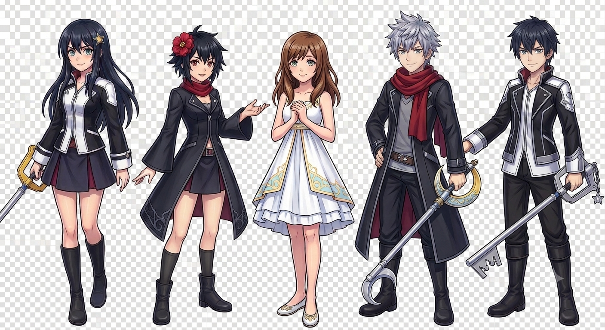

True to her word, Aura had successfully managed to bankrupt Ephemer’s Munny pouch.

The late afternoon sun cast long, golden shadows across the slanted rooftops of Daybreak Town as the four wielders sat together on the edge of a high brick aqueduct. Ephemer was dramatically holding his empty leather pouch upside down, letting a single, sad Munny coin drop into his palm.

"I don't understand," Ephemer sighed, looking at Aura. "How does someone so small eat three entire sea-salt ice creams in under ten minutes?"

"High metabolism," Aura grinned unrepentantly, waving her fourth blue popsicle in the air. "Using Haki burns a lot of calories. Besides, you promised Master Ava you'd treat me. You wouldn't want to break a promise to a Foreteller, would you?"

Skuld giggled, kicking her legs over the edge of the stone wall. "She's got you there, Ephemer. Just accept your financial ruin with dignity."

Raja sat quietly beside them, eating his own ice cream at a much more reasonable pace. He watched the bustling town below, enjoying the peaceful atmosphere. But as he took another bite, his eyes briefly flicked to the left, toward a large, ornate chimney stack about thirty yards down the roofline.

He didn't turn his head, but he projected a very quiet, focused strand of Ki toward Aura.

Aura caught the signal instantly. She took a bite of her ice cream, her Observation Haki flaring to life. Sure enough, hiding perfectly out of sight behind the chimney was a familiar, gentle presence. The aura was warm and kind, but fluttering with a nervous, anxious energy.

She's been following us since we left the fountain, Aura thought, sharing a subtle, knowing glance with Raja.

Despite the incredible bravery she had shown in Fajar's world—casting Bind spells and standing her ground against a violent mob—Strelitzia was still, at her core, a profoundly shy girl. The moment the emotional adrenaline of their return had faded, she had politely excused herself, only to immediately revert to her old habit of trailing them from the shadows. She admired them too much to stay away, but felt too awkward to simply insert herself into their casual hangout.

"Hey, Ephemer," Aura said loudly, stretching her arms over her head. "Did you buy five ice creams, or four?"

"Four," Ephemer replied, looking confused. "Why? Please don't tell me you want a fifth."

"No, but I think someone else might," Raja said smoothly.

Without warning, Aura vanished. She didn't use magic; she used a burst of physical speed, blurring across the rooftop in the blink of an eye.

Behind the chimney, Strelitzia was clutching her Keyblade to her chest, carefully peeking around the brickwork to watch her heroes laugh together. Suddenly, a hand tapped her lightly on the shoulder.

Strelitzia yelped, spinning around to find Aura leaning against the chimney, casually licking her blue popsicle.

"You know," Aura smirked, "for someone who stood in front of a raging mob of a thousand thugs in another dimension, you're surprisingly jumpy."

"Aura\! I—I wasn't—" Strelitzia stammered, her face turning as red as a Moogle's nose. She took a step back, looking down at her boots in mortification. "I was just... making sure you all got back to your Unions safely. After everything that happened today."

Raja, Ephemer, and Skuld walked over, dropping down from the higher roof tier. Ephemer looked surprised, but his expression quickly melted into a warm, welcoming smile.

"Strelitzia, have you been up here this whole time?" Skuld asked gently.

"I'm sorry," Strelitzia whispered, her shoulders shrinking. "I didn't mean to pry. You guys are just... so close. You’re a real team. I didn't want to intrude on your break."

Aura sighed, shaking her head. She stepped forward and gently but firmly placed a hand on Strelitzia's shoulder, stopping her from retreating any further.

"Strelitzia, look at me," Aura said, her voice dropping its playful edge, replacing it with the same mature, empathetic candor she had used with Master Ava. "You followed us into a terrifying, unknown reality. You locked down a vanguard of thugs so Raja could put them to sleep. You healed civilians. You carried the weight of Fajar's reality right alongside us."

Raja nodded in agreement, stepping up beside Aura. "A team isn't defined by who hangs out the loudest, Strelitzia. It's defined by who stands beside you when the world catches fire. And you stood right there with us."

"You're not an intruder," Ephemer smiled, reaching out to offer her a hand. "You're one of us. But you can't be part of the party if you're always hiding behind a chimney."

Strelitzia looked at their faces. There was no pity in their eyes, and no annoyance at her stalking. There was only absolute, genuine acceptance. The heavy, lonely feeling that had followed her around Daybreak Town for months suddenly completely evaporated.

Tears pricked the corners of her eyes, but this time, they were tears of pure relief. She reached out and took Ephemer's hand.

"Okay," Strelitzia said, her voice trembling but filled with a new, quiet strength. "I'd... I'd really like to join the party. For real this time."

"Awesome\!" Aura cheered, her boisterous energy returning. She immediately grabbed Ephemer's empty Munny pouch. "Now, Ephemer, be a good party leader and go ask the Moogle for a line of credit. Our new member needs a sea-salt ice cream\!"

"I am literally going to be in debt for the rest of my life," Ephemer groaned, though he was laughing as he led the newly officially formed five-person party back toward the marketplace.

As they walked together, Strelitzia didn't fall behind. For the first time, she walked right in the center of the group, the golden sunlight of Daybreak Town finally feeling warm against her shoulders.

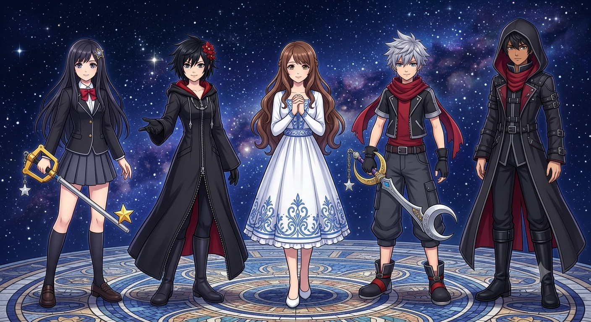

---

### Chapter 2.18 The Iron Vessel

The Corridor of Light opened high in the misty peaks of the Murim reality, depositing the party onto the ancient, sweeping stone courtyard of Mujin’s training temple.

The air here was thin, crisp, and charged with an intense, disciplined energy. To avoid drawing unnecessary attention in a world without Keyblades, Master Aced and Master Ava had agreed to leave their Foreteller masks behind, though they still wore their heavy, hooded Union cloaks. Even without his bear mask, Aced was a mountain of a man, his rugged, scarred face taking in the sights with burning curiosity. Ava stood gracefully beside him, her sharp, empathetic eyes observing the foreign world.

The courtyard sounded like a battlefield, but there was no chaos—only absolute, rhythmic order.

Dozens of martial artists and Shaolin disciples were engaged in exercises that made Ephemer wince and Skuld's jaw drop. In one corner, practitioners were repeatedly striking their shins and forearms against solid iron poles. In the center, however, was the sight that truly defied logic.

A senior disciple stood completely still, shirtless, his eyes closed in deep concentration. Another disciple stood before him, holding a perfectly sharpened broadsword. With a sharp exhale, the armed disciple swung the heavy blade directly at the other man's bare shoulder.

Strelitzia gasped, covering her eyes.

CLANG. The sound wasn't of slicing flesh, but of steel striking solid rock. The blade bounced off the disciple's skin, leaving nothing but a faint white line.

"Incredible," Aced breathed, his eyes widening. He stepped forward, completely entranced. "No Aero barriers. No Protect magic. Just the body."

"Welcome back, Aura. Raja," a deep, resonant voice called out.

Mujin walked out from the main temple pavilion. He wore his traditional, loose-fitting martial arts robes, his posture as impossibly straight as a forged spear. His sharp eyes immediately shifted to the two towering figures in cloaks. Even without his Ki, Mujin could sense the oceanic reserves of magical power radiating from Aced and Ava.

"I see you brought guests," Mujin noted, his tone respectful but firm. "Powerful ones."

"Master Mujin," Raja bowed deeply, pressing his fist to his open palm. Aura, Ephemer, Skuld, and Strelitzia quickly followed suit. Aced and Ava, recognizing a fellow master of his craft, nodded their heads in profound respect.

"This is Master Aced and Master Ava, leaders from our world," Raja introduced them. "Master Aced requested that I teach his union how to turn their bodies into weapons. I brought them here to see the true foundation of that philosophy."

Mujin’s stern expression softened into a faint, approving smile. He walked down the stone steps, gesturing toward the disciples practicing their blade deflection.

"A lofty goal," Mujin said, addressing Aced. "Your magic is strong, I can feel it. But magic is a resource that can be drained. Your body is the vessel that holds it. If the vessel is fragile, the power it holds will eventually shatter it."

"Exactly what I have been telling my Union\!" Aced boomed, his booming voice echoing across the courtyard. "But how is this blade deflection achieved? I sense no external shielding on your men."

"It is the culmination of anatomy, physical conditioning, and the flow of Qi," Mujin explained, pacing in front of the group. He pointed to his own arm. "It begins with tearing the body down. Muscle fibers must be micro-torn through heavy resistance and rebuilt denser. Bones must be subjected to impact to trigger Wolff's Law—the process where bone tissue calcifies and thickens in response to stress. You cannot build a fortress out of soft clay. You must first forge the stone."

Ephemer rubbed the back of his neck, remembering the grueling days on Rusukaina. "Yeah, we definitely got the 'tearing the body down' part covered."

Mujin nodded. "Fitness and anatomical knowledge are paramount. A martial artist must know every tendon, every vital point, and every muscle group. But physical conditioning alone cannot stop a sharpened blade. That is where Murim and Shaolin arts bridge the gap between the physical and the internal."

Mujin stepped up to a nearby weapons rack and picked up a sharp, steel dagger. He held his left forearm out.

"Aura, use your Observation," Mujin instructed.

Aura’s eyes narrowed as her Haki flared to life. She gasped softly. "Your energy... you're not just letting it flow through your veins. You're pushing it outward, weaving it."

"Precisely," Mujin said. "We call it the Iron Shirt, or the Golden Bell Cover. We take our internal Qi and compress it intensely into the fascia—the connective tissue just beneath the skin. By aligning the dense muscle fibers and fusing them with highly compressed internal energy, the skin momentarily takes on the properties of tempered steel."

Mujin drove the dagger hard into his own forearm. The steel blade bent slightly under the force of his thrust, but it did not pierce his skin. He pulled it away, completely unharmed.

Aced looked like he had just witnessed a miracle. The imposing Foreteller stepped forward, his fists clenched in pure excitement. "This... this is the ultimate defense. An armor that cannot be unequipped. A shield that cannot be shattered by an anti-magic spell."

Even Ava looked profoundly moved. She turned to Strelitzia, who was furiously writing notes in a small journal she had materialized. "Strelitzia," Ava asked softly, "with your affinity for healing magic and understanding of anatomy, could you learn the pathways of this 'Qi'?"

"I think so, Master Ava," Strelitzia nodded enthusiastically. "If I understand how the energy weaves into the muscle fascia, I could probably use my magic to help accelerate the healing process when they undergo the micro-tearing phase of the training\!"

Mujin let out a booming laugh. "A healer who understands martial conditioning\! You are welcome in my courtyard anytime, little one."

Mujin tossed the dagger back onto the rack and turned his full attention to Aced and Raja.

"The Iron Vessel is not learned in a day, Master Aced," Mujin warned. "It requires agonizing pain, unyielding discipline, and thousands of hours of meditation to control the Qi."

Aced pulled back his hood, revealing his rugged face and a massive, feral grin. He slammed his heavy fists together, the sound echoing like a thunderclap.

"Pain and discipline are the bread and butter of the Ursus Union, Master Mujin," Aced declared. "Show me where to begin."

---

### Chapter 2.19 See Slightly Into the Future

---

#### Chapter 2.19.1 The Weight of Awareness

Master Aced did not return with them. The moment Mujin had agreed to teach him the foundations of the Iron Shirt, the towering Foreteller had practically planted himself in the Murim courtyard, loudly declaring that he wouldn't leave until he could shatter a sword with his bare chest.

Master Ava, however, accompanied the five teenagers back to the Lanes Between. As Rex and Lux materialized the next Corridor of Light, Aura gently held out an arm, pausing the group before they stepped through.

"Master Ava, a quick disclaimer before we go in," Aura said, her tone serious but considerate. "When you asked me on the bridge how I could feel your emotions, I promised to show you. But the reality we're about to enter... it's not a peaceful monastery. It's a savage, brutal island."

Ava tilted her fox mask slightly, intrigued. "I am not afraid of harsh environments, Aura."

"I know," Aura smiled faintly. "But the training here was designed purely for combat and survival. It’s a brute-force method. You might be expecting a deeply philosophical or spiritual answer to your burdens, but the man teaching us here is a retired pirate. He teaches us how to feel intent so we don't get eaten by giant lions or killed in battle. The emotional empathy is just a byproduct of the survival instinct."

Ava nodded slowly, absorbing the warning. "I understand. Sometimes, the most profound truths are found in the simplest survival. Lead the way."

They stepped through the portal, instantly hit by the oppressive, sweltering heat of Rusukaina. The air was thick with the scent of wild beasts and giant flora.

They didn't have to walk far. In a large clearing near the edge of the jungle, a training session was actively underway.

A teenage boy with a straw hat hanging from his neck was standing in the center of the clearing, completely blindfolded. Across from him stood an older man with long white hair, round glasses, and an easygoing smile, holding a thick wooden staff.

"Forty-nine," the old man, Silvers Rayleigh, counted aloud, swinging the staff.

The boy, Luffy, ducked perfectly.

"Fifty." Rayleigh thrust the staff forward. Luffy twisted his torso, the wood missing him by an inch.

"Fifty-one. Fifty-two." Rayleigh's strikes were becoming a blur of speed and precision, completely silent. Luffy dodged both, but he was sweating profusely, his teeth gritted in frustration as he strained to sense the attacks.

"Fifty-three," Rayleigh said, his tone casual, but his swing shifting its trajectory mid-air.

THWACK. The wooden staff connected squarely with the side of Luffy's head.

"Gah\!" Luffy cried out, tumbling backward and landing flat on his back in the dirt. He ripped the blindfold off, panting heavily and glaring at the sky. "Dammit\! I lost it again\! You changed the intent right at the last second, old man\!"

Rayleigh chuckled, resting the staff on his shoulder. "I didn't change my intent, Luffy. You just lost your focus. You started thinking about the dodge instead of feeling the presence. Rest up. We'll try again tomorrow."

Luffy groaned, crossing his arms behind his head and simply lying there in the dirt, completely exhausted and too frustrated to move.

Rayleigh turned his head, his sharp eyes easily spotting the group approaching from the treeline. His smile widened into a welcoming grin. "Well now. I sensed a few familiar presences approaching, but it seems you've brought some new friends."

Within minutes, the group was seated around a crackling campfire near Rayleigh's massive tree-stump shelter. Luffy had opted to stay lying in the dirt a few yards away, snoring softly as he slept off his frustration.

Ephemer, Skuld, and Strelitzia took the lead in introducing Master Ava, explaining their roles as Keyblade wielders.

"It's honestly amazing watching him train," Ephemer admitted, gesturing to the sleeping Luffy. "When Skuld and I first stumbled into this world, we saw Luffy doing this exact same blindfold training. We didn't understand it at first."

"But then," Skuld chimed in, "when we went to the Castle of Dreams, Raja put a blindfold on right in the middle of a fight with Heartless. He started dodging their attacks the exact same way. That's when we realized this wasn't magic. It was pure awareness."

Ava sat gracefully on a log, her hands folded in her lap. She looked across the fire at Rayleigh, her posture perfectly composed but her voice betraying a deep, genuine curiosity.

"Aura told me you call this power 'Haki,'" Ava said. "Specifically, the Color of Observation. She used it to sense the heavy burden in my heart. How is such a thing possible without a spell of connection?"

Rayleigh took a slow sip from a metal flask, his eyes reflecting the dancing flames.

"Haki is just a manifestation of willpower, Master Ava," Rayleigh explained, his voice rumbling with the weight of decades of experience. "Everyone has it. Most just never figure out how to wake it up. The Color of Observation—Kenbunshoku—is the power to hear the 'voice' of living things."

Raja nodded respectfully. "It begins with sensing presence. Knowing an enemy is behind you without looking. Then, it evolves into sensing intent—knowing where they will strike before they move."

"And the final stage," Aura added quietly, looking into the fire, "is empathy. When your awareness extends far enough, you don't just feel the physical intent to strike. You feel the emotion driving it. You feel their fear, their anger... or their sorrow. That's how I heard your voice on the bridge, Master Ava."

Ava absorbed this. She looked at the sleeping Luffy, then at the scarred, veteran pirate sitting across from her.

"Aura warned me this was a combat tool," Ava said softly. "And I see that it is. But... to constantly hear the voices, the intents, and the hidden sorrows of everyone around you. How do you keep it from crushing you? How do you feel the pain of the world without letting it break your own spirit?"

The campfire crackled. It was the exact question Ava had been struggling with ever since the Master of Masters handed her the Book of Prophecies and the Dandelion initiative. She was carrying the grief of the end of the world, and it was tearing her apart.

Rayleigh lowered his flask. The laid-back old man faded for a moment, replaced by the Dark King—the first mate of the Pirate King, a man who had seen the absolute worst and best of the world.

"You don't absorb it," Rayleigh said simply. "That is the mistake many beginners make. Empathy is not the same as carrying someone else's burden for them."

Ava looked up, surprised by the directness of the answer.

"Observation Haki forces you to acknowledge the reality of the people around you," Rayleigh continued, leaning forward. "You feel their pain, yes. You feel their burdens. But you must remain the watcher. If a wave crashes against a ship, the ship acknowledges the wave, it rides the wave, but it does not invite the ocean inside the hull. If it does, it sinks."

Aura looked at Ava, her expression softening. "Master Ava... feeling the weight of the sky doesn't mean you have to hold it all up by yourself. It just means you know it's there. You can feel the sorrow of the future, but you have to stay grounded in your own will. Otherwise, the Haki—or the prophecy—controls you."

Ava sat in stunned silence. Aura had been entirely right; this wasn't a mystical, philosophical temple. It was practical, brutal survival advice. But it was exactly what she needed to hear.

She had been inviting the ocean inside her hull. She had been taking the inevitable tragedy of the Keyblade War and letting it drown her present self.

Ava looked down at her hands, taking a deep, shuddering breath. When she exhaled, it was as if a physical weight had lifted off her shoulders. The Fox Foreteller looked up at Rayleigh, Aura, and Raja, a profound sense of gratitude radiating from her.

"Acknowledge the wave, but do not invite the ocean inside," Ava murmured, committing the phrase to memory. She smiled beneath her mask. "Thank you. All of you. I believe this world has taught me exactly what I needed to learn."

---

#### Chapter 2.19.2 The Voice of the Wild

The campfire crackled, sending small sparks dancing into the dense canopy of Rusukaina. Master Ava sat in quiet contemplation, Rayleigh’s words about riding the wave of empathy echoing in her mind.

Suddenly, Rayleigh paused, the metal flask halfway to his lips. A knowing, fond smile spread across his scarred face. He capped the flask and stood up, brushing the dirt from his shorts.

"It seems our captain didn't stay asleep for long," Rayleigh murmured, gesturing for the group to follow him. "Come. Walk softly. There is something I think you all should see."

Curious, Ava, Aura, Raja, Ephemer, Skuld, and Strelitzia followed the old pirate through the thick underbrush, keeping their footsteps light. They stopped at the edge of a massive, moonlit clearing, hiding behind the roots of a giant banyan tree.

In the center of the clearing, Luffy was no longer sleeping. He was completely surrounded by massive, terrifying beasts—a giant gorilla, a towering crocodile, and a massive tiger. But it wasn't a fight to the death. It was a sparring session.

Luffy was blindfolded again, his straw hat bouncing on his back as he darted between the beasts. The animals swung their massive claws and fists, but their strikes lacked killing intent. They were helping him train. Luffy dodged with incredible fluidity, his body weaving through the attacks like a leaf in the wind.

"He's reading their playful intent," Skuld whispered in awe.

But the peaceful training was suddenly shattered.

The treeline on the opposite side of the clearing violently exploded. A gigantic lion—easily three times the size of the tiger—burst into the open. Its mane was matted with dried blood, its eyes completely feral, and it let out a roar that shook the very ground beneath their feet.

The friendly beasts instantly turned, roaring back and charging to protect Luffy. But the gigantic lion was completely enraged and overwhelmed by a primal frenzy. With three massive, frantic swipes, it sent the gorilla, crocodile, and tiger flying across the clearing.

"Oh no\!" Strelitzia gasped, her hand flying to her Keyblade. Ephemer and Skuld tensed, ready to jump in.

"Hold your ground," Rayleigh commanded softly, his arm out to stop them. "Watch."

The massive lion locked its wild eyes on Luffy and charged, its jaws snapping shut where Luffy’s head had been a fraction of a second prior.

Luffy didn't take off his blindfold. He didn't throw a punch. He simply dodged, flipping backward over the lion's sweeping claws. As the beast lunged again, Luffy used the momentum, grabbing a fistful of its thick mane and swinging himself directly onto the lion's massive back.

The beast thrashed violently, trying to throw the boy off. It bucked and spun, roaring in pure, unadulterated rage.

Luffy held on tight, pressing his forehead against the back of the lion's neck.

"Stop moving so much\!" Luffy yelled, not with anger, but with intense focus. "Where does it hurt?\!"

Master Ava’s breath hitched. From her vantage point, she focused her own magical awareness. What she had initially sensed as blind, murderous rage was suddenly peeling away, revealing the truth beneath.

The lion let out one final, agonizing roar before its legs gave out. It collapsed into the dirt, panting heavily.

Luffy scrambled off its back and immediately went to its side. He ran his hands over the thick fur near the lion's torso. "Ah. Found it."

Buried deep beneath the matted fur and muscle, snapped off at the base so it was barely visible, was a massive, jagged wooden stake.

"This is gonna sting," Luffy warned. He gripped the thick splinter, dug his heels into the dirt, and pulled with all his monstrous strength.

The lion roared in fresh pain as the stake slid free, followed by a rush of trapped blood. Luffy tossed the bloody wood aside.

For a terrifying moment, the gigantic lion loomed over the boy. Then, the tension broke. The lion lowered its massive head and began to gently, gratefully lick Luffy’s face, completely soaking his hair with saliva.

"Gah\! Okay, okay, you're welcome\! Stop, that's gross\!" Luffy laughed, trying to push the massive snout away.

The other beasts, recovering from being swatted, slowly approached. Seeing the giant lion calm and no longer a threat, the gorilla let out a happy huff, patting the lion's flank. The clearing transformed from a deadly battlefield into a joyous gathering.

Rayleigh smiled, turning to Master Ava. "Observation Haki at its purest. He didn't feel the attack. He felt the pain causing the attack, and he chose to fix it."

Ava watched the boy laughing with the monsters. She realized she had just witnessed the perfect embodiment of Rayleigh's lesson: Luffy hadn't let the lion's agonizing pain become his own. He simply acknowledged it, resolved it, and moved forward.

The group rested near the clearing for the remainder of the night.

When the sun finally rose over Rusukaina, painting the jungle in vibrant greens and golds, the camp was alive with activity. The primary activity, of course, was eating.

Luffy was sitting cross-legged by the fire, holding a piece of roasted beast meat on a bone that was roughly the size of a small car. He was devouring it with terrifying speed.

"So," Luffy mumbled, his cheeks completely stuffed with meat, looking at Master Ava. "You're a Fox Lady?"

"I am Master Ava, yes," she replied, a genuine, amused smile gracing her lips. Even without her mask—which she had removed to eat the much smaller portion of fruit Strelitzia had gathered—her presence was elegant. "I lead the Vulpes Union."

Gulp. Luffy swallowed the massive bite and tilted his head. "Vulpes? Is that a type of meat?"

"It means fox," Ephemer laughed, tossing another log onto the fire. "It’s a group of Keyblade wielders. We protect the light."

"Oh. Like a pirate crew," Luffy nodded as if this made perfect sense. He took another massive bite.

Ava leaned forward, resting her chin on her hands. The heavy, suffocating anxiety that had plagued her in Daybreak Town felt miles away in this simple, vibrant jungle.

"Luffy," Ava asked gently, "last night, when that giant lion attacked... it was terrifying. Most people would have drawn a weapon to defend themselves. How did you know it wasn't trying to kill you?"

Luffy didn't stop chewing, but his eyes drifted toward the treeline where the giant lion was currently sleeping off its wound.

"Its voice was just crying," Luffy said plainly, as if it were the most obvious thing in the world. "It was roaring really loud, yeah. But underneath the roaring, it was just crying because it couldn't reach the splinter. It didn't want to hurt anyone. It just wanted the hurting to stop."

He swallowed and looked back at Ava, offering a wide, toothy grin. "If someone is crying, you just figure out why and help them. You don't need to overthink it, Fox Lady."

Ava stared at the boy. You don't need to overthink it. For months, she had been tangled in the complex web of prophecies, timelines, survival ratios, and the crushing guilt of the Dandelions. She had been overthinking everything, trying to control a future that hadn't happened yet, instead of simply listening to the present and helping the people right in front of her.

"You're right," Ava laughed softly, a bright, clear sound that made Aura and Raja smile. "I have been overthinking it. Quite a lot, actually."

"Happens to the best of us," Rayleigh chuckled, sipping his morning tea.

Strelitzia, who was sitting near Luffy, timidly held out a small plate with an extra piece of roasted meat. "Um... would you like some more, Luffy?"

Luffy's eyes turned into stars. "Meat\! Thanks, Flower Girl\! You're the best\!"

Strelitzia beamed, her shyness melting away under the boy's absolute, unfiltered gratitude.

Aura leaned back against a log, bumping shoulders with Raja. "Not a bad vacation spot, huh?"

"The local wildlife is a bit aggressive," Raja smirked, watching Luffy inhale the second piece of meat. "But the company is good."

Ava looked around the campfire. She looked at Ephemer and Skuld, laughing together; at Strelitzia, finally coming out of her shell; at Aura and Raja, the strange multiversal travelers who had somehow anchored her spirit; and at Luffy and Rayleigh, who lived entirely in the freedom of the present moment.

The prophecy still loomed. The Keyblade War was still coming. But Master Ava finally knew how to carry the weight. She would be the ship. She would ride the wave, but she would never let the ocean sink her again.

---

#### Chapter 2.19.3 The Future and the Smile

The unpredictable climate of Rusukaina was a training tool all on its own.

By mid-morning, the sweltering jungle heat had vanished, replaced by a sudden, biting chill. In the center of the clearing, the audience had grown. Aura, Raja, Ephemer, Skuld, and Strelitzia sat on fallen logs, alongside Master Ava, who was currently being used as a very elegant leaning post by the giant gorilla. The massive lion from the night before was curled up near the fire, watching intently.

In the middle of the clearing, the blinding speed of the spar continued.

"Sixty," Rayleigh counted, his wooden staff whistling through the air. Luffy ducked perfectly beneath it. "Good\! Keep that focus, Luffy\! You're letting the intent guide you, not your eyes."

"Seventy-nine... Eighty."

As Rayleigh called the eightieth strike, the sky broke open. Without warning, a heavy, thick snowfall blanketed the jungle, instantly freezing the muddy ground.

"Just a bit more, Luffy," Rayleigh encouraged, his breath pluming in the freezing air as he swung again.

"Eighty-nine... Ninety\!"

As Luffy pivoted to dodge a sweeping low strike, his sandals lost traction on a freshly iced patch of dirt. His feet flew out from under him, and he fell hard onto his back.

"Luffy\!" Strelitzia gasped, standing up.

Rayleigh didn't pause. He didn't hold back. Taking advantage of the slip, the old pirate surged forward, striking faster and harder, bringing the staff straight down toward Luffy's chest.

But Luffy didn't panic. The frustration from the previous day was completely gone. Flat on his back, with his eyes still securely blindfolded, Luffy remained terrifyingly composed. He rolled to the left a fraction of a second before the staff cracked the ice where his ribs had just been. Using the momentum of the roll, Luffy sprang back to his feet, instantly slipping back into his defensive stance.

Aura grinned, nudging Raja. "He's getting it."

"Ninety-nine," Rayleigh said softly. Then, the old man simply vanished.

He didn't teleport; he just completely erased his presence. To the magical senses of the Keyblade wielders, it felt as though Rayleigh had ceased to exist. He made no sound, disturbed no snow, and projected zero intent.

"One hundred," a voice whispered from directly behind Luffy. The staff thrust forward, a lethal, silent strike aimed at the back of the boy's head.

Luffy tilted his head two inches to the right. The staff slid harmlessly past his ear.

Rayleigh froze. A look of genuine astonishment crossed his scarred face. He lowered the staff, stepping back.

"You dodged that," Rayleigh breathed. "I completely masked my presence. I buried my intent to strike. How did you know I was there?"

Luffy reached up and pulled the blindfold down around his neck, letting out a massive breath that turned to steam in the cold air. He rubbed the back of his head, laughing.

"I couldn't feel you at all, old man\!" Luffy admitted cheerfully. "But right at the end... I felt that you were smiling\!"

The clearing fell silent for a second before Rayleigh threw his head back and let out a booming, joyous laugh. The beasts rumbled in approval, and the Keyblade wielders cheered.

"Brilliant," Rayleigh smiled, tossing Luffy a towel. "Absolutely brilliant. Go get some meat. It's time for a break."

The group huddled around the roaring campfire, escaping the sudden snowstorm. Luffy was already three portions deep into a roasted boar, while Master Ava delicately sipped a cup of warm tea Strelitzia had prepared.

"You have a profound talent, Luffy," Rayleigh said, sitting across from his student. "Your Observation Haki is naturally attuned to the feelings of other beings. You felt the lion's pain last night, and you felt my joy today."

Luffy blinked, a piece of meat hanging from his mouth. "Really? I can do that?"

"You just did," Raja pointed out dryly, earning a chuckle from Ephemer.

"If you can master sensing those emotions," Rayleigh continued, turning his gaze to the fire, "you will eventually be able to sense an opponent's intentions clearly before they even twitch a muscle."

Rayleigh gestured to the two multiversal travelers. "Haki manifests differently depending on the spirit of the user. Aura’s Haki is highly empathetic; she feels sorrow, joy, and the burdens of the heart. Raja’s is tuned to danger and malice; he can sense bloodlust from a mile away. The rest of you," he nodded to Ephemer, Skuld, and Strelitzia, "will eventually find your own frequencies if you train your wills. But regardless of how it manifests, the end result is the same: you will know how the opponent moves before they move."

Ava listened with rapt attention. She looked down at her tea. "To know what is going to happen before it occurs... it sounds like reading a prophecy on a battlefield."

"In a way, it is," Rayleigh agreed, his tone turning grave. "Because there is a level beyond just reading intent. The absolute peak of Observation Haki. The truly powerful monsters of this world have trained it to such an extreme... that they can actually see slightly into the future."

Luffy stopped chewing. "Future?"

Raja took a sip of water, his dark eyes locking onto the old pirate. "You're speaking from experience. You can see it too, right?"

Rayleigh smiled, raising an eyebrow at Raja. "You're a very perceptive kid. Yes. I can see it."

The air around the campfire grew heavy. Master Ava’s hands tightened around her teacup.

"You can see the future," Ava whispered, her voice trembling slightly. "If your opponent knows exactly what you are going to do, what happens next, and how the battle ends... how do you fight them? How do you defy something that has already been seen?"

It was the question of her life. The Book of Prophecies dictated that the world would fall to darkness. The future was written. How could she possibly fight it?

Rayleigh didn't answer Ava. Instead, he looked at his captain. "Two years of training might not be enough for you to reach that level, Luffy. If you encounter an opponent who can see the future... it will be incredibly difficult. What will you do?"

Everyone looked at Luffy. The boy swallowed his food, looking thoughtfully at the fire. He didn't look scared or intimidated.

"Well," Luffy said plainly, "I guess it depends on what type of person the guy is."

Rayleigh blinked, genuinely taken aback. "The opponent's personality? Does it matter? Interesting... I never actually thought of that."

"Of course it matters\!" Luffy grinned, adjusting his straw hat. "If he's a good guy, maybe we just don't fight. But if he's a bad guy hurting my friends... then it doesn't matter if he sees the future. There are times when you just can't run away. So I'll just have to punch him in the present until the future changes\!"

Ava stared at the boy, her breath catching in her throat.

Punch him in the present until the future changes.

It was such a violently simple, absurdly optimistic answer, but it struck the Fox Foreteller like a bolt of lightning. The Master of Masters had written the Book of Prophecies, and all the Foretellers had assumed the future was absolute. They had stopped fighting for the present, paralyzed by the doom of tomorrow.

But Luffy didn't care about tomorrow. If the future said his friends would get hurt, he would simply refuse to accept that future. He would fight the inevitability itself.

Ava looked at Aura, who was smiling softly, clearly understanding the profound impact Luffy’s words were having on the Union leader.

"You're going to have a very hard time, Luffy," Rayleigh sighed sympathetically, though his eyes shone with immense pride. He stood up, dusting off his cloak. "But I suppose that's the path you've chosen. Break time is over."

Rayleigh picked up his wooden staff, tapping it against the icy ground.

"Put the blindfold back on," Rayleigh ordered, his voice echoing with the authority of the Dark King. "The snow is getting heavier, and my strikes are going to get faster. Let's see if you can feel me smiling when I'm actually trying to hit you."

Luffy grinned, pulling the blindfold over his eyes and dropping into his stance. "Bring it on, old man\!"

---

#### Chapter 2.19.4 The Fluidity of Fate

The campfire crackled, throwing warm, dancing light against the falling snow. Before Rayleigh stood up to resume the grueling training session, he paused, his seasoned eyes settling on his young captain.

"Don't let this minor victory go to your head, Luffy," Rayleigh warned gently, though his smile remained. "Remember what I told you when we first arrived on this island. What we are doing here—the blindfolds, the dodges, the beasts—this is just the foundation."

Luffy swallowed his last bite of meat and wiped his mouth. "The foundation?"

"Yes," Rayleigh nodded. "Haki is not a muscle you can simply lift weights to build. It is a manifestation of your spirit. I can teach you the basics, but Haki is like everything else in this world: it truly blossoms only in the extreme heat of actual battle. The stronger the opponents you face, the closer you are pushed to the brink of death, the stronger your Haki will become."

Raja nodded in silent agreement, remembering the terrifying life-or-death pressure of the Shaolin gauntlets and the anomaly world.

Rayleigh then turned his gaze away from his captain and back to the Fox Foreteller. Master Ava sat perfectly still, her hands resting in her lap, waiting for the Dark King's wisdom.

"You asked how one fights an opponent who has already seen the future, Master Ava," Rayleigh said, his voice dropping into a low, philosophical timbre. "You view the future as a rigid, unmovable wall. A prophecy written in stone. But let me tell you a secret about seeing the future: it is merely the next level of awareness. It is by no means the absolute peak."

Ava leaned forward slightly, her eyes wide beneath the shadow of her hood. "It isn't?"

"Imagine this," Rayleigh explained, gesturing with a stick in the snow near the fire. "Suppose two warriors who have both reached this advanced level face each other in combat. Warrior A looks into the future and sees exactly how Warrior B is going to attack. So, Warrior A decides to react and counter it."

Rayleigh drew a line in the snow, then intersected it with another.

"If that were the end of it, Warrior B would lose," Rayleigh continued. "But Warrior B can also see the future. He sees how Warrior A is going to react to his original attack. So, before the attack even happens, Warrior B changes his plan to counter the counter."

Ephemer’s eyes widened as he grasped the concept. "But then Warrior A would see that change, and change his own reaction again\!"

"Exactly," Rayleigh grinned, pointing the stick at Ephemer. "Action, reaction, precognition. Over and over in the span of a single heartbeat. If you have multiple powerful people on a battlefield doing this at once, the future isn't a straight line anymore. It becomes a raging river. You aren't just reading the future once; you have to read it a hundred times, tracking the constant, overlapping changes."

Master Ava stared at the intersected lines in the snow. Her mind was racing.

"The one who wins," Rayleigh concluded softly, tossing the stick into the fire, "is not the one who simply reads the future. It is the one whose willpower is strong enough to read, track, and ultimately force the future down the path they choose. They don't just see fate, Master Ava. They shape it."

The heavy, suffocating chains of the Book of Prophecies finally, completely shattered in Ava's heart.

The Master of Masters had shown them one future—a future where darkness prevailed and the Keyblade War destroyed the world. But Rayleigh's lesson laid bare a beautiful, terrifying truth: the Book of Prophecies was only showing them the future as it stood if no one's will was strong enough to change it.

If she, the Unions, the Dandelions, and these strange multiversal travelers exerted enough willpower... they could force the river of fate to change its course. The future was not a prison. It was clay.

Ava stood up from the log, her posture radiating a completely renewed, regal strength. The sorrow that Aura had sensed on the bridge in Daybreak Town was entirely gone, replaced by a blazing, unyielding resolve.

She bowed deeply to the old pirate, and then to the young boy with the straw hat.

"You have given me a gift beyond measure," Master Ava said, her voice ringing with the true authority of a Foreteller. "Thank you, Rayleigh. Thank you, Luffy. I know now what I must do."

"Anytime, Fox Lady\!" Luffy grinned, adjusting his straw hat.

Rayleigh stood up, brushing the snow from his cloak. "A strong will is a terrible thing to waste. Use yours well, Master Ava." He tapped his wooden staff against the icy ground, the sharp crack signaling the end of the break. "Alright, Luffy\! The snow is getting thicker. Let's see if you can track my intent when the weather itself is trying to freeze you\!"

"I'm ready\!" Luffy shouted, eagerly pulling the blindfold back over his eyes and dropping into a fighting stance.

Aura stepped up beside Ava, a proud smirk on her face as she opened a Corridor of Light. "Ready to head back to the daily grind, Boss?"

"More than ready, Aura," Ava smiled, pulling her fox mask back over her face. "We have a future to shape."

With a final wave to the training duo and the giant beasts of Rusukaina, Ephemer, Skuld, Strelitzia, Raja, Aura, and Master Ava stepped into the blinding portal. The Corridor snapped shut behind them, leaving the savage, snowy jungle behind, as they returned to Daybreak Town to prepare for the true battles to come.

---

### Chapter 2.20 The Scholar and the Reservoirs

The serene, untouched wilderness of Mount Paozu was a stark contrast to the snowy death-jungle of Rusukaina. The air was crisp, the sky an impossibly clear blue, and the only sound was the gentle rushing of a nearby river—and the occasional, earth-shaking thud of a seven-year-old tossing boulders the size of houses.

"Hey\! Look what I found underneath this one\!" Goten cheered, effortlessly holding a multi-ton granite rock above his head with one hand while pointing at a massive, iridescent beetle with the other.

Skuld and Ephemer sweatdropped, leaning away from the casually overpowered child. "That's... great, Goten," Ephemer chuckled nervously, fully aware that the kid could probably bench-press a Behemoth Heartless.

A few yards away, a much more focused and academic gathering was taking place.

Son Gohan pushed his round glasses up the bridge of his nose. He had set up a large, portable Capsule Corp whiteboard in the middle of the grassy clearing, completely covered in complex anatomical diagrams, flowcharts, and Ki pathway mappings. Videl sat on a folding chair nearby, watching her classmate (future husband) with an affectionate smile while continuing her flight training and Strelitzia eagerly sat front and center, a fresh notebook resting on her lap.

Aura and Raja sat cross-legged on the soft grass a short distance away, their eyes closed, their breathing perfectly synchronized.

"After our last training session, I realized my explanation of Ki was a bit too... instinctual," Gohan explained, using a marker to point at a diagram of a human body superimposed with glowing lines. "I grew up fighting, so I never really studied the science of it until recently. I've been hitting the books—and asking Dende up at the Lookout a few questions—to understand exactly what Aura and Raja are trying to achieve."

Gohan drew a large circle around the chest and stomach area on the board.

"For races like Saiyans, Namekians, or even genetically anomalous Earthlings, Ki cultivation is almost entirely instinctual," Gohan explained, his scholarly side in full bloom. "Our bodies are naturally durable, and our energy pathways are wide open from birth. When we power up, our bodies subconsciously map the energy. But for a standard human—or a Keyblade wielder relying on physical vessels—it requires precise, deliberate mapping."

On the grass, Raja and Aura’s breathing deepened. They were listening to every word, using Gohan’s academic breakdown to guide their internal focus.

Step 1.5: Neuro-Somatic Synchronization.

Up until now, Aura and Raja had to consciously command their Ki to move, flexing their willpower to push the energy through the widened vessels (Step 1). But true mastery required the mind and body to become one seamless entity.

As Gohan spoke, Raja and Aura began linking their nervous systems directly to their Ki pathways. They stopped forcing the energy and simply allowed it to flow alongside their pulse and nerve synapses. The air around them began to hum, a faint, translucent distortion radiating from their skin as their internal energy smoothed out, flowing like a calm, unbroken river rather than a violent flood.

"Right now, they are smoothing out their primary pathways," Gohan continued, turning to Ephemer, Skuld, and Strelitzia. "But the human body has a limit to how much Ki the standard pathways can hold. If they draw in too much, the vessels will burst. That’s where the next stage comes in."

Gohan tapped eight specific points on the diagram—running along the spine, the center of the chest, and the waist.

"The Eight Extraordinary Meridians," Gohan stated, his eyes gleaming with academic excitement. "Think of the standard Ki pathways as rivers. The Extraordinary Meridians aren't rivers; they are oceans. They are deep, dormant reservoirs of energy that connect the primary system. If Aura and Raja can unblock these eight gates, they won't just increase their strength; they will fundamentally multiply their absolute capacity for power."

Strelitzia furiously scribbled in her notebook, her healer's intuition clicking into place. "So, by opening the reservoirs, they create an overflow system\! If they take a massive hit, or expend too much energy casting a technique, the Extraordinary Meridians will instantly flood the body with backup reserves to prevent fatigue or physical collapse\!"

"Exactly\!" Gohan beamed, thrilled to have an attentive student. "It's a perfect biological failsafe."

Videl leaned forward, resting her chin in her hands. "But unblocking them isn't easy, right? It takes an intense amount of internal pressure."

"It does," Gohan nodded seriously, looking over at the two meditating teens. "It requires compressing the Ki they've just smoothed out and forcing it through dormant spiritual gates. It can be incredibly painful."

Step 2: The Eight Extraordinary Meridians.

Aura and Raja sat perfectly still, but beneath the surface, a violent internal storm was raging.

Having achieved the neuro-somatic synchronization, they now gathered every drop of their refined Ki. Guided by Gohan’s anatomical research and their own Shaolin discipline, they directed the compressed energy toward the base of their spines—the Governor Vessel.

Push. Raja’s brow furrowed, a bead of sweat tracing down his jawline. The physical sensation was akin to trying to force a boulder through a garden hose.

Push. Aura’s hands clenched into fists upon her knees. She used her Observation Haki internally, feeling the exact moment the dormant gate began to creak under the pressure of her willpower.

"Come on," Ephemer whispered, watching the grass around the two teens begin to flatten from the sheer gravitational weight of their gathering energy.

Goten, oblivious to the tension, casually dropped his massive boulder. BOOM. The ground shook violently. "Bye-bye, beetle\!"

The sudden, earth-shattering shockwave of the boulder dropping was the exact catalyst they needed. The kinetic vibration snapped their intense focus into pure instinct.

With a simultaneous, sharp exhale, Aura and Raja pushed.

CRACK. It wasn't a physical sound, but a spiritual one that echoed in the minds of everyone present.

A sudden, blinding pillar of pure, refined Ki erupted from both Aura and Raja, shooting straight up into the sky and parting the clouds above Mount Paozu. The sheer wind pressure forced Ephemer, Skuld, and Strelitzia to shield their eyes, while Gohan simply smiled, his hair rustling in the gale.

When the light faded, Aura and Raja slowly opened their eyes.

They hadn't transformed. Their hair hadn't changed color. But the presence they exuded was entirely different. The raw, aggressive edge of their Ki was gone, replaced by an impossibly deep, oceanic calm. They felt heavier, yet completely weightless.

Raja looked at his hands, gently clenching his fists. The energy didn't just flow; it breathed with him.

"The reservoirs are open," Aura breathed, a wide, triumphant grin spreading across her face. She looked over at the scholar. "Your research was flawless, Gohan. We bypassed weeks of trial and error just by knowing exactly where to apply the pressure."

Gohan rubbed the back of his neck, laughing modestly. "I'm just glad I could help\! Combining Namekian healing texts with martial arts theory is surprisingly effective."

Strelitzia snapped her notebook shut, her eyes shining with determination. "Gohan, do you think I could borrow those charts? If I map the Extraordinary Meridians to my Cure magic, I think I can create a spell that continuously heals a target from the inside out\!"

As Gohan eagerly began explaining Namekian regeneration theory to the Keyblade wielder, Ephemer and Skuld walked over to their multiversal friends.

"Step two complete," Ephemer grinned, offering Raja a hand up. "You guys are getting scary."

"Just building the foundation, Ephemer," Raja smirked.

---

## Chapter 3 Wonder Land

---

### Chapter 3.1 The Absolute Rejection of Logic

The cobblestone streets of Daybreak Town felt different beneath their feet.

After returning from the grueling training of Murim and the high-level Ki mapping of Mount Paozu, Aura and Raja walked with an entirely new kind of presence. They didn't just feel stronger; they felt profoundly anchored. The Eight Extraordinary Meridians hummed quietly beneath their skin, a vast, calm ocean of backup energy waiting to be tapped. Ephemer, Skuld, and Strelitzia walked beside them, radiating their own quiet confidence. They were ready. They were prepared to face the Keyblade War, the Foretellers, or whatever multiversal warlord the cosmos threw at them next.

As they reached the Fountain Plaza, three standard Chirithies popped into existence with soft poofs of smoke, hovering in front of Ephemer, Skuld, and Strelitzia.

A moment later, Rex and Lux materialized, floating lazily next to Raja and Aura. The two multiversal Dream Eaters looked completely unimpressed by the majestic scenery of Daybreak Town, currently playing a game of tic-tac-toe in the air with faint streaks of light.

"Welcome back\!" Strelitzia's Chirithy chimed, rubbing its little paws together. "You all feel very... intense today\! It's good that you're full of energy, because we have a new assignment for you\!"

Ephemer summoned his Keyblade, resting it confidently on his shoulder. "We're ready. What is it? A massive Heartless outbreak? A rogue faction of wielders?"

"Oh, no, nothing like that\!" Skuld's Chirithy said cheerfully. "A new world has opened up. We need you to go there, find a girl named Alice, and make sure she stays safe. She's a very precious light\!"

Raja blinked, his newly refined martial arts aura faltering slightly. "Find a girl named Alice. That's it?"

"Well, and maybe chase a white rabbit if you see one\!" Ephemer's Chirithy added helpfully.

Aura and Raja exchanged a long, deadpan look. After enduring Rayleigh’s savage beatdowns and the gravity-crushing pressure of unblocking spiritual gates, being asked to babysit and chase a rabbit felt like a comedic punchline.

"Alright," Aura sighed, cracking her neck. "A mission is a mission. Let's go see what this world is about."

They stepped through the Corridor of Light and instantly felt a bizarre shift in the atmosphere.

They materialized in a bizarre, asymmetrical room. The floorboards were slightly slanted, the wallpaper was a dizzying checkerboard pattern, and a single, normal-sized table sat in the center of the room. A whimsical, slightly off-key melody seemed to play from nowhere and everywhere at once.

"This place feels... wrong," Skuld muttered, looking around. "The magic here doesn't flow. It twitches."

"Hey, look at this," Ephemer called out. He was kneeling in front of a tiny, intricately carved door at the base of the wall, no bigger than a rat hole. He tried to pull the brass handle, but it was locked. "The keyhole is inside. But we're way too big to fit."

Strelitzia pointed to the table. "There's a bottle up there."

Sitting on the glass tabletop was a small glass vial with a tag that read: DRINK ME.

"It's a shrinking potion," Aura deduced, crossing her arms. She looked at the tiny door, then back at the bottle. Her martial artist's pride flared up. "We don't need a potion. Raja and I just spent days mastering Neuro-Somatic Synchronization and unblocking our Extraordinary Meridians. We can just compress our physical mass using high-density Ki control."

Raja nodded in agreement. "Gohan said Namekians can alter their size through cellular Ki manipulation. If we concentrate, we can condense our vessels and shrink naturally."

"I really don't think you should try that here," Strelitzia warned, her healer's intuition tingling.

Ignoring the warning, Raja and Aura closed their eyes. They tapped into their newly unlocked reservoirs, visualizing their Ki compressing, trying to force their physical bodies to condense and shrink. The air around them began to hum with immense power.

But Wonderland did not care about Namekian biology or Shaolin discipline.

The moment their highly logical, structured Ki tried to alter reality, the room actively rebelled. The whimsical background music suddenly screeched like a scratched record. The checkerboard wallpaper vibrated, and the universe essentially spat their logic back in their faces.

BOING.

A bizarre, cartoonish sound effect echoed through the room as a physical manifestation of Wonderland's absurd physics literally bounced Aura and Raja backward. They were thrown off their feet, landing flat on their backs on the slanted floor.

Rex and Lux floated down, looking down at their masters with extreme disappointment.

"You're in a world where logic goes to die, and you tried to use advanced astrophysics," Rex deadpanned.

"I give that performance a zero out of ten," Lux added, holding up a small, manifested scorecard.

Aura groaned, rubbing her head. "Okay. Fine. We play by its rules. Somebody grab the bottle."

Before Ephemer could reach for the table, a dark portal opened on the ceiling. A massive Knight Heartless dropped down, landing heavily on the table. It snatched the DRINK ME bottle in its armored gauntlet and let out a menacing, metallic roar, raising its lance.

The three normal Chirithies popped in, gasping in panic. "Oh no\! A Heartless\! Be careful, it looks tough\!"

Aura and Raja, still utterly humiliated by getting rejected by the room's wallpaper, slowly stood up. Their eyes were glowing with intense, unfiltered annoyance.

"I don't have the patience for this today," Raja muttered.

The Knight Heartless lunged.

It didn't even make it halfway off the table. Raja vanished, moving so fast that the standard Kingdom Hearts physics engine failed to render his movement. He reappeared directly above the Heartless, driving a Ki-infused heel straight down into its helmet.

CRACK.

The Heartless didn't just fade into darkness; it was violently atomized by the sheer kinetic force of the blow. The shockwave rattled the entire room, sending the DRINK ME bottle spinning into the air.

Aura calmly stepped forward, catching the bottle with one hand.

The three canon Chirithies were trembling, their little paws covering their mouths in pure terror at the absolute overkill they had just witnessed. Rex and Lux just yawned.

"Well," Aura sighed, popping the cork off the bottle. It smelled distinctly of cherry tart, custard, pineapple, and roast turkey. "Bottoms up. Let's go chase a rabbit."

---

### Chapter 3.2 Contradictions and the Warlord's Arrival

The tiny door led to a forest that actively defied the concept of geometry.

Trees grew at forty-five-degree angles, their leaves a dizzying array of neon pinks and deep purples. The path beneath their feet occasionally felt softer than a cloud and, a step later, harder than cobblestone.

"Curiouser and curiouser," a polite, distinctly British voice echoed ahead of them.

The party emerged into a small clearing just in time to see a young girl in a blue dress and a white apron staring after a frantic white rabbit holding an oversized pocket watch.

"I'm late\! I'm late\! For a very important date\!" the White Rabbit shrieked, sprinting down a winding path. "No time to say hello, goodbye\! I'm late, I'm late, I'm late\!"

"Mr. Rabbit, wait\!" the girl, Alice, called out, lifting her skirt and hurrying after him.

"That must be the 'precious light' Chirithy mentioned," Skuld said, pointing. "Come on, we shouldn't let her out of our sight."

The party took off down the path, easily outpacing Alice. However, as they rounded a bend composed entirely of singing daisies, the path abruptly split into three overlapping circles. Standing directly in their way were two round, identical men in matching striped shirts and propeller beanies.

"If you think we're waxworks, you ought to pay, you know\!" the first one, Tweedledee, declared, blocking Ephemer’s path.

"Contrariwise," the second, Tweedledum, added, stepping in front of Skuld. "If you think we're alive, you ought to speak\!"

Ephemer blinked, trying to deploy his usual diplomatic Union Leader charm. "Uh, hello. We're looking for a White Rabbit. Did you happen to see which way he went?"

"Nohow\!" Tweedledee cheered. "He went that way, unless he went this way, in which case he didn't go at all\!"

"Contrariwise\!" Tweedledum spun around in a circle. "If he was here, he might be there. But since he's not there, he couldn't have been here\!"

Skuld rubbed her forehead. "That doesn't make any sense."

Aura stepped forward, her patience already incredibly thin after the potion incident. She flared a tiny, controlled burst of Ki, intending to gently intimidate the twins into giving a straight answer. "Listen, we are in a hurry—"

"Oh, look\! A gentle breeze\!" Tweedledee laughed, completely unbothered by the spiritual pressure that would have brought a Heartless to its knees. He linked arms with his brother, and they began to dance a bizarre, looping jig that physically blocked the entire path.

Raja closed his eyes and pushed his Observation Haki outward, trying to bypass the twins and locate Alice or the Rabbit. Suddenly, he grimaced, grabbing the bridge of his nose.

"Don't bother," a disembodied, velvety voice purred from the branches above.

A pair of glowing yellow eyes and a massive, crescent-moon grin appeared in the tree, followed slowly by the purple-striped body of the Cheshire Cat.

Raja stared at the feline, his Haki short-circuiting. To his senses, trying to read the intent of the Cheshire Cat felt like trying to read the intent of a cloud of confetti. There was no malice, no logic, no goal. It was just pure, unfiltered static.

"He's not really there, but he's not entirely not there," Raja muttered to Aura, realizing his ultimate sensory technique was utterly useless in this realm.

"You can't use a map if the territory hasn't decided where it is yet," the Cheshire Cat grinned, lounging upside down on a branch.

Suddenly, the space directly above the Cat warped. It wasn't a Corridor of Light, nor was it a dark portal. The fabric of reality simply folded in on itself—a direct, unauthorized insertion orchestrated by powers far beyond the Book of Prophecies.

With a cheerful whoop, a teenager dropped out of the rift.

He plummeted toward the ground, but at the very last second, he casually flipped, landing in a perfect, silent crouch on the bizarre pink soil. He wore a dark, slightly unbuttoned school uniform, and his eyes practically sparkled with uncontainable enthusiasm.

"Whoa\! Talk about a rough landing\! Gravity is super weird here, huh?" Fajar Purnama laughed, dusting off his knees as he stood up.

"Fajar?\!" Strelitzia gasped, her eyes widening in pure shock.

Raja and Aura went completely still. They remembered the dark anomaly world—the blood, the tear gas, the unbearable weight of the timeline where Fajar had slaughtered his way to victory. But looking at him now, they also felt the resonance of the bright timeline, the one they had helped secure.

Fajar looked at them. Behind his enthusiastic smile, there was a flash of profound, ancient recognition. He possessed the memories of both timelines. He remembered the dark path of the warlord, and he remembered the blinding light of the Keyblade wielders who had stepped in to help him carry the burden. He had chosen to embrace the bright path, turning his tactical genius toward joy instead of survival.

"Hey, guys\! Fancy seeing you here\!" Fajar grinned, waving enthusiastically as if he had just bumped into them at a high school festival. "I was just doing some multiversal sightseeing and—whoa, check out these guys\!"

He turned his attention to the Tweedles, who had stopped their dancing.

"You can't pass\!" Tweedledee declared to Fajar. "Because you haven't arrived\!"

"Contrariwise\! If he has arrived, he must immediately depart\!" Tweedledum argued.

Aura sighed. "Fajar, don't bother. They don't use logic."

"Logic? Who needs logic when you have enthusiasm?\!" Fajar beamed. He marched right up to the twins and matched their absurd energy. "Actually, I did depart, but I walked backward so fast that I ended up arriving yesterday\! And since yesterday is currently busy being tomorrow, I'm legally obligated to walk diagonally upward until the rabbit catches up with me\!"

The Tweedles froze. They looked at each other, their minds completely blown by a paradox so absurd it short-circuited their own nonsense.

"Nohow..." Tweedledee whispered in awe.

"Contrariwise..." Tweedledum agreed.

Without another word, the twins turned around and marched directly into a solid tree trunk, vanishing into the wood. The path was instantly clear.

Ephemer’s jaw dropped. "How did you do that?"

"I told you guys before," Fajar winked, tapping his temple. "There is no word called 'impossible,' just 'not yet possible.' You guys are trying to force this place to make sense. You just gotta surf the nonsense\!"

The Cheshire Cat chuckled, its body fading away until only the grin remained. "A boy who understands the joke. How delightfully disruptive."

With the path clear, the party—now joined by the wildly enthusiastic warlord—hurried forward. They soon burst into another clearing, finding the White Rabbit frantically pulling at the locked doorknob of a quaint little cottage.

"Oh, my fur and whiskers\! I'm locked out\! I've dropped the key\!" the Rabbit wailed.

"Step aside, Mr. Rabbit," Ephemer said confidently, stepping forward and summoning his Starlight Keyblade. "I can unlock it for you. It's magic."

The White Rabbit turned, his eyes bulging at the sight of the heavy, star-tipped weapon. "A giant metal stick?\! Are you mad?\! You'll wreck my beautiful door\! The paint\! The hinges\! The property value\!"

Ephemer paused, his Keyblade awkwardly suspended in the air. "It... it doesn't actually break the door, it just shoots a beam of light—"

"Vandalism\! Hooliganism\!" the Rabbit shrieked, covering the doorknob with his body. "Just find my dropped key\! It's in the woods somewhere\! Oh, I'm so late\!"

Aura groaned, burying her face in her hands.

Fajar, however, simply threw his head back and laughed. He walked over, clapping Ephemer on the shoulder. "He's got a point, Ephemer\! Think of the paint job\! Come on, let's go play fetch. It builds character\!"

Defeated by the sheer force of Wonderland's absurdity and Fajar's unyielding cheerfulness, the party of overpowered, reality-bending martial artists and Keyblade Masters turned around and obediently began searching the grass for a normal brass key.

---

### Chapter 3.3 The Flora and the Giant

"Found it\!" Ephemer called out, holding up a gleaming brass key he had plucked from beneath a singing daffodil.

"Oh, thank goodness\! Now give it here, quickly\!" the White Rabbit snatched the key from Ephemer’s hand, shoved it into the doorknob, and darted inside his cottage. "I must get my gloves\! I'm late\! I'm late\!"

The party stood outside, waiting. Fajar was busy stretching his legs, completely at ease in the bizarre environment, while Aura and Raja were still trying to mentally recalibrate their senses.

Suddenly, the ground shook violently.

A massive crash echoed from inside the cottage. The wooden roof groaned, the chimney cracked, and two enormous arms burst through the windows, shattering the glass. A second later, a giant pair of feet blasted through the front door, sending the White Rabbit flying into the grass.

"Oh, my poor house\! My roof\! Mary Ann, what have you done?\!" the White Rabbit wailed, clutching his ears.

Alice’s face, now the size of a billboard, peered out from the broken second-story window. "I'm so sorry\! I found a little sweet that said 'EAT ME,' and I thought it might help me reach the gloves, but I think I had too much\!"

"Well," Fajar grinned, cracking his knuckles. "That's one way to solve a puzzle. Just outgrow it\!"

Before they could figure out how to extract the giant girl, dark portals materialized all around the cottage yard. A swarm of Red Nocturnes and Large Bodies spawned, drawn to the panic.

"Heartless\!" Skuld shouted, summoning her Keyblade.

"Oh, perfect. Something I actually understand," Raja sighed in relief. He didn't even drop into a Shaolin stance; he simply stepped forward and casually flicked his wrist. A compressed shockwave of Ki slammed into a Large Body, launching the massive Heartless completely over the cottage and into the horizon like a skipped stone.

Fajar laughed, sprinting right into a cluster of Red Nocturnes. He didn't use a Keyblade or Ki. He just moved with terrifying, lethal speed, grabbing one floating Heartless and using its momentum to hurl it into three others, scattering them into darkness. "Come on, guys\! Treat it like dodgeball\!"

Within thirty seconds, the yard was entirely clear of Heartless.

"My house is ruined, and there's a monster inside\!" the Rabbit cried, ignoring the fact that the 'monster' had just been saved. "We need something from the garden\! A vegetable\! Yes, the vegetables make you shrink\!"

"I'll go," Strelitzia volunteered immediately. She sheathed her Keyblade and hurried toward the fenced-off garden adjacent to the cottage, happy to have a clear, helpful task.

The garden was stunning, filled with vibrant, towering flowers of every color. But as Strelitzia approached a patch of carrots, the garden suddenly went dead silent.

"Well. What exactly is that?" a haughty voice sneered.

Strelitzia froze. A massive, beautiful Red Rose was leaning down, inspecting her with extreme prejudice.

"It looks like a weed," a Blue Iris chimed in, tossing its petals dismissively. "A very drab, unimpressive weed."

"And look at that dreadful cloak\!" a chorus of Pansies giggled. "Absolutely no sense of style. She must be a wild variety. Keep your roots away, girls, you might catch something\!"

Strelitzia shrank back, her cheeks burning with embarrassment. Even though she had faced down a mob of thugs in an alternate reality, her natural shyness made her terribly vulnerable to direct, personal mockery. "I'm... I'm sorry. I just need a vegetable to help a friend—"

"Weeds don't get garden privileges\!" the Rose snapped, waving a thorny leaf. "Shoo\! Shoo\! Go back to the dirt path where you belong\!"

Strelitzia took a step back, ready to retreat and let Aura or Raja handle the snobby flora.

"Hold up\!" a loud, incredibly enthusiastic voice shouted.

Fajar marched right past Strelitzia, planting his hands on his hips as he stared down the Golden Afternoon Flowers. Aura, Raja, Ephemer, and Skuld followed close behind, watching with immense amusement.

"Did you guys just call my friend a weed?" Fajar asked, his smile wide but his eyes glinting with a chaotic spark.

"We speak only the truth\!" the Iris huffed.

Fajar turned to Strelitzia, grabbing her by the shoulders and turning her to face the garden. "Strelitzia, what's your name mean?"

"Um," Strelitzia stammered, intimidated by the flowers. "It... it's the scientific name for the Bird of Paradise flower."

"Exactly\!" Fajar cheered, hyping her up like a boxing coach. "You're a tropical, exotic, top-tier flower\! These guys are basic garden-variety houseplants\! You gonna let a bunch of overgrown salad greens talk down to you?\!"

"He... he has a point, Strelitzia," Ephemer added, stifling a laugh.

Strelitzia looked at Fajar’s beaming, encouraging face. She remembered how she had found her courage in his dark timeline. She remembered Gohan and Mujin teaching her about inner strength. She took a deep breath, her shyness evaporating, replaced by a quiet, absolute confidence.

She stepped right up to the massive Rose.

"Actually," Strelitzia said, her voice perfectly polite but laced with devastating botanical accuracy, "your petals are sagging because your soil acidity is completely unbalanced. You're suffering from a severe nitrogen deficiency. And the Iris over there has aphids."

The entire garden gasped in collective, horrified outrage.

"Aphids?\!" the Iris shrieked, frantically checking its leaves. "I am ruined\!"

"I am taking this carrot," Strelitzia stated firmly, reaching down and plucking a glowing vegetable from the soil. She looked back up at the Rose. "I suggest you look into some compost. Good day."

"WOOO\! GET REKT, ROSIE\!" Fajar hollered, throwing his hands in the air and doing a small victory dance. Aura and Skuld burst out laughing, while Raja just smirked, deeply impressed.

Strelitzia marched back to the cottage, her head held high, and presented the carrot to the giant Alice through the window.

"Thank you, little flower\!" Alice smiled, taking a tiny nibble of the vegetable.

Instantly, Alice began to shrink. However, the carrot was incredibly potent. She didn't just return to normal size; she shrank down until she was no bigger than a mouse, dropping completely out of sight into the tall grass.

"Wait\! Mr. Rabbit\!" Alice's tiny voice squeaked from the blades of grass as she immediately resumed her chase.

"Oh, for the love of..." Aura groaned, watching the microscopic girl scurry away.

"Come on, team\!" Fajar laughed, already jogging after her. "The logic is dead, but the cardio is great\! Let's go\!"

---

### Chapter 3.4 The Question of Identity and The Madness of Patience

The microscopic Alice proved completely impossible to track through the dense, towering grass of Wonderland. The party soon found themselves wandering into a bizarre, shadowy forest where the trees were replaced by enormous, neon-colored mushrooms.

Atop the largest mushroom sat a blue Caterpillar, his eyes half-closed in deep lethargy. He took a long drag from a bubbling hookah, blowing out a perfect smoke ring that slowly morphed into the shape of a question mark.

"Who... are... YOU?" the Caterpillar drawled, his voice slow and heavily modulated.

Ephemer stepped forward, standing tall. "I'm Ephemer. I'm a Keyblade wielder of the Dandelions, from Daybreak Town."

The Caterpillar blew another puff of smoke directly into Ephemer’s face. Ephemer coughed, waving it away.

"Why?" the Caterpillar asked.

"What do you mean, 'why'?" Skuld frowned, stepping up beside him. "It's who he is. It's our duty."

"Duty is a thing you do," the Caterpillar corrected lazily, adjusting his many arms. "It is not a thing you are. If you lose the key, do you cease to be? Who are YOU?"

Strelitzia looked down at her hands. The question struck a profound chord. Ever since reading her assigned role in the Dandelions, she had felt defined by her duty to survive. But was that who she was?

"I... I don't know who I am right now," Alice’s tiny voice suddenly squeaked. She had somehow managed to climb up the side of the mushroom, returning to her normal, small-girl size. "I knew who I was this morning, but I've changed sizes so many times, I'm terribly confused\!"

"Identity is fluid," the Caterpillar nodded sagely. "Like smoke. Do not try to hold it in your hands. Just let it be."

Fajar leaned against the base of the mushroom, grinning up at the insect. "I like this guy\! He gets it. I'm Fajar, and right now, I'm a guy looking for a good cup of tea\!"

"Then you are in luck, enthusiastic boy," the Caterpillar pointed a single, lazy leg toward a path through the woods. "The Hatter is always having tea. Because it is always six o'clock."

With that, the Caterpillar vanished into a cloud of pink smoke.

"This world is giving me a headache," Raja muttered, rubbing his temples.

"We just have to find this Hatter, make sure Alice is safe, and get out of here," Aura said, though her eye twitched slightly. Her Shaolin-trained patience was beginning to fray.

They followed the path, soon hearing the clinking of teacups and loud, off-key singing. They burst into a clearing to find a massive, long dining table set for dozens. But only three figures sat at the far end: the Mad Hatter, the March Hare, and a sleeping Dormouse.

"A very merry unbirthday to us\! To us\!" they sang, clinking their teacups together.

Alice walked up to the table, and the party followed behind her.

"NO ROOM\! NO ROOM\! NO ROOM\!" the Hatter and Hare suddenly shrieked, waving their arms frantically.

"There's plenty of room\!" Alice argued indignantly, sitting down in a large armchair.

"It's very rude to sit down without being invited\!" the March Hare snapped.

Aura took a deep breath, pressing her palms together in a brief, calming martial arts gesture. "Listen. We don't want any trouble. We're just escorting her. If you could just—"

"Have some wine\!" the March Hare offered cheerfully.

Aura blinked. "Oh. Thank you. A glass of wine might actually—"

"There isn't any\!" the Hatter laughed hysterically.

Aura’s eye twitched violently. Neuro-somatic synchronization, she reminded herself. Breathe. Smooth the Ki. Raja decided to take a different approach. If he couldn't reason with them, he would read their next move to bypass the conversation entirely. He closed his eyes and pushed his Observation Haki outward, zeroing in on the Mad Hatter's mind to sense his true intent.

WHAM.

Raja physically staggered backward, violently grabbing his head. It felt as though someone had just screamed a math equation into his brain backward while banging a cymbal.

There was no hidden intent. There was no goal. There was no logic. The Hatter's mind was a swirling, infinite vortex of pure, unadulterated nonsense. Trying to read it with a highly disciplined martial arts technique was like trying to measure the ocean with a broken ruler.

"Don't do it," Raja warned Aura through gritted teeth, his Haki completely short-circuiting. "Do not try to read their Ki. It hurts."

"Clean cup\! Clean cup\! Move down\!" the Hatter suddenly shouted. He and the Hare grabbed their tea things and violently shifted one seat down, forcing the party to scramble out of the way.

"I need sugar\!" the Hare demanded, pointing an accusatory finger at Ephemer. "You\! Boy with the silver hair\! Go fetch the sugar\!"

"Me?\!" Ephemer gaped. "But you have a whole bowl right—"

"FETCH THE SUGAR OR GET OUT\!" the Hatter screamed.

Aura's hands slowly balled into fists. The Eight Extraordinary Meridians within her flared, her spiritual pressure instinctively leaking out and causing the teacups on the table to rattle. "That's it. I'm going to punch him. I'm going to punch the man in the hat."

"Contrariwise," Skuld muttered, looking ready to summon her Keyblade. "I might hit the rabbit."

Fajar, who was currently sitting in a chair holding an invisible teacup and having the time of his life, looked over at his multiversal friends. He saw Raja clutching his head and Aura radiating lethal intent at a cartoon character.

The rigid discipline of Murim and Shaolin had made them incredibly powerful, but it had completely robbed them of their ability to handle absurdity. They were wound tighter than the White Rabbit's pocket watch.

Fajar stood up, clapping his hands together.

"Alright\! Time out\!" Fajar declared loudly, stepping between Aura and the Mad Hatter. He looked at Aura, Raja, Ephemer, Skuld, and Strelitzia. "You guys are about to commit a felony over a cup of imaginary tea. You're way too tense. The logic centers of your brains are overheating."

"He told me to fetch the sugar, Fajar," Ephemer said, his voice deadly calm.

"I know, buddy, I know," Fajar laughed, patting Ephemer's shoulder. He raised his hand, his eyes gleaming with mischievous intent. "We are officially pausing this mission. It is time for a mandatory spa break."

Without warning, Fajar focused his willpower, tapping into the multiversal coordinates of his own past adventures. He grabbed the fabric of reality above the tea table and literally tore it open.

A rush of humid, misty air poured out of the rift, carrying the scent of mountain bamboo and hot spring water.

"W-what is that?" Strelitzia asked, taking a step back.

"A little slice of China from another reality," Fajar grinned wildly. "Specifically, the Jusenkyo training grounds. Come on\! We're gonna go take a dip, reset our brains, and let these guys enjoy their unbirthday\!"

Before Aura or Raja could protest, Fajar grabbed them both by the collars of their uniforms and leaped backward into the rift, dragging Ephemer, Skuld, and Strelitzia right through the portal with him.

The rift snapped shut, leaving the Mad Hatter, the March Hare, and Alice sitting in complete silence.

The Hatter blinked. "Well. That was incredibly rude. More tea, my dear?"

---

### Chapter 3.5 Ranma 1/2

---

#### Chapter 3.5.1 The Misty Pools of Jusenkyo

The transition from the chaotic clinking of the Mad Tea Party to the new world was not a smooth Corridor of Light. It was a violent, shimmering distortion where the colors of Wonderland bled into a misty, emerald green. The absurdity of the Queen’s realm acted like a gravitational slingshot, hurling them through the thin veil of reality into a place where logic was just as fragile, but far more... aqueous.

As the blinding light of the shift faded, the first thing the party felt was the temperature. The air was cool and humid, heavy with the scent of ancient moss, damp earth, and mountain bamboo.

And then, it started to pour.

"Ah, man\! Just my luck\!"

The voice that spoke was high-pitched, melodic, and startlingly feminine.

The party blinked the spots from their eyes. They were standing on a series of narrow stone pathways winding between hundreds of small, steaming circular ponds. Each pond had a tall bamboo pole stuck into its center, and ancient, weathered stone markers carved with Chinese characters stood guard over the water.

Aura and Raja froze. Their memories—the ones from the world of manga and anime—fired all at once. The bamboo, the mist, the legendary training ground in the Bayankala Mountains of Qinghai Province...

"Jusenkyo," Raja whispered, his eyes wide.

"Wait... if this is Jusenkyo, then that means..." Aura turned toward the voice.

Standing where the energetic high school boy had been was a stunningly beautiful teenage girl. She wore the same dark school uniform, but it now draped over a slender, athletic, and distinctly feminine frame. Her hair had grown longer, flowing in dark, silken waves, and her facial features had softened into a "pretty-girl" aesthetic that could stop traffic.

Fajar Purnama (Teenage Girl) stood there, wringing out her damp sleeves with a familiar, enthusiastic pout.

"I hate the rain in this dimension\!" Fajar (Teenage Girl) grumbled, her voice sweet but carrying the same tactical weight as before. She looked at her hands, then sighed. "Well, at least I’m already used to the center of gravity shift. Welcome to the cursed springs, everyone\!"

"Fajar?\!" Strelitzia gasped, her face turning a bright shade of crimson. "You... you're a..."

"A girl\! I know, I know\!" Fajar (Teenage Girl) laughed, the sound like chiming bells. She didn't seem bothered at all, flashing that same eccentric, confident grin. "Happened a while back during a 'not-yet-possible' training session. I took a tumble into one of these pools. In this reality, it’s a bit of a local tradition\!"

Alice, who had been dragged along for the ride, looked around with wide, wonder-filled eyes. "Oh\! Is this a new part of the garden? It’s much wetter than the last one, but the people seem much more prone to changing shape here. It feels quite like home\!"

"Alice, honey, stay away from the edge," Skuld warned, grabbing the girl’s hand. She looked at Fajar (Teenage Girl) with a mix of awe and confusion. "You’re... remarkably pretty, Fajar. But how does this even work?"

"It’s a curse\!" Fajar (Teenage Girl) explained, leaping onto a nearby stone marker with effortless grace. "About fifteen hundred years ago, a girl drowned in one of these springs. Now, anyone who falls in takes on her form whenever they’re splashed with cold water. Hot water turns you back. Simple, right?"

Aura and Raja exchanged a look of pure dread. They knew exactly where this was going. They looked at Ephemer and Raja, who were standing dangerously close to the edge of the narrow path as the rain continued to slick the stones.

"We need to get out of the rain," Raja said urgently. "If we—"

"Follow me\!" Fajar (Teenage Girl) cheered, waving them forward as she began hopping from one stone marker to the next like a seasoned martial arts master. "I know a spot with a roof nearby. I’ll show you the spring I fell into—the Nyannichuan, or the 'Spring of Drowned Girl.' It’s actually quite a scenic spot when you aren't drowning in it\!"

She led the party deeper into the mist. As they walked, the rain began to let up, replaced by a thick, swirling fog. Fajar (Teenage Girl) stopped at the edge of a particularly deep, dark-looking pool.

"Here it is," she said, pointing down. "The source of my... current predicament."

Ephemer leaned over the edge, squinting into the water. "So, if I fell in here, I'd..."

"You'd be a very cute silver-haired girl, Ephemer," Fajar (Teenage Girl) winked, her mischievous side coming out in full force.

Suddenly, the sound of splashing water and a loud, panicked "GWARRR\!" echoed from behind a dense thicket of bamboo. Something large and heavy was crashing toward them, accompanied by a smaller, faster blur of movement.

Fajar (Teenage Girl) perked up, her tactical senses tingling. "Oh\! Perfect timing\! I think the locals are having their afternoon sparring session\!"

---

#### Chapter 3.5.2 The Unavoidable Splash

"Take this, you stupid Panda\! Amaguriken\! (Chestnuts Roasting on an Open Fire\!)"

A barrage of incredibly fast, blurring punches completely decimated the bamboo thicket.

Bursting from the foliage was a red-haired teenage girl in a Chinese martial arts outfit, furiously launching a flurry of strikes at a massive, incredibly agile Giant Panda. The Panda rolled backward, dodging the blows before holding up a wooden wooden sign from absolutely nowhere that read: “Respect your father, you ungrateful girl\!”

"You’re the one who knocked me into the Spring of Drowned Girl in the first place\!" the red-haired girl yelled, launching a flying kick. "I told you we need to find the Nanniichuan\! The Spring of Drowned Man\! Where is the guide?\!"

The shockwave of their quarrel sent a shower of rocks, broken bamboo, and stray martial arts blasts hurtling directly toward the stone pathways where the party stood.

Raja and Fajar (Teenage Girl) didn't even blink. With their Observation Haki fully active, they casually swayed, sidestepped, and leaned, letting the debris whistle harmlessly past their ears. It looked less like dodging and more like a choreographed dance.

Ephemer, however, was still a novice. He had grasped the absolute basics of Haki during Rayleigh's training, but his senses weren't sharp enough for this sheer level of unpredictable chaos. He managed to duck under a flying log and sidestep a rock, but his foot slipped on the mossy stone. A stray blast of wind caught him off guard, sending him teetering precariously over the edge of the dark pool.

"Whoa\!" Ephemer yelped, his arms windmilling.

In a flash of movement, Fajar (Teenage Girl) darted forward and grabbed him by the collar of his coat, pulling him back from the brink with effortless strength.

"Whoops\!" Fajar (Teenage Girl) giggled, her melodic voice full of cheer. "Almost lost you there to the Nyannichuan, buddy\!"

Ephemer let out a massive sigh of relief, clutching his chest. "Phew... Thanks, Fajar. I thought I was a goner."

"Don't mention it\!"

Suddenly, the air rippled. Aura moved with blinding, terrifying speed, utilizing her newly mastered Neuro-Somatic Synchronization. She appeared directly beside Fajar. Her face was completely deadpan, but her eyes danced with a highly uncharacteristic, purely mischievous light.

Before Fajar could react, Aura grabbed Fajar's wrist and firmly forced her fingers open.

Ephemer's eyes went wide. "Wait—"

SPLASH.

Ephemer plummeted backward into the Spring of Drowned Girl, sinking beneath the cursed waters.

Fajar (Teenage Girl) blinked, then burst into absolute, hysterical laughter. Aura stood up straight, turning to Skuld, Strelitzia, and Alice. The four girls exchanged a look of pure, unadulterated mischief. The rigid, disciplined stress of Wonderland had completely vanished, replaced by the chaotic energy of a multiversal prank.

Raja’s Observation Haki suddenly spiked. His spiritual danger sense wasn't detecting malice, but it was detecting intent. He took one look at Aura's smirk and immediately knew what was happening.

"Oh, absolutely not," Raja declared. He spun on his heel and bolted down the stone pathway.

"Get him\!" Skuld cheered, pointing her Keyblade.

"Sorry, Raja\!" Strelitzia giggled, casting a rapid-fire series of harmless Water and Aero spells.

Raja sprinted across the slippery stones, dodging the magical blasts with masterful Shaolin agility. He flipped over a geyser of water, vaulted past a bamboo pole, and smirked. He was too fast. They couldn't catch him.

But he had forgotten the number one rule of his own existence: Aura knew him better than he knew himself.

As Raja landed on the next stone marker, Aura was already there, perfectly predicting his evasion route.

"Checkmate, little bro," Aura smirked.

She gracefully swept his legs. Raja, his momentum completely used against him, flailed wildly for a second before gravity took over.

SPLASH.

The girls crowded around the edge of the pools, peering into the bubbling water.

A moment later, Ephemer broke the surface, coughing and sputtering. "Aura\! What was that for?\! I almost— wait. Why is my voice so high?\!"

Ephemer scrambled out of the pool, dripping wet. The Union Leader was gone. In his place stood an incredibly petite, soft-featured teenage girl with striking, large silver eyes and an adorable mop of wet, curly silver hair. The Dandelion coat hung off her much smaller frame. Ephemer (Girl) looked down at her hands, then grabbed her face in pure panic.

"Oh my gosh\!" Alice clapped her hands together in delight. "You're a very pretty little girl now, Mr. Ephemer\! How curious\!"

"I am not pretty\!" Ephemer (Girl) squeaked, her face turning as red as a tomato, which somehow only made her look cuter.

"We are definitely bringing Master Ava here on vacation," Skuld laughed, wiping a tear from her eye. "She would absolutely lose her mind trying to pinch your cheeks, Ephemer."

A few yards away, the second pool bubbled. Raja pulled himself onto the stone pathway, grumbling dark, ancient Murim curses under his breath.

When Raja stood up, the resemblance was uncanny. Raja (Girl) looked almost exactly like Aura, clearly bearing the physical resonance of their connected souls. However, where Aura was elegant and composed, Raja (Girl) was the ultimate tomboy. She had fierce, sharp eyes, a messy, slightly spiked hairstyle, and carried herself with an aggressive, delinquent-like slouch. She looked like a girl who would casually pick a fight in a back alley and win.

Raja (Girl) wrung out her wet shirt, glaring daggers at Aura. "I am going to throw you into the Spring of Drowned Pig."

Aura just smiled serenely, crossing her arms. "You can certainly try."

Ephemer (Girl) was still panicking, pulling at her oversized clothes. "Fajar\! How long does this last?\! We have a Keyblade War to prepare for\! I can't command the Unions like this\! Nobody will take me seriously\!"

"Relax, Ephemer\!" Fajar (Teenage Girl) laughed, walking over and patting the panicking Union Leader on the head. "It's a localized multiversal curse. The rules of Jusenkyo only apply strictly in realities tied to absurdity—like here, or Wonderland."

Fajar (Teenage Girl) put her hands on her hips, her chest puffing out proudly. "When we leave this sector of the multiverse and return to Daybreak Town or regular worlds, the curse loses its absolute grip. You guys will have full control over it. Meaning, outside of absurd zones, cold water will only trigger the transformation if you subconsciously allow it to. You can be a boy, or you can switch back to this form whenever you feel like pulling a prank\!"

Raja (Girl) crossed her arms, her tomboyish glare softening just a fraction. "So it's toggleable outside of here. Fine. I guess there are tactical advantages to changing your mass and identity on the fly."

"See? Tactical\!" Fajar (Teenage Girl) beamed.

A few yards away, the sound of the martial arts brawl had suddenly ceased.

The red-haired Ranma (Girl) and Genma (Panda) stood frozen among the bamboo stalks. They had stopped fighting and were now staring blankly at the group of bizarrely dressed teenagers who had just cheerfully dropped each other into the cursed springs and were now discussing multiversal metaphysics.

Genma (Panda) slowly lowered his wooden sign. Ranma (Girl) blinked, sweatdropping.

"Uh, pop?" Ranma (Girl) muttered. "I think the locals here are getting weirder."

---

#### Chapter 3.5.3 The Tendo Dojo Apology Tour

Ranma (Girl) slowly stepped out from the shattered bamboo thicket, her blue Chinese shirt slightly torn from the sparring match. Genma (Panda) waddled behind her, his large, round eyes blinking in confusion at the group of strangely dressed teenagers.

Ranma’s eyes swept over the group, lingering on the two soaking wet girls, before finally locking onto the cheerful, dark-haired beauty waving at her.

"Wait..." Ranma (Girl) squinted, her jaw dropping. "Fajar?\! Is that you?\!"

"Heya, Ranma\! Long time no see\!" Fajar (Teenage Girl) beamed, throwing up a peace sign. "Still fighting your pop in the mud, I see\!"

Genma (Panda) hastily produced a wooden sign from thin air: "It is good to see you, honorable Fajar\! Have you found a cure yet?"

"Nope\! Haven't really been looking\!" Fajar (Teenage Girl) laughed, completely unbothered.

Ranma rubbed the back of her neck, looking incredibly guilty. She remembered very clearly how she and her father had accidentally knocked Fajar into the Spring of Drowned Girl months ago during one of their chaotic brawls. She looked past Fajar and noticed the two new girls dripping wet on the stone pathway—the silver-haired, adorable Ephemer (Girl) who was still frantically trying to fix her oversized coat, and the fierce, spiky-haired Raja (Girl) who looked ready to murder someone.

"Aw, man... don't tell me," Ranma groaned, slapping a hand over her face. "Did our shockwaves knock your friends into the springs?\! I am so sorry\! I thought you guys were clear of the blast zone\!"

Genma (Panda) immediately dropped to his knees on the wet stone, bowing repeatedly while holding up a new sign: "Please forgive this foolish bear and his clumsy daughter\! We bring only shame\!"

Aura, Skuld, and Strelitzia exchanged a swift, silent glance. They could have easily explained that Ranma’s fight had nothing to do with it, and that Aura had deliberately dunked Ephemer and swept Raja's legs for a prank.

Instead, Aura put on an incredibly convincing mask of polite solemnity. "It was quite a sudden shockwave. My poor friends lost their footing entirely."

"Hey\!" Raja (Girl) snapped, pointing an accusatory finger at Aura. "You literally—\!"

"Hush now, Raja," Strelitzia said sweetly, patting the tomboy's wet shoulder. "You've been through a traumatic drowning. Don't strain your new voice."

Ephemer (Girl) just whimpered, wringing out the hem of her Dandelion uniform.

"I feel terrible," Ranma sighed, crossing her arms. "Man, this is just like what happened with Fajar. Look, I'm Ranma Saotome, and this big furball is my pop, Genma. We're martial artists."

"I am Alice\!" the little Wonderland girl chimed in cheerfully, walking right up to Genma and poking his soft, furry stomach. "What a curious creature\! Do you speak in riddles like the Cat, Mr. Bear?"

Genma held up a sign: "I speak the language of regret, little miss." Alice clapped her hands. "Fascinating\!"

Fajar (Teenage Girl) stepped in to handle the rest of the introductions. "And these guys are my multiversal travel buddies\! The polite one is Aura, the grumpy wet one is Raja, the cute wet one is Ephemer, the one with the Keyblade is Skuld, and the one analyzing your dad's fur density is Strelitzia\!"

"Multiversal?" Ranma raised an eyebrow. "Whatever. Weird magic is just a Tuesday for us. Look, since we're the reason your friends got cursed, we gotta take responsibility. You're all coming back to Japan with us. We're staying at the Tendo Dojo in Nerima. We've got hot baths, dry clothes, and... well, free food\!"

Genma enthusiastically nodded his giant panda head, holding up a sign: "Mr. Tendo is very generous\! He will feed you all\!" (Conveniently ignoring that it was Soun Tendo's money and food, not his).

"A dojo, huh?" Raja (Girl) muttered, ringing out her spiky black hair. The mention of martial arts slightly cooled her temper. "Fine. A hot bath and a change of clothes wouldn't hurt."

"Wait, are we really just leaving Wonderland?" Ephemer (Girl) squeaked, looking at Fajar. "What about the Queen? What about the Heartless?"

"Ephemer, buddy, look at us," Fajar (Teenage Girl) laughed, gesturing to their soaked, cursed state. "The Wonderland logic already broke us. We need a reset. The Queen can wait a few hours to chop off some heads. Let's go get some ramen\!"

"Ramen does sound delightful," Alice agreed.

"Then it's settled\!" Ranma grinned, pointing a thumb over her shoulder. "Follow us\! The Jusenkyo Guide has a shortcut back to Tokyo\!"

The transition from the mystical, misty mountains of China to the bustling, suburban streets of Nerima, Tokyo, was jarring but surprisingly pleasant. The rain had cleared, leaving the Japanese evening sky painted in warm hues of orange and purple.

After a brief, bizarre hike through a dimensional shortcut provided by the eccentric local Jusenkyo Guide, the party found themselves standing in front of a traditional, sprawling Japanese estate.

A large wooden sign above the main gate read: TENDO DOJO \- Anything Goes Martial Arts.

"Home sweet home... sort of," Ranma sighed, pushing the heavy wooden gates open.

As they walked into the courtyard, Ephemer (Girl) looked around in awe. The dojo was beautiful, complete with a koi pond, a pristine training hall, and a large, traditional house. It felt incredibly grounded compared to the dizzying checkerboards of Wonderland.

"WE'RE BACK\!" Ranma called out, stepping up to the engawa (wooden porch). "AND WE BROUGHT GUESTS\!"

Almost immediately, the sliding screen doors flew open.

A beautiful teenage girl with short, dark blue hair and a furious expression stormed out onto the porch, holding a wooden kendo bokken.

"Ranma, you idiot\!" Akane Tendo yelled, completely ignoring the crowd of strangers. "You've been gone for a week\! Do you know how much trouble my dad went through trying to explain to the school why you—"

Akane suddenly stopped, her eyes landing on the massive group of people standing in the courtyard. She saw a giant panda, her red-haired fiancé, a little British girl in a blue dress, three strange girls in cloaks, a stunningly beautiful teenager (Fajar), a cute silver-haired girl (Ephemer), and a fierce-looking tomboy (Raja) who was currently glaring at the koi pond.

Akane blinked, slowly lowering her wooden sword.

"Uh," Akane stammered, her anger instantly evaporating into sheer confusion. "Ranma... who are all these people? And why are half of them dripping wet?"

"Long story, Akane\!" Fajar (Teenage Girl) cheerfully waved from the courtyard. "Can we borrow your hot water?\!"

---

#### Chapter 3.5.4 The Broken Boiler and the Fox's Vacation

"So... let me get this straight," Akane said, sitting at the low table in the Tendo living room, massaging her temples. "You guys are multiversal travelers, you tripped over a puddle in China, and now two of your friends are cursed to be girls?"

"That's the gist of it\!" Fajar (Teenage Girl) beamed, sitting cross-legged next to a very pouty Raja (Girl).

Akane looked at Ephemer (Girl), who was shivering slightly in her soaked Dandelion coat, and her expression softened into pure sympathy. "You poor things. Dealing with these idiots must be a nightmare." She shot a lethal glare at Ranma (Girl) and Genma (Panda), who were sitting in the corner trying to look as inconspicuous as possible.

"It's fine, really," Ephemer (Girl) squeaked, before clearing her throat to try and sound more like a confident Keyblade wielder. It didn't work. "We just need a little hot water to fix this. We have to get back to Daybreak Town soon. We're training for... well, some very important Keyblade duties."

They weren't Union Leaders yet—just dedicated wielders trying to do their part before the looming shadows of the Keyblade War fully descended. But right now, Ephemer felt less like a warrior of light and more like a damp, confused kitten.

"Right\! Hot water\!" Ranma (Girl) jumped up. "I'll go fire up the bath—"

"You'll do no such thing, Ranma," a cool, amused voice chimed in.

Nabiki Tendo leaned against the doorway, flipping through a magazine. "Did you forget? You and Uncle Genma smashed the water boiler into pieces this morning over the last piece of toast. Kasumi is out buying a replacement valve right now, but the plumber can't come until tomorrow."

Ranma flinched. "Oh. Right."

"What about boiling water on the stove?" Skuld asked hopefully.

"Kasumi took the large pots to be re-seasoned," Nabiki smirked, her business instincts flaring. "I have a tea kettle. It holds exactly three cups of water. I'm willing to sell it to you for ten thousand yen."

"I am going to destroy this entire house," Raja (Girl) muttered, her tomboyish face dark with pure, Murim-grade murderous intent.

"Okay, so no hot water for a bit\! No big deal\!" Fajar (Teenage Girl) laughed, clapping her hands together to break the tension. She looked over at the head of the household, Soun Tendo, who was currently sweating profusely as he counted the sheer number of mouths currently sitting in his living room.

"Mr. Tendo," Fajar (Teenage Girl) smiled sympathetically. "I know this is a huge crowd. You guys provide the roof, and I'll handle the catering\! I can rip a quick portal to grab enough lunch and dinner for everyone. I can only safely carry one passenger with me through a quick-jump, though. Who wants to come?"

"I'll go," Aura volunteered instantly, standing up.

"Awesome\! Be right back, guys\! Don't destroy the dojo while I'm gone\!"

Fajar (Teenage Girl) casually reached out, grabbed the fabric of reality in the hallway, and tore a glowing rift open. She and Aura stepped through, and the rift sealed behind them with a soft pop.

Inside the swirling, dimensional void of the portal, Aura looked at Fajar.

"We aren't just getting food, are we?" Fajar (Teenage Girl) asked, an entirely knowing, tactical grin on her pretty face.

"We are getting food from the Daybreak Town bakeries," Aura confirmed, her expression smoothing into deep sincerity. "But my primary objective is to grab Master Ava."

Fajar nodded in immediate understanding. "Ah. The Fox Foreteller. The one carrying the weight of the world on her shoulders."

"Exactly," Aura said softly. "The Keyblade War is looming. Ava is breaking herself in half trying to form the Dandelions and save whoever she can. She's so stressed, so isolated. Bringing her to Wonderland would have been a disaster. But taking her to a slice-of-life Japanese suburb? Where the biggest problem is a broken water heater and martial arts high school drama?"

"It's a mandatory, tactical vacation," Fajar (Teenage Girl) agreed enthusiastically. "And seeing Ephemer as a cute little girl will definitely cheer her up\!"

"Purely for therapeutic reasons, of course," Aura smirked, her mischievous side returning.

"Of course\! We are excellent friends."

Meanwhile, back at the Tendo Dojo, Akane had taken pity on the soaked Keyblade wielders.

Since their Dandelion coats were dripping wet, she had dug into her closet to find them some dry clothes.

A few minutes later, the sliding door opened.

Strelitzia, Skuld, and Alice burst into giggles. Even Ranma had to cover his mouth to stop from laughing.

Raja (Girl) stomped into the room wearing a bright yellow, slightly oversized tracksuit. She looked like a delinquent who was about to mug someone for their lunch money. She practically radiated hostile Ki, daring anyone to make a comment.

But it was Ephemer (Girl) who stole the show. Akane had dressed her in a light blue, floral sundress. With her large silver eyes, curly silver hair, and blushing, incredibly flustered face, Ephemer (Girl) looked absolutely adorable.

"I look ridiculous," Ephemer (Girl) squeaked, tugging nervously at the hem of the dress.

"You look terribly sweet, Mr. Ephemer\!" Alice cheered.

"You look like a pop idol," Skuld teased, poking Ephemer's cheek. "Master Ava is going to be so proud of her little Dandelion."

"Please never tell Master Ava about this," Ephemer (Girl) begged, hiding her face in her hands.

Right on cue, the center of the living room rippled.

The portal tore open. Fajar (Teenage Girl) stepped out first, effortlessly balancing four massive, stacked boxes of Daybreak Town's finest pastries, sandwiches, and roasted meats. Aura stepped out behind her, carrying a tray of high-quality teas.

And stepping out behind Aura, looking entirely bewildered by her sudden abduction, was Master Ava.

The Fox Foreteller was out of her usual heavy robes, wearing a simple, elegant casual dress Aura had likely insisted upon. The Fox mask was tucked under her arm. Ava blinked, looking around the Japanese living room, her eyes darting from the giant panda, to the martial artists, and finally settling on the Keyblade wielders.

Ava's eyes locked onto the angry tomboy in the yellow tracksuit, and the incredibly cute silver-haired girl in the sundress.

"Aura," Ava said slowly, her voice trembling slightly as she tried to process the absurdity. "Who... who are these two young ladies?"

Aura set the tea down with a completely straight face. "Master Ava, I'd like you to meet Raja and Ephemer."

Ava dropped her mask.

---

#### Chapter 3.5.5 The Foreteller and the Sundress

The wooden Fox mask slipped from Ava’s fingers, landing softly on the tatami mat.

She stood in the doorway of the Tendo living room, entirely speechless. The last thing she remembered was sitting in her study in Daybreak Town, buried under mountains of Union reports and the crushing anxiety of the looming prophecy. Then, a portal had opened, Aura had politely asked her to step through "for a strictly mandatory wellness check," and now she was standing in a Japanese suburban home, surrounded by martial artists, a giant panda, and a mountain of pastries.

"Master Ava," Aura smiled warmly, gently guiding the bewildered Foreteller into the room. "Welcome to the Tendo Dojo. I brought you here because you've been working yourself to the bone, and quite frankly, your stress levels are a threat to national security. You need a break."

Soun Tendo, seeing a woman of such elegant, commanding presence (and noticing the sheer volume of free, high-quality food Fajar had brought), immediately fell to his knees in a deep, weeping bow. "Welcome, honorable Master Ava\! Our humble dojo is graced by your presence\! And thank you for the feast\!"

"It is... a pleasure to meet you all," Ava said, her Foreteller poise automatically kicking in despite her profound confusion.

Introductions went around the room. Ranma (Girl) waved casually, Akane offered a polite bow, and Genma (Panda) held up a sign that read, "Welcome, Fox Lady\!" "Please, have a seat," Aura insisted, guiding Ava to a floor cushion right next to the small, silver-haired girl in the blue floral sundress.

Ephemer (Girl) stiffened like a board. He tried to shrink into the dress, pulling his knees up to his chest, absolutely terrified of blowing his cover.

Ava smiled gently at the quiet girl beside her, then looked across the table. "Ah\! You must be Alice. The others told me they were sent to protect you. It is wonderful to meet you, my dear."

"And you as well, Lady Ava\!" Alice beamed over a strawberry tart. "This is the most splendid tea party I've ever been to\! Much better than the Hatter's, and nobody has yelled 'no room' once\!"

Ava chuckled, the heavy tension in her chest beginning to loosen. She nodded to Skuld and Strelitzia, who were both suppressing massive grins, and then her eyes fell on the stunning, dark-haired teenager organizing the pastry boxes.

"I am Fajar Purnama\!" Fajar (Teenage Girl) introduced herself with a bright, energetic salute. "I'm a multiversal traveler and chaotic good anomaly\! Pleased to meetcha, Boss\!"

Ava blinked, sensing an ocean of terrifying, disciplined power hidden beneath the girl's bubbly, idol-like exterior. "A... multiversal traveler. I see. The cosmos is truly vast."

Ava then turned her gaze to the fierce, spiky-haired tomboy in the yellow tracksuit sitting next to Aura. "And you are...?"

"I'm Raja," Raja (Girl) said flatly, crossing her arms.

Ava paused. She looked at the tomboy, then at Aura, then back at the tomboy. "Wait. Raja? The boy from Master Aced's Ursus Union? The one with the Shaolin disciplines?"

"Yeah. That's me."

Ava's eyes widened in sheer disbelief. "But... how? Why?"

"Wonderland logic is broken, and we took a detour to a cursed Chinese training ground," Raja (Girl) sighed, rubbing her temples. "Fajar knocked Ephemer into a spring that turns you into a girl. Aura tripped me into it as a prank. Now I'm a delinquent in a tracksuit."

Ava stared blankly for a full three seconds. Then, very slowly, she turned her head to look at the incredibly petite, silver-haired girl sitting right beside her.

Ephemer (Girl) squeezed her eyes shut, her face burning so hot it could have boiled tea. "H-hi, Master Ava..." she squeaked.

Silence descended over the Tendo living room.

Then, Master Ava—the stoic, burdened leader of the Vulpes Union, the Foreteller who carried the sorrow of the future—completely broke character.

A bright, genuine, entirely un-Foreteller-like squeal escaped her lips.

"Oh my goodness\!" Ava gasped. She immediately leaned over and scooped Ephemer (Girl) into a massive, suffocating hug. "You are absolutely adorable\! Look at your little curls\! And the sundress\! Oh, this is the cutest thing I have ever seen in my entire life\!"

"Master Ava, please\!" Ephemer (Girl) wailed, his muffled voice coming from somewhere near Ava's shoulder. "I'm a Union Leader\! I have a reputation\!"

"Not anymore, you don't\!" Ava laughed, pulling back just to squish Ephemer's incredibly soft cheeks. "Oh, Skuld, look at him\! He's like a little porcelain doll\!"

"I told you she'd love it\!" Skuld cheered, high-fiving Strelitzia.

"I'm taking pictures," Nabiki Tendo announced, holding up a polaroid camera. "Five hundred yen a pop."

Watching Ava laugh—truly, deeply laugh without a single shadow of the Book of Prophecies hanging over her—made Aura's heart swell. Fajar (Teenage Girl) shot Aura a knowing wink. Mission accomplished.

Raja (Girl), however, cleared her throat loudly. "Aura. Did you happen to bring back any hot water from Daybreak Town?"

Aura paused mid-sip of her green tea. She looked at the ceiling with feigned innocence. "Oh. I completely forgot."

"You did that on purpose," Raja (Girl) growled, her tomboyish glare narrowing.

"I was entirely focused on cheering up Master Ava," Aura defended herself smoothly. "Her mental health is my top priority. I simply couldn't spare the brainpower to remember a thermos."

"Hey, don't look at me\!" Fajar (Teenage Girl) raised her hands defensively. "I was carrying four boxes of meat and pastries\! Mr. Tendo was gonna go bankrupt if we didn't bring our own food\!"

"Bless you, Fajar\!" Soun Tendo wept in the background, aggressively eating a Daybreak Town roast beef sandwich.

Raja (Girl) stared at Aura, then at Fajar, and finally at Ephemer, who was currently being aggressively pampered by a beaming Master Ava and an amused Kasumi Tendo. The absurdity of the situation finally outweighed her Murim-honed pride.

Raja exhaled a long, heavy breath, letting all the grumpiness drain out of her. Her shoulders relaxed, and she leaned back on her hands.

"You know what? Fine," Raja (Girl) sighed, a tiny smirk finally breaking through her tough exterior. "I surrender. Since it's toggleable once we get back to Daybreak Town anyway, there's no point stressing over it here. I'm just gonna rock the tracksuit and punch Heartless as a girl for the rest of Wonderland."

"That's the spirit, Raja\!" Ranma (Girl) cheered, raising a glass of juice. "Embrace the curse\! Honestly, you get used to the center of gravity shift pretty fast\!"

Genma (Panda) held up a sign: "And the food tastes just as good\!"

The evening melted into a perfect, chaotic slice of life.

There were no prophecies to decode. There were no Heartless to fight. There was just the warm chatter of the Tendo household, the smell of fresh pastries, and the bizarre, beautiful merging of worlds.

Fajar and Ranma traded stories about martial arts training from hell. Strelitzia eagerly took notes on herbal medicine from Kasumi. Skuld and Alice played a game of cards with Nabiki (which Nabiki inevitably won for profit). And Master Ava simply sat back, sipping her tea with a serene, radiant smile, keeping one arm securely wrapped around a highly resigned, sundress-wearing Ephemer.

For one evening, the Keyblade War felt like a million miles away.

---

#### Chapter 3.5.6 The Fox's Farewell and the Return to Nonsense

The peaceful evening in the Tendo Dojo eventually had to come to an end.

Kasumi slid the living room door open, carrying a neatly folded stack of laundry. "Your clothes are all dry now\! I even ironed out the wrinkles for you."

"Thank you so much, Kasumi," Aura smiled, taking the stack and distributing the garments.

A few minutes later, the party emerged from the changing rooms.

Ephemer (Girl) had reluctantly taken off the cute floral sundress and slipped back into her Dandelion coat and uniform. Because her female frame was significantly smaller and more petite, the heavy coat now hung off her shoulders like a child playing dress-up, the sleeves completely swallowing her hands. It somehow made her look even cuter, much to her profound despair.

Raja (Girl) had ditched the yellow tracksuit—though she secretly folded it into her inventory space—and put her dark Murim combat gear back on. On her new tomboyish figure, the martial arts uniform looked effortlessly cool, loose and rugged in all the right places.

Fajar (Teenage Girl) emerged last, having simply thrown her male high school uniform back on. The dark jacket was left unbuttoned over her shirt, giving her the distinct, chaotic aura of a rebellious, punk-rock schoolgirl.

"Alright, squad\!" Fajar (Teenage Girl) clapped her hands, her melodic voice ringing through the hallway. "The Wonderland timer is ticking\! Time to get back to the nonsense\!"

The entire Tendo household, along with Ranma and Genma, gathered at the front gates of the dojo to see them off.

Soun Tendo was openly weeping, dabbing his eyes with a handkerchief. "Our home will feel so empty without you all\! And without the wonderful roasted meats\!"

"Come and visit again someday, alright?" Ranma (Girl) grinned, crossing her arms. "Next time you drop by, I'll show you guys some real Anything Goes Martial Arts techniques\!"

Genma (Panda) held up a sign: "Bring more Daybreak Town pastries\!"

"We'd love to come back," Aura bowed respectfully to the family. "And we promise, next time we visit, we'll bring lots of snacks, souvenirs, and maybe a plumber for your boiler."

"Please do," Akane laughed, waving at them.

Fajar (Teenage Girl) stepped forward, raising a hand. With a casual flick of her wrist, she tore open the fabric of reality right in the middle of the quiet Nerima street. The swirling, mismatched colors of Wonderland poured out of the rift, accompanied by the faint, off-key ticking of a dozen invisible clocks.

"After you, Master Ava\!" Fajar gestured grandly.

Ava smiled, pulling her elegant Fox mask out from her sleeve. She stepped through the portal, followed closely by Aura, Raja (Girl), Ephemer (Girl), Skuld, Strelitzia, Alice, and finally Fajar. The dimensional rift snapped shut behind them, leaving the Tendo Dojo in peace.

They stepped out of the portal and instantly felt the bizarre, slanted gravity of Wonderland reassert itself. They were standing on a winding dirt path just outside a massive hedge maze, the sky above them painted in surreal shades of violet and magenta.

Ava took a deep breath, looking around the Curious World. "What a fascinating, chaotic place. The ambient magic here is entirely disorganized."

"It's a headache is what it is," Raja (Girl) sighed, adjusting her baggy sleeves. "But at least I'm not carrying the stress of the Mad Hatter anymore."

Ava turned to the group. The crushing weight of the Book of Prophecies, which had been slowly suffocating her for months, felt significantly lighter. The few hours spent laughing in a normal, suburban home had grounded her, reminding her exactly what she was fighting to protect. It wasn't just abstract light; it was the right for people to live, laugh, and share meals in peace.

"I cannot thank you enough for this," Ava said softly, looking at Aura and Fajar. "I didn't realize how much I needed a detour."

"That's what friends are for, Master Ava," Aura smiled warmly. "Sometimes the best tactical retreat is a vacation."

Ava nodded. She looked down at Alice, who was cheerfully watching a pair of butterfly-winged toast pieces flutter by. "Alice, my dear. You are a very precious light. Please stay close to these wielders. They will keep you safe from the shadows."

"I will, Lady Ava\! Thank you for the tea party\!" Alice curtsied.

Finally, Ava turned her attention to the small, silver-haired girl trying to hide behind Skuld.

"Ephemer," Ava teased, a playful glint in her eyes.

Ephemer (Girl) flinched. "Y-yes, Master Ava?"

Ava stepped forward and pulled the mortified Union Leader into one last, tight hug, affectionately squishing her cheeks. "Do try to stay out of the cursed springs from now on. Though I must admit, I will miss this look on you."

"I am never going near water again," Ephemer (Girl) whimpered, her face burning.

With a soft, melodic laugh, Ava stepped back. She raised her hand, summoning a pristine Corridor of Light. She slipped the Fox mask back over her face, instantly shifting back into the dignified, mysterious Foreteller of the Vulpes Union.

"Protect the light," Ava commanded gently. "And return safely."

With a final wave, Ava stepped into the Corridor, vanishing back to her study in Daybreak Town, her spirit completely renewed.

Fajar (Teenage Girl) cracked her knuckles, a wide grin spreading across her beautiful face. She looked down the winding path toward the towering red-and-black castle in the distance.

"Alright, team\!" Fajar declared, pointing toward the castle. "Vacation's over\! We've got a tyrant Queen to annoy, a trial to crash, and a whole deck of card soldiers to beat up\! Let's go make some noise\!"

Raja (Girl) smirked, dropping into a relaxed martial arts stance. "Lead the way. I've got some pent-up Wonderland frustration to work out."

---

### Chapter 3.6 The Kangaroo Court and the Second Glitch

The party arrived at the royal courtyard just in time to witness a spectacular tantrum. The Queen of Hearts, a massive, imposing woman in a red-and-black gown, was screaming at the top of her lungs at three terrified Card Guards who were frantically trying to paint white roses red. "If I find one white petal, it’s off with your heads\!" she bellowed, her face turning an impressive shade of plum. Before Aura or Raja could intervene, Alice, driven by her insatiable, innocent curiosity, stepped right out of the bushes. "Excuse me, Your Majesty," Alice curtsied politely. "But why don't you just plant red roses to begin with? It seems terribly inefficient to paint them." The entire courtyard went dead silent. The Card Guards gasped, dropping their paintbrushes. The Queen slowly turned her massive head toward the little girl. Her eyes narrowed. "Inefficient? Inefficient?\! You dare criticize my royal gardening methods?\! Guards\! Arrest this insolent, un-shrinking weed\!" Instantly, a dozen Card Guards with spears swarmed Alice, scooping her up. Skuld and Strelitzia immediately summoned their Keyblades, ready to intercept. Raja (Girl) cracked her knuckles, her tomboyish eyes narrowing as she prepared to turn the playing cards into confetti. But Fajar (Teenage Girl) threw out an arm, stopping them. "Hold up, squad\!" she whispered, her eyes sparkling with amusement. "Let's not skip cutscenes\! I've always wanted to be a defense attorney. Let's take this to court\!" Aura smirked, lowering her hands. "Fine. But if the verdict goes south, we do it Raja's way." The courtroom of Wonderland was a chaotic circus. The Queen sat on a towering throne, aggressively eating tarts, while the tiny King of Hearts sat beside her, looking incredibly nervous. Alice was placed in the defendant's box, looking more fascinated than frightened. "Rule 42\!" the King announced meekly, reading from a massive scroll. "All persons more than a mile high must leave the court\!" "I am not a mile high\!" Alice argued. "You are nearly two miles high\!" the Queen shouted. "And you criticized my roses\! That is high treason\! Read the charges\!" Ephemer (Girl) stepped forward, trying desperately to project the commanding aura of a Union Leader. Unfortunately, the oversized Dandelion coat and her adorable, squeaky voice completely undermined her authority. "Your Majesty, please be reasonable," Ephemer (Girl) pleaded, holding up her hands. "Alice didn't mean any harm. In our world, asking a question isn't a crime. We've been escorting her all day, and she hasn't done anything malicious\!" "Silence\!" the Queen roared, slamming her gavel. "I don't care about your world\! In my world, I am the law\! And her voice is annoying\!" Skuld gripped the hilt of her Keyblade, her serious demeanor cracking under the sheer frustration. "This isn't a trial\! This is a sham\! You haven't even presented any evidence\!" "Evidence?\!" The Queen scoffed. "Sentence first, verdict afterwards\!" "B-but that's completely backward\!" Strelitzia stammered from behind Skuld, her natural shyness fighting a losing battle against her strong sense of justice. "You can't punish someone without proving they did something wrong\!" "Are you questioning me?\!" The Queen stood up, her face red with fury. "Objection\!" Fajar (Teenage Girl) stepped into the center of the courtroom, pushing up invisible glasses. She wore her unbuttoned school uniform with the absolute confidence of a seasoned lawyer. "Your Majesty," Fajar (Girl) began, her melodic voice echoing through the chamber with absolute, terrifying calm. "My client cannot be held legally responsible for criticizing your roses, because according to the transitive property of Wonderland physics, if a raven is like a writing desk, then a painted rose is merely a conceptual illusion\! Furthermore, as my client was previously the size of a house and is now the size of a normal girl, she is legally a different person than she was ten minutes ago\! You are trying a ghost\!" The tiny King of Hearts nodded slowly. "She makes a very compelling, nonsensical point, my dear." The Queen of Hearts stared at Fajar. Her brain tried to process the absolute, weaponized absurdity Fajar had just unleashed. A vein throbbed on her forehead. The Cheshire Cat appeared on the chandelier above, grinning wildly at the sheer chaos the multiversal traveler was causing. "I... I..." The Queen stammered, holding her head. "I don't care\! She is guilty\! Guilty, guilty, GUILTY\! OFF WITH HER HEAD\!" The gavel slammed down so hard the podium cracked. Immediately, the massive doors of the courtroom burst open, and an entire army of Card Guards—Spades, Clubs, Diamonds, and Hearts—poured in, leveling their spears at the party and Alice. According to the Book of Prophecies, this was the moment the Keyblade Wielders were supposed to grab the innocent girl and make a desperate, tactical retreat. The script dictated flight. "She's lost her mind\!" Ephemer (Girl) shouted, summoning her Starlight Keyblade. "Skuld, Strelitzia\! Grab Alice\! We have to escort her out of here\! Fall back to the Lotus Forest\!" "Right\!" Skuld and Strelitzia moved to intercept the guards reaching for Alice. But Raja (Girl) didn't move backward. She took a step forward. "Hold on," Raja (Girl) said, her tomboyish voice cutting through the panic. She uncrossed her arms, rolling her shoulders. Her fierce, spiky hair shadowed her eyes. "Escort? Fall back? We just spent months training in gravity chambers, fighting Warlords, and mapping Ki. I am not running from a deck of playing cards." Ephemer (Girl) stopped, looking back in shock. "Raja\! What are you doing?\! There's too many of them\!" "Let her cook, Ephemer," Aura smiled, stepping up to stand shoulder-to-shoulder with her brother-turned-sister. She cracked her knuckles, the Eight Extraordinary Meridians flaring to life within her. Fajar (Teenage Girl) grinned, her eccentric, chaotic energy fully unmasking into the terrifying pragmatism of a multiversal warlord. "You heard her, Ephemer. Keep Alice behind us. We aren't running. We're going to fold them." In the grand, infinite tapestry of the cosmos, the Deity Fajar watched from his realm. He had only ever instituted one true, reality-breaking Glitch before—the manifestation of the Hogyoku. Everything else had been natural multiversal consequence. But this... this was the second Glitch. The moment Raja (Girl) actively chose to plant her feet and fight the entire army instead of following the established script of fate, the Book of Prophecies violently rejected the action. The reality of the courtroom literally stuttered. BZZZT. The colors of the stained glass windows inverted for a fraction of a second. The sound of the Card Guards marching warped, sounding like a scratched CD skipping a track. The canon Chirithies belonging to Ephemer, Skuld, and Strelitzia suddenly popped into existence, clutching their heads as their internal coding panicked. "Error\! Error\!" Ephemer's Chirithy squeaked, floating upside down. "This isn't in the mission parameters\! You're supposed to run\!" "We don't do parameters," Raja (Girl) smirked. She crouched low into a Murim martial arts stance, the stone floor beneath her feet cracking from the sheer density of her spiritual pressure. The Queen of Hearts gasped, suddenly feeling the terrifying weight of true, unbridled power filling her courtroom. The glitch had begun. And the rules of the game were about to be forcefully rewritten.

---

### Chapter 3.7 The Laws of Ivalice and the Warlord's Arsenal

"Error\! Error\! Mission parameters violated\!" Ephemer's Chirithy shrieked, floating in panicked circles above the Dandelion's head as the courtroom reality warped and stuttered around them. "This is a stealth-and-escort mission\! You are supposed to flee\! The King of Hearts is programmed to show you the secret exit\!" On the royal dais, the tiny King of Hearts wrung his hands together in absolute despair. He had indeed known of a secret passage behind the throne room, but with the entire Card Army now flooding the floor and the strange travelers drawing their weapons, there was nothing he could do to stop the impending bloodbath. "We don't do stealth when the enemy is right in front of us," Raja (Girl) stated, her fists raised. FWEEEEEEET\! A deafening, shrill whistle suddenly cut through the chaotic din of the courtroom, so loud it caused the Card Guards to stagger and cover their nonexistent ears. From the glitching, inverted-color ceiling, two large, yellow, avian creatures dropped to the floor. Chocobos. Riding atop them were Rex and Lux. The two multiversal Dream Eaters had completely changed their attire. They were now donning the heavy, ornate, armored robes of Judges from Final Fantasy Tactics Advance. Lux held up a glowing red card. "The universe's physics engine is currently crashing because you are attempting to brute-force a scripted narrative event," Lux announced, her voice magically amplified. "To prevent total reality collapse, emergency balancing protocols are now in effect." "We're leveling the playing field," Rex added deadpan, holding up a yellow card. "Law Imposed: Stat Squish." A wave of heavy, digitized golden light washed over Aura, Fajar (Teenage Girl), and Raja (Girl). Instantly, Aura gasped, her knees buckling slightly. The vast ocean of physical power she had cultivated on Mount Paozu felt as though it had been forcefully capped. "My Ki pathways are still open... my techniques and Observation Haki are perfectly intact," Aura analyzed, flexing her fingers. "But my physical output has been restricted. We've been reduced to the physical strength of newly awakened Keyblade wielders." "Are you kidding me?\!" Raja (Girl) growled, feeling the dramatic loss of her physical muscle density. "I am not getting nerfed by a bird on a giant chicken." Raja closed her eyes, tapping into the deepest, most unyielding part of her spirit. If her physical body was capped, she would just use her absolute willpower. A terrifying, invisible pressure erupted from her form—Conqueror’s Haki. The sheer, dominant weight of the Supreme King’s will clashed directly with the digital golden light of the Judge's Law. With a sound like shattering glass, the penalty broke. But that wasn't the only thing that broke. The immense surge of Haki actively violently expelled the foreign, magical influence of the Jusenkyo waters. In a flash of displaced energy, the tomboyish girl vanished, and Raja stood there in his original, male body, his spiky black hair and Murim uniform restored. "Oh, right\!" Fajar (Teenage Girl) clapped her hands in realization. "I completely forgot to tell you\! A strong enough burst of Haki can temporarily nullify magical curses and reality alterations\! Just don't get splashed with cold water again, or it'll override the suppression\!" Raja rolled his shoulders, feeling his full, god-like physical strength returning. He glared up at Rex and Lux. "Nice try. I'm fighting at full capacity." Far above them, beyond the checkerboard sky, beyond the boundaries of Wonderland and Daybreak Town, a Deity watched from the Infinite Realities. The true Fajar Purnama saw his avatar casually breaking the emergency patch. Let's make this interesting, the Deity mused. A second, infinitely heavier pressure descended from the heavens. It bypassed the Book of Prophecies, bypassed the FFTA Judges, and slammed directly into Raja's soul. It was a Will from a realm so far beyond Wonderland that Raja couldn't even attempt to clash with it. Raja instantly dropped to his hands and knees, gasping for breath. The Conqueror's Haki flickered out. He tried to push himself up, but his arms trembled wildly under the weight of his own body. "Raja\!" Aura dropped beside him. "What happened?\!" "My strength..." Raja wheezed, looking at his hands in horror. "It's gone. Not newbie Keyblade wielder gone. It's... it's practically zero." "Scanning..." Lux stated from atop her Chocobo. "Override acknowledged. Target 'Raja' has been hit with a Tier-3 Nerf. Physical strength is now equivalent to standard Disney Princesses. specifically, Cinderella prior to the Fairy Godmother." "A princess?\!" Raja choked out, mortified. He couldn't even lift his fists to block properly. The Card Army, seeing the terrifying martial artist suddenly collapse, let out a synchronized battle cry and charged forward, their spears lowered. "Judge\!" Fajar (Teenage Girl) suddenly shouted, raising her hand high. "According to the Laws of Ivalice, I am allowed to use a Law Card to swap active penalties and request authorized inventory items, correct?\!" Rex checked a rulebook that materialized in his paws. "Affirmative. State your swap." "I will take Raja's Tier-3 Princess Nerf\!" Fajar (Teenage Girl) declared, stepping in front of the incapacitated boy. "Restore him to the Newbie Keyblade Wielder tier\! And in exchange for my physical strength dropping to zero, I request authorization for non-lethal tactical gear\!" "Swap accepted," Lux banged a tiny gavel. "Commencing transfer." The golden light shifted from Raja to Fajar. Raja gasped as a fraction of his strength returned—he was still incredibly weak compared to his normal self, but he could stand and fight. Fajar (Teenage Girl), however, swayed slightly as the extreme physical weakness settled into her bones. "Whoa," Fajar (Teenage Girl) giggled, her voice melodic but breathless. "Okay, yeah, Cinderella definitely couldn't throw a punch." But a second later, a digital grid materialized around Fajar. When the light faded, her high school uniform was equipped with a tactical harness, a thigh holster, and several utility pouches. She looked like a bizarre, incredibly pretty blend of a schoolgirl and Solid Snake. She pulled a silenced tranquilizer pistol from her holster and unclipped a pair of flashbangs. "Let's dance," Fajar grinned. The first wave of Card Guards reached them. "Ephemer, Skuld, Strelitzia\! Protect Alice\! We've got the vanguard\!" Aura commanded. Despite their severely nerfed physical strength, Aura and Raja were still grandmaster martial artists. Aura didn't try to strike with force; she used pure Aikido and Shaolin redirective flow. As a massive Spade Guard lunged with his spear, Aura simply stepped inside his guard, grabbed his wrist, and used his own momentum to flip him cleanly over her shoulder, sending him crashing into three other guards. Raja, utilizing his Murim footwork, slipped between spear thrusts like a phantom. He couldn't punch through their armor, so he struck their absolute weakest points—joints, nerve clusters, and the backs of their knees—using precise, low-power palm strikes that caused the guards to collapse in a heap of folded cardboard. But Fajar (Teenage Girl) was the star of the show. Moving with the flawless tactical precision of a Metal Gear operative, she tossed a flashbang straight up into the air. "Eyes\!" she called out. Aura and Raja immediately squeezed their eyes shut. BANG\! A blinding white light disoriented half the courtyard. Fajar (Teenage Girl) dropped to a crouch, her physical weakness entirely mitigated by her tools. She fired three rapid shots from her tranquilizer gun—phut, phut, phut—hitting three Diamond Guards perfectly in the neck. They instantly slumped to the floor, snoring loudly. A Club Guard swung a halberd at her. Fajar didn't try to block. She casually sidestepped, pulled a canister from her belt, and sprayed him directly in the eyes with military-grade pepper spray. The guard dropped his weapon, screaming in agony. "Tactical Espionage Action\!" Fajar (Teenage Girl) cheered, vaulting off a fallen guard's back to toss a smoke grenade into the reinforcements pouring from the castle doors. Behind them, Ephemer (Girl), despite her adorable sundress-clad appearance, was fiercely parrying spears with her Starlight Keyblade alongside Skuld and Strelitzia, ensuring no guard got within ten feet of Alice. Within exactly three minutes, the Queen of Hearts' majestic, terrifying courtroom was reduced to a groan-filled disaster zone. Hundreds of Card Guards were either asleep, blinded, pepper-sprayed, or tied into literal knots by Aura and Raja's joint locks. Not a single drop of blood had been spilled, but the army was utterly defeated. Raja stood amidst the pile of folded cards, breathing heavily. Fighting an entire army with the physical strength of a rookie was exhausting, but his Murim pride was immensely satisfied. Fajar (Teenage Girl) twirled her tranq gun and holstered it, blowing a stray lock of dark hair out of her face. "Mission accomplished, Boss\!" The Queen of Hearts stood frozen by her throne, her jaw practically unhinged in sheer disbelief. Her invincible army had been dismantled by teenagers, one of whom was using completely incomprehensible metal contraptions. "This... this is impossible\!" the Queen shrieked, her voice cracking. "We told you," Ephemer (Girl) said, resting her Keyblade on her shoulder, trying to sound intimidating despite her squeaky voice. "We don't play by your rules." Suddenly, the BZZZT sound returned, infinitely louder this time. The glitch hadn't just been a temporary stutter. By completely overwhelming the FFTA Judges' penalty system and defeating an army they were canonically meant to run from, the party had pushed the Book of Prophecies' rendering engine past its breaking point. The checkerboard floor beneath their feet began to fracture like shattered glass. Dark, digital voids appeared between the tiles. "Uh oh," Rex deadpanned, putting his yellow card away. "System crash." The floor completely gave out.

---

### Chapter 3.8 Gintama Yoshiwara

---

#### Chapter 3.8.1 The King of the Night and the Fallen Spectators

The multiversal tunnel abruptly snapped shut, spitting the six teenagers out into the suffocating, neon-lit gloom of the underground city. CRASH. They slammed onto the hard cobblestone street of Yoshiwara. Fajar (Teenage Girl) hit the ground in a tactical roll. True to her absolute preference outside of the cursed springs, she wasn't wearing a skirt; she wore the dark trousers of her male school uniform, the tactical harness strapped securely over her unbuttoned jacket. Beside her, Ephemer (Girl) groaned, untangling herself from her oversized Dandelion coat, wearing her standard Union uniform pants. The whimsical air of Wonderland was gone, replaced by the heavy, metallic scent of blood and cheap perfume. "Where... where are we?" Ephemer (Girl) gasped, her silver eyes wide with terror as a suffocating wave of killing intent washed over them. Skuld and Strelitzia immediately summoned their Keyblades, trembling as they looked at the massive, terrifying old man standing in the center of the plaza. He wielded a giant steel parasol and radiated an aura of pure, unadulterated violence. "We are in Yoshiwara. The Underground City," Aura explained, her voice tight. She kept herself low, feeling the oppressive weight of the FFTA Judge's penalty still restricting her physical strength to that of a novice. "That giant is Housen. The King of the Night," Raja said, his jaw clenched in deep frustration as he recognized the warlord. "He's a Yato. An alien mercenary race with physical strength that defies logic. With our current penalty, a direct hit from him would shatter our bones." A few yards away, the battle was already reaching a boiling point. Gintoki Sakata, gripping his wooden sword Lake Toya, stood between Housen and a young boy named Seita. "A chain made from a perverted old man's wet dreams?" Gintoki mocked, his voice rough. "I'll break it with a single strike. Every night has to end eventually. It's time for this city to see dawn. The King of the Night can watch the sunrise, and go nighty night\!\!" Gintoki charged, swinging his wooden sword with all his might. Housen didn't dodge. He didn't even raise his parasol. With a sickening thud, Housen caught the unbreakable wooden blade with his bare hand. Gintoki's eyes widened in shock. Before he could follow up with his steel sword, Housen delivered a devastating kick, launching Gintoki backward. The samurai crashed into the wooden bridge, and Housen immediately followed up with a swing of his umbrella that completely shattered the structure, sending debris flying everywhere. Gintoki landed hard on the cobblestones near the KH party, panting heavily. He blocked a downward strike from Housen, the ground beneath them cracking from the sheer pressure. "What the hell..." Gintoki grunted, his bones grating. "One hit... One strike and it feels like my body's lost all its energy and stamina\!" As Gintoki rolled to evade another lethal swing, his eyes caught the group of teenagers watching from the sidelines. His gaze locked onto the beautiful teenage girl with the tactical harness and familiar chaotic grin. Gintoki's deadpan expression broke into absolute disbelief. "Oi, oi, oi... Are you kidding me? Fajar?\! We are in the middle of a life-or-death, high-stakes shonen battle, and you're in your female form at a time like this?\! Did you fall into that stupid Chinese spring again?\!" "Gintoki\! My man\!" Fajar (Teenage Girl) cheered from behind a pile of rubble. "Wonderland's physics engine broke\! I'm stuck like this, and I took a penalty swap\! My physical strength is currently zero, and I'm practically out of ammo\! I've only got one tranquilizer bullet, one flashbang, and one smoke screen left\!" "What use is a smoke screen against a guy who blocks cannonballs with an umbrella?\!" Gintoki yelled, barely dodging a kick that blew a hole in the stone wall. "Don't just sit there\! Actually, stay there\! You'll die\!" High above on the rooftop pipes, Kamui, the smiling Yato captain, watched the exchange. "Oh, wow," Kamui taunted. "You lasted ten seconds against the King of the Night. This is getting interesting. Good luck, mister. I feel like rooting for you now." "Don't look down on me, you damn kid\!" Gintoki shouted back, parrying Housen. "Ten seconds? Hell, I'll last till I die of old age. I'll die peacefully while surrounded by grandchildren, you bastard\!" "Your life has already ended," Housen sneered, his battle-crazed expression deepening. He pinned Gintoki against the wall, grabbing the samurai's head. Aura narrowed her eyes, analyzing the fight. "Housen isn't even using his full speed. He's playing with him. Kagura and Shinpachi must be escorting the others to the control room to open the roof. The Yato's weakness is sunlight." "We just have to watch," Raja muttered, hating every second of his nerfed state. "If we intervene now, we'll just be in the way." Housen hoisted Gintoki up. "Of course, you samurai wouldn't be able to shatter my chains, when you couldn't even protect your own nation from the Amanto. When a lion loses a turf war, it must turn over its land and its females. You samurai no longer have a home, or the right to hold women\!" Housen's voice boomed through the plaza. "This city, its women, and Hinowa all belong to the King of the Night\! They're chained up as my pets. You losers don't have the right to stop me\!" Gintoki snapped. With a roar of pure adrenaline, he pushed back against Housen's immense strength, breaking the grapple and panting heavily. "We haven't lost..." Gintoki wheezed. "...I'm still fighting\!" He looked back at the young boy. "Stay back\!\! What are you doing, idiot? Take your mom and get outta here\!" "No way\!" Seita cried out, tears streaming down his face. "You said so\! That there were bonds stronger than family, even when people aren't related by blood? You're all like family to me\! The one and only people who taught me what's important\! And you're telling me to abandon you here?\!" Gintoki smiled faintly. "Hearing you say that is more than enough... Get going. Don't make me into a loser again." But the tragedy of Yoshiwara ran deeper than the boy knew. When Seita rushed to his mother, Hinowa, begging her to run, she simply smiled sadly from her wheelchair. "I can't escape," Hinowa said softly. Housen laughed cruelly. "I told you. She cannot escape anywhere. She can try to take off to the surface, but there is no sky here. Let alone wings for her to fly with. They were torn into pieces long ago. That woman can no longer stand on her own legs\!" Ephemer (Girl) covered her mouth in horror, understanding the implication. Strelitzia looked away, trembling. Despite everything, Seita didn't give up. The young boy grabbed his mother and tried to lift her onto his back. "A son is supposed to carry a mom or two\! This isn't heavy at all. This weight makes me happier more than anything\!" "That sounds quite encouraging," a cool voice echoed through the plaza. Suddenly, a barrage of kunai rained down from the rooftops, aimed directly at Housen. The King of the Night casually deflected them with a swing of his parasol, but the distraction was enough. Standing on the destroyed bridge and the surrounding rooftops were Tsukuyo and the Hyakka—all forty-nine women of Yoshiwara's law enforcement, bloodied but unbowed. "In that case, can you carry everybody here?" Tsukuyo asked, her pipe resting in her mouth. "Your mothers... All 49 of them. We're happy to have such a nice son." Housen scowled. "Fools\! What is this? A rebellion?\!" "Don't blame us," Tsukuyo said, walking forward to stand near Gintoki. "We were merely fooled by a rude guest. Bluffing us with a bedtime story about launching a sun into Yoshiwara. We come here believing in him and this is what we get. What a joke this is. After all that big talk you made, look at you\! Where's that sun you promised? You... Big stinkin' liar\!\!" Gintoki slowly pushed himself up, his grip tightening on his wooden sword. He looked at Tsukuyo, then at the women of the Hyakka, and finally, his gaze flicked to Fajar, Aura, and Raja waiting in the wings. "...I didn't lie," Gintoki smirked, his eyes burning with renewed defiance. "The sun did arise. All around the place\!" Housen gritted his teeth, his killing intent flaring violently. "You half-dead fools. No matter how many ants you gather, it won't change a thing... Why do you have that look in your eyes?\! I can't stand those eyes\! Get rid of that look\!\!" Gintoki raised his sword. "Go, Seita\!\!"

---

#### Chapter 3.8.1 The King of the Night and the Fallen Spectators

"Psst\! Hey\! Over here\!" A frantic whisper cut through the digital noise. The party turned to see the tiny King of Hearts peeking out from behind a heavy velvet tapestry. A secret, stone-carved tunnel lay open behind him. "Hurry, before the Queen recovers\!" the King urged, waving his oversized sleeves. "You heard the man\! Move\!" Fajar (Teenage Girl) commanded, her tactical gear rattling as she sprinted toward the tapestry, ignoring her severely nerfed physical stamina. The party funneled behind the tapestry. The King immediately stepped in front of Alice, puffing out his tiny chest with a sudden, surprising burst of royal courage. "I will take it from here," the King declared. "I know the secret paths to the edge of the Lotus Forest. I shall escort the young lady to safety. The Queen's wrath is focused on you now. You must flee this world\!" "Thank you, Your Majesty," Aura bowed respectfully, despite her weakened state. "It's been a lovely unbirthday\!" Alice waved cheerfully, completely unfazed by the glitching reality. "Goodbye, Mr. Ephemer\! Goodbye, everyone\!" As the King led Alice down the dark corridor, the walls of the secret passage began to violently glitch. Because Raja, Aura, and Fajar had been the ones to actively defy the Book of Prophecies and break the system's balancing patch, the localized crash zeroed in on them. A massive, swirling void of digital static and multiversal code tore open directly beneath their feet. "Uh oh," Fajar (Teenage Girl) muttered, looking down into the abyss. "Gravity check\!" The floor vanished. Aura, Raja, and Fajar plummeted into the dark void. "Aura\! Raja\!" Ephemer (Girl) screamed. Without thinking, she dove forward, her small, sundress-clad body reaching for her friends. Skuld and Strelitzia lunged to grab her, but the glitching gravity of the void sucked them all in. The three Union Keyblade wielders slipped over the edge, tumbling into the kaleidoscope of absurdity alongside the anomaly twins and the warlord. They fell through a swirling tunnel of flashing lights, manga panels, and distorted realities. "My physical strength is still completely suppressed\!" Raja yelled over the roaring wind, trying and failing to punch the air. The golden digital chains of the FFTA penalty were still firmly wrapped around his and Aura's souls. "And I still have the upper-body strength of a wet noodle\!" Fajar (Teenage Girl) laughed, clutching her tactical gear. "Brace for impact, team\!" The multiversal tunnel abruptly snapped shut. CRASH. They slammed onto a hard, slanted surface, rolling down a slate-tiled roof before dropping onto a wide, cobblestone street. The whimsical, nonsensical air of Wonderland was instantly gone. The atmosphere here was incredibly heavy, suffocating, and reeked of blood, smoke, and cheap perfume. The sky above them wasn't a sky at all—it was a massive, oppressive cavern ceiling composed of steel pipes and metal plates. Neon signs flickered weakly in the gloom. Aura coughed, pushing herself up from the cobblestones. Her body felt sluggish under the penalty. She looked around, her eyes widening as she recognized the traditional red-light district architecture, the towering metal walls, and the sheer, terrifying density of killing intent suffocating the street. "Yoshiwara," Aura whispered. "The Underground City," Raja finished, his Murim instincts screaming at him despite his nerfed strength.

The multiversal tunnel abruptly snapped shut, spitting the six teenagers out into the suffocating, neon-lit gloom of the underground city. CRASH. They slammed onto the hard cobblestone street of Yoshiwara. Fajar (Teenage Girl) hit the ground in a tactical roll. True to her absolute preference outside of the cursed springs, she wasn't wearing a skirt; she wore the dark trousers of her male school uniform, the tactical harness strapped securely over her unbuttoned jacket. Beside her, Ephemer (Girl) groaned, untangling herself from her oversized Dandelion coat, wearing her standard Union uniform pants. The whimsical air of Wonderland was gone, replaced by the heavy, metallic scent of blood and cheap perfume. Housen slowly lowered his parasol, his terrifying eyes locking onto the new arrivals. "More trash raining from the ceiling?" "Where... where are we?" Ephemer (Girl) gasped, her silver eyes wide with terror as a suffocating wave of killing intent washed over them. Skuld and Strelitzia immediately summoned their Keyblades, trembling as they looked at the massive, terrifying old man standing in the center of the plaza. He wielded a giant steel parasol and radiated an aura of pure, unadulterated violence. "We are in Yoshiwara. The Underground City," Aura explained, her voice tight. She kept herself low, feeling the oppressive weight of the FFTA Judge's penalty still restricting her physical strength to that of a novice. "That giant is Housen. The King of the Night," Raja said, his jaw clenched in deep frustration as he recognized the warlord. "He's a Yato. An alien mercenary race with physical strength that defies logic. With our current penalty, a direct hit from him would shatter our bones." A few yards away, the battle was already reaching a boiling point. Gintoki Sakata, gripping his wooden sword Lake Toya, stood between Housen and a young boy named Seita. "A chain made from a perverted old man's wet dreams?" Gintoki mocked, his voice rough. "I'll break it with a single strike. Every night has to end eventually. It's time for this city to see dawn. The King of the Night can watch the sunrise, and go nighty night\!\!" Gintoki charged, swinging his wooden sword with all his might. Housen didn't dodge. He didn't even raise his parasol. With a sickening thud, Housen caught the unbreakable wooden blade with his bare hand. Gintoki's eyes widened in shock. Before he could follow up with his steel sword, Housen delivered a devastating kick, launching Gintoki backward. The samurai crashed into the wooden bridge, and Housen immediately followed up with a swing of his umbrella that completely shattered the structure, sending debris flying everywhere. Gintoki landed hard on the cobblestones near the KH party, panting heavily. He blocked a downward strike from Housen, the ground beneath them cracking from the sheer pressure. "What the hell..." Gintoki grunted, his bones grating. "One hit... One strike and it feels like my body's lost all its energy and stamina\!" As Gintoki rolled to evade another lethal swing, his eyes caught the group of teenagers watching from the sidelines. His gaze locked onto the beautiful teenage girl with the tactical harness and familiar chaotic grin. Gintoki's deadpan expression broke into absolute disbelief. "Oi, oi, oi... Are you kidding me? Fajar?\! We are in the middle of a life-or-death, high-stakes shonen battle, and you're in your female form at a time like this?\! Did you fall into that stupid Chinese spring again?\!" "Gintoki\! My man\!" Fajar (Teenage Girl) cheered from behind a pile of rubble. "Wonderland's physics engine broke\! I'm stuck like this, and I took a penalty swap\! My physical strength is currently zero, and I'm practically out of ammo\! I've only got one tranquilizer bullet, one flashbang, and one smoke screen left\!" "What use is a smoke screen against a guy who blocks cannonballs with an umbrella?\!" Gintoki yelled, barely dodging a kick that blew a hole in the stone wall. "Don't just sit there\! Actually, stay there\! You'll die\!" High above on the rooftop pipes, Kamui, the smiling Yato captain, watched the exchange. "Oh, wow," Kamui taunted. "You lasted ten seconds against the King of the Night. This is getting interesting. Good luck, mister. I feel like rooting for you now." "Don't look down on me, you damn kid\!" Gintoki shouted back, parrying Housen. "Ten seconds? Hell, I'll last till I die of old age. I'll die peacefully while surrounded by grandchildren, you bastard\!" "Your life has already ended," Housen sneered, his battle-crazed expression deepening. He pinned Gintoki against the wall, grabbing the samurai's head. Aura narrowed her eyes, analyzing the fight. "Housen isn't even using his full speed. He's playing with him. Kagura and Shinpachi must be escorting the others to the control room to open the roof. The Yato's weakness is sunlight." "We just have to watch," Raja muttered, hating every second of his nerfed state. "If we intervene now, we'll just be in the way." Housen hoisted Gintoki up. "Of course, you samurai wouldn't be able to shatter my chains, when you couldn't even protect your own nation from the Amanto. When a lion loses a turf war, it must turn over its land and its females. You samurai no longer have a home, or the right to hold women\!" Housen's voice boomed through the plaza. "This city, its women, and Hinowa all belong to the King of the Night\! They're chained up as my pets. You losers don't have the right to stop me\!" Gintoki snapped. With a roar of pure adrenaline, he pushed back against Housen's immense strength, breaking the grapple and panting heavily. "We haven't lost..." Gintoki wheezed. "...I'm still fighting\!" He looked back at the young boy. "Stay back\!\! What are you doing, idiot? Take your mom and get outta here\!" "No way\!" Seita cried out, tears streaming down his face. "You said so\! That there were bonds stronger than family, even when people aren't related by blood? You're all like family to me\! The one and only people who taught me what's important\! And you're telling me to abandon you here?\!" Gintoki smiled faintly. "Hearing you say that is more than enough... Get going. Don't make me into a loser again." But the tragedy of Yoshiwara ran deeper than the boy knew. When Seita rushed to his mother, Hinowa, begging her to run, she simply smiled sadly from her wheelchair. "I can't escape," Hinowa said softly. Housen laughed cruelly. "I told you. She cannot escape anywhere. She can try to take off to the surface, but there is no sky here. Let alone wings for her to fly with. They were torn into pieces long ago. That woman can no longer stand on her own legs\!" Ephemer (Girl) covered her mouth in horror, understanding the implication. Strelitzia looked away, trembling. Despite everything, Seita didn't give up. The young boy grabbed his mother and tried to lift her onto his back. "A son is supposed to carry a mom or two\! This isn't heavy at all. This weight makes me happier more than anything\!" "That sounds quite encouraging," a cool voice echoed through the plaza. Suddenly, a barrage of kunai rained down from the rooftops, aimed directly at Housen. The King of the Night casually deflected them with a swing of his parasol, but the distraction was enough. Standing on the destroyed bridge and the surrounding rooftops were Tsukuyo and the Hyakka—all forty-nine women of Yoshiwara's law enforcement, bloodied but unbowed. "In that case, can you carry everybody here?" Tsukuyo asked, her pipe resting in her mouth. "Your mothers... All 49 of them. We're happy to have such a nice son." Housen scowled. "Fools\! What is this? A rebellion?\!" "Don't blame us," Tsukuyo said, walking forward to stand near Gintoki. "We were merely fooled by a rude guest. Bluffing us with a bedtime story about launching a sun into Yoshiwara. We come here believing in him and this is what we get. What a joke this is. After all that big talk you made, look at you\! Where's that sun you promised? You... Big stinkin' liar\!\!" Gintoki slowly pushed himself up, his grip tightening on his wooden sword. He looked at Tsukuyo, then at the women of the Hyakka, and finally, his gaze flicked to Fajar, Aura, and Raja waiting in the wings. "...I didn't lie," Gintoki smirked, his eyes burning with renewed defiance. "The sun did arise. All around the place\!" Housen gritted his teeth, his killing intent flaring violently. "You half-dead fools. No matter how many ants you gather, it won't change a thing... Why do you have that look in your eyes?\! I can't stand those eyes\! Get rid of that look\!\!" Gintoki raised his sword. "Go, Seita\!\!"

---

#### Chapter 3.8.2 The Unextinguishable Flame

The plaza erupted into a chaotic, desperate frenzy.

"Go, Seita\!\!" Gintoki roared, his voice echoing off the steel walls as Kagura and Shinpachi dragged the tearful boy toward the control room.

Gintoki didn't waste another second. He grabbed a fallen katana from the rubble, and alongside Tsukuyo—who drew both of her short blades—they charged directly at the King of the Night.

Housen’s battle-crazed smile widened. He didn't even flinch. As Gintoki swung the steel katana, Housen effortlessly blocked it with the shaft of his parasol, while simultaneously catching Tsukuyo’s blindingly fast blade with his bare, monstrous hand.

Several Hyakka warriors leaped into the air, aiming to strike Housen from above. But Housen, still gripping Tsukuyo's blade, violently swung his arm, hurling Tsukuyo and her weapon directly into the airborne women. They all tangled together, plummeting toward the hard, unforgiving cobblestones.

"I've got them\!" Skuld yelled. She and Strelitzia darted forward, casting *Aero* beneath the falling women to cushion their landing, gently catching Tsukuyo and the Hyakka before their bones could shatter on the street.

Back in the clash, Gintoki adapted instantly. Having finally grasped the sheer, terrifying weight of Housen's physical strength, Gintoki shifted his technique. He seamlessly slipped his katana past the parasol’s guard and slammed the heavy hilt of the blade directly upward into Housen’s chin.

Housen staggered, a spray of blood flying from his mouth.

But the King of the Night recovered in a fraction of a second. With a furious roar, he brought his bare hand down on the katana, snapping the steel blade in half like a twig. He immediately pivoted, chambering his massive leg to deliver a kick that would undoubtedly cave Gintoki’s ribs in.

"Gintoki, brace\!" Aura shouted.

Despite the heavy, golden digital chains of the FFTA penalty suppressing her physical muscles, Aura didn't hesitate. She couldn't overpower Housen, so she relied entirely on her Ki. She charged in, enveloping her body and her summoned Keyblade in a dense layer of hardened spiritual energy—the ultimate Murim iron-body technique.

She threw herself between Housen's kick and Gintoki, taking the blow with her knee and Keyblade crossed.

The impact was like being hit by a meteor. Even with the Ki shielding, the sheer kinetic force blasted Aura and Gintoki backward. But because Aura had absorbed the brunt of the kinetic shock, the impact was severely lessened.

Raja was there in an instant, sliding across the cobblestones to catch them both, his boots sparking against the ground as he halted their momentum.

"You good?\!" Raja grunted, his penalized muscles screaming under the strain.

"Still breathing," Gintoki coughed, wiping blood from his chin. "Nice block, kid."

Before they could recover, the remaining Hyakka unleashed a massive barrage of kunai at Housen.

Fajar (Teenage Girl), observing the battlefield through the lens of her tactical expertise, watched the trajectory of the knives. Her Observation Haki equivalent flared. *He's not going to dodge,* she realized. *He's going to counter.* Fajar immediately sprinted to the side, diving behind a broken pillar just as Housen snapped his parasol open. The steel umbrella effortlessly deflected every single kunai. Without dropping his momentum, Housen charged forward, using the open parasol like a battering ram to crush the Hyakka.

Fajar leaned out from cover, raising her tranquilizer pistol. "Say goodnight, old man\!"

*Phut.* She fired her absolute last tranquilizer bullet. It struck Housen directly in the neck. For a Yato of his caliber, a single tranquilizer wasn't enough to put him to sleep, but the potent chemicals caused his muscles to involuntarily spasm. His charge lost a fraction of its devastating speed, lessening the impact as he slammed into the Hyakka, leaving them bruised rather than broken.

Housen ripped the dart from his neck, his eyes locking onto the schoolgirl with pure, unadulterated fury. "You annoying little insect\!"

He lunged toward Fajar, moving faster than her zero-strength body could ever hope to dodge.

"Fajar\! Duck\!" Ephemer (Girl) screamed.

Stepping in front of the warlord, Ephemer aimed her Starlight Keyblade and unleashed a massive, concentrated burst of *Thundaga* and *Blizzaga*. The explosive combination of ice and lightning slammed into Housen’s chest, the magical shockwave staggering the giant backward just long enough for Fajar to scramble away.

Tsukuyo and a few Hyakka tried to capitalize on the stagger, charging in, but Housen simply roared, swinging his massive arm and throwing them away like ragdolls. Tsukuyo hit the ground hard, her weapons scattered. Desperately, she began to crawl toward Gintoki's discarded wooden sword.

Housen loomed over her, raising his parasol for a lethal, crushing strike.

*THWACK.* A kunai suddenly pierced Housen’s raised arm, stopping his strike mid-air.

"Your guard is down, King of the Night\!" Gintoki yelled, sprinting forward with a discarded spear he had picked up from the rubble.

"Now\!" Fajar (Teenage Girl) shouted, pulling the pin on her last flashbang and hurling it between them.

*BANG\!* A blinding, agonizingly bright white light flooded the plaza. Housen roared, clutching his eyes. Gintoki was blinded too, but his seasoned samurai instincts guided his hands perfectly.

From the blinding light, Fajar (Teenage Girl) launched herself into a flying kick aimed squarely at Housen's chest. Because of her Tier-3 Princess penalty, the kick dealt absolutely zero physical damage—it was like being hit by a soft pillow. But the sudden, unexpected physical contact against his chest threw the blinded Housen completely off balance.

That tiny imbalance was all Gintoki needed. He drove the spear forward, plunging it deep into Housen’s shoulder, completely avoiding the wild, desperate counter-swing of the parasol.

Fajar hit the ground and immediately retreated, dragging Ephemer (Girl) with her. "I'm out of ammo\! The rest is on you guys\!"

Housen ripped the spear from his shoulder, his eyes bloodshot and wide with manic rage. He swung his parasol with earth-shattering force, destroying floors, pillars, and walls as he chased Gintoki down.

Gintoki scrambled backward, his body pushed to its absolute limit, dodging death by mere millimeters.

*Hold together... the soul\!* Gintoki murmured through gritted teeth, his eyes locked on the terrifying arcs of the steel umbrella. *Draw together, the life\! Cling on\! Hang tight\! Bite\! Pray\! No matter what happens...*

Gintoki lunged, thrusting his broken, half-length katana directly at Housen’s heart.

Housen didn't even block. He slammed his bare palm forward, going head-on with the thrust and shattering the remaining blade into pieces.

"It's over..." Housen declared, his massive hand reaching to crush Gintoki's skull.

Gintoki's eyes flashed. He revealed his other arm, tightly gripping the wooden sword, *Lake Toya*.

"...Protect it\!\!" Gintoki roared, swinging the wooden blade with everything he had and smashing it directly into the side of Housen’s head.

Housen coughed a massive spray of blood, his eyes rolling back momentarily as the heavy impact rattled his skull. His grip loosened, and the steel parasol slipped from his fingers, clattering far away across the cobblestones.

As Housen recovered, raising a massive fist to retaliate, Gintoki didn't give him an inch.

"Don't give him time to fight back," Gintoki breathed, moving in with a blistering flurry of strikes. "Don't let him breathe. There won't be another chance... If I don't finish him here, I'll lose. It ends here\!"

Gintoki battered the King of the Night, his wooden sword striking flesh and bone with the sound of thunder. With a final, desperate scream, Gintoki delivered a massive pushing thrust, driving Housen backward across the plaza.

But Housen was a monster. His feet dug into the cobblestones, grinding up the earth until he finally grounded himself, stopping the push. He reached out, his massive hands aiming to grab Gintoki and tear him in half.

Gintoki jumped back, narrowly avoiding the lethal grab, his stamina entirely depleted.

Seeing the opening, Tsukuyo and the surviving Hyakka unleashed every single kunai they had left. The sky blackened with blades raining down on the King of the Night.

Housen simply stood his ground, flexing his immense muscles and hardening his body. The kunais struck him, some piercing his skin, but most bouncing off his dense muscles. The sheer volume of the barrage kicked up a massive, thick cloud of dust, completely obscuring the giant from view.

As the dust settled, silence fell over the plaza.

"We... we finally did it\!" one of the Hyakka gasped, falling to her knees.

"We defeated Hosen..." another cried, tears streaming down her bruised face. "We finally defeated the King of the Night\! We're free\! Now Yoshiwara is... We are... free\!"

"Not yet."

It wasn't Gintoki who spoke.

Raja shot past the celebrating women like a black blur. Despite the FFTA penalty crushing his physical strength, Raja forced his Ki to flow, igniting his Keyblade with a terrifying mixture of dark energy and the absolute, domineering will of Conqueror’s Haki.

He lunged into the dust cloud and swung his Keyblade horizontally.

*CLANG.* The celebration died instantly. As the dust cleared, the Hyakka watched in horror as Raja’s energy-infused Keyblade ground against Housen’s bare, bleeding forearm. Housen hadn't fallen. He had merely been waiting.

"He's still standing," Raja gritted his teeth, struggling to maintain the clash as his nerfed physical strength threatened to give out against the giant's raw power.

Housen sneered, pushing Raja back with a flex of his arm. Then, with a terrifying roar, Housen flexed his entire body. The muscles in his chest and arms rippled violently, and the dozens of kunais that had pierced his skin were suddenly shot outward like bullets fired from a gun, flying directly toward Tsukuyo and the exhausted Hyakka.

"Watch out\!" Gintoki yelled, trying to move, but his legs refused to obey.

Aura stepped smoothly in front of Tsukuyo. She didn't have the physical strength to block them all, so she used Murim flow. She spun her Keyblade in a rapid, complex figure-eight pattern, layering the blade with Ki.

*Clink-clink-clink-clink\!* Aura effortlessly deflected the lethal barrage of flying kunais, the blades embedding themselves harmlessly into the ground around her.

Housen stood tall, his body bloodied and pierced, but his terrifying aura remained completely undiminished.

"Weak\! Weak\!\!" Housen bellowed, his voice dripping with absolute contempt. "You can assemble as many faint rays of light as you want. You still won't be able to dry out the King of the Night\! You cannot light up this dark night\!"

The Hyakka stepped back, their hope shattering into pieces. "I-Impossible... After all that, he's still...?\!"

"You're nothing like the sun," Housen mocked, slowly walking forward. "A frail light, like a candle that can be extinguished with a mere blow. That's what you all are\! You should have stayed chained to me with eyes of despair. Though I never expected that you are flames to reignite... from the remains of a fire once extinguished by us."

Housen raised a massive fist, preparing to crush the life out of them all. "I must destroy the source of the fire... that dim light of yours\!"

"Hold it."

Gintoki slowly stood up, his body battered, bleeding, and pushed far beyond its limits. He walked forward, standing between Housen and the women of Yoshiwara, between Housen and the multiversal teenagers who had fought beside him.

"That's enough," Gintoki said, his voice quiet but carrying an undeniable weight. "My life is enough. Save that flare of yours, for your cigarettes tomorrow."

Housen scoffed. "Is that your so-called 'Bushido'? How honorable of you. Offering your own life in exchange for forgiving those women? A futile effort. Once I'm finished with you, the women are next."

Gintoki reached into his bloody yukata.

"They won't be extinguished, none of them will," Gintoki said, pulling out a small, metal lighter. "Even if they're frail candles, if you gather enough, it can still illuminate the darkness. Even if some are extinguished, as long as one remains lit, the rest can be re-lit."

Gintoki looked up, his eyes burning with an unyielding, unbreakable fire that made even Raja and Aura pause in awe.

"You can't blow out my flame," Gintoki declared. "It's useless, no matter how hard you blow. I have a special lighter with me. I've got a lighter that can never be extinguished. As long as I have them... I'll burst back into flames every time you blow them out."

High above, a mechanical groan echoed through the cavernous ceiling.

"Someone like you..." Gintoki smirked. "...can never blow out our flame\!"

---

#### Chapter 3.8.3 The Thunder Bagua and the Otaku’s Awakening

High above the bloodstained plaza of Yoshiwara, the deafening grind of massive gears and rusted steel chains echoed through the cavernous ceiling.

Seita had made it to the control room.

Gintoki, Tsukuyo, the surviving Hyakka, and the multiversal teenagers all looked up. The enormous, heavy metal plates covering the underground city slowly began to slide apart. The ultimate weakness of the Yato race was the sun. For Housen, who had locked himself in this eternal darkness for years, direct sunlight would be an absolute, lethal poison.

Housen stopped his advance, his bloodshot eyes widening slightly as he looked up at the widening gap in the ceiling.

But as the metal plates fully retracted, there was no blinding, golden light.

Instead, a deafening crack of thunder shook the city, followed instantly by a torrential, freezing downpour.

The sky above Yoshiwara was entirely black, choked by massive, churning storm clouds. The sun was nowhere to be seen. The cold rain poured through the open hatch, flooding the plaza and soaking everyone to the bone.

Aura sighed. "You have got to be kidding me."

Raja, looking up at the sky, didn't even have time to complain. The icy water splashed against his face and soaked his Murim uniform. In a sudden *poof* of magical displacement, his broad shoulders shrank, his spiky hair softened into a messy tomboy cut, and his chest expanded.

"Oh, come on\!" Raja (Girl) yelled, her voice pitching up in intense frustration as the Jusenkyo curse forcefully reactivated. The heavy golden chains of the FFTA Judge penalty remained firmly locked onto her now-female soul.

Housen stood in the downpour. For a moment, he was silent. Then, a low, rumbling chuckle vibrated from his chest, escalating into a booming, tyrannical roar of laughter that echoed over the thunder.

"The sun?\!" Housen bellowed, spreading his massive arms to the storm. "You sacrificed everything to open the cage, and the heavens themselves mock you\! Look at this sky\! Even the gods know that the sun has no place in the King of the Night's domain\!"

Tsukuyo’s pipe fell from her trembling lips. The Hyakka warriors collapsed to their knees, the rain washing the blood from their faces as sheer, unadulterated despair finally broke their spirits. They had given everything, and it wasn't enough.

"It's over," one of the women sobbed. "We can never leave."

"You are born in the dark, and you will die in the dark\!" Housen taunted, his killing intent suffocating the plaza. "I am the absolute ruler of this world\! No light can reach you here. You samurai, you whores, you pathetic children... I will crush every last ember of your hope until there is nothing left but ash\!"

While Housen delivered his soul-crushing monologue, reveling in their despair, Fajar (Teenage Girl) was completely ignoring him.

She had slipped away the moment the rain started falling. Her Tier-3 Princess penalty made her body incredibly weak—so weak that even running felt like a marathon. But Fajar was a warlord. If her physical body was useless, she would just use her internal energy.

Moving stealthily toward the spot where Housen had dropped his massive steel parasol, Fajar closed her eyes. She focused purely on *cultivation*—forcing her internal Qi to forcefully circulate through her meridians, artificially stimulating her weak muscles to push far beyond their physical limits.

With a strained, silent gasp, she grabbed the hilt of the steel parasol. It weighed as much as a boulder. Forcing every ounce of her circulated energy into her arms, she hoisted the weapon onto her shoulder. Her knees buckled, but she gritted her teeth, dragging the ridiculously heavy weapon up a shattered flight of stone stairs to the second-floor balcony overlooking the plaza.

Reaching the top, she collapsed to her knees, panting heavily. She rested, closing her eyes and absorbing the minuscule, ambient natural energy from the rain and the storm, circulating it to recover her breath. She peeked over the edge. Housen was still taunting.

*Almost time,* Fajar (Girl) thought, her chaotic grin returning.

"...and I will mount your broken swords on the walls of my palace\!" Housen roared, raising his fist.

Fajar (Teenage Girl) stood up. She channeled every last drop of the ambient energy she had gathered and flooded it into her body, then pushed it outward, infusing it directly into the heavy steel parasol.

But energy wasn't enough to hurt Housen. She needed intent.

Closing her eyes, Fajar manifested her absolute, domineering willpower. She didn't just want to hit Housen; she visualized his absolute obliteration. It was a manifestation of pure will that rivaled the terrifying *Advanced Conqueror’s Haki* of the New World.

Finally, she reached out with her cultivation senses. Because of her penalty, she couldn't summon a massive lightning bolt, but she could act as a lightning rod. She pulled a crackling web of static electricity from the storm clouds above, wreathing the steel parasol in blue sparks.

Fajar (Teenage Girl) leaped off the second-floor balcony, hurtling directly toward the King of the Night.

"Kaido's Thunder Bagua: Miniature Imitation\!" Fajar (Teenage Girl) screamed, her melodic voice cutting right through Housen's laughter.

Housen looked up, his eyes widening in genuine surprise as the schoolgirl plummeted toward him, wielding his own weapon.

"Conqueror of Three Worlds..." Fajar (Girl) roared, swinging the impossibly heavy, lightning-wreathed parasol with all her infused will.

**"RAGNAROK\!"**

*KRA-KOOOOM\!*

The impact was cataclysmic. Because of the FFTA penalty, the physical force of the swing was merely that of a strong, normal human. But the *Willpower* infused into the strike completely bypassed Housen’s physical durability, artificially nerfing his defense at the point of impact, while the raw static electricity shocked his nervous system.

Combined, it felt exactly like being hit head-on by a speeding, ten-ton truck.

The steel parasol slammed into Housen’s face. The shockwave shattered the cobblestone floor beneath him in a massive twenty-foot crater, sending a geyser of dust, rainwater, and debris into the air.

Fajar (Teenage Girl) hit the ground, her artificial energy entirely spent. She let go of the parasol with a heavy gasp, the weapon clattering to the broken floor. She was completely out of breath.

Gintoki stared at the crater, his jaw hanging open so far it practically touched the floor.

"Oi... seriously?\!" Gintoki yelled over the rain, recognizing the iconic anime attack instantly. "You can use Advanced Conqueror's Haki in real life?\!"

Before Fajar could answer, the dust violently dispersed. Housen, his face heavily bruised, bleeding, and looking absolutely demonic with rage, shot out of the crater. He didn't even care about his wounds. He snatched his steel parasol from the ground and swung it with murderous speed directly at Fajar.

Fajar (Teenage Girl), currently lying on the ground, frantically rolled to the left. The parasol smashed into the cobblestones exactly where her head had been a millisecond prior.

"Energy\! Will\! Martial arts\! Cultivation\!" Fajar (Teenage Girl) yelled back to Gintoki, scrambling to her feet and immediately rolling backward to dodge a horizontal sweep that cleaved a stone pillar in half. "It's all basic\!"

*CRASH.* She rolled under another lethal thrust.

"Advanced Conqueror's Haki is just one of the applications\!" Fajar (Girl) panted, rolling again as Housen frantically tried to crush her like a bug. "Bridge your martial arts training with your otaku knowledge, Gintoki\!"

*SMASH.* She flipped over a low sweep, splashing into a puddle.

"Make them come true\!" Fajar yelled, rolling one more time to put distance between herself and the enraged Yato.

She hit a wall, entirely out of breath. Her chest heaved, and her penalized muscles refused to move another inch. "Seriously... if we stop fighting, we will definitely die or worse..."

Housen loomed over her, his eyes entirely white with manic fury. He raised the parasol high with both hands, preparing to bring it down and split the multiversal traveler in two. Fajar couldn't dodge.

*CLANG\!*

Aura stepped in front of Fajar, raising her Keyblade horizontally with both hands. She caught the descending shaft of the parasol. Her knees buckled under the titanic weight, the cobblestones cracking beneath her boots, but she held the line.

A split second later, Raja (Girl) flanked Housen from the right side. She leaped into the air, her tomboyish face twisted in fierce concentration, and swung her dark, energy-infused Keyblade directly at Housen’s neck.

Housen was forced to release his two-handed grip on the parasol, raising his incredibly dense, muscular left arm to block Raja's strike.

The three warriors were locked in a desperate, grinding stalemate, the pressure of their clashing energies pushing the rain away from them in a fine mist.

"Gintoki\! Help\!" Aura and Raja (Girl) shouted in unison, their penalized bodies straining to hold the warlord back.

From the sidelines, Ephemer (Girl), Skuld, and Strelitzia finally broke free of Housen's terrifying pressure. They dashed forward, their Keyblades glowing with defensive magic, moving to reinforce Aura and Raja’s flank.

Seeing the Keyblade wielders step in, Gintoki let out a breath he didn't realize he was holding. He didn't charge in blindly. He knew they were buying him the one thing he desperately needed: time.

Gintoki looked at Tsukuyo, his lazy eyes now sharp and calculating. "Tsukuyo\! Call Kagura and Shinpachi down here\! We need all the numbers we have right now\!"

Tsukuyo nodded sharply, turning to the Hyakka. "You heard him\! Signal the control room\! Bring the kids down\!"

Gintoki closed his eyes, ignoring the roaring thunder, the pouring rain, and the sound of Housen's parasol grinding against Aura's Keyblade. He gripped his wooden sword tightly.

*Bridge my martial arts training... with my otaku knowledge,* Gintoki thought, his samurai instincts syncing with the sheer absurdity of the multiversal crossover occurring right in front of him. *Make them come true.* Deep within the soul of the White Demon, a new kind of power began to awaken.

---

#### Chapter 3.8.4 Bullet Chess and the Awakening of the Vanguard

The pouring rain slicked the cobblestones, adding a treacherous, slippery layer to the already chaotic battlefield.

Aura, Raja (Girl), Ephemer (Girl), Skuld, and Strelitzia fought with everything they had, pushing their penalized and exhausted bodies to the absolute limit. Keyblades clashed against Housen’s terrifying, bare-handed strikes, creating shockwaves that parted the rain. They were highly skilled, coordinating their strikes perfectly—but there was a fatal flaw in their formation.

Unconsciously, every single one of them was holding back.

Their eyes kept darting to the sidelines, checking on Fajar (Girl), who was entirely out of breath and physically reduced to the strength of a fragile princess. The subconscious need to protect her anchored them, preventing them from fully committing to the lethal, high-risk maneuvers required to take down a monster like Housen.

Housen, a veteran warlord of countless blood-soaked battlefields, instantly sensed their divided attention.

"Looking away in the middle of a fight?\!" Housen roared.

With a relentless, blinding fury, Housen unleashed a barrage of devastating kicks and parasol sweeps. The Keyblade wielders’ defensive line shattered. Aura was thrown into a stone wall, Raja (Girl) skidded violently across the street, and Ephemer (Girl), Skuld, and Strelitzia were blasted backward by the sheer shockwave of a parasol slam.

They hit the ground hard, gasping for air.

But that momentary distraction had served a crucial purpose. It had given Fajar (Girl) exactly twenty seconds to catch her breath and regulate her artificially circulating inner energy.

Fajar (Girl) slowly pushed herself up from the wet cobblestones. The eccentric, enthusiastic smile was completely gone. Her eyes were empty, cold, and dead serious.

She began to walk toward Housen.

Housen, who had been preparing to crush the fallen Keyblade wielders, stopped. He turned his massive body toward the soaked, fragile-looking schoolgirl in the tactical harness and uniform trousers. His battle-crazed instincts flared, but not with the thrill of hunting prey.

Usually, when Fajar fought seriously in his original male form, he radiated the domineering, overwhelming aura of an apex predator—a tiger stepping onto the battlefield. But now, severely penalized and stripped of her physical might, Fajar (Girl) exuded something entirely different, yet equally terrifying.

It was the absolute, lethal stillness of a cornered fox.

Housen didn't immediately rush her. He actually shifted his footing into a guarded stance.

Fajar (Girl) stopped ten paces away. She dropped her hips, bending her knees into a perfectly balanced, deeply grounded martial arts stance, mimicking the ultimate mastery of Mori Dan—the fragile, depowered state of the Supreme God. It was a stance built on the absolute peak of martial arts efficiency: the minimum amount of force, arm's length, feet's length, and zero wasted energy.

Fajar’s mind shifted into a state of hyper-accelerated calculation. Her Observation Haki flared to its absolute maximum. She couldn't overpower Housen, so she had to outplay him.

It was the philosophy of chess, played at the speed of a bullet.

*Know the enemy. Know oneself. Find the optimal position. Calculate the physical difference. Do not blunder.* Housen roared, shattering the stillness, and charged forward. He swung his massive steel parasol down in a crushing vertical arc.

*Move 1\.* Fajar didn't leap away. She simply pivoted her left foot, evading the strike by a mere fraction of an inch. As the parasol smashed the ground beside her, she stepped inside his guard, launching a perfectly crisp, quick straight punch to his floating rib, immediately followed by a low, lightning-fast kick to his shin. Before Housen could react, she forcefully pushed off her back foot, falling back into a ready position at the exact optimal distance.

*Counter-attacks are necessary to complete the defense,* her mind calculated.

Housen snarled, recovering instantly and launching a vicious, upper horizontal swing aimed at taking her head off.

*Move 2\.* Fajar seamlessly dropped into a duck, the heavy steel whistling through the wet air just millimeters above her dark hair. While low, she swept her leg out, kicking his planted foot to disrupt his balance, and immediately stood back up in perfect posture.

Infuriated, Housen abandoned the weapon's reach, lunging forward with a massive, clawed hand to crush her throat.

*Move 3\.* Fajar sidestepped the grab. As the massive arm shot past her, she drove her elbow down like a hammer directly onto Housen’s extended elbow joint, aiming to damage the nerve. Using his own extended arm as leverage, she pushed off it, launching a double-legged kick to his chest while executing a flawless backward somersault to regain distance.

Housen staggered, but his endurance was monstrous. He gripped the parasol with both hands and unleashed a devastating, spear-like thrust aimed directly at her lower abdomen.

*Move 4\.* Fajar jumped. She didn't jump backward; she jumped *forward*, her boots landing perfectly on the shaft of the thrusting parasol. Riding the momentum of his own attack, she slid up the steel weapon and drove a brutal, flying knee strike directly into Housen’s chin.

Housen’s head snapped back. He staggered, truly disoriented.

*Move 5\.* Fajar dropped into his immediate personal space. She unleashed a blinding barrage of light, rapid Wing Chun strikes—trapping his hands, parrying his massive arms, and striking his nerve clusters. With a final, perfectly angled twist of her wrists, she redirected his grip, completely disarming the King of the Night. The heavy parasol clattered to the floor.

But Bullet Chess was a game of stamina, and the Tier-3 Princess penalty was an unforgiving master.

Fajar’s lungs suddenly burned like fire. Her artificial energy circulation sputtered. The flawless composure shattered as physical exhaustion violently caught up with her.

*Blunder.*

She was a half-step too slow on her retreat.

Housen’s eyes snapped down, burning with dark, recovered fury. Before Fajar could slip away, his massive hands shot out like bear traps, clamping down with crushing force on both of her slender wrists.

Fajar gasped, her momentum completely halted. She was trapped.

Housen yanked her forward, lifting her slightly off the ground so she was face-to-face with him. The King of the Night didn't look angry anymore; his lips curled into a terrifying, lustful grin.

"Hinowa is the sun of this miserable city," Housen rumbled, his hot breath washing over her. "And Tsukuyo is the moon. But you..." He looked Fajar (Girl) up and down, his battle-lust warping into something much darker. "...You are a moon brighter than the sun. And you look much, much tastier."

Housen let out a sound of deep, predatory satisfaction, savoring the moment.

The warlord mask completely shattered. Fajar (Girl) panicked. The genuine terror of her physically powerless state, combined with the sheer, uncomfortable reality of the giant's vile intent, broke her composure entirely. She pulled desperately at her trapped arms, kicking her boots uselessly against Housen’s iron-hard shins.

"Let go of me, you creep\!" Fajar (Girl) yelled, her face contorting into a genuinely distressed, grimacing expression of a terrified teenage girl.

As Housen widened his grip, pulling her closer to his face, a wooden blade suddenly materialized from the rain.

*SMASH\!*

Gintoki swung *Lake Toya* with bone-shattering force, driving the tip of the wooden sword directly into Housen’s ribs. It wasn't just physical strength; Gintoki had bridged his life of bloody samurai training with the absurd, multiversal otaku knowledge Fajar had forced into his brain. He circulated his inner energy perfectly, imbuing the wooden weapon with a concentrated burst of unyielding will.

The impact erupted like a cannon blast. Housen was violently pushed back, his grip breaking as he skidded across the wet cobblestones.

Fajar (Girl) fell to her knees, rubbing her bruised wrists and gasping for air.

"Get behind us," a voice commanded.

Aura and Raja (Girl) stepped smoothly in front of Fajar. The subconscious hesitation that had held them back was entirely gone. They had seen the enemy touch their deity. Their expressions were utterly devoid of mercy.

Aura raised her Keyblade, the light shifting and fracturing until the weapon morphed into two sleek, deadly daggers. She dropped into a tight, low-profile CQC stance.

Raja (Girl) flicked his wrist. His Keyblade elongated, stretching into a massive, curved *Masamune* nodachi. He held the blade out to the side in a flawless, traditional samurai stance, echoing Sephiroth's terrifying grace despite his tomboyish, cursed form.

They both closed their eyes for a fraction of a second. Their Observation Haki flared to life, tracking the raindrops themselves. They circulated their inner Ki, artificially bypassing their physical penalties, and embedded their bodies and their blades with the jet-black sheen of Armament Haki, layered with the terrifying, invisible pressure of Conqueror’s Haki.

Beside them, Ephemer (Girl) stepped forward, her silver hair plastered to her face by the rain.

She wasn't going to hide behind the vanguard anymore. She closed her eyes, remembering the brutal Observation Haki training with Rayleigh in the jungle. She focused her breathing, circulating her inner energy just as Gohan and Videl had taught her on Mount Paozu. She shifted her feet, dropping into the grounded, flawless Shaolin martial arts stance Mujin had demonstrated.

Instead of casting magic from afar, Ephemer infused her Starlight Keyblade entirely with offensive magic, the blade crackling with localized, lethal elemental energy.

"I've got your back, Ephemer\!" Skuld shouted, raising her own Keyblade and casting a rapid-fire sequence of *Protectga* and *Hastega* directly onto the silver-haired Union Leader.

Behind the line, Strelitzia rushed to Fajar's side. Her Keyblade glowed with a warm, restorative light as she cast *Curaga* and *Regen*, soothing Fajar’s bruised wrists and replenishing her exhausted stamina.

Fajar (Girl) let out a long, shaky exhale, the panic fading as the healing magic washed over her. She looked at the absolute, terrifying lineup of warriors standing between her and the King of the Night.

She offered a weak, but genuine smile.

"I'll leave it to you guys."

---

#### Chapter 3.8.5 The White Demon's Bankai and the Dawn of Yoshiwara

The plaza of Yoshiwara became a storm of clashing energies.

Housen, his eyes completely white with battle-madness, roared as he tried to crush Aura and Raja (Girl). His dense, monstrous muscles bulged, pushing against their crossed Keyblades. Despite their Armament Haki and internal Ki circulation, the FFTA Judge penalty made their bones groan under the sheer, titanic pressure.

"You think you can hold the King of the Night?\!" Housen bellowed, his killing intent spiking so violently it made the rain sizzle around him. "I will break your weapons and your spirits\!"

"Not today\!" Ephemer (Girl) shouted.

Dropping perfectly into the Shaolin stance she had copied from Mujin, Ephemer stepped into the giant's blind spot. Her Starlight Keyblade wasn't just glowing; it was violently sparking with localized elements. She swung horizontally, unleashing a point-blank, compressed burst of Thundaga and Firaga directly into Housen’s ribcage.

The magical explosion shattered Housen's balance.

"Now, Skuld\!" Ephemer called out.

Skuld leaped into the air, her Keyblade pointing straight down at the warlord. "Graviga\!"

A massive, invisible localized gravity well slammed down onto Housen’s shoulders. Already off-balance from Ephemer’s magic, the sudden, crushing weight forced the King of the Night to drop to one knee, the cobblestones cratering beneath him.

"He's open\!" Raja (Girl) yelled, her tomboyish face fierce as she and Aura pushed forward, grinding their Keyblades down to keep Housen pinned.

A few yards away, Gintoki Sakata finally opened his eyes.

The lazy, dead fish-eyes of the Yorozuya boss were gone. In their place was the terrifying, unyielding gaze of the White Demon. But something else mixed with that samurai intensity—a bizarre, multiversal understanding. He had successfully circulated his inner energy, bridging his decades of bloody swordsmanship with the absurd, manga-logic Fajar had forced upon him.

The wooden sword, Lake Toya, began to hum. A dense, brilliant aura of silver energy coated the wooden blade, vibrating with the intensity of a jet engine.

"Oi, Fajar," Gintoki muttered, dropping into a low, terrifyingly fast quick-draw stance. "If Shueisha sues me for copyright infringement, I'm sending the bill to your multiversal realm."

Gintoki took a deep breath, his silver energy flaring into the rainy sky.

"Getsuga..." Gintoki roared, his voice echoing off the steel walls as he kicked off the ground, shattering the stone beneath his feet. "...TENSHOU\!"

(Author's Note: Or whatever copyright-dodging equivalent Gintoki would scream—he was absolutely treating it like a Bankai).

Gintoki swung Lake Toya with apocalyptic force. A massive, crescent-shaped wave of condensed, silver samurai energy erupted from the wooden blade. It ripped through the rain, tore up the street, and slammed directly into Housen’s chest just as Aura and Raja leaped out of the blast radius.

"GAAAAAAH\!"

Housen’s roar of defiance was drowned out by the explosion. The energy wave carried the King of the Night backward, lifting him off his feet and blasting him through the shattered remains of a building, finally pinning him against the cavern's massive outer steel wall.

The shockwave dissipated, leaving a massive trench in the street.

The rain continued to fall, hissing against the superheated rubble.

Housen was slumped against the wall. The kunai wounds, Fajar's Thunder Bagua, the Keyblade strikes, and finally Gintoki's absurd, energy-infused finishing blow had pushed even his monstrous Yato biology past its absolute breaking point.

His eyes rolled back. The parasol slipped from his fingers for the final time. The King of the Night fell forward, collapsing face-first into the mud. He was completely unconscious.

"Gin-chan\!\!"

A voice pierced the heavy silence. Kagura, carrying her own purple umbrella and covered in soot and bruises, sprinted into the plaza, followed closely by a panting, battered Shinpachi. They had fought their way through the remaining Yato grunts just in time to see the finishing blow.

"Gintoki-san\! You actually did it\!" Shinpachi yelled, adjusting his cracked glasses in pure disbelief.

Before they could reach him, a cheerful, slow clapping echoed from above.

Kamui dropped lightly from a severed pipe, landing with perfect grace right next to Housen's unconscious body. His signature closed-eye smile was plastered across his face, his umbrella resting casually on his shoulder.

Aura, Raja (Girl), and Ephemer (Girl) instantly raised their Keyblades, exhausted but ready to defend themselves.

"Relax, relax," Kamui waved a hand dismissively. He nudged Housen’s massive head with his boot. "I'm not here to fight right now. I just wanted to watch the old man die. But..." Kamui looked up at the stormy sky, letting the rain fall on his face. "...the sun didn't come out. The old man is battered, broken, and defeated by an Earthling... but he's not dead."

Kamui easily hoisted the massive, unconscious Housen over his shoulder as if he weighed nothing.

Kamui opened his terrifying blue eyes, locking his gaze on Gintoki, and then shifting it to Fajar (Girl), Aura, and Raja. "You guys are incredibly weird. I like it. Since the sun didn't dry him up, I'll take the old man with me. We Yato look out for our own... sometimes."

Kamui smiled widely, his bloodlust leaking out just enough to promise a future clash. "Get stronger, Samurai. And you multiversal travelers... don't die before I get a chance to kill you."

With a powerful leap, Kamui vanished into the dark scaffolding of the ceiling, taking the defeated King of the Night with him.

The oppressive, suffocating aura that had choked Yoshiwara for years vanished with him.

Tsukuyo dropped her short blades, falling to her knees in the wet street. The surviving women of the Hyakka looked around, blinking through the rain and their tears.

"He's gone..." Tsukuyo whispered, her voice cracking. "Housen... is really gone."

"Mom\!" Seita's voice rang out. He pushed through the crowd, pulling Hinowa's wheelchair through the rubble.

Hinowa looked at the sky, then at the fallen debris, and finally at the people who had fought for them. Tears streamed freely down her face. She reached out, pulling Seita into a fierce embrace. "We're free, Seita... We're really free."

The Hyakka erupted into cheers, their joyful sobs echoing through the underground city. It didn't matter that it was raining. It didn't matter that the sun hadn't shined. The long night was finally over.

Gintoki let out a long, heavy sigh. He dropped Lake Toya, his arms shaking violently from the sheer exertion of circulating his inner energy. He collapsed backward onto the wet cobblestones, staring up at the rain.

"I am never... doing a crossover episode... again," Gintoki groaned, his body aching in places he didn't know existed.

Kagura and Shinpachi ran over, immediately fussing over him. "Gin-chan\! Don't die\! Who's going to pay me my back wages?\!" Kagura cried, poking his cheek.

A few yards away, the adrenaline finally left the multiversal travelers.

Aura and Raja (Girl) dismissed their Keyblades, the heavy burden of the FFTA Judge penalty making them feel like they were walking through molasses.

"That was..." Raja (Girl) started, her tomboyish voice lacking its usual aggressive edge. She looked down at her soaked Murim uniform and cursed female form. "...the worst multiversal drop we've ever had. I need a hot bath. Urgently."

"Agreed," Aura smiled tiredly, rubbing her shoulder.

Strelitzia and Skuld knelt beside Fajar (Girl), helping the exhausted, penalized "princess" sit up.

"You did it, Fajar," Strelitzia said softly, her eyes shining with admiration. "You coordinated everything perfectly."

Fajar (Girl) offered a weak, chaotic grin, giving a thumbs-up. "Tactical Espionage and Bullet Chess, baby. But man... I really miss my absolute deity strength right now."

Gintoki tilted his head back, looking at Fajar upside down. "Oi, Fajar. Next time you drop into my reality, bring some hot water to fix your stupid Chinese curse. It's weird seeing you act all serious looking like that."

"Shut up, Gin-chan\!" Fajar (Girl) laughed, a bit of her eccentric enthusiasm returning. "I gave you a Bankai\! You owe me a strawberry parfait\!"

As the banter echoed through the plaza, the storm clouds above finally began to thin. The rain slowed to a drizzle, and then, slowly, the heavy gray clouds parted.

A single, brilliant ray of real sunlight pierced through the open hatch in the ceiling. It struck the cobblestones, illuminating the exhausted, battered, but completely victorious group of warriors.

They stayed right there in the middle of Yoshiwara, resting in the warmth of the sun they had fought so hard to see. The Book of Prophecies was broken, the rules of Wonderland were a distant memory, and the King of the Night had fallen.

Against all odds, the light had won.

---

#### Chapter 3.8.6: Otaku Knowledge and the Resonance of Souls

The heavy, golden chains of the FFTA Judge penalty still weighed down on Aura, Raja (Girl), and Fajar (Girl), making their muscles ache as the adrenaline of the battle finally faded. But despite the physical exhaustion, a bright, melodic sound suddenly cut through the quiet drizzle of the Yoshiwara plaza.

Fajar (Girl) was laughing. She was sitting in the rubble, clutching her stomach, laughing so hard she had tears in her eyes.

"I can't believe it\!" Fajar (Girl) wheezed, pointing at the exhausted samurai. "Out of all the moves in the entire anime multiverse, you used Getsuga Tenshou?\! I thought you were going to pull out some desperate, original Yorozuya secret technique, and you hit him with the most classic Shonen protagonist trope in existence\!"

Gintoki, still lying flat on his back on the wet cobblestones, groaned and weakly pointed a finger at her. "Shut it, you tactical schoolgirl. You have no room to talk\! You literally screamed 'Thunder Bagua' and hit an old man with a lightning-infused umbrella\! Kaido's lawyers are going to bury us both in paperwork\!"

"Hey, the environment was practically begging for it\!" Fajar (Girl) defended herself, grinning brightly. "We had the dramatic monologue, the sudden storm, the dark clouds... the moment was just too perfect\! It’s called adapting to the narrative\!"

Shinpachi sighed, adjusting his cracked glasses. "I'm just glad neither of you tried to summon a Spirit Bomb. The copyright infringement fees would bankrupt the Yorozuya for the next three lifetimes."

"Gin-chan is just lazy," Kagura chimed in, munching on a piece of sukonbu she had pulled from nowhere. "He probably forgot how to do his own special moves."

As the bizarre, meta-aware banter washed over the plaza, the women of the Hyakka slowly gathered around them. Tsukuyo helped Hinowa’s wheelchair forward, with Seita walking proudly beside them. The expressions on the faces of the Yoshiwara residents were a mix of profound awe, exhaustion, and overwhelming gratitude.

"We don't know how to properly thank you," Hinowa said, her voice soft but carrying a deep warmth. She looked at Gintoki, then at the strange teenagers who had fallen from the sky. "You risked your lives for a city that wasn't yours, for people you didn't even know. Because of you, the night is over."

Tsukuyo bowed deeply, her pipe held in her hand. "The Hyakka owe you a debt we can never repay."

Fajar (Girl) blinked, suddenly realizing something. She slapped her forehead. "Oh, man\! Where are my manners? We literally dropped through your ceiling, fought a warlord, and we completely skipped the introduction cutscene\!"

"There's no need," Gintoki interrupted, finally sitting up and scratching his messy silver perm. He looked directly at Ephemer (Girl), Skuld, and Strelitzia. "The Yorozuya is highly educated in all things Jump and Square Enix. I know exactly who these three are."

Ephemer (Girl) flinched, instinctively pulling her oversized Dandelion coat tighter around her small frame. "Y-you do?"

"Yep," Gintoki deadpanned, picking his nose. "Ephemer, Skuld, and Strelitzia from Daybreak Town. Though, I gotta admit, the Kingdom Hearts Union χ lore I read on the toilet didn't mention Ephemer being an incredibly cute, squeaky-voiced girl in a sundress."

"It's a curse\!" Ephemer (Girl) shrieked, her face turning bright red as Kagura and Shinpachi stared at her in shock. "It's a localized multiversal curse\! I am a very respectable Union Leader\!"

"Sure, sure," Gintoki waved dismissively. He then turned his lazy eyes toward Aura and Raja (Girl), who were standing side-by-side, still radiating a faint, terrifying edge despite their penalized states. Gintoki squinted. "But the lore definitely didn't mention you two edge-lords. Who are the guys in the black coats?"

"I am Aura," Aura introduced herself with a polite, respectful bow, her demeanor completely at odds with her dark, terrifying combat style.

"And I'm Raja," Raja (Girl) grumbled, crossing her arms and glaring at her wet Murim uniform. "And before you say anything, yes, I am also a guy. Same curse."

Gintoki raised an eyebrow. He pushed himself to his feet, groaning as his joints popped, and walked over to the two anomalies. He held out his hand.

Aura took it first, shaking his hand firmly. Raja (Girl) followed, giving the samurai a solid, warrior's grip.

As their hands connected, Gintoki's eyes widened slightly. His lazy demeanor vanished for a split second, replaced by the sharp instincts of the White Demon. He looked from Aura, to Raja, and then turned his head to look at Fajar (Girl).

"Oi," Gintoki muttered, rubbing the back of his neck. "This is weird. You two... you feel exactly like her."

"Like who?" Raja (Girl) asked, raising an eyebrow.

"Like Fajar," Gintoki stated bluntly. "It’s not just your fighting style. It's your... I don't know, soul signature? spiritual pressure? Whatever you want to call it. Shaking your hands feels exactly like shaking hands with this chaotic idiot." He pointed a thumb at Fajar (Girl).

Aura and Raja exchanged a quick, loaded glance. They knew exactly why—they were literal extensions of Fajar, avatars granted free will. But hearing a samurai from a completely different reality pick up on it so casually was surprising.

Fajar (Girl) went quiet for a moment, her chaotic smile softening into a look of deep, nostalgic contemplation.

"You know," Fajar (Girl) murmured, looking at her hands. "I felt it too. Back when we stumbled into that school riot... when we changed the timeline and fought alongside my... well, my past self."

She was referencing the heroic timeline branch, the day the Avatars had dropped into the real world to stop a tragedy.

"When we shook hands back then, and all throughout the battles in Wonderland and here in Yoshiwara... the resonance between us keeps getting stronger," Fajar (Girl) continued, looking up at Aura and Raja. "It feels familiar. Like a missing piece clicking into place. But honestly? I don't know the full truth behind it."

Fajar (Girl) wasn't the Deity. She was the anomaly, the multiversal traveler acting on the ground level. The true Fajar—the Lord of Infinite Realities—was still in his realm, watching this all unfold. She only possessed the knowledge and perspective of her current, fragmented existence.

"But you know what?" Fajar (Girl) clapped her hands together, instantly dismissing the heavy, existential mood. "I'm not going to stress over it\! I'm sure the time will absolutely come when the universe explains the punchline to me. Until then, we just keep rolling\!"

Gintoki sighed. "Figures you'd just wing it. You're giving my author a headache."

With the tension broken, Fajar (Girl) turned to the residents of Yoshiwara. She walked up to Hinowa, Tsukuyo, and the Hyakka, offering a bright, polite bow.

"Since Gintoki already knows me and these two are my travel buddies, I should properly introduce myself to the rest of you," she said, her melodic voice ringing clear across the plaza. "I am Fajar Purnama\! I'm a multiversal traveler, a chaotic anomaly, and occasionally, a tactical espionage schoolgirl\!"

Tsukuyo smiled faintly, putting her pipe away. "It is an honor to meet you, Fajar Purnama. Yoshiwara will always welcome you."

"And I'm Shinpachi Shimura\!" Shinpachi stepped forward, bowing to the KH party. "And this is Kagura\! We're the Yorozuya\!"

"Nice to meet you all, yes\!" Kagura cheered, waving her umbrella. "Anyone who helps Gin-chan beat up bald old men is a friend of mine\!"

The remaining tension in the plaza finally dissolved, replaced by the warm, chaotic chatter of two vastly different worlds colliding. The rain had completely stopped, and the single ray of sunlight grew wider, illuminating the underground city in a golden glow.

Raja (Girl) stretched her arms, wincing as her penalized muscles protested. "Alright. The warlord is dead, the city is free, and the sun is out. Fajar, please tell me the Yorozuya reality has hot water. I am tired of being a tomboy."

Gintoki smirked, slinging Lake Toya over his shoulder. "Hot water? Kid, we've got the best public bathhouse in the district just down the street. Come on. The Yorozuya is officially treating you guys to a post-battle spa day."

---

#### Chapter 3.8.7 The Yorozuya Spa Day and the Return to Nonsense

The transition from the blood-soaked, neon-lit underground of Yoshiwara to the cluttered, lived-in living room of the Yorozuya apartment was exactly the kind of jarring multiversal whiplash the travelers were getting used to.

Gintoki slid the screen door open, tossing Lake Toya onto the couch before immediately collapsing into his desk chair. "We're back. Wipe your feet. Don't touch the strawberry milk in the fridge; I count the cartons."

Kagura instantly dove onto the sofa, while Shinpachi immediately started picking up the mess scattered across the floor. "Honestly, Gin-san, we have guests\! You could at least offer them tea\!"

Before Ephemer (Girl) could politely decline, three soft pops echoed through the room.

The canon Chirithies belonging to Ephemer, Skuld, and Strelitzia materialized in the center of the living room, floating nervously in their tiny striped purses.

"Phew\!" Ephemer's Chirithy wiped a drop of sweat from its forehead. "The reality matrix is finally stable\! The Book of Prophecies stopped glitching. You guys really pushed the physics engine to the breaking point\!"

Kagura sat up so fast she became a blur. Her blue eyes sparkled like massive saucers. "Ahhh\!\! Marketable mascot plushies\!\!"

Kagura lunged, grabbing Strelitzia's Chirithy and rubbing her cheeks aggressively against it. "So fluffy\! Gin-chan, look\! Can we keep them?\! We can sell merchandise\!"

"Hey\! Put me down\! I am a dignified Dream Eater\!" the Chirithy squeaked.

Gintoki eyed them lazily from his chair. "I don't know, Kagura. They look like a copyright strike from Square Enix waiting to happen. Though... they are pretty cute. Hey, do you guys eat a lot of Sadaharu's dog food?"

As the Yorozuya cast enthusiastically fawned over the panicked Dream Eaters, two larger, golden portals opened near the television.

Rex and Lux stepped out. They were no longer riding their giant Chocobos—which definitely wouldn't have fit in the apartment—but they were still wearing their heavy, ornate FFTA Judge armor.

"System crash resolved," Lux announced, her digitized voice echoing in the small room.

"The timeline is secure, and the emergency balancing protocols are no longer required," Rex added, holding up a green card. "We can lift your stat penalties now."

"Hold on," Aura said, raising a hand.

Raja (Girl) cracked her knuckles, a fierce, competitive grin spreading across her tomboyish face. "We appreciate the assist, Judges. But we want to try something first. Getting nerfed was annoying, but breaking out of it ourselves sounds like good training."

Rex and Lux exchanged a blank, Dream Eater stare. "Suit yourselves."

Aura and Raja (Girl) closed their eyes. They took deep, synchronized breaths, tapping into the absolute depths of their spirits. They didn't just push with their physical muscles; they circulated their Ki and fused it directly with the overwhelming, domineering willpower of Conqueror's Haki.

The air in the Yorozuya apartment grew incredibly heavy. The teacups on Shinpachi's tray rattled violently.

With a sound like shattering glass, a brilliant flash of golden light exploded off their bodies.

"Ha\!" Raja yelled. The crushing weight of the FFTA penalty evaporated instantly, his god-tier physical strength rushing back into his muscles.

But the massive burst of Haki did more than just break the digital penalty. It violently expelled the lingering magical effects of the Jusenkyo waters. In a puff of white smoke, Raja’s tomboyish female form vanished, and he stood there in his original, muscular male body, grinning triumphantly.

"Finally," Raja sighed, rolling his broad shoulders. "Being a guy again feels great."

"My turn\!" Fajar (Girl) cheered. She stepped to the center of the room, dropping into a martial arts stance. She focused all her remaining energy, gritted her teeth, and unleashed her own massive wave of Conqueror's Haki, trying to shatter the Tier-3 Princess penalty.

The apartment shook. The windows rattled.

...But the penalty didn't break.

Fajar (Girl) opened one eye, panting heavily. The heavy, invisible weight of weakness was still firmly anchored to her soul. She stood up, crossing her arms with a pout.

"Man, this penalty is ridiculous\!" Fajar (Girl) complained, completely unaware of the irony. "Aura and Raja broke theirs easily\! The Willpower holding this nerf on me must be from some absolute, top-tier deity sitting in a higher realm\!"

Far, far away, in the realm beyond realities, the Lord of Infinite Realities—Fajar (Deity)—chuckled quietly to himself.

Rex stepped forward, tapping Fajar's shoulder with his green card. "Override accepted. Reverting stats to default."

A soft glow washed over Fajar, and instantly, the crushing weakness vanished. She stretched her arms, feeling the terrifying, apex-predator strength of her warlord cultivation return to her body. "Oh, yeah. That's the stuff."

Shinpachi emerged from the kitchen, carrying a large steaming kettle. "Since you guys mentioned a curse from cold water, I boiled this for you\! Sorry it took a minute."

"You are a lifesaver, Shinpachi\!" Fajar (Girl) beamed.

Shinpachi carefully poured the hot water over Fajar's head. In a familiar puff of steam, the incredibly beautiful teenage schoolgirl vanished, and Fajar's original, male teenage form returned. He shook out his dark hair, looking down at his unbuttoned school uniform.

"Ah, the center of gravity is back to normal," Fajar grinned.

Shinpachi then walked over to Ephemer (Girl), who was practically bouncing on her heels in anticipation. With a quick splash of hot water, the cute, squeaky-voiced girl in the oversized coat vanished.

Ephemer stood there, back in his original male body, his silver hair perfectly intact. He let out the longest, most profound sigh of relief in Keyblade history.

"I am never going near a pond, lake, or puddle ever again," Ephemer declared, pulling his Dandelion coat tight. Skuld and Strelitzia giggled, patting his back.

"Alright, that's enough multiversal magic for one afternoon," Gintoki announced, standing up and grabbing a towel. "Like I said down in Yoshiwara: Hot water? Kid, we've got the best public bathhouse in the district just down the street. Come on. The Yorozuya is officially treating you guys to a post-battle spa day."

The next two hours were pure, unfiltered slice-of-life bliss.

After fighting a bloodthirsty Yato warlord with severely nerfed stats, soaking in the steaming hot springs of the Kabukicho public bathhouse was practically a religious experience for Aura, Raja, and Fajar. They washed away the mud, the rain, and the fatigue of Yoshiwara.

Even the Keyblade wielders, who were used to the pristine, magical environments of Daybreak Town, found the chaotic, loud, and incredibly relaxing atmosphere of the Edo bathhouse completely rejuvenating.

By the time they all stepped back out onto the neon-lit streets of the Kabukicho district, the sun was beginning to set, casting a warm orange glow over the bustling town.

The KH party stood at the end of the street, fully refreshed and ready to go.

"Thanks for everything, Gin-chan\!" Fajar cheered, giving the samurai a high-five. "And sorry for crashing your dramatic climax\!"

"Don't sweat it," Gintoki smirked, picking his ear. "It saved me some medical bills. But hey, don't be strangers. Visit again soon, alright?"

Gintoki's lazy expression sharpened just a fraction, a knowing glint in his eye. "And if you don't... well, now that we know multiversal travel is a thing, the Yorozuya might just decide to visit your reality instead. We've got travel privileges now, right? Don't be surprised if we crash Daybreak Town when you least expect it."

"We'd love that\!" Ephemer smiled brightly, extending his hand. Gintoki shook it firmly.

"Bring Sadaharu next time\!" Skuld added, waving at Kagura and Shinpachi.

"We will\!" Kagura cheered, waving her umbrella.

Fajar stepped back, raising his hand. With a casual, effortless swipe, he tore open the fabric of reality. The glowing, chaotic, mismatched colors of Wonderland swirled inside the dimensional rift, the faint sound of ticking clocks echoing from the void.

Aura, Raja, Ephemer, Skuld, and Strelitzia stepped through the portal one by one, fully recharged, their spirits high, and their penalties completely lifted.

Fajar turned back one last time, flashing his signature, chaotic grin at the Yorozuya. "See ya around, Samurai\!"

Fajar stepped through the portal, and the rift snapped shut behind him, leaving the streets of Kabukicho in peace.

They stepped out of the portal and back onto the checkerboard floors of the Curious World.

The glitching was gone. The sky was back to its bizarre, vibrant magenta. The FFTA Judges had returned to whatever corner of the multiverse they hailed from, and the Book of Prophecies had stabilized the rendering of the world.

Raja cracked his knuckles, feeling his immense, un-nerfed physical strength humming beneath his skin. He looked at Aura and Fajar, who both wore matching, highly dangerous smirks.

"Alright," Raja declared, looking toward the distant hedge maze. "We had our detour. We took our spa day. Let's go finish this nonsense."

---

### Chapter 3.9 The Next Destination

The chaotic, mismatched colors of the Curious World were a surprisingly welcome sight. As the party stepped out of Fajar's portal and onto the checkerboard grass of Wonderland, the heavy, oppressive air of Yoshiwara felt like a distant nightmare.

"Ah, the sweet smell of absolute nonsense," Fajar sighed happily, stretching his arms. He was back in his original teenage male form, wearing his unbuttoned school uniform, his center of gravity exactly where he liked it.

"Mr. Ephemer\! Everyone\! You're back\!"

A cheerful voice called out from a nearby path. Alice came skipping toward them, her blue dress perfectly pristine, looking entirely unbothered by the fact that reality had literally collapsed around her an hour ago. Waddling quickly behind her was the tiny King of Hearts, dabbing his forehead with a royal handkerchief.

"You survived the great falling-apart of the world\!" Alice clapped her hands in delight. "And my goodness, Mr. Ephemer, you're a boy again\! How curious\! Did you drink a potion backward?"

Ephemer rubbed the back of his neck, his silver hair bouncing. "Something like that, Alice. We're just glad you're safe."

"I am incredibly relieved," the King of Hearts wheezed, bowing to Aura and Raja. "When the Queen's anger broke the sky and you all vanished into the cracks, I feared the worst. You are remarkably resilient travelers."

"We've had some practice falling through dimensions," Raja smirked, resting his hands in his pockets.

"Well, now that you're back, I have a splendid idea\!" Alice declared, putting her hands on her hips. "The Queen was terribly rude to me, and her trial was all wrong. So, I am going to sneak back into the castle and paint all her red roses white\!"

"A prank?\!" Ephemer gasped, his Keyblade-wielder instincts briefly panicking. "Alice, no\! That's too dangerous\!"

"Nonsense\!" Alice giggled. She turned on her heel and began skipping down the winding path. "It's only fair\! Goodbye, everyone\!"

"Wait\! My dear, you mustn't\!" The King of Hearts panicked, looking between the party and the retreating girl. He puffed out his tiny chest. "I... I must go with her\! If the Queen catches her, I am the only one who can issue a royal pardon\! I shall remain by her side\!"

With a surprising burst of speed, the tiny King scurried after Alice, disappearing into the thicket of the Lotus Forest.

Skuld immediately stepped forward to chase after them, but a plume of purple smoke materialized directly in her path.

A wide, crescent-moon grin appeared in the air, followed closely by the striped body of the Cheshire Cat. He floated lazily above the grass, resting his chin on his paws.

"Going somewhere?" the Cat purred.

"We have to stop her," Strelitzia said worriedly. "If the Queen catches her again..."

"Oh, I wouldn't worry your little heads about that," the Cheshire Cat chuckled, his body slowly turning invisible until only his grin remained. "The little light won't be pulling any pranks today. She's far too easily distracted. In fact, she's already forgotten the Queen entirely. She has a very important, very mad tea party to attend, you see."

Fajar grinned, crossing his arms. "So, you're going to keep an eye on her?"

"I always do," the Cat's voice echoed from the trees. "She is a very entertaining guest. Ta-ta for now, rule-breakers." The grin vanished entirely.

Aura smiled, the tension finally leaving her shoulders. "It seems Wonderland is officially settled. Alice is safe, and we aren't bound to the Queen's script anymore."

Suddenly, a brilliant pillar of light erupted a few feet away.

The Corridor of Light opened, and Master Ava stepped through. She was back in her formal Foreteller robes, her elegant Fox mask securely in place. However, the moment she saw the party, she pulled the mask off, her face pale with intense concern.

"Ephemer\! Skuld\! Everyone\!" Ava rushed forward, her eyes scanning them for injuries. "Are you alright?\! Just as I returned to Daybreak Town, the Book of Prophecies in my study began to violently glitch\! It recorded a massive temporal anomaly, an unscripted conflict, and then your signatures completely vanished from the realm of light\! I came back as fast as I could\!"

Ephemer offered a sheepish, apologetic smile. "We're fine, Master Ava. Honestly. But... we sort of broke the script."

Ava blinked. "Broke the... what?"

For the next ten minutes, the party gave the Foreteller a rapid-fire recap of the most absurd afternoon of their lives. They explained how Raja refused to run from the Card Guards, causing the Book of Prophecies to crash. They told her about Rex and Lux acting as referees, the penalty stat-squish, the floor dropping out, and their crash landing in Yoshiwara.

Aura and Raja detailed the terrifying fight against Housen, the King of the Night. Fajar excitedly explained his "Thunder Bagua" and how he gave Gintoki Sakata a pep talk to unlock his inner samurai-otaku potential. Finally, they explained the hot spring trip in Kabukicho that cured their Jusenkyo curses.

By the time they finished, Master Ava was staring at them in absolute, stunned silence.

She looked at Ephemer, who was completely dry and male. She looked at Raja, who was back to his muscular, imposing self. And she looked at Fajar, who was currently trying to balance a stick on his nose.

Ava let out a long, slow breath, pressing her fingers to her temples. A soft chuckle escaped her lips, quickly turning into a genuine, relieved laugh.

"You fought a warlord... without your physical strength... and ended the day in a public bathhouse," Ava summarized, shaking her head. "I leave you alone for one hour, and you shatter the laws of reality. I am simply glad you are all safe."

"It was great training, honestly," Raja smirked.

"Well, I think you've had enough training for one day," Ava said gently, her Foreteller poise returning, warmed by a deep affection for the wielders in front of her. "It is time we return to Daybreak Town. You all need proper rest."

"Sounds like a plan\!" Fajar clapped his hands together, stepping backward. "I'll leave you guys to it, then\! The multiverse is vast, and I've got a lot of chaotic good to spread. Maybe I'll go check on that guy building floor heating, or see what Lloyd Frontera is up to. Catch you guys on the flip side\!"

Fajar turned to leave, but before he could take two steps, Aura and Raja both reached out, grabbing him by the collar of his school jacket.

"Hold it," Aura said smoothly.

"Where do you think you're going?" Raja asked, raising an eyebrow. "You're coming with us to Daybreak Town."

Fajar blinked, looking over his shoulder. "What? No, I can't\! Daybreak Town is the central hub for Keyblade wielders\! The Foretellers' headquarters\! I don't even have a Keyblade\! I'd stick out like a sore thumb\!"

"That's not true," Skuld interjected, crossing her arms with a smile. "Daybreak Town wasn't originally just for Keyblade wielders. It's a massive, bustling city. There are plenty of normal residents, merchants, and bakers who aren't wielders. It just happens to be the place where we all gather to receive our missions."

"Exactly\!" Strelitzia nodded enthusiastically. "You wouldn't stick out at all, Fajar\! You could just be a visiting traveler\!"

Fajar rubbed the back of his neck, trying to find another loophole. "Yeah, but, guys... I'm a multiversal anomaly. My whole deal is traveling\! I have to keep moving\!"

Ephemer stepped forward, tilting his head with a perfectly innocent, totally logical smile. "But Fajar, isn't visiting a brand new world you've never been to part of traveling? You've never been to Daybreak Town before. Skipping it goes against your entire philosophy, doesn't it?"

Fajar froze. His jaw opened slightly, his brain buffering as Ephemer used his own eccentric logic against him.

He looked at Aura and Raja, who were smirking. He looked at Master Ava, who was watching the exchange with deep amusement. He looked at the three Union wielders, who were staring at him with expectant, hopeful eyes.

Fajar let out a long, dramatic groan, dropping his head backward in defeat.

"Curse you and your flawless logic, Ephemer\!" Fajar laughed, throwing his hands in the air. "Fine\! You win\! I surrender\! Take me to Daybreak Town\!"

"Victory\!" Skuld and Strelitzia high-fived.

Master Ava smiled warmly, raising her hand to summon a massive, radiant Corridor of Light. The golden doorway illuminated the chaotic foliage of Wonderland, offering a path back to their home.

"Come along, everyone," Ava said softly. "Let's go home."

Aura and Raja led the way, their black coats swishing as they stepped into the light. Ephemer, Skuld, and Strelitzia followed close behind, chattering excitedly about showing Fajar the fountain square.

Fajar took one last look at the absurd, wonderful world of Wonderland. He flashed a chaotic, enthusiastic grin, cracked his knuckles, and stepped into the Corridor of Light, ready for whatever absurd adventure Daybreak Town had to offer.

---

### Chapter 3.10 The Fountain Square and the Afternoon Cafe

The golden Corridor of Light deposited them right into the heart of Daybreak Town’s Fountain Square.

The transition was peaceful. There were no glitching skies, no torrential rain, and no tyrannical queens screaming for executions. Just the gentle sound of flowing water, the distant chime of the great Clock Tower, and the warm, welcoming light of a perfect afternoon.

Master Ava let out a soft sigh, the tension finally leaving her posture entirely. She turned to the group, her Fox mask resting securely on her face once more.

"I wish I could stay and show you around properly, Fajar," Ava said gently, her voice carrying a tinge of regret. "But I have been summoned. The Foretellers are convening for a meeting at the tower, and I cannot be late."

"No worries, Master Ava\!" Fajar waved cheerfully. "Go do your Foreteller things\! Just don't let the stress get to you again, alright? If you ever need another vacation, I know a great bathhouse in Kabukicho\!"

Ava chuckled softly, a sound like chiming bells. "I will keep that in mind. Ephemer, Skuld, Strelitzia... please take good care of our guests."

With a final, graceful nod to Aura and Raja, Master Ava summoned a quick Corridor of Light and stepped through, heading toward the towering structure that loomed over the city.

As soon as she was gone, Fajar looked down at his damp, rumpled high school uniform. Between the Jusenkyo pools, the Wonderland trial, and the muddy, rainy streets of Yoshiwara, the dark jacket and trousers had seen much better days.

"Alright, that's it. The schoolboy aesthetic was fun, but it's time for an upgrade," Fajar declared.

He reached into his pocket and pulled out a small, high-tech spatial capsule—a souvenir from a sci-fi reality he had visited long ago. He clicked it, and in a flash of digitized light, his outfit instantly swapped.

Gone was the unbuttoned school jacket. Fajar was now dressed in highly comfortable, stylish casual streetwear. He wore a loose-fitting, dark crimson jacket over a simple white t-shirt, paired with flexible, multi-pocketed cargo joggers and high-top sneakers perfectly designed for free-running. It was the ultimate "multiversal traveler" look—practical, comfortable, and effortlessly cool.

"Much better," Fajar grinned, stretching his arms. "I'm officially retiring the uniform."

"It suits you," Aura smiled, adjusting her red scarf.

Fajar spun around, his eyes wide and shining with pure, unfiltered enthusiasm as he took in the sight of Daybreak Town. He had seen this place a million times through screens, through the fragmented memories of Aura and Raja, and in the lore of his original world. But seeing it with his own eyes—feeling the cobblestones beneath his feet, smelling the fresh pastries from the Moogle shops, feeling the ambient light magic in the air—was entirely different.

"Guys..." Fajar breathed, looking at the vibrant rooftops and the massive, gears-and-brass aesthetic of the town. "This place is absolutely incredible."

"It really is," Ephemer said, walking up beside him with a proud smile. "Welcome to Daybreak Town, Fajar. We'll give you the grand tour\!"

For the next hour, the party engaged in pure, uninterrupted slice-of-life bliss.

Ephemer and Skuld took the lead, guiding Fajar, Aura, and Raja through the winding, picturesque streets. They walked across the bridges spanning the sparkling waterways, waving at the Moogles floating by with their shops. Strelitzia, usually shy, eagerly pointed out the quiet, flower-filled courtyards and the best spots to watch the sunset.

Fajar was geeking out the entire time, treating the town like the ultimate tourist destination, taking mental pictures of everything.

Eventually, the adrenaline of the day completely wore off, replaced by the collective rumble of six very empty stomachs.

"I'm starving," Raja admitted, rubbing his stomach. "Fighting a Yato warlord on a nerfed stat-block takes a lot of calories."

"I know just the place," Skuld grinned.

They settled at a wide, circular table outside a bustling cafe on one of the main afternoon streets, offering a perfect view of the Clock Tower. The table was quickly filled with Daybreak Town's finest: warm, crusty sandwiches, roasted meats, sweet tarts, and tall glasses of iced fruit tea.

"Cheers to surviving the glitch\!" Fajar announced, raising his glass.

"Cheers\!" the rest of the table echoed, clinking their glasses together.

Raja took a massive bite of his sandwich, chewing thoughtfully. "You know, looking back on it... today was completely insane. Even by our standards."

"You can say that again," Ephemer shuddered, taking a sip of his tea. "We started out trying to be logical in Wonderland. I still can't believe Aura and Raja tried to use Murim Ki compression to shrink themselves."

"Hey, it was scientifically sound\!" Aura defended herself, though she was smiling. "How were we supposed to know Wonderland's physics engine would actively reject logic?"

"It was a good lesson, though," Strelitzia noted softly. "Wonderland showed us that sometimes, you can't just follow the rules. When the Queen's trial was rigged, playing along wasn't going to save Alice."

"Exactly," Fajar pointed a french fry at her. "When the game is rigged, flip the board\! Though, to be fair, flipping the board is what caused the Book of Prophecies to panic and hit us with those FFTA Judges."

"Don't remind me," Raja groaned, leaning back in his chair. "Getting hit with that 'Stat Squish' law was humiliating. I had to fight an army of playing cards using purely joint-locks because I didn't have the strength to punch through cardboard."

"It could have been worse, Raja," Skuld teased, leaning across the table with a mischievous glint in her eye. "You could have stayed in the 'Tier-3 Princess' penalty."

"Or worse," Ephemer added, shuddering again. "You could have stayed a tomboy."

Raja leveled a dark, completely unamused glare at Ephemer. "Need I remind you, Ephemer-chan, that you spent the majority of the day wearing an oversized coat and a floral sundress?"

Ephemer’s face instantly turned the color of a tomato. "We agreed never to speak of the Jusenkyo pools again\! Fajar, you promised\!"

"I promised I wouldn't tell Master Ava the details," Fajar laughed, dodging a thrown napkin from Ephemer. "But seriously, that detour to Ranma's reality was perfectly timed. It definitely knocked the rigid discipline out of your systems."

"It certainly did," Aura agreed, sipping her tea. "By the time we dropped into Yoshiwara, our mindset was completely shifted."

The mention of the Underground City brought a brief, respectful silence to the table. The absurdity of Wonderland and the comedy of Ranma 1/2 had abruptly given way to a terrifying, blood-pumping life-or-death struggle.

"Housen was a monster," Raja said seriously. "Even if we hadn't been penalized, his raw strength was absurd. The Yato race is no joke."

"But you guys held the line perfectly," Fajar praised them, his chaotic grin softening into genuine pride. "Aura blocking that parasol, Raja clashing with him, Ephemer hitting him with point-blank magic... you guys gave Gintoki the opening he needed."

"And you gave him the inspiration," Skuld pointed out. "I still can't believe you hit a warlord with a lightning umbrella and screamed 'Ragnarok'. And I can't believe Gintoki actually used a Getsuga Tenshou with a wooden sword."

"Otaku knowledge is the strongest magic system in the multiverse," Fajar stated sagely, taking a bite of a sweet tart. "But jokes aside, I'm glad we fell into Yoshiwara. Hinowa, Seita, Tsukuyo... they deserved to see the sky. Even if it was raining."

"They're free now," Strelitzia smiled, looking up at the clear, beautiful sky of Daybreak Town. "Just like Alice."

The party fell into a comfortable silence, enjoying the gentle afternoon breeze and the excellent food. They had started the day as highly disciplined warriors trying to impose order on chaos, and ended it by embracing the absurdity to protect the light in three entirely different realities.

Fajar leaned back in his chair, putting his hands behind his head. He looked at Aura and Raja—his avatars, his other halves, who had grown into such incredible individuals. He looked at Ephemer, Skuld, and Strelitzia, the brave Keyblade wielders who carried the hope of the future.

The Keyblade War was still looming on the horizon. The dark destiny of Daybreak Town was still written in the Book of Prophecies.

But sitting here, surrounded by friends in the golden afternoon light, Fajar knew one thing for absolute certain.

Fate is just a script, Fajar thought, smiling up at the Clock Tower. And scripts are meant to be rewritten.

---

### Chapter 3.11 The Supervision Directive

High above the peaceful, sunlit streets of Daybreak Town, the atmosphere inside the Foretellers' Chamber at the apex of the Clock Tower was suffocatingly tense.

The five Foretellers stood around the central table. In the center lay a copy of the Book of Prophecies, its ancient pages open. However, instead of the elegant, glowing script that usually detailed the inevitable future, the current page was violently obscured by a shifting, jagged blot of dark, digital static.

Ira, the Unicorn Foreteller, stared at the static, his arms crossed tightly behind his back. The air around him was heavy with dread.

"It has happened again," Ira said, his voice laced with absolute authority and deep, underlying paranoia. "The Book is blinding us."

Invi, the Snake Foreteller, leaned closer. "The first abnormality was terrifying enough. The Hogyoku granting a Darkside Heartless a mind and a Keyblade rewrote the laws of our reality. But this is a second, distinct abnormality."

"Indeed," Ira stated, pointing sharply at the static. "The Book dictated that during the Queen of Hearts' trial, the Keyblade wielders were to grab the innocent girl and flee from the Card Army. It was a scripted, tactical retreat."

Aced, the Bear Foreteller, slammed his massive fist onto the table. "But they didn't run\! Aura, Raja, and that anomaly Fajar planted their feet and fought\! They engaged an entire army head-on\!"

"Which caused the localized reality of that world to completely crash," Gula, the Leopard Foreteller, murmured, resting his chin on his hand. "The Book couldn't process their defiance. But where did they go? What happened in the static?"

"I can answer that."

Master Ava stood at the edge of the table. Unlike the others, the Fox Foreteller looked remarkably calm.

"Ava," Ira said, his tone tight. "Your signature vanished from Daybreak Town earlier today. Where were you?"

"I was on a strictly mandatory wellness vacation," Ava replied smoothly. Seeing their bewildered expressions, she continued. "I will summarize. Our anomalies took Ephemer, Skuld, and Strelitzia on a detour to a reality unrecorded by our Book—the Jusenkyo training grounds. It was highly chaotic and served to break our Dandelions' rigid adherence to logic."

Ava carefully omitted the details of Ephemer's floral sundress, moving to the pressing matters.

"When they returned to Wonderland and triggered the second abnormality by defying the Queen, the resulting glitch dropped them into yet another unrecorded reality called Yoshiwara. They dropped into the middle of a war, fought alongside a local samurai against an alien mercenary warlord whose strength defied our universe's limits, and freed the city's people from his tyranny."

Aced's eyes widened behind his Bear mask. A low, rumbling laugh began to build in his chest. "Wait. You are telling me that Raja—forged in my Ursus Union—not only defied fate to fight an army of thousands, but then immediately fell into another dimension and fought an alien warlord?\!"

Aced threw his head back and laughed, a booming sound of pure pride. "Hah\! He broke the very fabric of reality with his bare hands\! That is the spirit of Ursus\! I must spar with him at once\!"

"This is not a laughing matter, Aced\!" Ira snapped, slamming both hands onto the table. "He broke reality\! The Master of Masters left us this Book to guide us. The Book speaks of a Traitor who will bring about the end of the world. Look at these anomalies\! They wield dark powers with terrifying proficiency\! If they can shatter the Book's script, they can shatter the world\!"

Invi folded her arms, nodding slowly. "Ira makes a valid point. Their actions might have been noble in this 'Yoshiwara', but their existence is a threat to the world's order. They are wildcards."

"They fought to save an innocent girl, and then a whole city," Ava defended them, her voice ringing with conviction. "Fajar Purnama shielded Strelitzia. Aura and Raja wield dark powers, yes, but they use them exclusively to protect the innocent. They do not care about the Master's prophecy, Ira. They only care about the people standing in front of them."

"That is exactly the problem\!" Ira countered. "They do not care about the rules\!"

Gula leaned back, his eyes darting between Ira and Ava. "If the Book cannot read them, and they refuse to follow the script... how do we know if they are the saviors Ava claims, or the Traitors Ira fears?"

Invi tapped her chin thoughtfully. "We evaluate them ourselves. We cannot rely on the Book for these anomalies. We must rely on our own eyes."

Ira straightened, his paranoia warring with his duty as a leader. He looked at the glitching page, then at his fellow Foretellers.

"Very well," Ira decided, his voice carrying the weight of absolute law. "We will not blindly act against them. But they will no longer deploy unsupervised. There are five major worlds remaining in this current cycle of our operations: Beast's Castle, Agrabah, Enchanted Dominion, Dwarf Woodlands, and the Olympus Coliseum."

Ira looked at each of the Foretellers. "There are five of us. For each of these remaining worlds, one Foreteller will accompany the anomalies and their Keyblade wielder companions. We will observe their methods. We will watch how they handle the Heartless, how they use their darkness, and how this 'Fajar Purnama' operates."

"A Supervision Rotation," Gula smirked. "I like it. A front-row seat to the chaos."

"I claim a turn\!" Aced crossed his massive arms. "I want to see this warlord strength with my own eyes."

"I will go as well," Invi agreed calmly. "An unbiased assessment is necessary."

"Then it is settled," Ira commanded. "We will take turns descending into the worlds with them. If they prove to be the protectors Ava claims, we will permit them to remain. But if they show signs of being the Traitor... we will eliminate the threat ourselves."

Ava nodded, hiding a small, knowing smile behind her Fox mask. The Foretellers thought they were going to evaluate the anomalies. But Ava knew the truth: Aura, Raja, and Fajar were about to evaluate them.

The meeting adjourned, and the stage was set. The multiversal warlords were about to take the Foretellers on the most chaotic, rule-breaking field trips the Kingdom Hearts universe had ever seen.

I have the context perfectly from the file snippet and our previous chapters\! Mount Paozu, Scholar Gohan, Videl learning Ki, Goten being casually overpowered, and Strelitzia taking furious medical notes.

Let's dive right into the next phase of their multiversal martial arts training.

---

### Chapter 3.12 The Scholar, the Warlord, and the Minor Chakras

The serene, untouched wilderness of Mount Paozu was exactly the palate cleanser the party needed after the chaotic, rain-soaked battle in Yoshiwara.

Fajar tore open a rift in space, and the group stepped through the portal into the bright, crisp air of the Dragon Ball universe. Fajar, now sporting his sleek, crimson-and-white streetwear, took a deep breath, instantly feeling the rich, ambient natural energy of the mountain.

"Incoming\!" Ephemer yelled, ducking instinctively.

A massive, fifty-foot pine tree came hurtling through the air, spinning like a baton. It gracefully descended, caught effortlessly on the index finger of a seven-year-old boy.

"You're back\!" Goten cheered, balancing the multi-ton timber on his fingertip while waving with his free hand.

Skuld just sighed, smiling fondly at the casually overpowered child. "Hi, Goten. Still doing light yard work, I see."

A short distance away, the familiar setup was already waiting. Son Gohan, dressed in his academic clothes with his round glasses perched on his nose, was pulling down a fresh sheet on his massive Capsule Corp whiteboard. Videl was hovering a few feet off the ground, executing a flawless sequence of mid-air kicks, her Ki control drastically improved since their last visit.

"Welcome back, everyone\!" Gohan smiled warmly, pushing his glasses up. "And I see you brought a new friend\!"

"Fajar Purnama," Fajar introduced himself, offering a two-finger salute. "Multiversal anomaly, tactical warlord, and a big fan of your academic work, Gohan. I hear you're the guy who helped these two map out their Extraordinary Meridians."

"It was a collaborative effort," Gohan laughed modestly.

Strelitzia had already summoned her favorite notebook and was practically vibrating with excitement, taking her usual seat front and center. "Gohan\! I integrated the Namekian regeneration theory with my *Curaga* spell like we discussed\! It creates an ambient healing field now\! I can't wait to show you\!"

While the Keyblade wielders caught up with Videl and Goten, Aura, Raja, Fajar, and Gohan gathered around the whiteboard.

"Alright, let's review the curriculum," Fajar said, looking at the complex anatomical diagrams Gohan had drawn. He crossed his arms, slipping seamlessly into the role of a martial arts master. "At the end of Volume 1—or, well, your first major arc—you two unlocked Step 0.5 and Step 1."

Aura nodded. "Neuro-Somatic Cultivation. We awakened the terminals in our fingers and toes, turned our cells into sponges for the intake valve, used the joint drill as a capacitor, and completed the bone wash for deep cleaning. That allowed us to safely open Step 1: the 12 Great Meridians."

"Exactly," Gohan pointed to the board. "The 12 Great Meridians act as the main highways for your Ki. Then, during your last visit here, we established Step 1.5—smooth neuro-somatic circulation throughout the entire body—which allowed you to crack open Step 2: the 8 Extraordinary Meridians."

"The reservoirs," Raja said, flexing his hand. "It gave us an ocean of energy to draw from. It's the only reason we were able to clash with Housen's raw physical strength in Yoshiwara while under a severe penalty."

"You did great," Fajar grinned. "But having a massive ocean of energy isn't enough if you want to reach the absolute apex. If the 12 Great Meridians are the highways, and the 8 Extraordinary Meridians are the reservoirs... then you need distribution substations to precisely manage that flow."

Fajar held up his right hand. He didn't just summon a blast of energy. Instead, a delicate, glowing lotus flower made of pure, solidified Ki bloomed from his palm. The petals were so detailed they looked like physical glass.

Gohan's eyes widened in sheer academic awe. "Fascinating... the molecular density of your Ki is completely stable. It's not leaking ambient heat."

"Because I've already mastered the entire sequence," Fajar explained, letting the lotus dissolve into sparkling dust. "I've opened Step 2.5: Minor Chakras. Step 3: Dan Storage—forming the Elixir Pearl. Step 3.5: Major Chakras. And finally, Step 4: Externalization, which lets me manifest pure energy as solid constructs. Today, we are getting you two through Step 2.5."

Gohan tapped the whiteboard with a marker, drawing small circles at key junctions of the human body diagram—the palms, the soles of the feet, the knees, the elbows, the base of the throat, and the solar plexus.

"The Minor Chakras," Gohan lectured, his inner scholar shining brightly. "Unlike the meridians, which are pathways, the Minor Chakras are localized vortexes of energy. They connect your energetic pathways directly to your physical nervous system and muscle fascia at a micro-level."

"If you try to push a massive amount of energy into your fist without opening the minor chakra in your palm, the energy just blasts out like a shotgun," Fajar added. "It's wasteful. Opening the Minor Chakras gives you pinpoint, surgical control over your output."

Aura and Raja didn't need to be told twice. They immediately sat cross-legged on the soft grass, dropping into a deep, meditative state.

They visualized the vast oceans of Ki resting in their 8 Extraordinary Meridians. Slowly, deliberately, they began to pump that energy through the 12 Great Meridians, ensuring the flow was perfectly smooth, utilizing the Step 1.5 neuro-somatic circulation.

"Don't force it," Gohan advised, watching their vital signs with his highly trained senses. "Guide the energy to the joints and the terminals. Let it pool there. It should feel like a pressure valve waiting to release."

Raja focused his will on his palms. He felt the immense, heavy pressure of his Murim energy building up against an invisible barrier. It was uncomfortable, like holding his breath for too long.

*Pierce it,* Raja thought, applying a microscopic, needle-like intent of Conqueror's Haki to the blockage.

*POP.*

The sensation was bizarre but incredibly satisfying. It felt exactly like a sheet of bubble wrap popping inside his hands. A sudden, refreshing coolness flooded his palms.

Beside him, Aura experienced the same breakthrough. She focused on the soles of her feet, her knees, and her elbows. *Pop. Pop. Pop.* To the outside observers, the change was subtle but breathtaking. Small, localized halos of dense, incredibly pure energy ignited at Aura and Raja's palms, feet, and joints. The ambient air around them didn't ripple with violent power like it usually did when they powered up; instead, the energy was perfectly contained, humming with absolute, surgical precision.

Aura slowly opened her eyes. She raised her index finger. With a mere thought, a tiny, compressed bead of Ki materialized at the tip of her finger, shining as brightly as a miniature star. There was zero wasted energy. Zero leakage.

"Incredible," Aura whispered, closing her fist and absorbing the light back into her body instantly. "The response time is practically zero. It feels like my energy is a physical extension of my nervous system."

Raja stood up, shifting his weight. "My footwork... I can regulate the exact amount of Ki emitted from the soles of my feet to grip the ground or slide. This changes our entire close-quarters combat game."

Fajar clapped his hands together, his crimson jacket rustling. "Congratulations\! Step 2.5: Minor Chakras is officially unlocked. You guys are well on your way to forming your Elixir Pearls."

Strelitzia, who had been furiously scribbling notes the entire time, looked up with stars in her eyes. "If I can map the Minor Chakras to my party-buffing magic, I could selectively enhance Skuld's speed or Ephemer's strength just by targeting specific nodes in their bodies\!"

"That is a brilliant hypothesis, Strelitzia\!" Gohan beamed, pulling out another whiteboard marker. "Let's run the anatomical calculations on that right now\!"

As the scholar and the healer geeked out over the medical applications of Ki, Ephemer walked over to Aura and Raja, handing them both cold bottles of water from a Capsule Corp cooler.

"You guys are leveling up ridiculously fast," Ephemer smiled, shaking his head. "I almost feel sorry for the Heartless."

"The Heartless aren't what I'm preparing for," Raja said, taking a sip of water. His eyes narrowed slightly as he looked up at the clear sky of Mount Paozu, thinking back to the stifling paranoia they had sensed during their brief stop in Daybreak Town. "Master Ava might trust us... but the other Foretellers don't."

Aura nodded, her expression turning serious. "They're going to test us, Ephemer. I can feel it. The Book of Prophecies is failing them, and they are looking for a scapegoat."

Fajar slung his arm over Ephemer's shoulder, grinning his signature, chaotic grin. "Let them test us\! We've got surgical Ki strikes, advanced Haki, and multiversal warlord tactics. Whatever world the Foretellers decide to drag us to next, we are going to completely hijack their evaluation."

## Chapter 4 Beast's Castle

### Chapter 4.1 The Observer and the Blindfold

The morning sun cast a warm, golden glow over the fountain plaza of Daybreak Town. Ephemer, Skuld, and Strelitzia were going over their mission logs, while Fajar sat on the edge of the fountain, casually tossing a sea-salt ice cream bar into the air and catching it. He looked completely at peace, the ultimate multiversal tourist enjoying the local scenery.

Nearby, Aura and Raja were stretching, the ambient Ki around them humming with the refined, surgical precision of their newly awakened Minor Chakras.

The peaceful morning was interrupted by the quiet, authoritative click of heels on the cobblestone. The Dandelions immediately stood at attention, respectfully bowing their heads.

"Master Invi," Ephemer greeted.

The Snake Foreteller approached the group, her posture pristine, her face hidden behind her iconic mask. She did not look at the Keyblade wielders; her gaze was fixed squarely on Aura, Raja, and Fajar.

"I have a directive from the Foretellers," Invi stated, her voice calm but carrying the heavy weight of magical law. "Due to the... irregular nature of your recent deployments, and the strain placed upon the Book of Prophecies, you are no longer to operate unsupervised. For this next cycle, I will be accompanying your party. I will observe your methods, your adherence to the rules of light, and your combat against the Heartless."

Invi braced herself for resistance. She fully expected the anomalies to protest, to act defensive, or to show the arrogance of those who possessed such terrifying, rule-breaking power.

Instead, Raja just smiled warmly and offered a polite, respectful bow—not of a subordinate, but of a fellow martial artist greeting a respected elder.

"We would be honored to have you join us, Master Invi," Raja said genuinely.

Aura nodded in agreement, her tone perfectly courteous. "We appreciate you taking the time to oversee us. Please, let us know if there is anything specific you need us to adjust during the deployment."

Invi blinked behind her mask, entirely caught off guard. They weren't defensive at all. They were completely, disarmingly polite.

Fajar took a bite of his ice cream and gave her a lazy, two-finger salute from the fountain. "Welcome aboard the tour group, Master Invi! Don't mind me, I'm just here for the sightseeing. The KH universe isn't really my main stage, so I'll mostly be chilling in the spectator seats. Just point us toward the next world!"

Invi slowly nodded, trying to process the sheer lack of malice in the group. "Very well. Our destination is a world currently suffering from a rapid influx of Heartless. It is centered around an isolated castle."

"Perfect," Fajar clapped his hands together, hopping off the fountain. "Before we go, it's time for the handicap rotation. Aura, you're up."

"Understood," Aura replied smoothly. She reached into her dark coat and pulled out a thick, black cloth. Without a second of hesitation, she wrapped it tightly around her eyes, tying it in a firm knot at the back of her head.

Invi’s rigid sense of logic immediately short-circuited. "What are you doing? We are entering a hostile environment. Why are you purposely blinding yourself?"

"Sensory deprivation training, Master Invi," Aura answered calmly, turning her head slightly. Even with the blindfold, Invi got the distinct, eerie sensation that Aura was looking directly into her eyes. "By shutting off my physical sight, I am forced to rely entirely on the neuro-somatic Ki circulation through my minor chakras, as well as my Observation Haki. It prevents me from relying on visual tricks and hones my spatial awareness to an absolute absolute."

"You intend to fight Heartless... blind?" Invi asked, her voice tinged with incredulity.

"She'll be fine," Raja chuckled, patting Aura on the shoulder. "Honestly, her strike precision usually goes up when she can't see the target. Shall we depart?"

Invi could only nod mutely as Fajar, whistling a cheerful tune, opened a corridor of light.

Arrival at the Gloomy Gates

The transition from the bright, sunny plaza of Daybreak Town to their destination was jarring. The party stepped out of the corridor of light and immediately felt a biting, unnatural chill in the air.

Towering before them were the massive, wrought-iron gates of a dark, foreboding castle. The sky above was choked with heavy gray clouds, and the surrounding forest looked twisted and dead. The architecture of the castle itself was magnificent, but it was marred by a heavy, oppressive atmosphere of gloom. Gargoyles stared down at them from the high, shadowed parapets.

"Well," Fajar said, looking around with a critical eye, "this place definitely skipped the spring cleaning."

Poof.

Chirithy materialized by Ephemer's feet, shivering and wrapping its small arms around itself. "O-oh boy... this place gives me the creeps. The darkness here feels... heavy. Not just Heartless darkness, but like... normal, everyday sadness that's just been sitting here rotting."

Invi observed the castle, her posture rigid. "Aura. You are completely deprived of your sight. What do you sense?"

Aura stood perfectly still, her hands resting easily at her sides. Through her Haki and Ki sensing, the world was not dark. It was a vibrant, topographical map of energies. She could feel the faint, struggling pulses of light inside the castle walls, buried beneath a massive, suffocating blanket of negative emotion.

"I sense immense despair," Aura reported smoothly. "There is a deep, agonizing sorrow radiating from the highest tower. But there are also smaller, erratic signatures..." Aura tilted her head, her blindfolded gaze snapping toward a dark corner near the entrance pillars. "...like that one."

Chirithy floated up, looking where Aura was pointing. "Like what on— YIKES!"

A translucent, sheet-like figure with glowing yellow eyes suddenly phased out of the stone pillar directly behind Chirithy. It was a Search Ghost Heartless.

Before anyone else could even summon their Keyblades, Aura moved.

She didn't run; she simply glided forward, her footwork utilizing the pinpoint Ki emissions from the minor chakras in her soles. In a fraction of a second, she was behind the Search Ghost. With a smooth, effortless motion, she struck the Heartless with a backhanded palm strike. The impact didn't make a loud sound, but a highly concentrated burst of raw Ki bypassed the Heartless's ethereal defense and detonated its core internally.

The Search Ghost instantly dissolved into dark smoke.

Invi watched in stunned silence. There had been no wasted movement. No visual confirmation. Aura had navigated the uneven cobblestone, tracked a teleporting enemy, and destroyed it with zero collateral damage, all while completely blind.

"Show-off," Raja grinned.

"It seems my spatial mapping is functioning optimally," Aura smiled slightly, adjusting her blindfold. "Shall we proceed inside, Master Invi?"

The Foreteller gripped her Keyblade tighter, realizing that evaluating these "anomalies" was going to completely redefine everything she thought she knew about combat and magic.

"Yes," Invi said, finding her composure. "Stay alert. Where there is one Search Ghost, there are likely many more."

### Chapter 4.2 The Dungeon and the Cursed Servants

The heavy oak doors of the castle yielded with a resounding, echoing creak. The grand foyer was vast, shrouded in unnatural shadows, and thick with the suffocating aura of despair.

As soon as they stepped onto the marble floor, the temperature plummeted.

"More of them," Ephemer warned, summoning his Keyblade.

From the dark corners of the grand staircase, a dozen more Search Ghosts materialized, their yellow eyes glowing with malice. But before the Keyblade wielders could even brace themselves, a massive, terrifying roar shook the very foundations of the castle.

A hulking, fur-covered figure leapt from the upper balcony, crashing onto the marble floor with earth-shattering force. The Beast had arrived.

He didn't use magic. He didn't use a weapon. Fueled by pure, unadulterated rage and paranoia, the Beast tore into the Heartless with his bare claws. He grabbed two Search Ghosts by their ethereal forms—somehow bypassing their intangibility through sheer, brute force of will—and slammed them together, dispelling them into darkness.

"Woah," Raja muttered, raising an eyebrow. "Now that is some raw physical power."

The Beast, panting heavily, whipped his massive head toward the party. His eyes were wild, filled with an agonizing mix of fury and terror. He saw the Keyblades. He saw the unfamiliar faces.

"Intruders!" the Beast roared, his voice booming like thunder. "Thieves! You've come for it, haven't you?! You've come for the Rose!"

"Hold on, big guy, we're just—" Ephemer started, holding his hands up placatingly.

The Beast didn't listen. He lunged, a massive, clawed hand swiping toward them.

Raja instantly stepped forward, his muscles coiling, ready to catch the Beast's strike and flip the massive creature onto his back. But a slender arm blocked his path.

Aura, still blindfolded, stood between Raja and the charging Beast.

“Yield,” Aura whispered to Raja.

Raja immediately dropped his stance, letting his Ki dissipate. "You sure?"

"He has no killing intent," Aura said calmly, not moving an inch as the Beast's massive shadow fell over them. "Only fear. If we fight him, we validate his paranoia."

Invi watched, appalled, as the anomalies completely dropped their guard. The Beast, surprised by their sudden lack of resistance, stopped his lethal strike, instead grabbing Raja and Ephemer by the collars of their jackets.

"To the dungeon!" the Beast snarled, easily hauling them away. "All of you! You will rot down there before I let you take what is mine!"

Fajar happily trotted along behind the Beast, hands in his pockets. "Lead the way, Captain Fluffy!"

The dungeon was cold, damp, and lit only by a single flickering torch. The heavy iron door slammed shut, and the lock turned with a heavy clack.

Invi stood in the center of the cell, her arms crossed, radiating sheer disapproval. "Explain yourselves. Why did you surrender to a creature actively hostile to the light?"

"De-escalation, Master Invi," Aura explained, taking a seat on a stone bench. "His heart is drowning in sorrow. A physical confrontation would only push him further into the darkness, generating more Heartless. Sometimes, the strongest defense is refusing to throw the first punch."

"Hello?" a soft, hesitant voice called out from the shadows of the adjacent cell.

The party turned to see a young woman in a blue-and-white peasant dress stepping into the dim light. She looked exhausted but carried a distinct air of quiet bravery.

"Oh, you have got to be kidding me," Skuld sighed sympathetically. "He locked you up too?"

"I traded places with my father," Belle explained, stepping closer to the iron bars separating them. "He trespassed by accident, and the Beast imprisoned him. I couldn't let an old, sickly man stay in this freezing dungeon, so I offered to stay forever in his place."

Strelitzia gasped, her hands flying to her mouth. "That’s horrible! And incredibly brave of you."

"I just hope he made it home safe..." Belle murmured, looking down.

Before the conversation could continue, the lock on their cell door suddenly began to rattle. With a metallic click, the heavy iron door slowly creaked open.

Standing in the doorway was a three-foot-tall clock, a golden candelabra, and a matronly teapot.

"Sacrebleu! More guests, and the Master throws them in the dungeon!" the candelabra, Lumiere, threw his hands (candles) up in exasperation. "I apologize profusely for his temper, mes amis!"

"It is highly irregular! Against all castle protocols!" Cogsworth, the clock, fussed, winding his own gears nervously.

"Oh, hush, you two, the poor dears must be freezing," Mrs. Potts hopped forward, tipping her spout as her son, a tiny teacup named Chip, hopped over to offer everyone a warm sip of tea.

Fajar took a cup, sipping it thoughtfully. "Sentient furniture. Now that's a classic."

"It is a curse," Lumiere sighed, his flames dimming slightly. "Placed upon the Master and this entire castle by an Enchantress. If he cannot learn to love, and earn someone's love in return, by the time the last petal of the Enchanted Rose falls... he is doomed to remain a beast forever. And we will become normal, lifeless antiques."

Invi’s eyes widened behind her mask. She could sense the magic radiating from the servants now. It was ancient, incredibly potent, and completely bound by an absolute rule.

"And his despair over this curse..." Invi realized, looking at the door.

"Is drawing the monsters of darkness to our home," Mrs. Potts finished sadly. "Please. You wield weapons of light. We cannot fight those shadow-creatures. Will you help us protect the castle?"

"Of course we will," Ephemer smiled brightly. "That's what we do."

### Chapter 4.3 The West Wing and the Snowfield Rescue

The party split up to secure the perimeter. Fajar, Ephemer, and Invi cleared the grand foyer, while Aura, Raja, Skuld, and Strelitzia scoured the upper floors.

However, while the party was busy exorcising the Heartless, Belle’s curiosity got the better of her. Wandering the massive, empty halls, she found herself standing before the imposing, shredded doors of the forbidden West Wing.

Inside, the room was a destroyed mess of broken furniture and slashed portraits. But in the center, glowing with an ethereal, captivating light, was the Enchanted Rose, housed under a glass bell jar. Mesmerized, Belle reached out toward the glass.

Suddenly, a shadow engulfed her.

The Beast leaped into the room, slamming the glass jar shut. His face contorted into pure, unrestrained panic and fury.

"I WARNED YOU NEVER TO COME HERE!" The Beast shattered a nearby table with a single swing of his massive arm. "DO YOU REALIZE WHAT YOU COULD HAVE DONE?! GET OUT! GET OUT!!"

Terrified by the raw, explosive violence, Belle turned and fled. She bolted past the party in the hallway, tears in her eyes, throwing her cloak over her shoulders. She burst out of the castle gates, mounted her waiting horse, Philippe, and galloped desperately into the freezing, snow-covered forest.

"Belle, wait!" Skuld yelled, running to the window just in time to see her disappear into the blizzard.

Aura, her blindfold still securely in place, snapped her head toward the forest. "She's moving fast. But she's not alone out there. I sense multiple hostile signatures converging on her. Wolves. And Heartless."

"Let's go," Raja said, his tone shifting from casual to deadly serious.

The party sprinted out into the snow, following the horse's tracks. The blizzard was howling, reducing visibility to zero, but Aura guided them flawlessly, weaving through the dense trees with perfect Ki-enhanced footing.

They found Belle backed against a fallen tree. Philippe had bucked her off in panic. Surrounding her was a massive pack of snarling, starving timber wolves, their eyes glowing with unnatural feral hunger, accompanied by several fast-moving Rabid Dog Heartless.

"Formation!" Ephemer called out, raising his Keyblade.

Raja cracked his knuckles, stepping to the front. "I'll clear the wolves. Don't want to accidentally cut up normal animals with Keyblades. Leave the Heartless to—"

Before Raja could engage, a massive shape launched over his head.

The Beast landed directly in the center of the wolf pack, putting his massive body squarely between the snarling predators and Belle. He roared, swiping at the wolves, tossing them aside like ragdolls. But there were too many. The wolves bit into his arms, his shoulders, tearing at his fur. A Heartless lunged, raking its claws across the Beast's back.

The Beast roared in agony, but he did not step back. He took every hit, every bite, ensuring nothing reached Belle.

"Now!" Raja yelled.

Moving in a blur, Raja executed a sweeping kick, a wave of concentrated Ki blasting the remaining wolves away without lethally wounding them. Aura glided through the snow, her palms striking the Rabid Dog Heartless with pinpoint minor-chakra blasts, dissolving them instantly.

With the threat neutralized, the Beast let out a heavy, rattling breath. His adrenaline faded, and the massive creature collapsed into the snow, bleeding heavily from his wounds.

Belle stood up, trembling. The logical thing to do would be to get on her horse and keep riding. She was free.

She looked at the Beast, then at the horse, and finally at the party.

"Help me," Belle said, her voice steadying as she knelt beside the massive creature, wrapping her cloak over his shivering form. "We have to get him back."

Invi, standing at the edge of the clearing, watched the scene unfold. She saw the "anomalies" gently hoist the massive, cursed Beast onto his feet, supporting his weight alongside the girl he had wrongfully imprisoned.

There was no trickery here. No hidden darkness. Just pure, undeniable compassion. The Foreteller remained silent, but for the first time, a genuine crack appeared in her rigid, dogmatic worldview.

### Chapter 4.4 A Special Surprise

The atmosphere in the castle’s parlor was completely different from the terrifying gloom of the dungeon. A warm fire crackled in the hearth, casting a soft, golden glow across the room.

The Beast sat in an oversized armchair, wincing slightly as Strelitzia hovered her hands over his bandaged arm. A gentle, pulsating green light radiated from her palms.

"The localized regeneration field is holding perfectly," Strelitzia noted, her inner medical scholar beaming as she applied the Namekian-inspired Curaga technique she had discussed with Gohan. "The tissue damage is already repairing itself. You just need to rest."

"Thank you," the Beast rumbled, his voice lacking its usual thunderous aggression. He looked over at Belle, who was wringing out a warm cloth by the fire. "And... thank you, Belle. For not leaving me in the snow."

Belle offered a soft, genuine smile. "You didn't leave me to the wolves."

Fajar leaned against the doorframe, a teacup balanced on his head. "See? Communication! It’s the ultimate multiversal magic. Beats locking people in dungeons any day of the week."

As the days passed, the oppressive darkness that had choked the castle began to lift. The Beast, out of profound gratitude, presented Belle with a gift that left her entirely speechless: the castle's massive, multi-story library, containing thousands of books from across the world.

The blossoming bond culminated a few nights later in the grand ballroom.

The enchanted furniture had pulled out all the stops. The room was bathed in the light of a crystal chandelier. Belle descended the grand staircase in a breathtaking, golden gown. The Beast, scrubbed clean and dressed in a sharp blue tailcoat, met her at the bottom.

As Mrs. Potts sang a beautiful, timeless melody, the two shared a slow, elegant waltz across the polished marble floor.

The party watched from the upper balcony. Ephemer, Skuld, and Strelitzia leaned against the railing, completely mesmerized by the fairy-tale moment. Fajar was busy sketching the architecture of the chandelier in a small notebook, while Raja simply leaned back, arms crossed, appreciating the peaceful downtime.

Aura stood beside Foreteller Invi, her black blindfold still securely tied around her eyes.

"Master Invi," Aura said quietly, her voice barely carrying over the music. "What do you see?"

Invi looked down at the dancing couple. "I see a curse nearing its end. But more than that... I see the darkness in his heart receding. It is being replaced by a brilliant, pure light."

"Exactly," Aura nodded smoothly. "Light doesn't just exist because it's commanded to. It is cultivated through connection. If we had struck him down when he first attacked us in the foyer, the Book might have recorded it as a victory against a creature of darkness. But we would have destroyed the light struggling to bloom inside him."

Invi remained silent, the profound weight of Aura's words sinking deep into her rigid, rule-bound heart.

However, the peaceful evening was abruptly shattered.

Down in the ballroom, the Beast had offered Belle the use of the Enchanted Mirror so she could see her father. The reflection showed Maurice, lost and collapsing in the freezing woods, coughing violently.

"I must go to him," Belle gasped, panic filling her eyes. "He might be dying."

The Beast looked at her, his heart breaking, but the pure light within him made the choice clear. He released her from her captivity, pressing the Magic Mirror into her hands so she would always have a way to look back at him.

Belle rushed out of the ballroom, leaving the Beast standing alone in the massive, suddenly empty hall.

Up on the balcony, Chirithy drooped its ears. "He let her go. Even though it means he'll be a beast forever."

"That's what true love looks like, little guy," Raja sighed, pushing himself off the wall. "But unfortunately for us, the peaceful part of this story is officially over."

### Chapter 4.5 The Town's Betrayal

Hours later, the atmosphere in the castle had reverted to a suffocating, heavy gloom. The Beast had locked himself in the West Wing, refusing to speak to anyone.

Down in the courtyard, Aura stood perfectly still in the freezing rain, her head tilted toward the distant horizon. Her Observation Haki was sweeping across the miles of forest, reaching all the way to Belle's village.

"Report," Fajar said, tossing an apple into the air.

"Belle reached her father," Aura stated, her blindfolded gaze fixed on the distance. "But the situation has deteriorated. I sense a massive concentration of malice blooming in the village. It’s dense. Organized."

"Gaston," Skuld guessed, her fists clenching.

"Correct," Aura nodded. "He tried to lock Maurice in an asylum to force Belle's hand. She used the Magic Mirror to prove the Beast was real. But instead of understanding, Gaston used their fear. He has ignited a mob. They've locked Belle and her father in their cellar."

"Coward," Raja spat, his eyes narrowing dangerously.

"The mob is marching," Aura warned, turning to face the castle gates. "Hundreds of them. Armed with torches, pitchforks, and absolute, blind hatred. They are coming to kill the Beast."

Lumiere, Cogsworth, and Mrs. Potts gasped in horror.

"We must barricade the doors!" Cogsworth panicked, his clock hands spinning wildly. "Secure the perimeter! Prepare the boiling tea!"

"Let them try," Lumiere declared, igniting his candle-hands with a fiery determination. "This is our home! We will not let some arrogant hunter destroy the Master!"

### Chapter 4.6 Let Them Come

The torrential rain battered the castle walls as the distant, angry chants of the mob grew louder. Kill the Beast! Kill the Beast!

Inside, the enchanted furniture was frantically organizing their defenses in the grand foyer. Ephemer, Skuld, and Strelitzia summoned their Keyblades, ready to help hold the line without causing lethal harm.

Raja and Fajar, however, walked past the barricades and headed straight up the grand staircase, making their way to the West Wing. Invi followed silently behind them.

They found the Beast sitting on the floor of his ruined bedroom, staring blankly out the window at the approaching sea of torches. His massive shoulders slumped; the fierce, terrifying monster that had fought off a pack of wolves was completely gone.

"Hey," Raja called out, leaning against the doorway. "We've got an army of angry villagers at the front door. We could use some muscle."

The Beast didn't even look at them. "It doesn't matter."

"Of course it matters!" Ephemer yelled, running into the room. "They're coming to kill you! You have to fight back!"

"Let them come," the Beast rumbled, his voice hollow and utterly defeated. He closed his eyes, the image of Belle riding away burned into his mind. "Without her... there is nothing left to fight for."

Invi stepped forward, her Keyblade materializing in her hand. "His will is entirely broken. The darkness of despair is consuming him again. If he does not fight, he will perish."

Raja stared at the depressed Beast for a long, quiet moment. He listened to the hateful, arrogant chanting of the mob echoing up from the courtyard below. He thought about the Beast, who had taken terrible wounds to protect the girl he loved, now waiting to die because a jealous, narcissistic hunter had whipped a town of cowards into a frenzy.

Raja felt a deep, profound annoyance bubbling up in his chest.

"You know what?" Raja said, cracking his neck. He turned his back on the Beast and walked toward the balcony doors. "If you want to sit here and mope, fine. You earned the right to be sad. But I am not letting a mob of brainwashed, torch-wielding idiots dictate the end of this story."

Fajar smirked, pulling up a deeply comfortable, folding lawn chair from his spatial storage. He set it down in the hallway, crossing his legs and resting his chin on his hand. "Going solo on this one, Raja?"

"Yeah," Raja growled, stepping out onto the rain-slicked balcony overlooking the front gates. He looked down at the massive mob currently trying to batter down the heavy oak doors with a felled tree.

Raja's eyes glowed with a terrifying, golden light.

"Nobody touches this castle," Raja declared, his voice echoing over the thunder. "I'm taking the whole mob."

### Chapter 4.7 The Mob, the Glitch, and the Despair of Vetto

Raja vaulted over the balcony railing, dropping fifty feet down into the muddy, rain-soaked courtyard. He landed with a heavy thud right between the heavy oak doors and the front line of the charging, torch-wielding mob.

"Alright, listen up!" Raja's voice cut through the thunder, amplified by a subtle application of Ki. "You're all going home. Now. Anyone who takes another step toward this castle is going to sleep in the mud."

"It's a monster! A creature of dark magic!" Gaston yelled from the back of the crowd, pointing his blunderbuss at Raja. "Kill him!"

The mob surged forward with a collective, bloodthirsty roar.

Raja sighed, dropping into a low, relaxed Murim martial arts stance. He began to draw upon his 8 Extraordinary Meridians, preparing to unleash a massive, non-lethal shockwave of Conqueror's Haki to knock the entire village unconscious at once.

But as his aura flared, the universe violently rejected the action.

KRZZZT.

The rain froze in mid-air. The entire courtyard flickered with a violent burst of digital static. The sky above pixelated, shifting from dark gray clouds to a stark, blinding white grid.

Two familiar figures descended from the sky, hovering on golden platforms. They wore heavy, archaic judge's robes.

"Oh, you have got to be kidding me," Raja groaned, dropping his stance.

"ATTENTION, RULE-BREAKERS," Judge Rex's voice boomed with absolute, mechanical authority. "LEVEL 3 INFRACTION DETECTED. MASSIVE POWER DISCREPANCY BETWEEN COMBATANTS ENDANGERS THE NARRATIVE STABILITY."

Judge Lux held up a glowing red card. "LAW ENACTED: THOU SHALT NOT SLAUGHTER THE WEAK. STAT PENALTY IMPOSED. ALL ANOMALIES REDUCED TO NOVICE TIER."

A heavy, invisible weight crashed down on Raja, Aura, and Fajar. Their immense physical strength, speed, and magical reserves were instantly locked away, reduced to the level of a Keyblade wielder who had just swung a weapon for the very first time. The purpose was clear: the universe was terrified Raja was going to accidentally vaporize the fragile human villagers, so it put training wheels on him.

The digital grid vanished. The rain resumed falling. The mob, entirely unaware of the multiversal glitch that had just saved their lives, continued their charge.

Up on the balcony, Invi summoned her Keyblade, panic finally gripping her. "Their power—it's gone! We have to help him!"

"Relax, Master Invi," Fajar yawned. He casually summoned a comfortable, folding lawn chair, set it down on the balcony, and took a seat. Aura, still wearing her black blindfold, calmly sat cross-legged on the floor next to him.

"What are you doing?!" Invi demanded. "He is depowered and facing hundreds of armed men!"

"He doesn't need stats to beat up a bunch of bullies," Aura said smoothly, her head tilted toward the courtyard. "In fact, the penalty makes this a much fairer lesson."

Down in the mud, Raja dodged a pitchfork thrust with a millimeter to spare. He had no superhuman speed, no explosive power. But he still had decades of perfected martial arts technique, flawless footwork, and the neuro-somatic control of his Minor Chakras.

He didn't hit them hard. He didn't need to. Raja moved like water through the frantic, uncoordinated mob. He caught a villager's wrist, applied a gentle Aikido redirection, and flipped the man into two others, knocking all three out instantly. He sidestepped a swinging torch, tapping a specific nerve cluster on the attacker's neck, sending them crumbling into the mud.

It was a masterclass in efficiency. Stripped of his overwhelming power, Raja dismantled the mob using nothing but leverage, momentum, and surgical precision.

"By the way," Fajar casually mentioned to the group on the balcony, "Aura, how's the rescue mission going?"

"Optimal," Aura reported, her blindfolded gaze fixed on the distant forest. "Belle is approaching rapidly on horseback. Her father is safe."

Ephemer blinked in surprise. "Wait, I thought Gaston locked them in a cellar?"

"He did," Fajar grinned, tossing an apple into the air. "But I had a feeling the town's 'hero' would pull something cowardly. Before Belle left the castle earlier, I told Chirithy to quietly hide in her saddlebag. Between Chirithy's magic and that little teacup using Maurice's wood-chopping machine, they busted the cellar door wide open ten minutes ago."

Down in the courtyard, the mob was rapidly shrinking. Dozens of men were already groaning in the mud.

Gaston watched in sheer disbelief. This wasn't supposed to happen. He was the hero. He was the strongest. But this stranger was humiliating his entire army without even breaking a sweat.

A dark, boiling hatred exploded in Gaston's chest. His jealousy, his bruised ego, and his pure malice reached a critical mass. Thick, black smoke began to pour from his body, coalescing in the rain.

ROAR.

The Enraged Elk Heartless manifested—a towering, monstrous beast born directly from Gaston's darkest emotions. The remaining conscious villagers screamed, dropping their weapons and fleeing in terror from the monster their "hero" had just created.

Seeing the Heartless form, Gaston completely snapped. He abandoned his mob, completely bypassed Raja, and sprinted through a side entrance of the castle. "The Beast is MINE!" Gaston screamed, rushing toward the roof.

"Aura," Raja called out, not even turning around as he tossed the last conscious villager into a puddle. "You're up."

Aura stood from the balcony floor. "Understood."

She dropped smoothly into the courtyard, landing lightly despite the heavy stat penalty weighing her down. She stood between the towering Enraged Elk Heartless and the castle doors.

The Heartless charged, its massive antlers glowing with dark energy.

Aura didn't draw a weapon. Relying entirely on her Step 2.5 Ki control, she visualized the tiny, compressed bead of energy in her palm. The FFTA penalty had capped her total energy, but it couldn't stop her efficiency.

She stepped perfectly inside the Heartless's guard, her blindfold unmoving. She placed her palm directly against the creature's chest.

POP.

The localized, pinpoint detonation of pure Ki bypassed the Heartless's thick armor, striking its core directly. The massive beast froze, then violently shattered into a thousand fading sparks of darkness. It was over in a single strike.

Invi watched from above, her hands trembling. They are completely stripped of their power... and they are still invincible. Meanwhile, high above on the castle rooftops, the original story was reaching its climax. Belle's desperate voice echoed through the rain just as Gaston cornered the depressed Beast. The sight of Belle returning ignited the pure light within the Beast. He easily overpowered Gaston, hanging the hunter over the edge of the roof—before choosing mercy.

“Get out,” the Beast growled, dropping Gaston safely on the balcony.

But as the Beast turned to reunite with Belle, Gaston treacherously drew a dagger and stabbed him in the back. The Beast roared in pain, thrashing backward. Gaston slipped on the rain-slicked slate and plummeted into the fog below, his screams fading into the dark.

Down in the courtyard, Raja looked up, sensing the Beast's fading life force. "The curse is about to break."

But the universe had finally reached its breaking point.

The Book of Prophecies was attempting to process too many conflicting variables at once. Raja taking on an entire mob flawlessly under an FFTA penalty. Fajar's preemptive plot-hole fixing. Aura one-shotting a boss Heartless blindfolded. The sheer density of broken rules caused a localized reality crash.

"Uh oh," Fajar muttered, looking down.

The cobblestone beneath their feet began to fragment. The courtyard didn't just break; it dissolved into a vortex of digital static and raw, multiversal void.

"Fajar!" Skuld yelled as the ground gave way.

"Brace for impact!" Fajar shouted back, grabbing his lawn chair as they all plummeted into the rift.

Invi gasped as she fell, her perfectly ordered universe completely coming apart at the seams.

### Chapter 4.8 Black Clover Vetto Despair

#### Chapter 4.8.1 The Despair of the Midnight Sun

The multiversal static shattered like glass, violently violently splitting the party in mid-air as they were pulled into the gravitational pull of a completely new reality.

The Master Room (The Spectators)
High above the battlefield, inside a glowing, impenetrable cube of spatial magic, Captain Yami Sukehiro took a long drag from his cigarette. Beside him, the High Priest of the Seabed Temple, Gifuso, was sweating profusely as they watched the massacre unfolding on the magical monitors.

Suddenly, a rift tore open near the ceiling of their confinement.

With a yelp, Ephemer, Skuld, Strelitzia, and Foreteller Invi unceremoniously dropped onto the stone floor of the spatial trap.

Yami didn't even flinch. He just exhaled a cloud of smoke, staring down at the heavily armed teenagers and the masked woman in the archaic robes. "Well, that's a new trick. You kids get lost on the way to the bathroom or something?"

Invi immediately stood, her Keyblade materializing. She struck the glowing walls of the room, but the blade bounced off with a dull clang. "A spatial confinement barrier. Incredibly dense. Where are we?"

"Front-row seats to a disaster, lady," Yami grunted, pointing his cigarette toward the massive floating water-screens showing the battlefield below. "Eye of the Midnight Sun crashed our little game. Now I'm stuck in this bubble while my squad gets ripped apart by a beast."

Strelitzia gasped, rushing to the screens. "Look! It's Fajar, Raja, and Aura!"

The Battlefield (The Lifeline)
Down in the ruined, cratered halls of the temple, Fajar, Raja, and Aura hit the ground hard. There was no graceful superhero landing.

Fajar scrambled to his feet, breathing heavily. He immediately checked his internal Ki reserves and cursed under his breath. The massive, oppressive weight pressing down on his soul was still there.

"The penalty," Fajar said, his voice dropping all of its usual carefree eccentricity. His eyes were wide, calculating the terrifying reality of their situation. "The FFTA glitch carried over through the rift. We are completely locked at novice-tier stats."

Raja clenched his fists, feeling the profound lack of explosive power in his muscles. "You've got to be kidding me. In this world? Against him?"

Standing in the center of the devastated room was Vetto, his colossal, muscular frame radiating a suffocating, dense aura of red magic. The Beast Mage was currently holding a heavily bleeding girl—Kahono—by the throat, lifting her effortlessly off the ground after having just crushed her vocal cords.

"Listen to me," Fajar whispered sharply, grabbing Raja's shoulder. "No plot twists. No heroics. We are in Black Clover. That is Vetto the Despair. With our current stats, if he hits us even once, we will literally die. Our defense is zero compared to his output. We assist, we do not complicate, and we wait for the absolute perfect opening."

Aura, her blindfold still on, slowly nodded, dropping into a flawless, perfectly silent martial stance. She couldn't overpower Vetto, but her Step 2.5 neuro-somatic control meant she could still perceive the battlefield perfectly.

A few yards away, Asta was broken and bleeding. And standing in front of Vetto, shaking uncontrollably, was Noelle Silva. She gripped her wand, terrified, unable to cast a spell as she watched her first real friend being choked to death.

“Noelle…”

The voice echoed through the massive cavern. It wasn't spoken aloud—Kahono's throat was destroyed. It was her Dream Magic, a telepathic link meant only for Noelle's mind. But due to the lingering multiversal glitch radiating from the anomalies, the psychic frequency violently amplified, broadcasting Kahono's inner voice aloud for everyone to hear.

“You told me once… that you couldn't control your magic,” Kahono's ethereal voice echoed off the broken pillars, filled with warmth and absolute faith despite her physical agony. “But I know the truth. You couldn't hit your targets because you are too kind. Deep down, you never wanted to hurt anyone.”

Noelle’s eyes widened, tears spilling down her cheeks.

“But right now… you are fighting to save a friend,” Kahono's voice smiled through the broadcast. “So I know… you won't miss. I believe in you, Noelle.”

The broadcast hit Noelle's heart like a lightning bolt. The trembling stopped. The hesitation vanished.

A terrifying, oceanic wave of pure, condensed mana erupted from Noelle's body. The sheer pressure of it cracked the stone beneath her feet and sent shockwaves echoing all the way up to the master room.

The Spectator Room
High above, Gifuso’s jaw dropped. "By the sea gods... what is this magic power?!"

Throughout the Seabed Temple, the residents watching the broadcast gasped.

Yami smirked around his cigarette, his eyes gleaming with pride. "About time. She finally reveals herself."

Invi watched the screen, her analytical mind struggling to comprehend the energy. "It isn't light or darkness. It is raw, elemental life force, driven by absolute conviction."

The Clash
Down on the battlefield, Noelle aimed her wand directly at Vetto. Her eyes were fiercely locked onto the monstrous man.

"I will say this one more time," Noelle commanded, her voice ringing with absolute authority. "Let. My friend. Go."

Vetto grinned, his eyes glowing with sadistic thrill as he felt the sheer density of Noelle’s mana pressing against his skin. "This magic power… Royalty?"

Normally, Noelle would have proudly announced her lineage as a member of the House of Silva. But she looked at Kahono, bleeding in Vetto's grip.

"Right now, that doesn't matter," Noelle declared, her grimoire glowing with a blinding blue light. "All that matters is that I am going to defeat you!"

Vetto laughed, tossing Kahono to the side like a ragdoll. He flared his terrifying red Beast Magic, his muscles expanding. "Come then! I will take that arrogant, sinful mana of yours and smash it into the ground!"

Noelle swung her wand.

"Water Creation Magic: Sea Dragon's Roar!"

A colossal, terrifying dragon made of highly compressed, swirling water erupted from her wand. It roared, spiraling across the room with the force of a natural disaster. The sheer kinetic force of the spell tore the stone floor to shreds as it closed the distance.

Vetto roared back, crossing his arms and focusing all of his Beast Magic into his ultimate defense, attempting to tank the spell head-on to break Noelle's spirit.

The collision was blinding. The shockwave blew Asta back and forced Fajar, Raja, and Aura to dig their heels into the ground just to keep from being swept away. The furious clash of water and beast mana tore through the temple, shaking the very foundations of the ocean floor.

When the light faded and the steam cleared, the entire right side of the temple had been obliterated.

And standing in the rubble was Vetto. The entire right half of his torso was mutilated. His right arm and shoulder had been completely cleanly severed by the Sea Dragon's Roar, dissolving into blood and vapor.

Up in the master room, Gifuso cheered. Ephemer, Skuld, and Strelitzia threw their hands up in massive relief. "She did it! She actually blew his arm off!" Ephemer shouted.

Even Invi let out a tense breath. "An incredible display of power."

But down on the battlefield, Noelle collapsed to her knees, completely exhausted, her mana reserves drained to zero. Asta and the other Black Bulls began to cheer.

Yet, off to the side, Fajar wasn't cheering. He was rolling his shoulders, his face dead serious.

Aura was adjusting her blindfold, her breathing slowing down to a hyper-focused rhythm.

Raja cracked his knuckles, dropping his center of gravity into a low, defensive Murim stance.

Up in the cube, Yami narrowed his eyes at the screen, noticing the three anomalies. "Hey... why are your friends down there stretching like the warm-up just finished?"

Strelitzia blinked, looking closely at the monitor. "Wait... Fajar looks terrified. Why are they preparing to fight?"

Down on the battlefield, Fajar kept his eyes locked on Vetto's bleeding, armless form.

"Keep your guard up," Fajar whispered to Aura and Raja, his voice tense. "The beast hasn't even shown its true fangs yet."

#### Chapter 4.8.2 The Vision of Despair and the Third Eye

The Broadcast Glitch
The silence that followed Noelle's devastating Sea Dragon's Roar was heavy and thick. Up in the spatial confinement room, the spectators waited for the dust to settle. But the multiversal glitch that had amplified Kahono’s telepathy hadn't closed. It was still wide open, broadcasting audio from the battlefield directly into the minds of everyone present.

“So, are you taking it off?” Raja’s voice suddenly echoed through the temple and up into the spectator cube.

Down in the rubble, Raja was casually stretching his shoulders, looking at Aura.

“Negative,” Aura replied smoothly, her hands resting calmly at her sides, the black cloth still tied firmly around her eyes. “My visual cortex is a liability against an opponent who emits this much blinding magical pressure. I will rely entirely on my Haki.”

“Good call,” Fajar muttered, his voice tense but incredibly focused. To the absolute shock of the observing Keyblade wielders, Fajar reached into his coat and pulled out a black strip of cloth. “In fact, I’m putting one on, too.”

He tied the blindfold over his eyes.

“With this FFTA stat penalty locking our defense at zero, if that monster grazes us, we die,” Fajar explained, his usual carefree demeanor completely gone. “I need perfect, uninterrupted Ki evasion. If I see the attack, my brain will hesitate. If I only feel the intent, my body will move automatically.”

“Suit yourselves,” Raja smirked, cracking his neck. “If you two are going dark, I’ll keep my eyes open. Someone needs to play spotter just in case this gets messy.”

Up in the cube, Yami stared at the screens, completely bewildered. "Are those three insane? They're nerfing themselves on purpose against a guy who just face-tanked a water dragon!"

"They aren't nerfing themselves," Invi said quietly, her mask hiding her absolute awe. "They are eliminating sensory distractions to achieve perfect bodily autonomy. But to attempt it in this situation... their discipline is terrifying."

The Memory of Extinction
Suddenly, the digital glitch spiked violently. The spatial screens flickered, shifting from the ruined temple to a horrifying, blood-red vision. Because of the multiversal tear, Vetto's most deeply buried, traumatic memories were forcibly projected into the minds of everyone in the temple.

They saw it: 500 years ago. A beautiful, sunlit meadow. A wedding between a human, Tetia, and an Elf, Licht.

Then, the sky tore open. A torrential rain of Light Magic arrows rained down, slaughtering the innocent Elves.

Ephemer, Skuld, and Strelitzia gasped in horror as they watched the massacre unfold from Vetto's perspective. They felt his overwhelming, suffocating panic. But the vision revealed an extra, terrifying detail: hidden among the human royals was a massive, pulsing magical artifact.

As Vetto tried to cast his Beast Magic to protect his kin, the artifact violently stole his mana, canceling his spells before they could even form.

“No! Give it back! Let me fight!” the memory of Vetto screamed, his voice breaking as he was impaled by light arrows, entirely helpless. The despair of being completely stripped of his power while his entire race was genocided flooded the minds of the spectators.

The vision violently snapped shut.

The Awakening
Down in the ruined temple, Vetto was laughing. It wasn't a boastful laugh; it was a guttural, demonic sound of absolute, bottomless hatred.

The magical pressure in the room exploded. It was so thick and ominous that it warped the very air. High above the Seabed Temple, the tranquil ocean instantly violently churned into a massive, raging maelstrom.

"You did well..." Vetto growled, his voice distorted and layered with a demonic echo. "You did well to draw me out... humans!"

In the center of Vetto's forehead, the skin tore open. A glowing, crimson Third Eye snapped wide open, radiating a sickening, dark purple aura.

"What is that energy?!" Skuld yelled, grabbing the edge of the spectator cube.

Invi stepped back, gripping her Keyblade. "It is ancient. Pure malice, fused with forbidden magic. It eclipses the Heartless entirely."

Vetto raised the bloody stump of his severed arm. “Demon Beast Magic…” Dark, swirling miasma enveloped his shoulder. Muscle fibers, bones, and skin violently twisted and wove together at impossible speeds. In a matter of seconds, Vetto completely regenerated a massive, monstrous, clawed arm.

The Black Bulls froze. The hope that Noelle's attack had bought them completely shattered.

"Hey, royalty," Yami's voice suddenly projected from the master room, entirely serious. "Run. Get out of there right now."

Noelle looked up, trembling.

"That guy isn't just a terrorist anymore," Yami commanded, gripping the bars of his spatial cage. "He's something ancient. Something wrong. You can't beat him. Grab whoever is breathing and run!"

Noelle stood before the monstrous, fully healed Vetto. She looked around the battlefield. Finral was down. Vanessa was down. Kahono was bleeding out.

Noelle gripped her wand, planting her feet. "No."

Yami gritted his teeth. "Don't be stupid, Noelle! Move!"

"I can't!" Noelle yelled back, tears in her eyes but her stance unbroken. "My comrades are all around me! How can I call myself a member of the Black Bulls if I run away and leave them to die?!"

The Standby
A few yards away, Aura, Raja, and Fajar completely ignored the demonic pressure. Aura and Fajar, both blindfolded, simply sat down cross-legged on the ruined floor, entering a state of absolute, deep meditation. Raja stood over them, his eyes locked on Vetto, his breathing perfectly synchronized.

They weren't giving up. They were hyper-focusing their Ki, preparing for the exact millisecond they would be needed.

"Foolish girl!" Vetto roared, his newly regenerated arm glowing with devastating Demon Beast Magic. "Then despair together!"

Vetto thrust his arm forward, unleashing a massive, concentrated blast of pure, destructive energy directly at Noelle. It was too fast. Noelle had no mana left to block it.

But suddenly, a heavy, rusted black blade slammed into the stone floor right in front of her.

The demonic blast hit the flat of the blade and instantly shattered into harmless sparks, entirely negated by Anti-Magic.

Standing in front of Noelle, his arms broken, bleeding from a dozen wounds, but his eyes burning with absolute, unbroken resolve, was Asta.

"Not yet," Asta growled, gripping the massive sword with his broken, bleeding hands. "I'm not done yet!"

#### Chapter 4.8.3 The Weapon of the Weak and the Support Vanguard

Asta gripped his heavy, rusted anti-magic sword, his arms bruised and trembling, but his eyes burning with an unshakable fire. He didn't look at Vetto; he looked back at Noelle.

"That was amazing, Noelle!" Asta shouted, his voice echoing through the ruined temple. "You completely blew him away!"

He turned his gaze back to the monstrous Beast Mage. Vetto's demonic Third Eye pulsed with a sickening, purple light, his regenerated arm twitching with raw, untamed power.

"Hey, despair-guy," Asta grinned fiercely, blood dripping from his chin. "Before, you told me that my inability to give up was my greatest weakness. You said it just dragged out my suffering. Well, you're wrong! Not giving up... that is my only weapon!"

Vetto threw his head back and laughed, a guttural, booming sound of pure malice. "Your weapon? A weapon that cannot protect anything is just a piece of trash! Let me show you what your 'weapon' can do against true despair!"

Vetto swiped his regenerated, demonic claw. Multiple spheres of highly compressed Demon Beast Magic materialized and shot out like cannonballs. But they weren't aimed at Asta. They tore through the air, curving toward the unconscious and severely wounded bodies scattered across the rubble: Magna, Luck, Kahono, and her brother Kiato.

Simultaneously, three of the deadly projectiles locked onto the meditating anomalies—Aura, Raja, and Fajar.

Up in the spatial cube, Ephemer and Strelitzia screamed warnings, but down on the battlefield, the anomalies barely reacted.

Aura, still blindfolded, simply swayed her torso two inches to the left. Fajar, also blindfolded, tilted his head slightly back. Raja merely shifted his weight. The demonic projectiles screamed past them, missing by millimeters, and detonated harmlessly against the stone walls behind them. It was a terrifying display of absolute Ki mastery—wasting zero movement, utilizing pure Observation Haki to slip through the attacks.

But they didn't make a single move to help the downed Black Bulls.

"Why didn't they protect the others?!" Gifuso panicked in the master room.

Down below, the answer arrived in a flash of pink and crimson. Just as Vetto's blasts were about to obliterate Magna, Luck, and the siblings, a flurry of glowing red strings whipped through the air. The strings wrapped tightly around the wounded, violently jerking them out of the blast zones a split-second before the magic detonated.

Floating into the temple on her broom, controlling the threads with a fierce smile, was Vanessa.

"I finally get it," Vanessa said, landing gently beside Asta, her eyes softening as she looked at her junior. "I always wondered why everyone in the squad liked you so much, Asta. You're loud, you're reckless, and you have zero magic. But you never give up. And because you never give up... you make the rest of us want to fight, too."

Vanessa flicked her wrist, her Thread Magic weaving intricately around Asta's broken arms. "It's because of you that I'm standing here right now. I'm not running away anymore."

The Spectator Room
High above, Yami took a slow drag from his cigarette, a proud smirk breaking across his rugged face. "She's right, kid. You're a virus. Magna, Luck, Noelle... they all pushed past their limits because they saw you charging in headfirst. Hell, even I ended up surpassing my own limits against Licht because of you."

Invi watched the monitors intently. Her rigid worldview, built entirely around the absolute laws of light and darkness, was being dismantled piece by piece. They possess no Keyblades. No inherent light of their own. Yet their bonds... they generate a light powerful enough to repel absolute despair.

The Wuss Steps Up
Down on the battlefield, Vetto snarled, annoyed by the sudden reinforcements. "More insects gathering to be crushed! I will annihilate all of you at once!"

He swung his massive arm, unleashing a sweeping, crescent-shaped wave of Demon Beast Magic designed to vaporize Asta, Noelle, and Vanessa in one strike.

But before the wave could connect, a spatial portal suddenly ripped open directly in front of them. The portal swallowed the massive energy wave whole. A second portal instantly opened directly above Vetto, violently violently spitting his own attack back down on his head.

The blast kicked up a massive cloud of dust. Stepping out from behind a pillar, his legs visibly shaking but his grimoire glowing brightly, was Finral.

"If my juniors are out here this motivated to fight..." Finral stammered, trying to force a confident smile despite his absolute terror, "...then as their senior, I have to set a good example!"

Vanessa casually drifted over, grabbing the spatial mage by his collar with a teasing grin. "Way to go, Finral the Wuss. Usually, you'd be halfway across the kingdom by now."

Finral sighed, his shoulders slumping slightly. "What else am I supposed to do, Vanessa? I can't just leave you guys."

The Support Vanguard Formation
"Alright, listen up," Vanessa instructed, pulling her magic taut. She bound her threads directly to Asta's limbs. "Asta, I'll support you by controlling your movements with my threads like a puppet. Finral, you're on rapid-fire spatial transport. We move him around, keep him completely unpredictable, and wait for the opening."

Finral nodded, sweating bullets but holding his ground.

Vanessa turned to Noelle. "Noelle, I need you to stay by us. You still have enough magic to act as our guard. Finral and I need to focus entirely on supporting Asta."

Before Noelle could nod, heavy footsteps crunched on the gravel.

"We'll take the guard duty," Fajar's voice cut through the tension.

The three anomalies stepped forward. The heavy, oppressive FFTA penalty was still locking their stats at absolute zero, but their aura was entirely unshaken.

Raja stepped directly in front of Vanessa and Finral. With a flash of light, he summoned his heavy, buster-sword-style Keyblade, planting it firmly into the stone floor. He cracked his neck, his eyes locked onto the dust cloud where Vetto stood. "Support team, you focus entirely on your boy with the swords. Don't even look at us. Nothing gets past this line."

Aura stepped past Raja, moving into the vanguard zone alongside Asta. She casually summoned her elegant, rapier-like Keyblade. Despite the blindfold, she pointed the tip of her blade flawlessly toward Vetto's exact location in the smoke.

Fajar walked up right beside Aura. To everyone's shock, he didn't summon a weapon. He didn't draw a sword or cast a spell. He just casually rolled his shoulders and raised his bare hands, dropping into a relaxed, fluid martial arts stance. As the deepest martial artist of the trio, he didn't need a weapon; his very body was an instrument of absolute precision.

"Noelle," Fajar called back, his blindfolded head turning slightly toward her. "You take the rear. Focus your remaining mana strictly on shielding the unconscious ones. We've got the vanguard."

The Spectators React
"What are they doing?!" Gifuso yelled, pulling his hair in the master room. "Two of them are blindfolded, one is completely unarmed, and the other is standing in the back! They are going to be slaughtered!"

"Are you kidding?" Ephemer grinned, leaning against the spatial glass. "You clearly don't know who you're watching."

"Their defense is still penalized," Skuld noted nervously, but she couldn't hide her awe. "But if they don't plan on getting hit... it doesn't matter."

Yami leaned forward, his eyes narrowing as he analyzed Fajar's bare-handed stance. No magic. No weapon. Just pure, unadulterated intent. These guys are monsters.

Down in the ruins, the smoke cleared. Vetto stood up, his demonic aura flaring violently, cracking the ground beneath him.

"Let's go," Asta growled.

The final battle of the Seabed Temple was about to begin.

#### Chapter 4.8.4 The Limits of Magic and the Zenith of Instinct

The Dance of the Bulls
Asta launched himself forward, his anti-magic sword raised high.

Vetto’s demonic Third Eye glowed, but it wasn't just magic he was reading. Like Yami, and recently Asta, Vetto could sense the flow of life energy—Ki. He saw Asta’s muscles tense, predicting his exact trajectory before the boy even jumped. Vetto grinned, pulling back his monstrous arm to crush Asta the second he entered striking range.

But Asta never arrived.

A glowing red thread violently yanked Asta’s waist in mid-air, completely breaking the laws of physics and his predictable Ki flow. Asta spun like a top, evading Vetto’s colossal fist by a hair, and slashed downward.

Vetto snarled, firing off a point-blank blast of Demon Beast Magic to obliterate the boy.

ZWIP.

A spatial portal opened directly in front of Asta, swallowing him. Instantly, another portal opened behind Vetto, spitting the boy—and Vetto's own deflected magic—right back at the Beast Mage.

"Spatial Magic and Thread Magic!" Gifuso cheered from the spectator room. "They are completely negating his predictability!"

The Untouchable Anomalies
Annoyed by the constant warping, Vetto whipped his head toward the support line. If he couldn't hit the swordsman, he would slaughter the guards. He fired six high-speed, condensed magical projectiles—three at Aura, three at Fajar.

The attacks were lethal, moving at blinding speeds. But the two anomalies, entirely blindfolded, didn't even flinch.

Fajar simply swayed like a reed in the wind. He leaned back, letting the first blast singe the hairs on his chin, pivoted his heel to dodge the second, and casually swatted the third away with the back of his hand using a precise burst of redirective Ki.

Aura stepped forward, her footwork flawless. She ducked the first two blasts and used her Keyblade not to block, but to parry the third, slipping the destructive magic off her blade.

Moving with impossible synchronization, both Aura and Fajar instantly closed the distance. Vetto switches to multiple melee strikes but could never hit Aura and Fajar. Aura delivered a blindingly fast counter flurry of thrusts with her Keyblade, while Fajar unleashed precised quick martial art counter strikes.

Because of the multiversal stat penalty, the attacks did virtually zero damage to Vetto's immense demonic durability. But the sheer precision and speed of the strikes staggered the Beast Mage just enough to break his stance.

Taking the opening, Asta flew out of a portal and carved a deep gash into Vetto’s thigh.

Vetto leaped back, his demonic eye wide with genuine shock. He looked at Aura and Fajar. They have no mana. Their physical output is nonexistent. But their senses... "Their Ki sensing..." Asta gasped, hanging from a thread. "It's way sharper than mine or Captain Yami's! They don't even need eyes!"

Up in the spatial cage, Yami gripped the bars, his cigarette nearly falling from his mouth. "I read Ki to predict movements. But those two... they are reading the very intent of the universe. They're dodging attacks before the attacks are even fired."

The Shifting Tide
Realizing that targeting the untouchable anomalies was a complete waste of time, Vetto adjusted his strategy. He stopped throwing wide, destructive blasts and narrowed his focus entirely on Asta, Vanessa, and Finral, learning the rhythm of the portals and the tension of the strings.

Seeing the shift in intent, Fajar let out a long breath and dropped his martial arts stance. "He stopped paying attention to us."

Aura lowered her Keyblade, resting it on her shoulder. "Indeed. His murderous intent has completely shifted away from our sector."

Behind them, Raja let out a loud, exaggerated yawn. He sat down cross-legged on the rubble. "Well, if we're on standby again, I'm going to make myself useful. Since I don't have my own stats, I'll just borrow the temple's."

Raja closed his eyes, his breathing slowing. Slowly, the ambient, natural energy of the ocean and the ancient temple began to silently gather around him, pooling into his Minor Chakras.

Meanwhile, the battle was getting desperate. Vetto's immense speed was catching up to Finral's portals.

"Idiots! He's studying your patterns!" Yami yelled from the ceiling. "Fall back and regroup!"

Vetto's claws finally grazed Asta, ripping a bloody gash across his shoulder. But Asta didn't stop. He gritted his teeth, his grip on his sword tightening. "I'm not giving up! I'm going to push harder! Hey, Captain Yami, if you're so smart, why don't you come down here and help?!"

A thick, pulsing vein popped on Yami's forehead. "You little brat! Do you think I'm staying up in this bubble because I want to?!"

The Broadcasted Past
As the exhaustion set in, the multiversal glitch spiked once again. The immense emotional pressure from Vanessa and Finral triggered the temporal anomaly, broadcasting their deepest memories to the entire temple.

The spatial screens flickered. Everyone, including the Keyblade wielders and Yami, saw it.

They saw a young Vanessa, locked in an ornate birdcage deep within the Witches' Forest. She was a prisoner to her mother, the Witch Queen, who sought to artificially awaken Vanessa's ultimate Thread of Fate magic. Vanessa had never even tried to escape, believing the Queen's word was absolute law.
Then, a massive, muscular man with a katana had accidentally smashed through the ceiling. It was Yami. He had broken the cage effortlessly, telling her, "You're only trapped because you chose to cage yourself."

The vision shifted. They saw Finral, born to a noble house but burdened with non-offensive Spatial Magic. He watched his aggressive, powerful younger brother, Langris, take everything—the family heirship, the praise, the respect. Abandoned by his family for being weak, Finral joined the Black Bulls and hid his insecurities behind flirting and running away.
But when Finral had asked Yami why he, a coward who could only run, was allowed in the squad, Yami had simply replied, "Isn't there more than one way to fight?"

The glitch faded back to reality.

Invi watched the Black Bulls with wide eyes. They are all broken people. Rejects. But together, they are forging a bond stronger than any forged by perfect knights.

"Asta!" Finral screamed, his grimoire glowing as tears pricked his eyes. "I'm a coward! I usually run away! But seeing you fight like this... I won't run anymore!"

"Believe in us, Asta!" Vanessa yelled, her magical threads weaving furiously. "We will not let you get hit!"

Asta hung suspended by the threads, battered and bleeding. He looked back at them and smiled. "I'm sorry, guys. I can't believe in you... because I already trust you one hundred percent!"

Vanessa and Finral both froze, completely stunned.

He trusts a drunk woman who just lounges around the base? Vanessa thought, her heart swelling.

He trusts a wimp who spends all his time chasing girls? Finral thought, his hands shaking.

"Alright!" Finral and Vanessa roared together. They pushed entirely past their limits.

The temple became a blur of motion. Finral opened portals at a blinding, impossible speed. Vanessa yanked Asta through them like a deadly, anti-magic pinball. Asta struck Vetto from above, below, behind, landing heavy, agonizing slashes that the Beast Mage couldn't block. The momentum was entirely in the Black Bulls' favor.

The Wall of Despair
But Vetto just smiled through the pain.

"Magnificent," Vetto laughed, bleeding heavily but his demonic aura only growing denser. "Your concentration is absolute. Your teamwork is flawless. But tell me, humans... what about your mana pools?"

Vanessa gasped, dropping to one knee. Her threads wavered.

Finral coughed up blood, his grimoire violently trembling as he completely emptied his magical reserves.

"I have oceans of mana left!" Vetto roared, regenerating his wounds in seconds. "Your parlor tricks are over! Despair!"

Vetto lunged, his demonic fist aimed squarely at Asta's chest. Finral and Vanessa couldn't move to save him.

CLANG.

Vetto’s fist stopped inches from Asta's face.

Aura and Fajar stood between them. Aura had parried the Beast Mage's wrist with the flat of her Keyblade, while Fajar had redirected the kinetic force of the punch by striking Vetto’s elbow joint. They couldn't damage him, but their flawless technique had completely stalled his momentum.

"You ignored us for too long," Aura said calmly, adjusting her blindfold.

"Yeah, we were getting lonely over there," Fajar smirked. "So we decided to switch back to offense."

Before Vetto could swat them away, a blinding ray of light shot through the temple, slamming into the Beast Mage's face and forcing him back.

"Mirror Magic: Reflect Refrain!"

"Sheep Magic: Fluffy Strike!"

"Transformation Magic!"

The smoke cleared to reveal three new figures standing beside the exhausted trio. Gauche aimed his glowing mirror at Vetto. Charmy, surrounded by massive, boxing sheep, was chewing on some food. And beside Asta stood three identical clones of Asta, created by a trembling Grey.

"Sorry we're late," Gauche glared, his mirror shining brightly. "But nobody touches our squad."

The real fight was just beginning.

#### Chapter 4.8.5 The Anatomy of Despair and the Indomitable Will

The Chaotic Vanguard
The ruined temple transformed into an absolute battlefield of overlapping magic. Gauche’s mirrors hovered in the air, firing a relentless barrage of Reflect Refrain beams. Charmy’s massive cotton sheep slammed into the crumbling stone pillars, kicking up dense clouds of dust and debris, perfectly obscuring Grey, who constantly shifted into identical shadow-clones of Asta to confuse the Beast Mage.

Amidst the chaos, Asta, guided by Vanessa's threads and Finral's portals, continued his high-speed, multidirectional assault. Every time his heavy, rusted blade carved into Vetto’s flesh, it left behind a lingering trail of Anti-Magic that completely severed the natural mana flow, forcing Vetto to spend agonizing seconds manually repairing his internal magical pathways before his regeneration could even begin.

But down on the ground, practically glued to Vetto’s colossal frame, were Aura and Fajar.

They were absolute daredevils. Operating with zero magical or physical stats due to the multiversal penalty, they constantly stepped into Vetto’s guard. They didn't aim for finishing blows; they were purely opportunistic. Fajar would tap a nerve behind Vetto’s knee right as he tried to jump. Aura would slip her Keyblade between Vetto’s fingers to ruin his grip on a spell. They were completely untouchable, weaving through the crossfire blindfolded, ensuring Vetto never had a single second to breathe.

The False Triumph
Finally, the opening arrived.

Vetto, momentarily blinded by Gauche's mirrors and distracted by an illusory Asta-clone, left his center wide open.

ZWIP. The real Asta flew out of a portal directly in front of Vetto, plunging the heavy, flat edge of his demon-dweller sword directly into Vetto’s abdomen. The blade sank deep, releasing a massive burst of Anti-Magic that violently snuffed out the Beast Mage's red aura.

Vetto froze, his eyes widening as blood spilled from his mouth.

Up in the spatial cage, the Keyblade wielders erupted. "He got him!" Ephemer cheered, punching the air.

"Incredible!" Skuld gasped, hugging Strelitzia. "The anti-magic completely stopped his core!"

Even Invi let out a long, shuddering breath. "The light of their determination... it actually pierced through the ancient dark."

Down in the temple, Finral fell to his knees, panting, a massive smile breaking across his face. Vanessa let out a joyous laugh. The residents of the Seabed Temple watching the broadcast erupted into tears of relief.

The Trap
But down on the battlefield, Vetto wasn't falling.

Slowly, a sickening, demonic grin stretched across Vetto's face. His Third Eye pulsed with an intense, violent purple light.

Before Asta could pull his sword out, Vetto’s massive, clawed hand snapped forward, violently grabbing Asta’s right arm. The sound of bones shattering instantly echoed through the silent temple.

"You fool," Vetto whispered, his voice dripping with pure malice. "I allowed you to stab me there. It missed my vital organs completely."

Asta’s eyes widened in horror.

"Do you know when humans feel the greatest despair?" Vetto asked, his demonic aura violently flaring back to life, thicker and darker than before. "It is not when they are losing. It is when the absolute, greatest hope they have ever felt is instantly ripped away from them."

Dark, cursed energy—Mythical Beast Magic—surged from Vetto's hand directly into Asta’s broken arm. The curse acted like acid, violently tearing through muscle, bone, and nerve endings.

Asta threw his head back and unleashed a blood-curdling, agonizing scream that shook the very foundations of the temple.

"Despair," Vetto chanted, his grip tightening as the curse spread to Asta's other arm.

Asta screamed louder, his vision going white with unimaginable pain.

"Despair, despair, despair, despair, despair!" Vetto roared, drowning out the boy's screams.

The absolute psychological shockwave hit the Black Bulls like a physical blow. Finral froze, his eyes wide with absolute terror. Vanessa clutched her head, her threads dissolving. Gauche, Charmy, and Grey stood paralyzed. The victory they had just tasted turned into a horrific nightmare.

Up in the cage, Strelitzia covered her ears, tears streaming down her face. Invi stood completely frozen, the raw, unfiltered darkness of the act paralyzing her analytical mind. Yami slammed his fists into the spatial barrier, his teeth grinding so hard his jaw bled.

Unlike the canon history of this world, Vetto did not let go to gloat. He intended to finish the job right now. He raised his free hand, fully intent on crushing Asta's skull.

"Die, and let your friends drown in—"

"NOT YET!"

Asta’s voice ripped through the pain. He glared up at Vetto, his eyes bloodshot, tears streaming down his face, his arms completely ruined. But his spirit was completely unbroken.

Vetto’s demonic eye twitched in genuine shock. How is his mind not shattered?!

The Conquerors
Suddenly, the air pressure in the temple violently inverted.

Aura and Fajar, who had quietly stepped back during the "victory," suddenly appeared on either side of Vetto. They hadn't run; they had used a high-speed burst of Ki.

They still possessed zero stats. But physical stats meant nothing to the soul.

Aura coated the tip of her Keyblade, and Fajar coated his open palm, in an invisible, highly condensed armor of Advanced Conqueror's Haki. They weren't using physical strength; they were weaponizing their absolute, indomitable willpower, projecting it outward.

They struck Vetto simultaneously in the ribs.

The FFTA penalty tried to negate the damage, but the Haki completely bypassed Vetto's physical defense. The spiritual shockwave detonated inside Vetto's body.

Vetto coughed up a massive spray of black blood, his eyes rolling back as the internal destruction rattled his organs. His grip failed, releasing Asta's ruined arms as the Beast Mage was sent skidding backward across the rubble. And because the damage was dealt by supreme willpower rather than magic, Vetto's demonic regeneration severely lagged, unable to quickly heal the spiritual bruising.

Aura stepped smoothly in front of the falling Asta, her blindfold unmoving. "Well done, Asta. You survived the trap."

Fajar cracked his knuckles, smiling grimly. "Take a breather, kid. We're going to go ahead and make sure the big guy can't focus on anything else."

Before Vetto could even fully recover his footing, Aura and Fajar were on him. They became a localized storm of harassment. Fajar was a mosquito, landing painless but intensely disorienting nerve-strikes. Aura was a fly, her Keyblade constantly buzzing near Vetto's eyes, parrying his wild, frustrated swings. They did no damage, but they drove Vetto absolutely insane, preventing him from casting a single coherent spell.

The Decisive Strike
"Vanessa!" Fajar yelled, ducking under a massive demonic claw. "Tie him up!"

Vanessa snapped out of her paralyzing despair. She looked at Asta, whose arms hung uselessly at his sides, his eyes still burning with absolute resolve. She gritted her teeth, unleashing her magic. Glowing red threads wrapped tightly around Asta's forearms and wrists, forcibly holding his anti-magic sword up.

"Finral!" Vanessa screamed.

Finral slapped his cheeks, forcing himself to focus. He opened a massive portal directly above Vetto.

"Let's go!" the Black Bulls roared together. Gauche fired his mirrors, Charmy unleashed her sheep, and Vanessa violently yanked Asta through the spatial gate.

Aura and Fajar simultaneously completely vanished from Vetto's perimeter, leaving the Beast Mage looking directly up into the descending portal.

Asta shot out of the gate like a meteor, his sword perfectly angled.

"Never giving up is my magic!" Asta roared.

The heavy, rusted blade slammed directly into Vetto's chest, slicing straight down. The immense surge of Anti-Magic flooded Vetto’s system, completely severing his demonic mana circuits. The Third Eye violently snapped shut, and the oppressive, suffocating red aura exploded into harmless sparks.

Vetto’s massive body crashed into the floor, the crater deepening from the impact.

Silence fell over the temple. The monstrous magical pressure was completely gone.

"He's down," Skuld whispered from the ceiling, almost afraid to say it out loud.

Then, Finral let out a massive, exhausted cheer. The Black Bulls collapsed onto the ground, laughing and crying simultaneously. Asta lay on his back, breathing heavily, smiling up at the ruined ceiling.

Aura and Fajar calmly walked over to where Raja was still sitting peacefully in the rubble, his eyes closed as natural energy swirled around him.

"Is it over?" Ephemer asked, wiping sweat from his brow.

Invi looked closely at the monitors, her eyes narrowing behind her mask. "The mana is gone. But..."

Down in the rubble, Vetto’s fingers twitched.

#### Chapter 4.8.6 The Lord of All Waters and the Dimension Slash

The Memory of Hope
The battlefield was silent for only a moment before the multiversal glitch violently spiked again. The spatial screens above flickered, broadcasting another suppressed memory deep from within Vetto’s soul.

The temple saw a sunlit forest. A young Vetto, his eyes wide and innocent, held a severely injured, bleeding little bird in his hands. He was crying. “Why?” young Vetto sobbed. “Why are humans so cruel? It didn’t do anything to them!”

A gentle hand rested on his shoulder. It was a young Licht, smiling warmly. “Don't cry, Vetto. I chased the humans away. We can still save it with healing magic.” Licht looked up at the sky. “Humans cannot fly. They envy this bird, so they hurt it. Just like how they look at us Elves. We have something special, and it frightens them. But I believe, one day, we will come to an understanding.”

Young Vetto wiped his tears, looking at Licht with pure adoration. “Hope is a sweet thing, Licht. You are my hope.”

The vision violently shifted. Fire. Blood. The massacre of the Elves. The sky rained light magic. Vetto stood in the ruins of his wedding, screaming in absolute agony as Licht’s body fell.

“THEY TOOK YOU! THEY TOOK MY HOPE! I WILL GIVE THEM NOTHING BUT DESPAIR!”

The broadcast snapped shut.

The Final Stand
Down in the ruined Seabed Temple, Vetto’s body began to violently convulse. The demonic Third Eye snapped open once more, bleeding dark purple miasma. He was no longer regenerating his wounds; he was compressing all of his remaining mana into his core.

"He's going to blow himself up!" Yami yelled from the spatial cage, his patience completely running out. He drew his katana, pouring every ounce of his dark magic into the blade, desperately trying to carve through the unbreakable spatial barrier. "He's going to take the entire temple with him!"

Down below, the Black Bulls stood battered and broken.

"We're not done!" Asta yelled, his broken arms hanging limply, but his eyes burning fiercely. "We go one more time!"

Finral gulped, the word impossible forming on his lips. But he looked at Asta, slapped his own cheeks, and forced his grimoire open. "I said I'm done running!"

Vanessa forced a strained, exhausted smile. "If we make it out of this alive, Finral... I'll let you take me on a date."

Finral’s eyes widened, a comically serious fire igniting in his soul. "I am absolutely not dying today!"

"Hold on, people."

The calm, relaxed voice cut through the tension. Raja stood up, brushing dust off his pants. He had stopped his meditation. His golden eyes locked onto Vetto's expanding, unstable core.

"I know how these stories usually go," Raja smirked, stretching his arms. "The captain breaks out at the last second and saves the day. But I really hate plot twists. And frankly, you people fought like absolute legends. Let me join in for this last part."

Raja raised his Keyblade, pointing it toward the ceiling. He wasn't using his own internal magic—the FFTA penalty prevented that. Instead, he reached out with his Ki, acting as a conductor for the immense, natural energy of the ocean surrounding the Seabed Temple.

"I don't have the stats to hit you," Raja declared, his Keyblade glowing with a blinding, azure light. "So I'll just let the local wildlife do it. Summon: Leviathan."

Outside the Seabed Temple, the ocean violently churned. The water pressure spiked to impossible levels. Suddenly, a colossal, serpentine deity made of pure, highly pressurized ocean water materialized in the dark depths. It was the Lord of All Waters, a summon ripped straight from the Final Fantasy universe, made possible only by Raja weaponizing the glitch.

The Black Bulls stared in absolute, jaw-dropping awe as the massive silhouette of the sea dragon eclipsed the temple windows.

Leviathan opened its massive jaws and unleashed a devastating, pressurized Tidal Wave directly into the temple. The sheer kinetic force of the ocean blasted through the roof, slamming into Vetto with the weight of a tsunami. The blast violently interrupted his self-destruction, scattering his compressed mana and slamming him into the far wall.

Leviathan dispersed, the borrowed energy fading, but it had done its job.

The Mercenary and the Mist
Vetto survived the blast, but his mind completely snapped. He rose from the rubble, roaring incoherently, his body twisting into a completely berserk, monstrous form. He charged blindly, a mountain of pure, feral muscle.

"My turn," Aura said coldly.

With a flash of light, her rapier-like Keyblade violently shifted, transforming into twin, tactical army knives.

To the absolute shock of everyone watching, the blindfolded woman charged directly at the hulking, berserk giant. It was a suicidal clash of weight classes—like a regular human running at a raging bear.

But Aura didn't fight with magic. She fought with the terrifying, pragmatic CQC skills of a master mercenary.

Vetto swung a massive claw that could shatter a mountain. Aura didn't block; she pivoted on her heel, slipping directly under his arm, and slashed her knife across his tricep. As Vetto roared and lunged with his other hand, Aura parried the wrist, using his own momentum to spin around him, delivering three rapid, shallow cuts to his ribcage and hamstrings.

Slice. Duck. Pivot. Slice.

It was a mesmerizing, terrifying dance. Every single one of Vetto's feral strikes was met with a flawless evasion, instantly punished by a shallow cut. Because of the FFTA penalty, her blades couldn't cut deep. But she had coated the edges of the knives in Advanced Conqueror's Haki. The spiritual energy burned into the shallow wounds, completely preventing Vetto’s Beast Magic from regenerating the tissue.

"She's... she's tearing him apart without even using a spell," Finral stammered, entirely paralyzed by the display of pure, martial dominance.

"Keep him blind," Fajar said casually, stepping forward. He channeled the residual puddles of water left behind by Leviathan, weaving a string of rapid hand signs. "Suiton: Kirigakure no Jutsu."

A thick, unnatural mist instantly flooded the temple, dropping visibility to zero.

Now, Vetto was trapped in a nightmare. He couldn't see. He swung wildly at the mist, but the anomalies were everywhere. Aura relentlessly carved into his joints from the shadows. Fajar slipped into his blind spots, delivering concussive, bare-handed palm strikes to his nerve clusters. Raja stepped in, using the broad side of his heavy Keyblade to violently bash Vetto’s kneecaps.

They were dismantling a catastrophic threat through pure, systematic jumping.

The Dimension Slash
Bleeding from a hundred shallow cuts, unable to hit his targets, and his body failing, Vetto roared in absolute fury. He began to forcefully draw in mana once more, intent on self-destructing no matter the cost.

"Is that all you have?!" Vetto taunted into the mist. "Can you summon your ocean god again?!"

In the mist, Aura and Raja shifted their weapons back to their standard Keyblades, gathering dense Haki. Fajar coiled his Ki into his fist. They were ready to end it.

"Nah, you people can take a break."

The deep, gruff voice echoed through the mist.

The fog parted. Standing perfectly relaxed directly behind the Black Bulls was Captain Yami.

"Captain!" Asta yelled, his eyes sparkling. "You broke out!"

"Yeah," Yami grunted, blowing a puff of smoke. "Actually, I broke out a minute ago. But I was watching these three strangers fight. Honestly? I was in awe. I've never seen anyone fight like that."

Suddenly, the space behind Yami rippled. High Priest Gifuso dropped to the ground, immediately running to hug the unconscious Kahono and Kiato, tears streaming down his face.

Behind him stepped Foreteller Invi, Ephemer, Skuld, and Strelitzia.

"Leave the wounded to us!" Ephemer called out, raising his Keyblade.

Strelitzia ran to Kahono and Kiato, her hands glowing with Curaga, while Ephemer and Skuld cast healing magic on Luck and Magna. Invi simply stood in the center of the room, her eyes locked on Aura, Raja, and Fajar. She had finally witnessed the truth: they possessed no light, no darkness, and in this world, no magic. But their unbreakable will had protected an entire universe.

Yami stepped past his squad, his hand resting on the hilt of his katana. "Hey, Asta. You pushed past your limits. Because of you, I had to push past mine to figure out how to cut through dimensions."

Yami drew his blade, the dark magic condensing into an impossibly sharp, suffocating edge.

"Watch closely," Yami said.

“Dark Magic: Dark Cloaked Dimension Slash.”

Yami swung his sword. A silent, terrifying arc of black magic cleaved forward. It didn't just cut the air; it severed the very fabric of space itself. The slash passed effortlessly through Vetto’s massive, berserk body, splitting him perfectly down the middle.

The Beast Mage froze. The red aura shattered like glass. Vetto’s body collapsed, finally, utterly defeated.

But as the dust settled, the multiversal glitch rippled one last time. Unlike the canon history, Vetto’s body did not remain. Instead, it dissolved into a warm, glowing light. Through the glitch, the entire temple saw a beautiful, ethereal vision: Vetto's soul, young and unburdened, running into a sunlit meadow. Waiting for him were Licht, Fana, and Rhya.

Vetto smiled, and the light vanished.

The temple was quiet. The battle of the Seabed Temple was finally over.

#### Chapter 4.8.7 The Echoes of Despair and the Journey Home

The deafening silence that followed Captain Yami's Dimension Slash was slowly replaced by the sound of exhausted, ragged breathing. The oppressive, suffocating magical pressure that had choked the Seabed Temple was finally gone.

"Captain..." Asta managed to croak out, laying flat on his back. "You did it."

Yami exhaled a long plume of smoke, sheathing his katana. "No, kid. You did it. I just cleaned up the mess."

Before Yami could turn to address the strange, impossibly skilled warriors who had held the line, Ephemer suddenly gasped, his eyes going wide. "The Beast! The mob!"

Strelitzia covered her mouth. "Oh no! We completely forgot! Time is still moving in our reality! The Beast is fighting Gaston right now!"

"We need a door, now!" Fajar ordered, snapping his fingers.

Invi stepped forward, raising her Keyblade. With a swift, practiced motion, she carved a glowing, keyhole-shaped tear in the fabric of space. The Corridor of Light violently hummed to life, revealing the torrential rain and dark clouds of the Beast's Castle on the other side.

Yami raised an eyebrow at the glowing portal. "Hey, wait a minute. You guys aren't sticking around? I don't even know your names. And Gifuso probably owes you a lifetime supply of seafood."

Raja paused at the edge of the portal, glancing over his shoulder at the battered Black Bulls. "Raincheck, Captain. We left our vacation right in the middle of a siege. We’ll come back to introduce ourselves properly when we don't have a burning castle to save."

Aura gave a crisp, respectful nod to the squad, while Fajar tossed a two-finger salute. "Keep pushing your limits, everyone!" Fajar called out.

"Wait!" Asta yelled, struggling to lift his head. "Thank you!"

The anomalies and the Keyblade wielders smiled, stepping seamlessly into the Corridor of Light. The glowing portal snapped shut behind them, leaving the Black Bulls and the Seabed Temple residents to the quiet aftermath of their victory.

The Aftermath of the Seabed Temple

For the Black Bulls, the celebration was not one of boisterous cheering, but of profound, tearful relief.

Gifuso wept openly, hugging his grandchildren tight. Because of the quick healing magic from Ephemer, Skuld, and Strelitzia before they left, Kahono and Kiato were breathing easily. Kahono couldn't speak yet, her throat still recovering, but she reached out and tightly grabbed Noelle's hand.

Noelle fell to her knees, tears spilling down her aristocratic cheeks. The High Priest and the observing residents of the temple looked at the silver-haired royal with absolute reverence. It was Kahono's unwavering faith, broadcasted across the temple, that had shattered Noelle's mental blocks. The Sea Dragon's Roar wasn't just a spell; it was Noelle Silva finally accepting that her immense power was meant to protect, not destroy.

Across the rubble, Vanessa leaned heavily against Finral, both of them completely drained of mana. "You actually didn't run away," Vanessa laughed softly, though her hands were still shaking.

Finral smiled weakly, looking at Asta. "How could I? After seeing that idiot throw himself at a monster with broken arms... my pride as a senior wouldn't let me." Their synchronized dance of threads and spatial portals had elevated them from mere support mages to the absolute lifeline of the squad.

Gauche, Charmy, and Grey sat quietly near the crater, reflecting on how terrifying the battle had been, and how deeply they had relied on each other. The Black Bulls were a squad of outcasts, rejects, and failures. But in this temple, they had proven that their bonds forged a strength far greater than any elite Magic Knight squad.

But Asta didn't join the immediate celebration.

With Magna and Luck helping him to his feet, Asta slowly walked over to the spot where Vetto had fallen. The Beast Mage's body had dissolved into light, leaving only scorch marks on the stone.

Because of the multiversal glitch, Asta—and everyone else—had seen Vetto’s memories. They had seen the innocent Elven boy holding the wounded bird. They had seen Licht's promise of hope, and the horrific human betrayal that had burned that hope to ashes.

Asta knelt down awkwardly, his ruined arms hanging by his sides. He nudged a small, glowing white sea-flower with his foot, pushing it gently into the center of the scorch mark.

"You called us insects," Asta said quietly, his voice devoid of anger, filled only with a deep, tragic empathy. "You talked about despair so much. But after seeing what you went through... losing everyone you loved, having your hope stolen... you were the one hurting the most. You were the one trapped in the deepest despair."

Asta bowed his head. "I'm sorry we couldn't save your heart, Vetto. I hope... wherever you are now with Licht and the others... you don't have to hurt anymore."

Watching from a few yards away, Yami crossed his arms, his eyes softening. Then, his gaze drifted to the empty space where the spatial portal had vanished.

"Hey, Captain," Finral coughed. "Who... who were those people?"

"I have no idea," Yami admitted, blowing a smoke ring. "They had zero mana. Not a single drop. And yet, they completely dismantled a mythical beast that just face-tanked a Sea Dragon. Two of them were fighting blindfolded, relying purely on Ki, and moving with a physical logic that completely defies this world. And that guy with the giant sword... he summoned an ocean god just by talking to the water."

Gifuso shuddered. "They felt like... natural disasters stuffed into human bodies."

Yami smirked. "Whatever they are, they saved our necks. If they do come back, we're throwing them one hell of a banquet."

The Corridor of Light

In the space between worlds, the party sprinted across the glowing, ethereal pathways of the Corridor of Light.

"Ugh, it's still there," Fajar groaned, stretching his arms as they ran. "I was hoping stepping into the void between universes would wipe it, but the FFTA penalty is still chained to our souls. My stats are still locked at absolute zero."

"The glitch originated in the Beast's Castle reality," Aura deduced smoothly, her blindfold safely tucked away in her coat now that they were out of combat. "Until we resolve the narrative anomaly in that specific world, the universe will continue to enforce the penalty to maintain stability."

Raja cracked his neck. "Fine by me. We didn't need stats to deal with the Beast Mage, and we definitely don't need them to deal with Gaston."

Behind them, the Keyblade wielders were silent, still processing the sheer magnitude of what they had just experienced.

Invi’s footsteps slowed slightly, her masked face tilted downward. "That creature... Vetto. The Book of Prophecies would have classified him strictly as a creature of Darkness. A monster to be eradicated by the Light."

"He was a monster," Raja said bluntly, not slowing his pace. "He crushed a girl's throat, maimed teenagers, and tried to blow up a temple. His actions were irredeemable."

"But his origins were not born of malice," Invi countered, her voice trembling with a sudden, profound realization. "The glitch showed us his heart. He was innocent. His darkness was entirely forged by the cruelty of humans. It was born of profound grief, trauma, and a broken promise of hope."

She stopped running, standing in the middle of the glowing corridor.

"If darkness is not inherently evil... but simply a manifestation of untreated pain..." Invi whispered, her rigid worldview cracking violently at the seams. "Then our entire crusade in Daybreak Town... everything the Foretellers are fighting for... is fundamentally flawed. We are striking down the symptom, completely ignoring the disease."

Ephemer, Skuld, and Strelitzia stopped, looking at the Foreteller in shock. They had never heard a Keyblade Master—let alone a Foreteller—speak with such vulnerability and doubt.

"Master Invi..." Skuld said gently.

Fajar stopped and turned around. He didn't offer a sarcastic quip. He looked at Invi with a genuine, empathetic expression. "That's the problem with absolute rules, Invi. The universe is messy. Light can blind you, and darkness can comfort you. Asta and the Black Bulls didn't beat Vetto because their 'light' was stronger. They beat him because their bonds gave them the will to push past their trauma, while Vetto let his trauma consume him."

Aura nodded. "You are beginning to see the truth of the multiverse, Invi. It is not a chessboard of black and white. It is a canvas of gray."

Invi stood silent for a long moment. Then, she raised her head, a new, determined energy radiating from her posture. She didn't have all the answers yet, but her blind devotion to the Master of Masters' absolute dogma was officially broken. "We must hurry. The Beast's heart is balancing on that very same edge of despair. We cannot let him fall as Vetto did."

"That's the spirit," Ephemer grinned, summoning his Keyblade.

"Brace yourselves," Raja warned, pointing to the glowing tear at the end of the corridor. "We are dropping right back into the timeline. Gaston's mob is still out there, and the Beast is bleeding."

They burst through the portal, the ethereal light of the corridor instantly giving way to freezing, torrential rain and the deafening crash of thunder.

They had returned to the rooftops of the Beast's Castle.

### Chapter 4.9 The Master's Riddles and the Library of Dreams

The Hidden Intentions
The party continued their sprint through the glowing, ethereal pathways of the Corridor of Light. Foreteller Invi was still processing the profound paradigm shift she had just experienced. Her entire worldview, built upon the absolute eradication of darkness, had been violently shaken by the tragic truth of Vetto's past.

Fajar slowed his pace slightly, falling in step beside the Foreteller. His tone lost its usual eccentric edge, replaced by a deep, respectful sincerity.

"Master Invi," Fajar said quietly, addressing her formal title for the first time. "Don't write your Master off completely just yet."

Invi turned her masked face toward him, surprised by the sudden shift in respect. "What do you mean?"

"The Master of Masters... he isn't exactly a straightforward guy, is he?" Fajar pointed out, scratching the back of his head. "From what little we know of him, he's deeply eccentric. He's goofy, he speaks in riddles, and he acts like he's not taking anything seriously."

Aura nodded, her blindfold tucked securely in her pocket. "Master Invi, if your Master truly possesses the Gazing Eye and can see the future, it is highly improbable that his teachings are simply 'flawed.' It is far more likely that there are profound, hidden meanings and intentions behind his absolute laws that you and the other Foretellers simply do not understand yet."

Raja chimed in, resting his heavy Keyblade on his shoulder. "Exactly. Maybe he gave you guys strict rules because he knew you'd eventually have to break them to find the real truth. You don't teach a kid to ride a bike by explaining physics; you put training wheels on it and let them figure out balance for themselves."

Invi fell silent, the memories of her Master flooding her mind. She remembered his exaggerated hand gestures, his cryptic jokes, and the way he always seemed to know the punchline to a joke that hadn't been told yet. Could they be right? she thought. Did the Master orchestrate this rigid structure, knowing that one day, my experiences in the multiverse would shatter it and reveal a deeper truth?

"Thank you," Master Invi said softly, her posture straightening with renewed clarity. "Your perspective... is remarkably grounding. I will not discard my faith, but I will observe the universe with open eyes."

"Anytime, Master Invi," Fajar grinned. "Now, brace yourselves! We're jumping back into a warzone! Gaston's mob is still out there, and the Beast is bleeding!"

The Return
Invi slashed her Keyblade forward, carving a portal directly back into the Beast's Castle timeline. The party braced for freezing rain, thunder, and the clash of steel.

They burst out of the portal, weapons drawn, Fajar dropping into a martial stance despite his FFTA penalty still locking his stats at zero.

But there was no rain.

Sunlight, warm and golden, poured through massive, pristine glass windows. The gloomy, oppressive atmosphere of the cursed castle had completely vanished. The gargoyles were replaced by beautiful marble statues, and the heavy, rotting tapestries were now vibrant and colorful.

"What happened?" Skuld gasped, lowering her Keyblade.

Ephemer looked around in absolute awe. "The curse... it's broken. While we were fighting in the other universe, the timeline here resolved itself!"

Strelitzia smiled brightly, clapping her hands together. "That means Belle saved him! The Beast is safe!"

Reunion Belle of the Ball
The party hurriedly made their way through the massive, beautifully restored corridors until they reached the grand library. Pushing open the towering oak doors, they were greeted by a breathtaking sight: floor-to-ceiling bookshelves practically glowing in the morning sun.

Sitting peacefully near the center of the room, reading a beautifully bound book together, were Belle and a handsome, golden-haired man dressed in regal blue and gold. The Beast had transformed back into Prince Adam.

Hearing the doors open, Belle and the Prince looked up. Their faces instantly lit up with joy.

"You're back!" Belle smiled warmly, carefully placing a bookmark in her story.

Prince Adam closed the book gently. "Hello, my friends. We were beginning to worry, but we are so glad that you came back safely."

They both stood up and gracefully walked over to the party. The Prince bowed his head slightly toward Ephemer, Skuld, Strelitzia, and Master Invi. "I owe you my life, and my humanity. Your light held the darkness at bay long enough for love to break the curse."

"We're just happy you're both okay!" Ephemer beamed.

Belle excitedly gestured to the massive room around them. "I can finally show you the castle library properly! Look at all of this. There are so many stories here... tales from faraway places, magic, and adventure."

Prince Adam looked at Belle, his eyes filled with absolute adoration. "I promise you, Belle. I will make all of those dreams come true for you."

Belle smiled, looking at the Keyblade wielders and the three anomalies. "I just hope that everyone can travel and experience those faraway places. There is so much beauty out there to see."

The Multiversal Field Trip
Silence hung in the air for a moment. Then, Fajar, Aura, and Raja slowly turned to look at each other. Identical, mischievous grins spread across their faces.

"You know..." Fajar started, crossing his arms and leaning against a bookshelf. "We did just pull a massive hit-and-run on a completely different universe."

Raja chuckled, summoning his Keyblade. "Yeah, Captain Yami and the Black Bulls are probably throwing a massive victory banquet right now in a literal underwater temple. And we didn't even leave them our names."

Aura adjusted her glasses, her tone perfectly serious but her eyes amused. "It is a severe breach of mercenary etiquette to abandon a client before the post-mission debriefing and celebration."

Master Invi tilted her head, realizing exactly what they were implying.

Fajar turned to Belle and Prince Adam, his grin widening. "Belle, you just said you hope everyone can travel and experience stories from faraway places, right?"

Belle blinked, slightly confused. "Well... yes."

"How would you two like to experience one right now?" Fajar asked, gesturing to Master Invi.

Invi sighed softly, though a genuine smile tugged at the corners of her mouth beneath her mask. She raised her Keyblade, slicing open a Corridor of Light right in the middle of the library.

"We left a rather intense 'faraway place' in a hurry," Master Invi explained gracefully to the royal couple. "If you are amenable, we would be honored to escort you to a victory banquet in a world entirely unlike your own."

Prince Adam looked at the glowing portal, then down at Belle. The princess's eyes were wide with absolute wonder, practically sparkling with the thrill of a real adventure.

"Well," Prince Adam smiled, offering Belle his arm. "I did just promise to make your dreams come true."

### Chapter 4.10 Black Clover Fana's Hatred
#### Chapter 4.10.1 The Banquet of Outcasts and the Moonlit Vow

The Black Bull headquarters was, as usual, a theater of absolute chaos. Following their victory at the Seabed Temple, Captain Yami had mandated a celebratory barbecue. The courtyard was filled with the smell of roasting meat, the sound of Magna and Luck brawling over the best cuts, and Charmy summoning giant sheep cooks to endlessly multiply the food supply.

Right in the middle of this rowdy festival, a glowing Corridor of Light tore open in the air.

Out stepped the multiversal travelers: Fajar, Aura, Raja, Ephemer, Skuld, Strelitzia, Master Invi, and their newest companions, Belle and Prince Adam.

The Grand Introduction
"Yo! The portal crew made it!" Asta yelled enthusiastically, though his arms were heavily wrapped in thick, cursed-stone bandages and suspended in heavy slings.

The Black Bulls paused their brawling to stare at the newcomers. Raja took the lead, gesturing to the royal couple. "We brought some friends who wanted to see a faraway world. Meet Belle and Adam."

The interactions that followed were a chaotic clash of cultures:

Belle and Adam: Accustomed to formal ballrooms, they were initially taken aback by the exploding fireballs and rampant destruction. However, Noelle quickly stepped in, her royal upbringing giving her common ground with them. Belle was fascinated by Noelle's water magic, while Adam, having just regained his humanity, observed the squad's fierce loyalty to one another with deep respect.

The Keyblade Wielders: Ephemer, Skuld, and Strelitzia were quickly swarmed by the younger Black Bulls. Magna demanded to know if their Keyblades could shoot fire, while Gauche suspiciously kept his distance, ensuring none of them looked at his sister Marie's picture.

Master Invi: She stood near the grill with Captain Yami. Though worlds apart in demeanor, they shared the silent, heavy aura of commanders. Yami offered her a charred skewer; she politely declined, though she watched his dark magic with intense analytical interest.

Fajar, Aura, and Raja: Still burdened by the FFTA penalty that locked their stats at zero, they comfortably took seats on the sidelines, acting as the grounded, observant veterans of the group.

Despite the joyful atmosphere, Fajar noticed Asta struggling to eat a piece of meat directly off the plate like a bird, unable to use his hands at all.

The Shadow Over the Celebration
As the moon rose high into the night sky, casting a silver glow over the forest, Asta suddenly stood up.

"Hey, guys," Asta said, his voice unusually quiet, lacking its signature, deafening volume. "I think I'm gonna go take a break in the forest for a bit. Just wanna look at the moon."

He turned and walked into the dense tree line alone.

The courtyard went dead silent. Magna dropped his meat skewer. Luck stopped smiling.

"Did Asta just ask for a... break?" Noelle asked, her eyes wide with confusion. "He doesn't even know what that word means."

"Let him go," Finral said. The usually flirtatious spatial mage looked incredibly grave, his fists clenched at his sides. He looked at the squad, and then at the traveling party.

"What is it, Finral?" Yami asked, taking a slow drag from his cigarette.

"I went with him earlier today to see Dr. Owen, the Kingdom's best recovery mage," Finral explained, his voice trembling. "I overheard the diagnosis. Vetto's final attack didn't just break his bones. It was an ancient curse of despair. The magic completely shattered his bones and severed his physical pathways. Dr. Owen said... Asta will never be able to use his arms again."

A suffocating silence blanketed the courtyard. Strelitzia gasped, covering her mouth, while Ephemer and Skuld looked toward the forest in horror. To a magicless boy whose only weapon was a heavy physical sword, losing his arms was a fate worse than death.

"He's acting tough so he doesn't ruin the party," Vanessa whispered, tears prickling her eyes.

"We're not letting him sit in that dark forest alone," Raja said, his golden eyes narrowing.

The Moonlit Vow
Using stealth magic and Fajar's silent martial arts footwork, the entire group sneaked into the forest. They hid in the dense bushes surrounding a small clearing, peering through the leaves.

Asta stood perfectly still in the center of the clearing, bathed in the moonlight. His head was bowed, and his bandaged arms hung uselessly at his sides.

"He's sulking," Gauche whispered, looking away. "Of course he is. He's broken."

Invi watched closely, expecting the boy's light to finally give way to darkness, just as Vetto's had.

But suddenly, Asta's head snapped up. He didn't let out a sob. He let out a deafening, earth-shaking roar.

"LIKE HELL I'M GIVING UP!" Asta kicked the dirt, his eyes burning with an unquenchable fire. "YUNO! That day we got our grimoires... that was the very last time I'll ever let myself feel despair! I don't care if it's an ancient curse! If I can't use my arms, I'll fight with my legs! If I can't find a cure here, I'll search the whole world! I am going to be the Wizard King!" To the absolute shock of everyone watching, Asta immediately dropped into a rapid series of squats, compensating for his arms by training his legs at blinding speeds.

The Secret Pact
In the bushes, the Black Bulls burst into tears of absolute relief. Magna was ugly-crying into his jacket, and even Yami had to tilt his head back to hide a proud smirk.

"That idiot," Noelle sniffled, wiping her eyes. "He really doesn't know how to quit."

The squad huddled tightly together in the shadows.

"Listen up," Finral whispered fiercely. "If he's not giving up, neither are we. But he's too stubborn to let us help if he thinks it'll burden us. We search for a cure in secret. We'll scour the whole world if we have to."

The Black Bulls nodded in unison, immediately beginning to whisper plans to scatter across the continent.

Fajar looked at his companions, then at Belle and Adam, before turning back to the Bulls. "You guys focus on finding the cure. We'll stay behind at the HQ. We'll keep Asta company and distract him so he doesn't figure out you've all vanished on a secret mission."

"Thank you," Vanessa smiled warmly at the travelers.

As Asta continued his frantic squats under the moon, a silent, unbreakable pact was formed in the shadows. The entire world was about to be turned upside down just to heal the arms of a magicless boy.

#### Chapter 4.10.2 Sensory Priority and the Witches' Forest

The Empty Hideout
The next morning, the Black Bull headquarters was unnervingly quiet. No explosions rattled the windows, no lightning fried the courtyard, and Gordon wasn't muttering in the corner.

Asta stood in the middle of the empty common room, blinking in confusion. His arms, still wrapped in heavy bandages and held in slings, throbbed with a dull ache. "Hello?! Did everyone go on a mission without me?!"

He walked outside and found only the multiversal travelers—Fajar, Aura, Raja, Master Invi, Ephemer, Skuld, Strelitzia, alongside Belle and Prince Adam—enjoying a peaceful morning tea in the courtyard.

"Morning, kid," Raja greeted, taking a sip from a teacup. "Looks like your squad had some sudden errands to run. You're stuck with us today."

Asta tilted his head, completely oblivious to the fact that his friends had scattered across the continent to secretly search for his cure. "Errands? All of them? Man, Captain Yami usually makes us draw straws for chores."

"It is a beautiful morning, Asta," Belle smiled warmly, setting her book down. "Perhaps a quiet day of rest is exactly what you need to recover."

The Logic of the Blindfold
"Rest?! I don't know the meaning of the word!" Asta yelled, immediately dropping into a deep, high-speed squat. One! Two! Three! "If I can't use my arms to swing my sword right now, then I'll just train my lower body! I'm gonna do squats until I grow giant, massive legs! I'll just kick the despair out of my enemies!"

The mental image of Asta walking around with massive, over-muscled tree trunks for legs and tiny, useless arms made Skuld and Strelitzia burst into giggles.

Prince Adam chuckled, leaning back in his chair. "A formidable strategy. I can attest that raw leg strength can be quite useful in a beastly brawl."

Aura watched Asta's frantic squats, adjusting her glasses. "It is an excellent pivot, Asta. When one avenue is temporarily closed, you adapt and find another. In fact, that exact philosophy is why we fought Vetto the way we did."

Asta stopped mid-squat, panting. "Oh yeah! I wanted to ask about that! You guys fought that monster completely blindfolded, but you dodged better than I did! Captain Yami taught me how to read Ki, but I still have to look at what I'm hitting. How did you do that?"

"It is a matter of sensory priority," Fajar explained, casually tossing an apple into the air and catching it. "Your brain and biology are inherently lazy. As long as your eyes are open and functioning, your brain will instinctively rely on your vision first. It will tell your body, 'We don't need to listen to the airflow or feel the shift in intent, because we can just see the punch coming.'"

Raja nodded in agreement. "Even if you know how to read Ki, relying on your eyes creates a bottleneck. Vision is actually quite slow compared to pure instinct. By putting the blindfold on, we temporarily made our eyes unavailable. The brain panics for a second, then forcefully heightens every other sense to compensate."

"Exactly," Aura concluded. "If you truly want to master Ki, Asta, you should try training blindfolded. It will force your latent senses to awaken."

Asta's eyes practically turned into stars. "That makes so much sense! As soon as my arms are better, I'm doing blindfold training!"

The Surprise Kidnapping
Before Asta could ask for a demonstration, a massive, unnatural gust of wind whipped through the courtyard.

WHOOSH!

Four figures descended rapidly from the sky, riding flying brooms. It was Noelle, alongside the rogue wind-mage Fanzell (Zell), his fiancée Domina, and their former assassin student Mariella.

"There he is! Grab him!" Noelle pointed dramatically.

"Wait, Noelle?! Zell?! What are you—"

Before Asta could finish his sentence, Fanzell flicked his wand. A swirling cyclone of wind magic instantly scooped Asta off the ground, sweeping up Fajar, Aura, Raja, Master Invi, and the rest of the party in the same massive updraft.

As Asta tried to yell and protest about them risking a mission for him, Zell skillfully manipulated the wind to create a high-pressure gag right over Asta's mouth, completely muffling his shouts.

"Just be quiet and follow along, Bakasta!" Noelle yelled over the rushing wind, trying to hide her deep concern behind her usual royal haughtiness. She had already discussed this with the others: Asta would fiercely protest them risking their lives for his arms, so kidnapping him was the only logical solution.

The Border of the Witches' Forest
After hours of high-speed flying, Zell slowly brought the group down into a dense, heavily fortified woodland covered in glowing moss and ancient, oppressive magical barriers.

"We are at the border of the Witches' Forest," Domina explained, her expression turning dead serious as they landed in the thick brush. Zell released the wind gag on Asta.

"The Witches' Forest?!" Asta gasped. "What are we doing here?!"

"We are going to confront the Witch Queen," Mariella stated bluntly. "She possesses ancient, forbidden blood magic. She is the only one on this continent capable of breaking the curse on your arms. We also need to check on Vanessa, who came here alone."

"But I can't let you guys risk—" Asta started.

"Shut up, insect," Noelle interrupted, her cheeks flushed. "We're doing this. But we have to sneak in. The Witches' Forest is strictly off-limits to outsiders. If we are caught, we will be executed."

"Especially the men," Domina warned, casting a grim look at Asta, Zell, Fajar, Raja, Ephemer, and Adam. "The witches here harbor an extreme, violent hostility towards men. If they see a male in the forest, it's an automatic death sentence."

Fajar sighed, pinching the bridge of his nose. He looked over at the silver-haired royal. "Hey, Noelle. Do me a huge favor and hit me with a splash of water, would you?"

Noelle blinked, entirely bewildered. "Excuse me? Why?"

"Just trust me. It'll solve one problem."

Noelle shrugged and conjured a small sphere of water, splashing it directly into Fajar's face.

POOF.

A cloud of pink steam erupted. When the steam cleared, the tall, broad-shouldered mercenary was gone. In his place stood Fajar (Girl), complete with a slender, athletic build, long dark hair tied in a sleek ponytail, and a significantly higher voice.

"Much better," Fajar (Girl) said, wringing out her damp shirt and stretching her newly proportioned limbs. She looked over at the other males in the party with a completely straight face. "Well? I can ask Noelle to splash you guys too if you want to make sneaking in easier."

Raja crossed his arms, his golden eyes wide with absolute refusal. "Hard pass. I will take my chances with the angry witches."

Ephemer's face turned beet red, and he waved his hands frantically. "Nope! No thank you! I'm good being me!"

Prince Adam adjusted his velvet collar, looking mildly horrified. "I spent ten years trapped as a beast to finally regain my manhood. I politely decline."

"Suit yourselves," Fajar (Girl) smirked, drawing a combat knife and stepping into the shadows of the magical foliage. "Don't blame me if you get turned into toads. Let's move."

#### Chapter 4.10.3 Tactical Espionage and the Naked Swordsman

The Invisibility Problem
Deep within the outer perimeter of the Witches' Forest, Domina unrolled her magical supplies, her expression grim. "I only have two Cloaks of Invisibility," she explained, holding up the shimmering, translucent fabrics. "And they can only comfortably hide three people each."

"That dictates our formation," Mariella said analytically. "Broom One will carry Domina, Noelle, and myself. Broom Two will carry Asta, Fanzell, and Finral."

Finral, who had secretly tagged along with the kidnapping crew to ensure Asta's safety, gulped nervously. "I'm still not entirely sure how I ended up on the infiltration squad, but... okay. What about the rest of you?" He pointed to the multiversal travelers.

"We will proceed on foot," Fajar (Girl) said smoothly, adjusting her tactical belt. Her voice was melodic but carried the same authoritative, mercenary grit. "Aura and Raja are masters of Ki concealment. And I have extensive experience in tactical espionage."

"Tactical espionage?" Prince Adam asked, raising an eyebrow.

"Yeah. I learned it from a guy named Naked Snake—also known as Big Boss," Fajar (Girl) smirked, stretching her legs. "We actually helped him set up a pretty massive Mother Base out in the deserts of Agrabah a while back. I'll take the lead. We'll track your brooms' magical energy signatures from the ground."

Master Invi simply nodded, trusting the anomalies' expertise, while Belle, Ephemer, Skuld, and Strelitzia stayed close to the center of the formation.

The Skyward Disaster
With the cloaks draped over them, the two brooms took to the sky, rendering themselves completely invisible to the naked eye. They flew high above the twisted, magical canopy of the Witches' Forest, carefully avoiding the patrolling mini-golem dolls that buzzed through the air like security cameras.

For the first ten minutes, the infiltration was flawless.

Then, disaster struck.

As Broom Two navigated through a particularly dense cluster of ancient branches, the edge of their invisibility cloak snagged on a sharp, jagged thorn. The fabric violently ripped away, instantly exposing Asta, Finral, and Fanzell to the open air.

But it wasn't just the cloak that got snagged.

"Wait... Commander Fanzell?" Mariella gasped from Broom One, looking over her shoulder.

By some absolutely logic-defying, physically impossible twist of fate, the branch hadn't just grabbed the cloak. It had completely snagged Fanzell's outer robes, his shirt, and his pants, stripping them off cleanly in a split second. Fanzell was now flying on the broom completely exposed, wearing nothing but his boxers.

"How is that even mathematically possible?!" Noelle shrieked, shielding her eyes in pure disgust. "Asta and Finral are wearing all their clothes! Only his got taken off!"

Domina buried her face in her hands. "Not again... why does the universe constantly rob my fiancé of his clothes?"

Fanzell, completely unfazed by the chilly altitude and his lack of attire, pointed forward heroically. "Onward, Finral! Do not let my sudden nudity distract you from the mission!"

"I AM VERY DISTRACTED!" Finral screamed.

The Chase
The sudden appearance of a screaming spatial mage, a boy with heavily bandaged arms, and a practically naked swordsman immediately triggered the Witches' Forest security system. The flying mini-golems flashed red, sounding a screeching alarm.

Within seconds, a dozen elite witches on brooms shot out from the canopy, their grimoires glowing with hostile intent.

"Intruders! Men!" the lead witch screamed, conjuring a massive barrage of fire magic. "Burn them to ash!"

"Whoa, hold on a second!" Finral yelled, violently swerving the broom to dodge the explosions. Instead of flying faster, he inexplicably slowed down, giving the lead witch his most charming, flirtatious wink. "Hey there, cutie! Once we clear up this massive misunderstanding, how about I take you out for some tea? We can talk about your skincare routine, you look glowing!"

The witches froze, their faces contorting into absolute horror as they looked from the flirting Finral to the proudly posing, half-naked Fanzell behind him.

"GROSS!" the witches shrieked in unison. "THEY'RE PERVERTS! KILL THEM FASTER!"

"FINRAL, ARE YOU SERIOUS RIGHT NOW?!" Asta roared, ducking under a barrage of magic missiles. "STOP HITTING ON THE PEOPLE TRYING TO KILL US!"

A Leisurely Stroll
Down on the forest floor, the ground team was perfectly hidden in the shadows. Fajar (Girl) had her combat knife drawn, moving silently from tree to tree, while Aura and Raja seamlessly erased their presence.

Then, they heard the explosions.

Fajar (Girl) paused, looking up through the canopy. The sky was lit up with magical crossfire. She could clearly see Finral desperately dodging spells while trying to hand out his business card, Asta screaming at the top of his lungs, and Fanzell standing heroically in his underwear. Every single witch in a five-mile radius was swarming toward the sky.

The forest floor was completely empty. The security golems had all flown upward to join the chase.

Fajar (Girl) slowly sheathed her knife and stood up straight. She let out a long, exhausted sigh.

"Well," Fajar (Girl) said, turning back to the group. "Cancel the tactical espionage operations. There isn't a single guard left down here."

Raja chuckled, resting his Keyblade on his shoulder. "The Black Bulls really are the greatest distraction in the multiverse."

"Shall we proceed?" Master Invi asked, her tone entirely deadpan despite the sheer absurdity occurring above them.

"Yeah, let's just walk," Fajar (Girl) shrugged. "The Queen's chamber is dead center. If we maintain a leisurely pace, we'll probably get there right as they crash into it."

With Belle and Adam walking comfortably in the center, the group casually strolled through the forbidden magical forest like tourists in a botanical garden, completely ignoring the screaming and explosions raging in the sky above them.

The Queen's Chamber
High above, Finral's evasive maneuvers finally failed. A concussive blast of magic clipped the tail of his broom. At the exact same time, Domina's broom lost its steering under the sheer pressure of the crossfire.

Both brooms spiraled violently out of control, rocketing directly toward the massive, imposing tower at the very center of the forest.

CRASH!

With a deafening shatter of glass and stone, both brooms violently broke through the stained-glass windows of the highest chamber, sending Asta, Finral, Fanzell, Noelle, Mariella, and Domina tumbling across the polished marble floor.

"Ow, my head..." Asta groaned, struggling to sit up with his broken arms.

"Is everyone alive?" Noelle coughed, waving away the dust.

As the dust settled, the temperature in the room plummeted. The intruders froze.

Sitting on a massive throne of thorns was the Witch Queen, a towering, terrifying figure radiating an oppressive, suffocating amount of magical power. Her cold, piercing eyes glared down at them.

But that wasn't what made Asta's blood run cold.

Lying unconscious on the floor at the foot of the throne, covered in minor wounds as if she had just been violently struck down, was Vanessa.

"Vanessa!" Finral yelled, trying to run forward, but the sheer gravity of the Queen's mana forced him to his knees.

#### Chapter 4.10.4 The Perfect Queen and the Defiance of Fate

The Mother of All Witches
The grand chamber of the Witch Queen was a towering monument to absolute control. Every stone, every stained-glass window, and every thorn in the throne was perfectly aligned. The Queen herself, radiating a terrifyingly ancient and immense mana, was obsessed with perfection.

She did not inherently despise men—she despised imperfection. And to her, anyone who was not a witch fell into that category.

Asta struggled to his feet, his useless arms hanging at his sides. He looked past the imposing figure of the Queen and saw Vanessa. She was unconscious on the floor, the Queen's heel pressing down lightly but firmly on her shoulder.

"Let her go!" Asta yelled, taking a step forward.

Instantly, a massive flock of crimson-eyed crows materialized from the shadows, forming an impenetrable wall of feathers and magic between Asta and the Queen.

"Silence, imperfect creature," the Witch Queen commanded, her voice cold and resonant. "I am the Queen. I am the mother of all witches. Vanessa is my daughter, my creation, and my property. I may do with her as I please."

The Queen looked down at Vanessa, her expression completely detached. "She came to me begging. She offered to return to her cage, to be mine forever, to listen to my every command... on the condition that I cure the cursed arms of her friend." The Queen’s piercing gaze shifted to Asta's bandaged arms. "It appears you are the friend in question."

Asta froze. The gears in his head finally clicked. He looked at Vanessa on the floor. Then he looked back at Fanzell, Domina, Mariella, Noelle, and Finral, all of whom were avoiding his gaze.

"You guys..." Asta whispered, his eyes widening. "You didn't come here on a mission. You all came here to fix my arms?"

"We couldn't just let you give up your dream, you idiot," Noelle muttered, her voice thick with emotion.

Before the Queen could speak again, Fanzell and Mariella moved with deadly precision. Fanzell unleashed a blinding gale of wind, while Mariella threw a barrage of ice daggers. It was a perfectly coordinated feint. The Queen lazily waved a hand, summoning a shield of blood to block the attack, but the distraction allowed Finral to open a small portal, snatching Vanessa out from under the Queen's foot.

The intruders dropped into a battle stance, weapons drawn.

"Foolish," the Witch Queen scoffed, not moving from her throne. "What can imperfect creatures possibly achieve against me? My divination is absolute. I have already seen the future. You, your friends, and my runaway daughter will all be defeated right here, in this very room."

The Anomaly in the Divination
"Are you sure about that?"

The heavy oak doors of the chamber slowly creaked open.

Walking in at a remarkably leisurely pace was Fajar (Girl), followed by Aura, Raja, Master Invi, Ephemer, Skuld, Strelitzia, Belle, and Prince Adam. They didn't look like they had just infiltrated a highly secure magical fortress; they looked like they had just finished a casual stroll through a park.

The Witch Queen's eyes narrowed dangerously. "Who are you? My divination... it suddenly vanished."

"It didn't vanish," Fajar (Girl) smirked, leaning against the doorframe. "Your fortune-telling just forgot to take us into account. We tend to break prophecies just by standing near them."

Master Invi observed the Queen, her masked face unreadable, though she recognized the sheer, overwhelming power of a ruler who demanded absolute control.

Vanessa groaned, her eyes fluttering open. She sat up, rubbing her head, and immediately saw the familiar, comforting face of her fellow runaway witch.

"Domina?" Vanessa gasped.

"Hi, Vanessa," Domina smiled softly. "It's been a while. We're here for the same reason you are."

Vanessa looked around, seeing the Black Bulls, the strangers, and Asta. A fierce determination ignited in her eyes. She stood up, her grimoire glowing pink. "Good. Then let's take her down. I will definitely get you that cure, Asta!"

Crushing Fate
"NO!" Asta yelled, stepping in front of the group.

Vanessa blinked, stunned. "Asta, what are you doing?"

"I am not trading your freedom for my arms!" Asta declared, glaring at the Queen. "If getting my arms back means you get locked in a cage, then I don't want them!"

"Asta, there is no other way!" Vanessa pleaded. "Only her blood magic can undo the curse!"

"I don't need it! I have a last resort!"

With incredible difficulty, Asta used his teeth to pull the heavy Demon-Dweller Sword from his grimoire. Holding the hilt in his mouth, he maneuvered the blade and violently drove the heavy, anti-magic edge directly into his own cursed, bandaged arm.

"ASTA!" Noelle screamed.

Asta let out a bloodcurdling scream of agony, dropping the sword and falling to his knees. The anti-magic didn't erase the curse; it just caused immense physical trauma to his already broken bones.

"Stop it! You're being reckless!" Vanessa cried, running to him. "Asta, listen to me! We cannot always fight fate!"

Asta looked up, panting heavily, tears of pain streaming down his face. "Is it my fate to sacrifice my friends just to heal myself?! I won't accept it! No one should ever accept it!"

He grabbed the sword with his teeth again, preparing to strike his other arm. "I will not give up! Even if I have to crush fate itself!"

Vanessa stopped dead in her tracks. Her eyes widened. Crush fate itself. They were the exact same words Captain Yami had said to her when he destroyed her cage all those years ago. A warm, beautiful smile spread across her face.

She gently reached out and pulled the sword away from Asta.

"You're right," Vanessa said softly. "Friends aren't there to be sacrificed. They are there to help you win against the fate you can't fight on your own." She winked at him. "Besides, I never actually planned on staying in the cage. My plan was to have her cure you, and then have you use your anti-magic swords to bust us out of here."

Asta sighed in massive relief. "Oh, thank goodness! That's a great plan!"

Vanessa suddenly slapped her forehead. "Oh no. I just said my secret escape plan out loud in front of the Queen, didn't I?"

The Dual Invasion
The Witch Queen simply sighed, thoroughly unimpressed by the emotional display. However, before she could punish them, the massive crystal ball hovering above her throne suddenly flared with violent, chaotic energy.

"It seems your presence has thrown my divinations into complete chaos," the Queen stated coldly, looking at Fajar (Girl) and the anomalies. "The timeline has fractured. What was meant to happen separately is now happening simultaneously."

The crystal ball projected two massive, terrifying images.

On the eastern border of the Witches' Forest, a massive army of heavily armored mages from the Diamond Kingdom was marching through the trees, burning everything in their path.

On the western border, a smaller but significantly more terrifying force had arrived: The Eye of the Midnight Sun, led by the spatial mage Fana and the beast-rider Vetto's comrades.

"The Eye of the Midnight Sun?!" Finral panicked. "If they have monsters like Vetto with them, this whole forest is going to be wiped off the map!"

Asta, despite the excruciating pain in his arms, immediately stood up. "We have to stop them. There are innocent people in this forest!"

Noelle stepped forward, her royal authority flaring. She looked directly at the Witch Queen. "You see the situation. You are under attack from two sides. Cure Asta's arms immediately. If he moves to protect this forest, the rest of us will fight with him. It is your most logical move."

The Witch Queen analyzed the battlefield in her mind. The Diamond Kingdom and the Midnight Sun were significant threats. These imperfect creatures were offering themselves as a vanguard.

"A logical proposition," the Queen agreed.

She raised her hand, and a surge of dense, crimson mana enveloped Asta. Blood Magic: Curse-Breaking Blood-Cocoon. The ancient, rotting curse placed by Vetto was forcefully flushed out of Asta's body, replaced by the rapidly accelerating healing properties of the Queen's blood. The bandages dissolved.

Asta blinked. He slowly flexed his fingers. Then his wrists.

With a massive grin, Asta instantly dropped to the floor and began doing one-handed push-ups at blinding speed. "WHOA! My arms feel amazing! Are they... sturdier than before?!"

"Yes," Aura observed, adjusting her glasses. "The Queen's magic healed the cellular damage, but because you fought so intensely against Vetto, your muscle fibers naturally regenerated denser and stronger to adapt to the trauma."

"You absolute idiot!" Magna's voice roared, though he wasn't there. But Noelle, Finral, and Vanessa were.

Overwhelmed with relief and frustration, Noelle, Finral, and Vanessa began violently smacking Asta on the back and shoulders. "Do you know how worried we were?!" Noelle yelled, hitting him again. "Don't ever pull a stunt like that again!"

Asta just laughed, flexing his newly healed biceps. "It's not working guys! I'm way too tough now!"

Noelle and Finral suddenly stopped, wincing and shaking their hands. They realized that Asta's muscles had become so dense that they were actually bruising their own hands by hitting him.

"Alright!" Asta yelled, drawing his Demon-Slayer sword, the heavy anti-magic blade feeling lighter than ever. "Let's go save this forest!"

#### Chapter 4.10.5 The War on Two Fronts

The Command Center
High above the chaos, the Witch Queen remained seated on her thorned throne. Surrounding her were dozens of hovering, blood-red magical projectors, displaying every corner of the burning forest.

Belle and Prince Adam stood safely near the back of the chamber, watching the screens with bated breath. Master Invi stood firmly between them and the shattered windows, her Keyblade resting in her hand, serving as their unwavering protector while analyzing the ongoing skirmishes through the Queen’s monitors.

"Let us see," the Witch Queen murmured, resting her chin on her hand, "if these imperfect creatures can back up their insolent words."

The Eastern Front: The Diamond Kingdom
On the eastern border, the Diamond Kingdom’s heavily armored infantry marched relentlessly through the woods. However, their advance was immediately thwarted by a highly coordinated, incredibly unorthodox defense force.

Domina sprinted through the battlefield, grabbing the shattered remains of the forest's mini-golem dolls. Using a bizarre combination of low-budget magical engineering and quick fixes, she rapidly reassembled them, upgrading their joints with enhanced wind-magic thrusters. The elder witches, who usually despised outsiders, watched in begrudging awe as Domina's repurposed dolls overwhelmed the Diamond soldiers.

"Push the left flank! They are overextending!" Mariella barked. Using her profound knowledge as a former Diamond Kingdom assassin, she effortlessly read the enemy’s formations. Acting as the field commander, she coordinated the witches' ranged attacks to break the infantry’s shields, all while pulling wounded defenders out of the crossfire.

Whenever a witch fell, a warm, golden light washed over them. Strelitzia darted across the backlines, her Keyblade glowing as she cast Curaga, mending wounds instantly and keeping the witches in the fight.

At the vanguard, Raja simply waded into the sea of Diamond Kingdom soldiers. Aware of the witches' intense hostility toward men, he completely ignored the defenders, fighting completely solo. With massive, sweeping arcs of his Keyblade, he treated the armored soldiers like bowling pins, clearing entire platoons single-handedly.

Further ahead, Fanzell drew his wind-magic sword, stepping into a clearing to face the commanders of the invasion: his former students, the crystal-mage Mars and the magic-absorbing Ladros.

"Fanzell," Ladros sneered, his body crackling with absorbed mana. "To think we'd find you hiding with the witches."

"I am not hiding," Fanzell replied grimly.

Before Mars or Ladros could strike, Aura stepped smoothly out of the shadows, coming to a halt right beside Fanzell. She adjusted her glasses, her rapier transforming into her signature twin tactical knives. "I will cover your blind spots, Commander Fanzell. Let us teach your rogue students a lesson in close-quarters combat."

(The climax of this battle will continue in the next sub-chapter).

The Western Front: The Eye of the Midnight Sun
On the opposite side of the forest, absolute devastation reigned.

Fana, the hateful Third Eye of the Midnight Sun, floated in the sky above her colossal fire spirit, Salamander. With a single, effortless breath of fire, Salamander completely vaporized the Witches' Forest Colossal Golem.

The resulting shockwave set the ancient trees ablaze.

"Water Creation Magic: Sea Dragon's Lair!" Noelle shouted, running frantically through the burning brush, casting blasts of water to extinguish the rampant forest fires before they could consume the witches' homes.

Below the canopy, Midnight Sun grunts were using vine and binding magic to capture the fleeing witches.

"I got you!" Ephemer yelled, slicing through a vine trap to free a downed witch. He reached out his hand to help her up.

"Ew! Gross! A boy!" the witch shrieked, slapping his hand away and scrambling backward in absolute disgust.

Ephemer sweatdropped, looking completely utterly defeated. "Okay... Skuld, you're a girl! You handle the rescues! I'm going to go help Noelle with the fires where I won't get yelled at!"

Asta was having an even worse time. He moved like a blur, his newly reinforced, ultra-sturdy arms allowing him to swing the heavy Demon-Slayer sword with terrifying speed. He cleaved through the Midnight Sun grunts, saving a group of captive witches.

"Take this chance to escape!" Asta yelled heroically.

The witches looked at his incredibly dense, bulging arm muscles. "Ew! Your muscles are so gross and lumpy!" one witch hissed, actively scratching Asta's face like an angry cat before running away.

"I JUST SAVED YOUR LIVES!" Asta cried, his face covered in scratch marks.

"I'm so sorry, Asta," Vanessa sighed, dodging a spell. "Witches have a very severe superiority complex. Being saved by a man completely breaks their worldview. They just can't handle it."

Suddenly, three Midnight Sun mages flanking Vanessa quietly collapsed to the ground, unconscious. Fajar (Girl) dropped silently from the branches, her combat knife gleaming. Because of her transformation, the witches didn't bat an eye at her. Moving with lethal, tactical espionage efficiency, she utilized military hand signals, gesturing for Skuld to flank right while she dismantled the enemy formations from the shadows.

But the infantry was just a distraction.

"YOU TOOK VETTO FROM ME!" Fana screamed from the sky, her eyes locking onto Asta and the Black Bulls. "DIE!"

Salamander opened its massive jaws and unleashed a colossal, concentrated fireball directly at Asta.

Asta didn't flinch. Gripping his sword with both hands, he planted his feet and swung like a baseball player, deflecting the massive fireball right back at the spirit.

To prevent the deflected attack from hitting Fana, Salamander fired a second fireball to intercept it. The two attacks collided in mid-air, resulting in a cataclysmic explosion that blew away the surrounding trees and the remaining Midnight Sun grunts.

As the smoke cleared, Asta was safely hovering in the air behind Vanessa and Finral. They had flawlessly executed their anti-Vetto tactic: Vanessa had attached a nearly invisible thread to Asta, and Finral had instantly teleported him out of the blast zone.

Furious, Salamander swooped down, wildly slashing its massive, fiery talons. The sheer force of the strikes cleanly severed the trunks of several gargantuan trees, sending them tumbling through the air.

"Here I go!" Asta roared. Using the falling, mid-air tree trunks as stepping stones, Asta parkoured upward with explosive leg strength. He closed the distance in a flash and brought his sword down, slicing a massive gash across Salamander's fiery wing.

Finral and Vanessa watched in awe. Salamander wasn't a physical creature; it was a spirit made of pure, dense mana. Yet, Asta's anti-magic sword cut through it like physical flesh.

Before Salamander could recover and counterattack Asta, a blur of motion vaulted off another falling log. Fajar (Girl) launched herself through the air, rotating her body to deliver a devastating, momentum-fueled flying roundhouse kick directly into Salamander's jaw.

CRACK.

The sheer kinetic force of the blow violently threw the colossal fire spirit off balance, sending it crashing into the dirt.

Asta landed gracefully next to Fajar (Girl), his eyes wide. "Whoa! My sword erases magic, but you just kicked a giant fire lizard in the face! How did you hurt it without magic?!"

"My strikes are similar to your anti-magic sword, kid, but the origin is much more fundamental," Fajar (Girl) smirked, shaking the soot off her boot. "I don't have mana to interact with theirs. Pure, unfiltered physical force and intent simply ignore magical resistance altogether."

The Command Center
Back in the highest tower, the Witch Queen watched the monitors. The Diamond Kingdom's formations were crumbling under Mariella and Domina's tactics, while the Black Bulls and the anomalies were actively manhandling a legendary spirit of fire.

"Hmm," the Witch Queen mused, a faint, almost imperceptible smirk crossing her perfectly calculated features. "It seems they are not entirely composed of hot air after all."

Master Invi lowered her Keyblade slightly, a deep sense of pride swelling in her chest as she watched Ephemer, Skuld, and Strelitzia fulfill their duties flawlessly.

"They are incredible," Belle whispered, her hands clasped together as she watched Asta and Fajar (Girl) fight side-by-side. "They don't use magic like the others, but they fight with such heart."

"A true warrior's strength," Prince Adam agreed, his eyes gleaming with respect. "It is not defined by the weapons they wield, but by the weight of the burdens they are willing to carry."

#### Chapter 4.10.6 The Burning Sky and the Weight of Hatred

The Plea for Understanding
Seeing Asta’s impossible physical prowess and the tactical support from the multiversal travelers, a wave of optimism washed over Vanessa and Finral. For the first time since the Midnight Sun attacked, victory felt within reach.

But then, the absolute unthinkable happened.

Clang. Clang.

Asta let go of his weapons. The heavy Demon-Slayer and Demon-Dweller swords hit the scorched earth. He stood completely unarmed, looking up at the floating girl and her colossal fire spirit.

"ASTA! WHAT ARE YOU DOING?!" Finral shrieked, his eyes bulging out of his head.

"Pick your swords back up!" Vanessa panicked, her grimoire flipping frantically. "They are terrorists! They cannot be reasoned with!"

"Hate... Hatred... Unforgivable..." Fana droned, her voice flat, rigid, and devoid of normal inflection. Because her elven soul had not fully awakened within the human host, she spoke like a broken doll, repeating the same venomous words on an endless loop. "I hate you... Disappear."

"Why?!" Asta shouted, his voice cutting through the crackling flames. "Since you got here, all you've said is hate, hate, hate! Why do you hate the Clover Kingdom so much? Can't we just talk about this? Tell me why you're so angry!"

Fana paused. For a split second, the emotionless mask faltered. The battlefield went dead silent, almost tricking Vanessa and Finral into believing Asta’s reckless diplomacy had actually worked.

"Be quiet," Fana whispered.

Salamander roared, unleashing a blinding torrent of fire breath directly at the unarmed boy.

"Asta!" Vanessa screamed, whipping her wand forward. A crimson thread snapped onto Asta's waist, violently yanking him out of the inferno. But Asta used the momentum of Vanessa's pull, planted his feet, and launched himself forward instead of retreating.

Reading Asta's reckless intent, Finral instantly cast a spatial corridor in Asta's path. Asta shot through the portal, emerging high in the air, landing directly on top of Salamander's massive back, mere feet from Fana.

"Vetto was just like you!" Asta pleaded, ignoring the blistering heat of the spirit beneath him. "He was full of hatred and despair! But I know there's a reason for it! Just tell me! Can't we just reach an understanding?!"

The Echoes of Betrayal
Understanding. The moment that word left Asta's mouth, the same multiversal mana-glitch that had occurred in the Seabed Temple triggered violently. A massive shockwave of pure, condensed memory pulsed outward, violently projecting Fana's deepest, sealed memories directly into the minds of everyone present.

The vision opened in a sunlit, peaceful meadow. The Elves lived in absolute harmony with nature. Fana, smiling and full of life, looked at their leader, Licht. "Licht, that person you were speaking with... is he really a human?"

Licht smiled warmly. "Yes. He is my dear friend."

The scene shifted. A young human man with bright eyes and royal attire stood among the Elves. "The Elves' mana is truly amazing!" the human beamed. "If we combine your magic with human technology, both of our races can prosper beyond imagination. I hope that one day, humans and Elves can live together in perfect harmony. We can reach a mutual understanding!"

The vision shifted again, filled with pure joy. Licht was marrying a beautiful human woman, Tetia, who was pregnant with their child. The Elves cheered, their hearts full of hope for the future.

And then, the sky turned black.

The joy morphed into an absolute, suffocating nightmare. The humans had arrived. Not to celebrate, but to slaughter. A massive magical barrier trapped the Elves, siphoning their incredible mana into a royal magic tool. Giant arrows of pure light rained down, violently piercing the Elves one by one. >
Licht fell to his knees in pure despair, holding the lifeless body of his human wife. The Elves, bleeding and dying, looked up at the light arrows in absolute horror. >
"Only he knew our location..." an Elf choked out, coughing blood. "That human... he lied to us. He deceived us. He betrayed us!"

The vision violently snapped shut.

Asta, Ephemer, Skuld, and Fajar (Girl) stumbled back, the sheer weight of the agonizing betrayal crushing their chests.

The Third Eye Awakens
On top of Salamander, Fana clutched her head, her rigid, doll-like demeanor shattering completely. The sealed memories had been forcefully ripped open.

"Ah... AHHHH!" Fana screamed, a sound of pure, unadulterated agony and rage.

In the center of her forehead, the skin split. A glowing, malicious Third Eye snapped open, radiating a demonic, overwhelming aura of hatred.

"How could I forget?!" Fana shrieked, her voice no longer monotone, but dripping with absolute malice. "The lies! The betrayal! After what you humans did to us... after you slaughtered my family... how could I EVER believe your words?! HOW COULD I TRUST YOU?!"

Fana’s grimoire flipped open violently. A secondary magic attribute—Mineral Magic, retained from the human host’s past—flared to life. Massive, jagged chunks of razor-sharp diamond erupted from the air, slamming into Asta’s chest and violently blowing him off Salamander’s back. Asta plummeted toward the forest floor, crashing into the dirt.

Above him, Fana and Salamander began to undergo a horrific transformation.

The fire spirit roared in agony as Fana’s awakened hatred forcefully fed it an unimaginable amount of mana. Salamander's sleek, lizard-like body bulked out grotesquely. Massive, pulsing veins bulged across its scales. Its muscles swelled, turning it from a majestic spirit into a terrifying, monstrous titan of fire.

A cloak of super-ignited, white-hot flames erupted around Fana and the spirit. The heat was so intense that the sky above the Witches' Forest instantly began to boil. Dark, suffocating ash clouds gathered, completely blocking out the sun. Within seconds, the dark clouds ignited from the sheer ambient temperature, turning the entire sky a burning, apocalyptic orange.

"Burn," Fana commanded, her Third Eye glowing with murderous intent. "Can you handle the weight of my hatred?!"

The Melting of the World
The heat was no longer just a magical attack; it was a localized natural disaster.

Miles away, in the safety of the highest tower, the temperature suddenly spiked to lethal levels. The stained glass windows began to warp and melt.

Belle gasped, her knees buckling. The sudden loss of oxygen and the oppressive radiation caused her to collapse.

"Belle!" Prince Adam shouted, immediately diving to catch her. He wrapped his thick velvet coat around her, trying to shield her from the searing air.

Master Invi reacted instantly. Raising her Keyblade, she cast a powerful, sustained spell. "Curaga! Regen!" A soothing, cool aura of green light enveloped Belle and Adam, stabilizing the princess's breathing and fighting off the heatstroke.

The Witch Queen scowled, visibly sweating. "Insolent child," she muttered. With a wave of her hand, a massive array of cooling Blood Magic cascaded through the chamber's walls, forcefully dropping the room's temperature to a livable state.

"The heat is unbelievable," Prince Adam breathed heavily, looking at the monitors showing the burning sky. "If it is this oppressive from miles away... I cannot fathom the hell they are enduring on the front lines."

The Breakdown of Magic
On the battlefield, the environment was fundamentally breaking down. The ground turned to molten glass beneath their feet.

"She's attacking!" Skuld yelled, raising her Keyblade to cast a Blizzaga shield. But the moment the ice materialized, it evaporated into steam before it even left the tip of her blade.

Fana commanded Salamander to strike, but the sheer thermal energy radiating from the beast was so volatile that it created massive, explosive updrafts of air. When Salamander swiped its massive claws, it didn't even need to make contact. The sheer wall of superheated air and radiation physically blew Asta, Ephemer, and Fajar (Girl) backward, sending them tumbling through the burning dirt.

"Finral! Get us out of the blast zone!" Vanessa coughed, struggling to breathe in the thin, burning air.

"I can't!" Finral panicked, his hands shaking as his spatial magic fizzled into sparks. "The heat is distorting the air density! The spatial coordinates are melting! I can't open a door!"

"Then I'll pull us!" Vanessa yelled, whipping her wand. But the second her magical pink string manifested in the air, it instantly ignited and turned to ash. "My threads! They're burning up before I can even use them!"

They were completely pinned down. Magic was failing. The air was turning to fire. The hatred of the Elves had transformed the Witches' Forest into an inescapable furnace.

With their magic failing and the very air burning their lungs, how will Asta and the party overcome a threat that they cannot even physically get close to?

#### Chapter 4.10.7 The Teacher’s Will and the Magic Absorber

The Burden of the Master
On the eastern front of the Witches' Forest, the clash of weapons and magic rang out through the trees. Fanzell Zell, wielding his blade of highly compressed wind, stood side-by-side with Aura. Across from them stood his two greatest and most tragic former students: Mars, the stoic Diamond Mage, and Ladros, the ambitious, battle-crazed soldier.

"Why do you fight us, Commander?" Ladros sneered, firing a rapid barrage of magical energy blasts. "You left the Diamond Kingdom. You are a traitor. And yet here you are, bleeding for a bunch of forest witches."

Fanzell deflected the blasts with a sweeping wall of wind. "I fight for the same reason I trained you both!" he shouted, his voice carrying the heavy, weary grief of a failed teacher. "The Diamond Kingdom wanted to turn you into mindless weapons! But do you remember what I taught you? Everyone is born with their own specialty, their own unique talents! And true strength... the only real purpose of power... is to protect!"

Aura moved like a phantom. While Fanzell provided magical cover, she utilized her flawless close-quarters combat. She slipped entirely past Mars's heavy diamond broadsword and delivered a concussive, Haki-infused strike to the back of Ladros's knee, forcing him to stumble.

Despite their incredible magical reserves, Mars and Ladros were being steadily pushed back. Fanzell knew their fighting styles intimately, and Aura was an entirely unpredictable variable, punishing their every opening with lethal precision.

The Coward's Tactic
Frustrated and nursing a bruised leg, Ladros’s face twisted into an ugly, sadistic scowl. "If we can't break your guard, Commander... let's see how well you can protect!"

Ladros shifted his aim completely away from Fanzell and Aura. He raised his hands toward the rear line, where Domina was frantically repairing golems alongside the injured, exhausted witches.

"Die!" Ladros cackled, unleashing a devastating volley of piercing magic lasers directly at the non-combatants.

"No!" Fanzell yelled, his eyes widening in horror.

Before the lasers could hit, the defense squad moved. Mariella erected a massive wall of thick ice. Strelitzia summoned her Keyblade, casting a brilliant, glowing Reflect barrier over a group of downed witches. Raja casually stepped in front of another group, spinning his heavy Keyblade like a propeller to swat the magical lasers into the dirt.

But Ladros had anticipated the block. He had secretly condensed his densest, most lethal beam specifically for Domina. The beam tore through the battlefield, too fast for Fanzell to cast a wind shield. Fanzell dove desperately, intending to use his own body as a meat shield for his fiancée.

He braced for the agonizing impact.

CRASH!

A massive, sparkling wall of impenetrable crystal erupted from the earth, perfectly intercepting Ladros's lethal beam. The magic shattered against the diamond, leaving Fanzell and Domina completely unharmed.

Fanzell opened his eyes, stunned.

Standing with his back to them, his grimoire glowing brightly, was Mars.

"Mars?" Ladros blinked, completely baffled. "What are you doing? Your attack missed."

"It didn't miss," Mars said, his voice flat but carrying a newfound, profound weight. He looked over his shoulder at Fanzell. "Your teachings... they finally reached me, Commander. A loud, magicless boy with an anti-magic sword reminded me of them."

Mars turned his cold gaze back to Ladros. "Our mission was strictly to apprehend the Witch Queen. Stop this unnecessary slaughter. I will not let you kill innocent people anymore."

Ladros stared at Mars for a long moment. Then, a sickening, manic grin slowly spread across his face. He began to laugh—a high-pitched, psychotic cackle that sent chills down Domina's spine.

"Oh, Mars! You're actually protecting the traitor?" Ladros laughed, clapping his hands together. "Does that mean... you are committing treason against the Diamond Kingdom?"

"If protecting the innocent is treason, then yes," Mars declared, raising his diamond sword. "I defect."

Ladros’s eyes practically rolled back in sheer, unadulterated ecstasy. "Do you know how long I've waited for this?! I've always hated you! You were always the favorite! But now? Now you're a traitor! Which means I can legally execute you!"

The Infinite Sponge
"Let's take him down together, Mars!" Fanzell commanded, launching himself forward.

Teacher and student moved in perfect unison. Fanzell unleashed a massive, spiraling tornado of razor-sharp wind, while Mars conjured a localized meteor shower of jagged, heavy diamonds. The combined, devastating attack converged directly on Ladros.

Ladros didn't dodge. He just stood there, smiling with his arms spread wide open.

The wind and diamonds slammed into him—and instantly vanished. The kinetic force, the mana, the raw elements—everything was sucked directly into Ladros's body like water down a drain. His skin began to glow with a sickening, overloaded magical aura.

"Surprise!" Ladros giggled, his mana signature skyrocketing to impossible levels. "The Diamond Kingdom's research division—Dr. Morris—did a little experimenting on me before we left! I am the ultimate weapon! I can absorb any and all magical energy, store it, and fire it back!"

Fanzell gritted his teeth. "He's a magical sponge. As long as we use magic, we're just feeding him ammo."

The Heat of the Past
Before Fanzell could strategize, the very air around them suddenly warped.

A wave of blistering, suffocating heat washed over the eastern front. The sky above the forest canopy instantly turned a burning, apocalyptic orange. The snow and ice from Mariella's magic instantly flashed into steam.

Mars froze. His diamond sword dropped an inch.

Through the suffocating heat, a specific, overwhelming mana signature reached him. It was a signature he hadn't felt since he was a child. A signature he thought he had killed with his own hands in the Diamond Kingdom's cruel survival exams.

"This mana..." Mars breathed, his eyes trembling with absolute shock. "Fana...?"

Aura adjusted her glasses, reading the battlefield instantly. She saw Mars's emotional shock. She felt the cataclysmic heat radiating from the western front. And she looked at the glowing, magic-absorbing Ladros standing in front of them.

"Change of plans," Aura stated with absolute, commanding authority.

Aura, Raja, and Strelitzia stepped forward, forming a physical wall between Ladros and the rest of the group.

"Commander Fanzell, Mars," Aura instructed, not taking her eyes off Ladros. "Take your swords and head toward that heat on the western front immediately. Asta is fighting a monster out there, and I believe you have a personal stake in who he is fighting."

Mars looked at Aura, profound gratitude flashing in his eyes. Fanzell nodded firmly.

"Mariella, Domina," Raja ordered, pointing his Keyblade toward the rear. "Grab the wounded witches and evacuate them to the Queen's tower immediately. It's the only place heavily shielded enough to survive that heatwave."

"What about you three?!" Fanzell protested. "Ladros just absorbed a massive amount of magic! He's a walking nuke!"

"Exactly," Raja smirked, cracking his knuckles. "He absorbs magic."

Strelitzia smiled sweetly, twirling her Keyblade. "But they don't have any magic for him to absorb. And my Keyblade hits with physical light."

Ladros frowned, his manic smile faltering as the two heavily armored mages ran off into the forest, leaving him with three strangers. "Hey! Where are you going?! I was going to execute you!"

"You rely entirely on absorbing your opponent's spells," Aura said coldly, her twin knives gleaming in the orange light of the burning sky. "Let us see how your stolen power fares against martial arts."